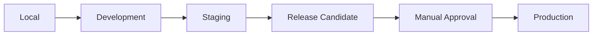
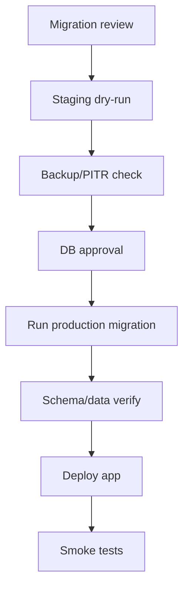
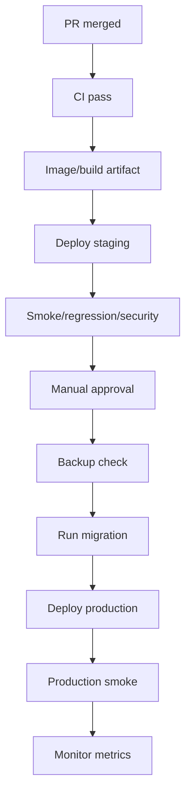

# CILT 13 - Deployment ve Production Release Documentation: NeuroDesk AI

Surum: 1.0  
Tarih: 09 Temmuz 2026  
Dil: Turkce  
Dokuman turu: Deployment, Canliya Alma ve Production Release Dokumani, Cilt 13  
Kapsam: Local/development/staging/production deployment adimlari, release checklist, production readiness, environment variables, migration plani, rollback, smoke test, monitoring dogrulama, privacy/AI safety/tenant isolation kontrolleri, incident hazirligi ve ilk canliya alma sureci

> Onemli: Bu asamada kesinlikle Dockerfile, docker-compose.yml, Kubernetes manifesti, Terraform dosyasi, GitHub Actions workflow veya uygulama kodu yazma. Sadece Cilt 13 Deployment ve Production Release dokumani olustur.

> Sureklilik notu: Cilt 8 altyapi mimarisini, Cilt 10 DevOps/deployment uygulama cercevesini, Cilt 12 test ve kalite kapilarini tanimlar. Bu cilt, bu kararları ilk canliya alma ve production release operasyonu icin uygulanabilir runbook seviyesine getirir.

## Icindekiler

1. [Yonetici Ozeti](#1-yonetici-ozeti)
2. [Deployment Vizyonu](#2-deployment-vizyonu)
3. [Release Yonetimi Ilkeleri](#3-release-yonetimi-ilkeleri)
4. [Deployment Ortamlari](#4-deployment-ortamlari)
5. [Local Deployment](#5-local-deployment)
6. [Development Deployment](#6-development-deployment)
7. [Staging Deployment](#7-staging-deployment)
8. [Production Deployment](#8-production-deployment)
9. [MVP Deployment Yaklasimi](#9-mvp-deployment-yaklasimi)
10. [Beta Deployment Yaklasimi](#10-beta-deployment-yaklasimi)
11. [Public Launch Deployment Yaklasimi](#11-public-launch-deployment-yaklasimi)
12. [Enterprise Deployment Yaklasimi](#12-enterprise-deployment-yaklasimi)
13. [Environment Variable Yonetimi](#13-environment-variable-yonetimi)
14. [Secret Yonetimi](#14-secret-yonetimi)
15. [Domain ve DNS Hazirligi](#15-domain-ve-dns-hazirligi)
16. [SSL/TLS Hazirligi](#16-ssltls-hazirligi)
17. [Backend Deployment](#17-backend-deployment)
18. [Frontend Web Deployment](#18-frontend-web-deployment)
19. [Mobile Release Deployment](#19-mobile-release-deployment)
20. [Admin Panel Deployment](#20-admin-panel-deployment)
21. [Worker Deployment](#21-worker-deployment)
22. [AI Worker Deployment](#22-ai-worker-deployment)
23. [Transcription Worker Deployment](#23-transcription-worker-deployment)
24. [Notification Worker Deployment](#24-notification-worker-deployment)
25. [Scheduler Deployment](#25-scheduler-deployment)
26. [Email Sync Worker Deployment](#26-email-sync-worker-deployment)
27. [Calendar Sync Worker Deployment](#27-calendar-sync-worker-deployment)
28. [Embedding Worker Deployment](#28-embedding-worker-deployment)
29. [Analytics Worker Deployment](#29-analytics-worker-deployment)
30. [Database Deployment](#30-database-deployment)
31. [PostgreSQL Production Hazirligi](#31-postgresql-production-hazirligi)
32. [Redis Production Hazirligi](#32-redis-production-hazirligi)
33. [Vector Database Production Hazirligi](#33-vector-database-production-hazirligi)
34. [Object Storage Production Hazirligi](#34-object-storage-production-hazirligi)
35. [File Storage ve Signed URL Hazirligi](#35-file-storage-ve-signed-url-hazirligi)
36. [Migration Plani](#36-migration-plani)
37. [Zero-Downtime Migration Stratejisi](#37-zero-downtime-migration-stratejisi)
38. [Seed Data Plani](#38-seed-data-plani)
39. [Feature Flag Hazirligi](#39-feature-flag-hazirligi)
40. [AI Provider Production Hazirligi](#40-ai-provider-production-hazirligi)
41. [Speech-to-Text Provider Hazirligi](#41-speech-to-text-provider-hazirligi)
42. [Gmail OAuth Production Hazirligi](#42-gmail-oauth-production-hazirligi)
43. [Microsoft OAuth Production Hazirligi](#43-microsoft-oauth-production-hazirligi)
44. [Google Calendar Production Hazirligi](#44-google-calendar-production-hazirligi)
45. [Notification Provider Hazirligi](#45-notification-provider-hazirligi)
46. [Mail Provider Hazirligi](#46-mail-provider-hazirligi)
47. [SMS Provider Hazirligi](#47-sms-provider-hazirligi)
48. [WhatsApp Business API Hazirligi](#48-whatsapp-business-api-hazirligi)
49. [Billing Provider Hazirligi](#49-billing-provider-hazirligi)
50. [Monitoring Hazirligi](#50-monitoring-hazirligi)
51. [Logging Hazirligi](#51-logging-hazirligi)
52. [Sentry Hazirligi](#52-sentry-hazirligi)
53. [Prometheus / Grafana Hazirligi](#53-prometheus--grafana-hazirligi)
54. [Alerting Hazirligi](#54-alerting-hazirligi)
55. [Backup Hazirligi](#55-backup-hazirligi)
56. [Restore Hazirligi](#56-restore-hazirligi)
57. [Disaster Recovery Hazirligi](#57-disaster-recovery-hazirligi)
58. [Production Readiness Checklist](#58-production-readiness-checklist)
59. [Security Readiness Checklist](#59-security-readiness-checklist)
60. [Privacy / KVKK / GDPR Readiness Checklist](#60-privacy--kvkk--gdpr-readiness-checklist)
61. [AI Safety Readiness Checklist](#61-ai-safety-readiness-checklist)
62. [Performance Readiness Checklist](#62-performance-readiness-checklist)
63. [Release Candidate Sureci](#63-release-candidate-sureci)
64. [Release Notes Sureci](#64-release-notes-sureci)
65. [Deployment Window Plani](#65-deployment-window-plani)
66. [Communication Plan](#66-communication-plan)
67. [Production Deployment Adimlari](#67-production-deployment-adimlari)
68. [Smoke Test Sureci](#68-smoke-test-sureci)
69. [Sanity Test Sureci](#69-sanity-test-sureci)
70. [Regression Test Sureci](#70-regression-test-sureci)
71. [Post-Deployment Verification](#71-post-deployment-verification)
72. [Rollback Plani](#72-rollback-plani)
73. [Hotfix Plani](#73-hotfix-plani)
74. [Blue/Green Deployment Plani](#74-bluegreen-deployment-plani)
75. [Canary Deployment Plani](#75-canary-deployment-plani)
76. [Rolling Deployment Plani](#76-rolling-deployment-plani)
77. [Database Rollback Plani](#77-database-rollback-plani)
78. [Feature Flag Rollback Plani](#78-feature-flag-rollback-plani)
79. [Incident Response Hazirligi](#79-incident-response-hazirligi)
80. [On-Call Hazirligi](#80-on-call-hazirligi)
81. [Launch Day Plani](#81-launch-day-plani)
82. [Launch Sonrasi Izleme](#82-launch-sonrasi-izleme)
83. [Ilk 24 Saat Operasyon Plani](#83-ilk-24-saat-operasyon-plani)
84. [Ilk 7 Gun Operasyon Plani](#84-ilk-7-gun-operasyon-plani)
85. [Beta Kullanici Yonetimi](#85-beta-kullanici-yonetimi)
86. [Production Support Plani](#86-production-support-plani)
87. [SLA / SLO Kontrolu](#87-sla--slo-kontrolu)
88. [Cost Monitoring Hazirligi](#88-cost-monitoring-hazirligi)
89. [AI Cost Monitoring Hazirligi](#89-ai-cost-monitoring-hazirligi)
90. [Audit Log Verification](#90-audit-log-verification)
91. [Consent Verification](#91-consent-verification)
92. [Data Export Verification](#92-data-export-verification)
93. [Data Deletion Verification](#93-data-deletion-verification)
94. [Tenant Isolation Verification](#94-tenant-isolation-verification)
95. [Release Risk Matrisi](#95-release-risk-matrisi)
96. [Deployment Kabul Kriterleri](#96-deployment-kabul-kriterleri)
97. [Codex Icin Deployment Uygulama Talimatlari](#97-codex-icin-deployment-uygulama-talimatlari)
98. [Codex Icin Sonraki Ciltlere Hazirlik Notlari](#98-codex-icin-sonraki-ciltlere-hazirlik-notlari)

# 1. Yonetici Ozeti

NeuroDesk AI production release sureci, siradan bir web uygulamasi deploy'undan daha yuksek hassasiyet gerektirir. Sistem telefon gorusmesi metinleri, e-posta icerikleri, takvim verileri, kisi hafizasi, AI analiz sonuclari, tenant bazli kurumsal veriler ve kullanici onayina bagli aksiyonlarla calisir. Bu nedenle deployment sureci yalnizca "yeni surumu yayinlama" degil; veri butunlugu, guvenlik, privacy readiness, AI safety, tenant isolation, monitoring, rollback ve incident response hazirliginin birlikte onaylandigi kontrollu bir operasyon olmalidir.

Bu dokuman local ortamdan production canliya almaya kadar uygulanacak adimlari tanimlar. MVP icin hedef, basit ama guvenli managed servislerle canliya cikmak; Beta'da entegrasyon ve kullanici feedback akisini guvenceye almak; Public Launch'ta production readiness ve operasyonel destek olgunlugunu tamamlamak; Enterprise fazda dedicated tenant, SSO, audit export, SIEM ve private deployment gibi kurumsal gereksinimleri yurutmektir.

# 2. Deployment Vizyonu

Deployment vizyonu "surprizsiz, izlenebilir, geri alinabilir release"tir. Her release'in hangi commit'ten, hangi image tag'inden, hangi migration setinden, hangi feature flag durumuyla ve hangi environment variable degisikligiyle yayinlandigi bilinir. Production deployment insan onayi olmadan yapilmaz.

# 3. Release Yonetimi Ilkeleri

| Ilke | Aciklama |
|---|---|
| Production'a surpriz cikilmaz | Her release local, CI, staging ve smoke kapilarindan gecer. |
| Rollback hazir olur | Onceki stabil image/build/flag durumu bilinir. |
| Migration dikkatli yapilir | Backward compatible ve expand-contract tercih edilir. |
| Kullanici verisi korunur | Tenant karismasi, veri kaybi ve PII sizintisi release blocker'dir. |
| AI safety korunur | AI approval modeli deploy sonrasi tekrar dogrulanir. |
| Monitoring olmadan cikilmaz | Sentry, logs, metrics, alerts aktif olmalidir. |
| Small batch release | Buyuk degisiklikler parcalanir. |
| Feature flag kullanilir | Riskli ozellikler flag arkasinda acilir. |
| Human approval | Production deploy manuel onay gerektirir. |
| Auditability | Release, rollback, migration ve admin aksiyonlari izlenebilir olur. |

# 4. Deployment Ortamlari

| Ortam | Amac | Branch | Veri | Secret | DB/Redis/Storage | AI Provider | Monitoring | Deployment |
|---|---|---|---|---|---|---|---|---|
| Local | Gelistirici calismasi | feature | Synthetic/seed | Local `.env`, gercek secret yok | Local Docker servisleri | Mock | Konsol | Docker Compose future |
| Development | Ekip entegrasyonu | develop/feature | Test | Dev secret | Dev managed/local | Mock/sandbox | Temel | Otomatik/manuel |
| Staging | Production provasi | release/main adayi | Sentetik/anonim | Staging secret | Production benzeri | Sandbox/limitli real | Aktif | CI/CD |
| Production | Gercek kullanim | main/tag | Gercek | Secret manager | Managed HA | Production | Tam | Manual approval |
| Enterprise | Izole kurumsal | release tag | Musteri verisi | Tenant/customer policy | Dedicated opsiyon | Sozlesmeye gore | SIEM dahil | IaC/GitOps future |

# 5. Local Deployment

Local deployment amaci, gelistiricinin sistemi kendi makinesinde gercek secret kullanmadan calistirmasidir. Local README; servis listesi, environment placeholder'lari, migration/seed adimlari, worker komutlari, log izleme ve troubleshooting icermelidir. Local ortamda backend, frontend, PostgreSQL, Redis, MinIO, worker'lar, mock AI provider, mock mail/calendar provider bulunur.

# 6. Development Deployment

Development deployment ekip ici entegrasyon icindir. Debug log daha acik olabilir ancak PII/token loglama yasaktir. Dev ortam production verisi icermez. Provider'lar sandbox veya mock modda calisir. Bu ortam release onayi yerine gecmez.

# 7. Staging Deployment

Staging production'a en yakin dogrulama ortamidir. Production release oncesi migration, smoke, regression, AI approval, tenant isolation, data export/delete ve provider sandbox testleri burada calisir. Staging secret'lari production secret'lariyla karistirilmaz.

# 8. Production Deployment

Production deployment gercek kullanici etkisi olan kontrollu operasyonudur. Manual approval, backup status, migration plan, rollback plan, monitoring readiness, privacy/security readiness ve post-deploy smoke test zorunludur. Production deployment window belirlenmeli ve on-call hazir olmalidir.

# 9. MVP Deployment Yaklasimi

MVP icin onerilen yapi: frontend Vercel/Render, backend Render/Railway/Fly.io/DigitalOcean, managed PostgreSQL, managed Redis, S3/R2/GCS object storage, worker'lar backend image uzerinden ayri process, Sentry + platform metrics, Cloudflare DNS, managed SSL, GitHub Actions. Kubernetes ve Terraform MVP baslangicinda zorunlu degildir.

# 10. Beta Deployment Yaklasimi

Beta deployment sinirli kullanici grubuna kontrollu acilis yapar. Feedback, error tracking, AI output review, support kanali, known issues ve feature flags aktif olmalidir. Gmail/Outlook/Calendar entegrasyonlari sandbox'tan production app onay surecine gecis icin kontrol edilir.

# 11. Public Launch Deployment Yaklasimi

Public Launch icin P0/P1 bug olmamali, backup/restore testi tamamlanmali, monitoring dashboard hazir olmali, privacy/terms yayinda olmali, billing temel akisi calismali, incident runbook hazir olmalidir. Launch gunu buyuk yeni feature acilmaz; stabilizasyon onceliklidir.

# 12. Enterprise Deployment Yaklasimi

Enterprise deployment SSO, SCIM, audit export, SIEM, dedicated tenant, custom retention, data residency, private deployment ve SLA raporlama gerektirir. Bu fazda Kubernetes, Terraform, CMK ve dedicated database/namespace/cluster opsiyonlari degerlendirilir.

# 13. Environment Variable Yonetimi

Env kategorileri: application, database, Redis, auth, OAuth, AI, STT, storage, notification, billing, monitoring, security, feature flags. `.env.example` gercek deger icermemeli, sadece placeholder ve aciklama icermelidir. Environment variable degisikligi release notuna yazilir ve staging'de dogrulanmadan production'a alinmaz.

| Kategori | Ornek anahtarlar | Secret mi? | Not |
|---|---|---|---|
| Application | APP_ENV, APP_VERSION, API_BASE_URL | Hayir | Ortam bazli |
| Database | DATABASE_URL, POOL_SIZE | Evet olabilir | Production secret manager |
| Auth | JWT_SECRET, REFRESH_TOKEN_SECRET | Evet | Rotasyon planli |
| OAuth | GOOGLE_CLIENT_SECRET, REDIRECT_URI | Secret + config | Ortam bazli URI |
| AI | AI_PROVIDER, OPENAI_API_KEY, MODEL | API key secret | Cost limit |
| Storage | S3_BUCKET, ACCESS_KEY | Secret olabilir | Public bucket yok |
| Monitoring | SENTRY_DSN, SENTRY_RELEASE | DSN kontrollu | PII scrub |
| Security | ENCRYPTION_KEY, WEBHOOK_SECRET | Evet | En yuksek hassasiyet |

# 14. Secret Yonetimi

Secret'lar Git repository, Docker image, frontend bundle, log veya dokuman icine yazilmaz. Kullanilabilecek araclar: cloud secret manager, Vault, Doppler, 1Password Secrets Automation, GitHub Actions Secrets. Deployment oncesi secret dogrulama: ortam dogru mu, staging secret production'da yok mu, masked mi, rotasyon tarihi biliniyor mu, git gecmisinde sızınti yok mu.

# 15. Domain ve DNS Hazirligi

Domainler: `app.neurodesk.ai`, `api.neurodesk.ai`, `admin.neurodesk.ai`, `webhook.neurodesk.ai`, `docs.neurodesk.ai`, `status.neurodesk.ai`. Launch oncesi DNS TTL uygun seviyeye dusurulur, CNAME/A kayitlari, Cloudflare proxy/WAF, webhook domain routing ve status page kontrol edilir.

# 16. SSL/TLS Hazirligi

TLS zorunludur. TLS 1.2 minimum, TLS 1.3 onerilir. Sertifikalar auto-renew olmalidir. HTTP -> HTTPS redirect, HSTS, mixed content, certificate expiry alert ve webhook HTTPS gereksinimi dogrulanir.

# 17. Backend Deployment

Backend release akisi: PR merge, CI pass, image build, image scan, registry push, staging deploy, staging smoke, release approval, env/migration kontrolu, production deploy, health check, API smoke, error rate izleme. Health endpointleri: `/health`, `/health/db`, `/health/redis`, `/health/workers`, `/health/ai`, `/health/storage`.

# 18. Frontend Web Deployment

Frontend release akisi: build, type/lint/test, env kontrolu, staging deploy, login/dashboard/AI approval smoke, production deploy, CDN/static asset kontrolu, Sentry release. API_BASE_URL ve auth callback URL'leri environment bazli dogrulanir.

# 19. Mobile Release Deployment

Mobil release app store review sureclerine baglidir. Build signing secret'lari guvenli tutulur. API compatibility, minimum supported version, forced update gereksinimi, crash reporting ve deep link/OAuth callback test edilir. Mobil release web/backend release'ten daha yavas planlanir.

# 20. Admin Panel Deployment

Admin panel sadece yetkili rollere acilir. Deployment sonrasi admin login, RBAC, audit log, AI cost view, tenant/user list ve masked data smoke test edilir. Admin panel feature flag ile kapatilabilir olmalidir.

# 21. Worker Deployment

Worker'lar backend image uzerinden farkli command'larla calisir. Deployment oncesi queue compatibility, job schema, retry/DLQ, idempotency ve graceful shutdown kontrol edilir. Worker deploy API deploy ile uyumlu image tag kullanmalidir.

# 22. AI Worker Deployment

AI worker icin provider config, timeout, token limit, prompt version, cost tracking, retry/backoff ve low-confidence davranisi dogrulanir. Deployment sonrasi AI analysis job, AI approval smoke ve AI cost metrics kontrol edilir.

# 23. Transcription Worker Deployment

STT future veya ileri faz olabilir. Production hazirlikta provider quota, language config, file size limit, consent, audio storage, retry ve cost metrikleri dogrulanir.

# 24. Notification Worker Deployment

Notification worker deploy sonrasi in-app/email notification, retry, DLQ, provider credentials, rate limits ve hassas veri maskesi test edilir.

# 25. Scheduler Deployment

Scheduler reminder, cleanup, retention ve sync job'larini tetikler. Duplicate job riskine karsi single active scheduler, lock veya leader election stratejisi gerekir. Deployment sonrasi scheduler heartbeat kontrol edilir.

# 26. Email Sync Worker Deployment

Email sync worker OAuth token ve provider rate limitlerine baglidir. Production'da incremental sync, revoke handling, consent check ve retry/backoff dogrulanir.

# 27. Calendar Sync Worker Deployment

Calendar worker read/write scope ayrimini korumalidir. Kullanici onayi olmadan event olusturulmadigi smoke test ile dogrulanir. Redirect URI ve provider app ayarlari environment bazli olmalidir.

# 28. Embedding Worker Deployment

Embedding worker semantic search ve RAG icin kritiktir. Tenant_id filter, re-index job, delete propagation, vector dimension ve provider error handling deployment sonrasi dogrulanir.

# 29. Analytics Worker Deployment

Analytics worker usage, AI cost, dashboard aggregation ve reporting metriklerini hesaplar. Tenant scoped aggregation ve PII minimizasyonu kontrol edilir.

# 30. Database Deployment

Database production managed PostgreSQL uzerinde calismalidir. Connection pooling, SSL, backups, PITR, slow query logs, indexler, tenant_id constraints ve migration history kontrol edilir.

# 31. PostgreSQL Production Hazirligi

Checklist: managed HA, backup/PITR aktif, SSL zorunlu, connection pool limitleri, pgvector extension, migration role ayrimi, readonly access, slow query alert, disk usage alert, restore testi.

# 32. Redis Production Hazirligi

Checklist: managed Redis, auth/TLS, memory policy, eviction alert, queue length alert, persistence ihtiyaci, rate limit DB ayrimi, cache key tenant-aware, backup ihtiyaci.

# 33. Vector Database Production Hazirligi

MVP'de pgvector olabilir. Ayrik vector DB future ise tenant scoped namespace/collection, index backup, re-index plan, delete propagation ve access control dokumante edilir.

# 34. Object Storage Production Hazirligi

Object storage private olmalidir. Public bucket yasaktir. Signed URL, lifecycle policy, versioning, malware scan hook, CORS, encryption ve delete propagation kontrol edilir.

# 35. File Storage ve Signed URL Hazirligi

Upload/download signed URL ile yapilir. TTL kisa tutulur. Dosya path'i tenant ve resource owner baglami tasir. Dosya indirme yetki kontrolu uygulama katmaninda yapilir.

# 36. Migration Plani

Migration release'in en riskli adimidir. Plan: migration review, staging dry-run, backup kontrolu, backward compatibility, production approval, migration calistirma, schema verification, app deploy, smoke test. Alembic migration production deploy oncesi release surecine eklenmelidir.

# 37. Zero-Downtime Migration Stratejisi

Expand-contract modeli: once geriye uyumlu kolon/tablo ekle, uygulamayi yeni alani destekler hale getir, veri backfill yap, eski alani daha sonraki release'te kaldir. Aynı release'te kolon silme, zorunlu alan ekleme veya buyuk locking migration'dan kacınılır.

# 38. Seed Data Plani

Seed data: default roles, permissions, feature flags, notification templates, system settings, test tenant staging. Production seed idempotent olmalidir; tekrar calisinca veri bozmamalidir.

# 39. Feature Flag Hazirligi

Riskli ozellikler flag arkasindadir: AI Chat, semantic search, Gmail/Outlook, calendar write, document analysis, billing, admin yeni ozellikler, new AI model/prompt. Kill switch her zaman vardir ve flag degisikligi auditlenir.

# 40. AI Provider Production Hazirligi

AI provider config environment bazli ayrilir. Production key, model, timeout, max token, cost tracking, retry, fallback, safety policy ve prompt version dogrulanir. Gercek API key dokumana veya repo'ya yazilmaz.

# 41. Speech-to-Text Provider Hazirligi

STT provider future/ileri fazda production'a alinirken audio retention, consent, language, timeout, cost, file limit, provider DPA ve retry stratejisi dogrulanir.

# 42. Gmail OAuth Production Hazirligi

Gmail production icin OAuth consent screen, scopes, redirect URI, domain verification, limited/sensitive scope approval, token encryption ve revoke akisi kontrol edilir. Gereksiz scope istenmez.

# 43. Microsoft OAuth Production Hazirligi

Microsoft Entra app registration, redirect URI, Graph permissions, admin consent gereksinimi, tenant type, token refresh ve revoke akisi dogrulanir.

# 44. Google Calendar Production Hazirligi

Read/write scope ayrimi, event create approval, timezone, webhook/calendar sync ve redirect URI dogrulanir. Calendar write kullanici onayi olmadan calisamaz.

# 45. Notification Provider Hazirligi

Email/push/SMS provider credentials, rate limit, sender identity, domain verification, bounce handling, retry ve hassas veri icermeyen notification template'leri kontrol edilir.

# 46. Mail Provider Hazirligi

SPF/DKIM/DMARC, sender domain, SMTP/API credentials, bounce/complaint webhook, unsubscribe gereksinimleri ve transactional email template'leri kontrol edilir.

# 47. SMS Provider Hazirligi

SMS future olabilir. Production oncesi maliyet, rate limit, sender ID, opt-out, KVKK iletisim izni ve fallback davranisi degerlendirilir.

# 48. WhatsApp Business API Hazirligi

Yalnizca resmi WhatsApp Business API degerlendirilir. Resmi olmayan scraping/otomasyon production'a alinmaz. Template approval, consent, webhook signature ve rate limit gerekir.

# 49. Billing Provider Hazirligi

Payment provider secret, webhook signing secret, idempotency, test/live mode ayrimi, plan mapping, quota enforcement, invoice/receipt ve billing event audit kontrol edilir.

# 50. Monitoring Hazirligi

Metrikler: API availability, latency, error rate, DB, Redis, queue backlog, worker health, AI job success, AI cost, provider errors, notification delivery, storage errors. Dashboard ve alertler deployment oncesi hazirdir.

# 51. Logging Hazirligi

Structured logs, request_id, trace_id, tenant_id, service, level, duration, error_code alanlarini icerebilir. Token, password, mail body, transkript, belge icerigi, payment data loglanmaz.

# 52. Sentry Hazirligi

Sentry DSN, environment, release, source map stratejisi, PII scrubbing, alert rules ve deploy release association kontrol edilir. Sentry eventlerinde hassas veri olmamalidir.

# 53. Prometheus / Grafana Hazirligi

Production/enterprise fazda Prometheus/Grafana dashboard'lari API, DB, Redis, workers, AI cost, queue backlog, error rate ve SLO'lari gosterir. MVP'de provider metrics + Sentry yeterli olabilir.

# 54. Alerting Hazirligi

Critical alertler: API down, DB failure, Redis failure, queue backlog critical, AI provider outage, backup failure, production deploy failure, cross-tenant access attempt, SSL expiration, error spike. Alertler actionable olmalidir.

# 55. Backup Hazirligi

Production deploy oncesi PostgreSQL backup/PITR durumu, object storage lifecycle/versioning, audit log retention ve backup alertleri dogrulanir. Release oncesi manuel/snapshot backup gerekip gerekmedigi migration riskine gore belirlenir.

# 56. Restore Hazirligi

Restore runbook hazir olmadan production release yapilmaz. Staging restore testi, RTO/RPO hedefleri, object storage dosya erisimi, embeddings rebuild ve silinmis verinin geri gelmemesi kontrol edilir.

# 57. Disaster Recovery Hazirligi

DR hazirligi: cloud outage, DB corruption, secret leak, DNS issue, major deployment failure, AI provider outage, data deletion hata senaryolari. Degraded mode tanimlanir: AI kapaliysa manuel gorev/randevu calismaya devam eder.

# 58. Production Readiness Checklist

- CI ve staging testleri gecti.
- Backup/PITR hazir.
- Migration plan onayli.
- Rollback image/build biliniyor.
- Feature flags hazir.
- Monitoring/alerting aktif.
- Sentry release hazir.
- Support/on-call hazir.
- P0/P1 bug yok.
- Security/privacy/AI safety checklist tamam.

# 59. Security Readiness Checklist

Auth, refresh rotation, OAuth token encryption, rate limiting, webhook signature, file upload allowlist, private bucket, CORS allowlist, secret scan, dependency scan, admin RBAC, audit log ve sensitive log masking dogrulanir.

# 60. Privacy / KVKK / GDPR Readiness Checklist

Consent, aydinlatma/policy version, data export, data deletion, retention, provider/subprocessor listesi, AI provider transparency, mail/calendar/contact riza akislari ve data processing audit hazir olmalidir.

# 61. AI Safety Readiness Checklist

AI approval, prompt injection tests, low confidence behavior, hallucination guard, tenant-scoped retrieval, AI cost limit, provider timeout, prompt version tracking, no raw prompt logging dogrulanir.

# 62. Performance Readiness Checklist

Dashboard latency, pagination, async AI jobs, queue backlog, DB slow query, Redis cache, semantic search latency, file upload signed URL, load/performance smoke ve AI provider latency kabul edilir seviyede olmalidir.

# 63. Release Candidate Sureci

RC tag/branch olusturulur, staging'e deploy edilir, migration dry-run calisir, smoke/regression/security/performance smoke testleri tamamlanir, release notes ve rollback plan yazilir, go/no-go toplantisi yapilir.

# 64. Release Notes Sureci

Release notes: yeni ozellikler, duzeltmeler, migration etkisi, env variable degisikligi, feature flag durumu, known issues, rollback notu, kullanici etkisi ve destek notlarini icerir.

# 65. Deployment Window Plani

Deployment window dusuk trafik zamanina planlanir. Buyuk migration varsa maintenance notice gerekebilir. Rollback ve support ekibi hazir tutulur. Window disinda plansiz degisiklik yapilmaz.

# 66. Communication Plan

Ic iletisim: release owner, incident commander, backend/frontend/AI/DevOps/Security/QA sorumlulari. Dis iletisim: status page, support email, beta kullanici duyurusu, enterprise musteri bilgilendirmesi.

# 67. Production Deployment Adimlari

# 68. Smoke Test Sureci

Smoke test: health, login, current user, dashboard, task list, appointment list, conversation create, AI job enqueue/result, AI approval, notification schedule, contact timeline, semantic search, AI Chat, audit log, Sentry errors, queue backlog, tenant isolation.

# 69. Sanity Test Sureci

Sanity test, ilgili release'in degistirdigi alanlara odaklanir. Calendar release'i icin timezone/event approval; AI release'i icin prompt/evaluation; auth release'i icin login/refresh/logout test edilir.

# 70. Regression Test Sureci

Regression RC'de calisir. Kapsam: auth, tenant, AI approval, tasks, appointments, notification, dashboard, contact, AI Chat, search, Gmail/Calendar, data export/delete, admin, billing.

# 71. Post-Deployment Verification

Ilk 15 dakika: availability, error rate, login, DB/Redis, workers, Sentry. Ilk 1 saat: latency, AI job success, queue backlog, provider errors, dashboard. Ilk 24 saat: AI cost, feedback, bug reports, export/delete, audit volume, slow queries.

# 72. Rollback Plani

Rollback tetikleyicileri: API down, login failure, migration error, critical error spike, AI approval bypass, cross-tenant exposure, onaysiz mail/calendar, veri kaybi, worker job loss, billing/security incident. Once feature flag rollback denenir; yetmezse app/frontend/worker image rollback; DB rollback CTO/DBA onayi gerektirir.

# 73. Hotfix Plani

Hotfix minimum kapsamli olur. Hotfix branch, targeted tests, staging smoke, production approval, deploy, post-deploy smoke, main/develop merge ve postmortem adimlarini izler. Hotfix'e yeni feature eklenmez.

# 74. Blue/Green Deployment Plani

Blue mevcut production, Green yeni release ortamidir. Green smoke testlerden gecerse trafik aktarilir. Avantaj hizli rollback; risk iki ortam maliyeti ve DB migration uyumlulugudur. Public Launch sonrasi/enterprise icin degerlendirilir.

# 75. Canary Deployment Plani

Canary %5, %10, %25, %50, %100 trafik veya tenant bazli acilisla ilerler. Error rate, latency, AI success, approval success, Sentry ve feedback izlenir. Riskli AI/prompt, Gmail/Outlook, billing degisiklikleri icin uygundur.

# 76. Rolling Deployment Plani

Rolling deployment default container/Kubernetes stratejisidir. Readiness probe, backward compatible migration ve graceful shutdown olmadan risklidir. Worker rolling deploy'da job kaybi olmamalidir.

# 77. Database Rollback Plani

DB rollback en riskli rollback turudur. Tercih forward fix ve backward compatible migration'dir. Veri kaybi riski olan rollbacklerde backup restore planı, maintenance window ve CTO/DBA onayi gerekir.

# 78. Feature Flag Rollback Plani

Flag ile kapatilabilecekler: AI Chat, semantic search, Gmail/Outlook, calendar write, email analysis, document analysis, billing, admin yeni ozellikleri, new AI prompt/model. Kill switch ve audit zorunludur.

# 79. Incident Response Hazirligi

Incident sureci: tespit, incident commander, severity, ekip bilgilendirme, etki analizi, rollback/hotfix karari, mudahale, monitoring, kullanici iletisimi, postmortem. SEV-1: sistem down, veri sizintisi, cross-tenant, AI onaysiz action.

# 80. On-Call Hazirligi

MVP'de launch gunu belirli sorumlu kisi yeterli olabilir. Public Launch ve enterprise'da rota, escalation, response hedefi, runbook ve iletisim kanali tanimlanir.

# 81. Launch Day Plani

T-7: RC, security checklist, restore test. T-3: regression/UAT/release notes. T-1: readiness, DNS/SSL, on-call, go/no-go. T-0: backup, deploy, smoke, monitoring, support. T+24: operasyon raporu. T+7: launch postmortem.

# 82. Launch Sonrasi Izleme

Launch sonrasi buyuk feature acilmaz. Error, signup, login success, AI usage, AI cost, queue backlog, notification, provider errors, support tickets ve security alerts aktif izlenir.

# 83. Ilk 24 Saat Operasyon Plani

Ilk 24 saat boyunca API uptime, error rate, login success, signup count, AI analysis count, AI failure, AI cost, queue backlog, notification success, provider errors, slow queries, Sentry, support, privacy requests ve security alerts takip edilir.

# 84. Ilk 7 Gun Operasyon Plani

Ilk 7 gun stabilite, feedback, AI output kalitesi, maliyet, entegrasyon hatalari, performans darboğazlari ve kritik bug fix'leri takip edilir. Her gun error, AI cost, queue, DB, support, security ve billing dashboard'lari kontrol edilir.

# 85. Beta Kullanici Yonetimi

Beta kullanicilar segmentlenir, feature flags ile kademeli erisim verilir, feedback kanallari acilir, known issues paylasilir. Beta feedback'i release kararini etkiler; P0/P1 beta bug'lari launch blocker'dir.

# 86. Production Support Plani

Support kanallari, escalation, ticket severity, response hedefleri, known issues, status page ve customer communication template'leri hazirlanir. Enterprise musteriler icin ayrik escalation kanali olabilir.

# 87. SLA / SLO Kontrolu

MVP SLO daha esnek; production %99.5+, enterprise %99.9 veya sozlesme bazli olabilir. Deployment oncesi SLI dashboard'lari: availability, latency, error rate, AI job success, queue backlog, notification delivery.

# 88. Cost Monitoring Hazirligi

Compute, DB, Redis, storage, bandwidth, monitoring/logging, CI/CD, email/SMS ve backup maliyetleri izlenir. Budget alert ve owner tanimlanir.

# 89. AI Cost Monitoring Hazirligi

AI maliyetleri tenant, user, feature, model, token, embedding count, transcription minute ve AI Chat count bazinda izlenir. Cost spike alert launch oncesi aktif olmalidir.

# 90. Audit Log Verification

Login, role change, integration connect/remove, AI approve/reject, mail send, calendar create, file delete, export/delete request, admin access ve billing change audit log'a yazilmalidir. Audit log append-only ve tenant-scoped gorunmelidir.

# 91. Consent Verification

Telefon, mail, calendar, contact, document ve third-party AI riza kontrolleri dogrulanir. Riza geri cekilince yeni isleme durmalidir. Consent version ve policy version saklanmalidir.

# 92. Data Export Verification

Export job, signed URL, TTL, tenant-scoped veri, audit log ve export retention dogrulanir. Baska tenant verisi export'a karisamaz.

# 93. Data Deletion Verification

Deletion job DB, object storage, embeddings, OAuth tokens, AI memory ve search/RAG sonucunu kapsar. Silinen veri AI Chat/search sonucunda gorunmemelidir.

# 94. Tenant Isolation Verification

Tenant A kullanicisi Tenant B gorev/randevu/gorusme/contact/dosya/search/chat verisini goremez. Cache key, worker job, vector search, object storage path ve admin cross-tenant audit kontrol edilir.

# 95. Release Risk Matrisi

| ID | Risk | Etki | Olasilik | Seviye | Azaltma | Rollback | Ekip | MVP |
|---|---|---|---|---|---|---|---|---|
| REL-001 | Production secret eksik | High | Medium | High | Secret checklist | Config fix | DevOps | Evet |
| REL-002 | Yanlis env var | High | Medium | High | Env review | Config rollback | DevOps | Evet |
| REL-003 | Migration failure | Critical | Medium | Critical | Staging dry-run | Forward fix/restore | Backend | Evet |
| REL-004 | Migration rollback yok | Critical | Medium | Critical | Expand-contract | Forward fix | Backend | Evet |
| REL-005 | Tenant regression | Critical | Medium | Critical | Tenant smoke | App rollback | Sec/BE | Evet |
| REL-006 | AI approval bypass | Critical | Medium | Critical | Approval smoke | Flag/app rollback | AI/Sec | Evet |
| REL-007 | AI provider outage | High | Medium | High | Degraded mode | Provider fallback | AI/Ops | Evet |
| REL-008 | AI cost spike | High | Medium | High | Cost alert/quota | Flag off | AI/Ops | Evet |
| REL-009 | OAuth redirect hatasi | High | Medium | High | URI checklist | Config fix | BE | Evet |
| REL-010 | Gmail consent eksik | Critical | Low | High | Consent review | Disable Gmail | Product/Sec | Hayir |
| REL-011 | Graph permission hatasi | High | Medium | High | Permission review | Disable Outlook | BE | Hayir |
| REL-012 | Calendar create hatasi | High | Medium | High | Calendar smoke | Flag off | BE | Evet |
| REL-013 | Onaysiz mail | Critical | Low | High | Approval tests | Flag off | Sec/BE | Evet |
| REL-014 | Notification failure | Medium | Medium | Medium | Provider health | Worker rollback | BE | Evet |
| REL-015 | Queue backlog | High | Medium | High | Queue alert | Scale/rollback | DevOps | Evet |
| REL-016 | Worker deploy fail | High | Medium | High | Worker smoke | Worker rollback | DevOps | Evet |
| REL-017 | Redis failure | High | Medium | High | Managed HA | Degraded mode | DevOps | Evet |
| REL-018 | PG pool exhaustion | High | Medium | High | Pool alert | Scale/config | BE | Evet |
| REL-019 | Public bucket | Critical | Low | High | Bucket policy | Block bucket | DevOps/Sec | Evet |
| REL-020 | Signed URL failure | Medium | Medium | Medium | URL smoke | Config fix | BE | Evet |
| REL-021 | Wrong API URL | High | Medium | High | Frontend env check | Frontend rollback | FE | Evet |
| REL-022 | CORS hatasi | Medium | Medium | Medium | CORS test | Config fix | BE | Evet |
| REL-023 | SSL hatasi | High | Low | Medium | Cert alert | Cert fix | DevOps | Evet |
| REL-024 | DNS gecikmesi | Medium | Medium | Medium | TTL plan | Wait/fallback | DevOps | Evet |
| REL-025 | Monitoring eksik | High | Medium | High | Readiness gate | Hold release | DevOps | Evet |
| REL-026 | Sentry PII | Critical | Low | High | PII scrub | Disable event | Sec | Evet |
| REL-027 | Backup alinmadi | Critical | Low | High | Backup gate | Hold release | DevOps | Evet |
| REL-028 | Restore test yok | High | Medium | High | Restore drill | Hold release | DevOps | Evet |
| REL-029 | Rollback image yok | High | Medium | High | Tag retention | Hold release | DevOps | Evet |
| REL-030 | Flag yanlis | Medium | Medium | Medium | Flag review | Flag rollback | Product | Evet |
| REL-031 | Billing webhook | High | Medium | High | Signature test | Disable billing | BE | Hayir |
| REL-032 | Admin permission | Critical | Medium | Critical | Admin RBAC | Admin flag off | Sec | Hayir |
| REL-033 | Export wrong data | Critical | Medium | Critical | Export tests | Disable export | BE/Sec | Evet |
| REL-034 | Deletion eksik | Critical | Medium | Critical | Delete tests | Stop deletion | BE/Legal | Evet |
| REL-035 | Support yetersiz | Medium | Medium | Medium | Support plan | Pause launch | Product | Evet |
| REL-036 | Mobile review gecikir | Medium | High | Medium | Early submit | Web fallback | Mobile | Hayir |

# 96. Deployment Kabul Kriterleri

MVP: local/dev/staging/production deployment calisir, manual approval vardir, health check basarili, workers calisir, migration staging'de test edildi, backup alindi, rollback plan hazir, smoke test gecti, tenant isolation/AI approval/consent/audit/Sentry aktif. Public Launch: P0/P1 yok, security/privacy/performance checklist tamam, restore testi yapildi, monitoring ve incident runbook hazir. Enterprise: SSO, audit export, custom retention, dedicated tenant, SIEM ve SLA monitoring hazir.

# 97. Codex Icin Deployment Uygulama Talimatlari

Codex ileride deployment dosyalari ve release surecleri icin su sirayla ilerlemelidir:

1. Local deployment README hazirlanmalidir.
2. `.env.example` hazirlanmalidir.
3. Docker Compose local servisleri tanimlanmalidir.
4. Backend Dockerfile hazirlanmalidir.
5. Frontend Dockerfile hazirlanmalidir.
6. Worker process komutlari dokumante edilmelidir.
7. Health check endpointleri backend icinde uygulanmalidir.
8. GitHub Actions CI pipeline hazirlanmalidir.
9. Staging deployment workflow hazirlanmalidir.
10. Production deployment workflow manuel approval ile hazirlanmalidir.
11. Migration komutlari release surecine eklenmelidir.
12. Rollback komutlari dokumante edilmelidir.
13. Smoke test scriptleri hazirlanmalidir.
14. Environment variable listesi README'de bulunmalidir.
15. Secret degerleri asla dosyaya yazilmamalidir.
16. Sentry release entegrasyonu eklenmelidir.
17. Docker image tag stratejisi uygulanmalidir.
18. Production deployment checklist markdown olarak olusturulmalidir.
19. Incident runbook markdown olarak olusturulmalidir.
20. Backup/restore dokumantasyonu hazirlanmalidir.
21. Kubernetes manifestleri MVP sonrasi ayri fazda hazirlanmalidir.
22. Terraform production altyapisi MVP sonrasi hazirlanmalidir.
23. Feature flag sistemi deployment surecine entegre edilmelidir.
24. AI provider configleri environment bazli ayrilmalidir.
25. OAuth redirect URI ayarlari environment bazli dokumante edilmelidir.
26. Tenant isolation smoke test deployment sonrasi calistirilmalidir.
27. AI approval smoke test deployment sonrasi calistirilmalidir.
28. Data export/delete testleri release candidate surecinde calistirilmalidir.
29. Production deployment insan review ve onay olmadan yapilmamalidir.
30. Codex deployment dosyalarini uretirken gercek secret veya API key yazmamalidir.

# 98. Codex Icin Sonraki Ciltlere Hazirlik Notlari

Bir sonraki dokumanda Cilt 14 - Enterprise, Integrations & Platform Documentation hazirlanacaktir. Cilt 14; kurumsal musteri ozellikleri, coklu kullanici, takim yonetimi, gelismis RBAC, SSO, SAML/OIDC, SCIM, audit export, SIEM entegrasyonu, dedicated tenant, private deployment, CRM/ERP entegrasyonlari, public API, webhook sistemi, marketplace ve enterprise onboarding sureclerini detaylandirmalidir.
