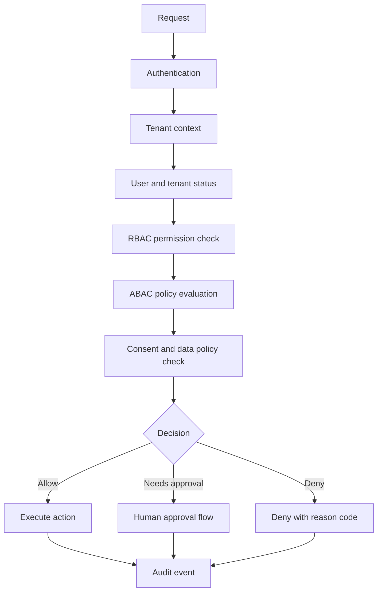
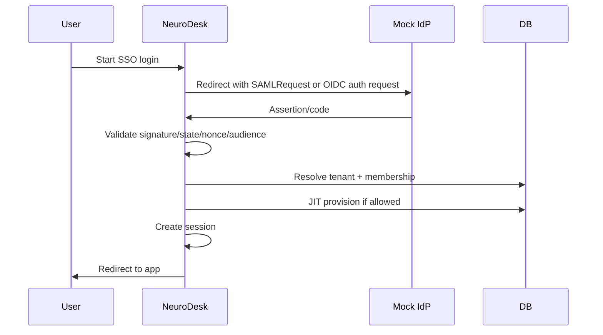
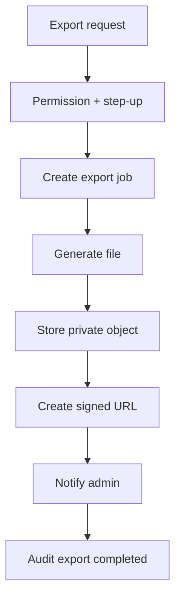

# CILT 14 - Enterprise, Integrations & Platform Documentation: NeuroDesk AI

Surum: 1.0  
Tarih: 09 Temmuz 2026  
Dil: Turkce  
Dokuman turu: Enterprise, Integrations ve Platform Mimari Dokumani, Cilt 14  
Kapsam: Enterprise tenant modeli, organization/team/department yapisi, custom RBAC, ABAC policy engine, shared contact memory, manager dashboard, enterprise admin console, SSO SAML/OIDC, SCIM, audit export, SIEM, API key management, public API, webhook, developer portal, CRM/ERP entegrasyonlari, marketplace, enterprise onboarding, dedicated tenant, private deployment ve Codex icin enterprise gelistirme talimatlari

> Onemli: Bu asamada kesinlikle kod yazma. Sadece Cilt 14 Enterprise, Integrations & Platform dokumani olustur.

> Sureklilik notu: Cilt 1 urun vizyonunu, Cilt 2 sistem mimarisini, Cilt 3 veri modelini, Cilt 4 backend tasarimini, Cilt 9 guvenlik/compliance esaslarini, Cilt 12 test stratejisini ve Cilt 13 production release surecini tanimlar. Bu cilt, NeuroDesk AI'i bireysel/KOBI urununden enterprise-ready platforma tasiyacak mimari, urun, guvenlik, operasyon ve entegrasyon cercevesini detaylandirir.

## Icindekiler

1. [Yonetici Ozeti](#1-yonetici-ozeti)
2. [Enterprise Vizyonu](#2-enterprise-vizyonu)
3. [Enterprise Ilkeleri](#3-enterprise-ilkeleri)
4. [Enterprise Fazlandirma Stratejisi](#4-enterprise-fazlandirma-stratejisi)
5. [Tenant ve Organization Modeli](#5-tenant-ve-organization-modeli)
6. [Team ve Department Modeli](#6-team-ve-department-modeli)
7. [Kullanici, Membership ve Lifecycle Modeli](#7-kullanici-membership-ve-lifecycle-modeli)
8. [Custom Role ve Permission Sistemi](#8-custom-role-ve-permission-sistemi)
9. [RBAC Test Stratejisi](#9-rbac-test-stratejisi)
10. [ABAC Policy Engine Skeleton](#10-abac-policy-engine-skeleton)
11. [Permission Decision Flow](#11-permission-decision-flow)
12. [Shared Contact Memory](#12-shared-contact-memory)
13. [AI Chat ve Semantic Search ABAC Filtreleri](#13-ai-chat-ve-semantic-search-abac-filtreleri)
14. [Manager Dashboard](#14-manager-dashboard)
15. [Enterprise Admin Console](#15-enterprise-admin-console)
16. [Enterprise Settings Modeli](#16-enterprise-settings-modeli)
17. [SSO Genel Mimari](#17-sso-genel-mimari)
18. [SAML Configuration Modeli](#18-saml-configuration-modeli)
19. [OIDC Configuration Modeli](#19-oidc-configuration-modeli)
20. [SSO Login Flow ve Mock IdP Testleri](#20-sso-login-flow-ve-mock-idp-testleri)
21. [SSO Guvenlik Gereksinimleri](#21-sso-guvenlik-gereksinimleri)
22. [SCIM Modulu](#22-scim-modulu)
23. [SCIM Create Update Deactivate Testleri](#23-scim-create-update-deactivate-testleri)
24. [Audit Log Enterprise Event Coverage](#24-audit-log-enterprise-event-coverage)
25. [Audit Export Job](#25-audit-export-job)
26. [SIEM Webhook ve Export Sistemi](#26-siem-webhook-ve-export-sistemi)
27. [API Key Management](#27-api-key-management)
28. [Public API Versioning](#28-public-api-versioning)
29. [Public API Endpoint Kapsami](#29-public-api-endpoint-kapsami)
30. [Rate Limiting ve Quota](#30-rate-limiting-ve-quota)
31. [Webhook Subscription Sistemi](#31-webhook-subscription-sistemi)
32. [Webhook Signing, Retry ve Idempotency](#32-webhook-signing-retry-ve-idempotency)
33. [Developer Portal Documentation Skeleton](#33-developer-portal-documentation-skeleton)
34. [Generic Connector Architecture](#34-generic-connector-architecture)
35. [Salesforce Connector Adapter](#35-salesforce-connector-adapter)
36. [HubSpot Connector Adapter](#36-hubspot-connector-adapter)
37. [ERP Entegrasyonlari](#37-erp-entegrasyonlari)
38. [Marketplace App Model Skeleton](#38-marketplace-app-model-skeleton)
39. [Marketplace Review ve Security Modeli](#39-marketplace-review-ve-security-modeli)
40. [Enterprise Onboarding](#40-enterprise-onboarding)
41. [Customer Success ve Support Operasyonlari](#41-customer-success-ve-support-operasyonlari)
42. [Sales ve Solution Engineering Sureci](#42-sales-ve-solution-engineering-sureci)
43. [Legal ve Compliance Sureci](#43-legal-ve-compliance-sureci)
44. [Dedicated Tenant Deployment](#44-dedicated-tenant-deployment)
45. [Private Deployment Ayrik Faz](#45-private-deployment-ayrik-faz)
46. [Enterprise Security Testleri](#46-enterprise-security-testleri)
47. [Tenant Isolation Enterprise Testleri](#47-tenant-isolation-enterprise-testleri)
48. [Legal Hold ve Retention Policy](#48-legal-hold-ve-retention-policy)
49. [Enterprise Observability](#49-enterprise-observability)
50. [Enterprise SLA ve SLO](#50-enterprise-sla-ve-slo)
51. [Data Residency ve Regionalization](#51-data-residency-ve-regionalization)
52. [Risk Matrisi](#52-risk-matrisi)
53. [Kabul Kriterleri](#53-kabul-kriterleri)
54. [Codex Icin Enterprise Gelistirme Talimatlari](#54-codex-icin-enterprise-gelistirme-talimatlari)
55. [Codex Icin Sonraki Adim](#55-codex-icin-sonraki-adim)

# 1. Yonetici Ozeti

NeuroDesk AI'in enterprise fazi, urunu sadece daha buyuk musterilere satilabilir hale getirmek degil; guvenlik, yonetilebilirlik, entegrasyon, denetlenebilirlik ve operasyonel olgunluk acisindan kurumsal tedarik sureclerinden gecebilir bir platforma donusturmektir. Enterprise musteriler, tekil kullanici deneyiminden daha fazlasini ister: SSO, SCIM, detayli yetkilendirme, audit export, SIEM, data retention, legal hold, public API, webhook, CRM/ERP entegrasyonlari, dedicated tenant opsiyonlari, SLA, support escalation ve hukuki/compliance dokumantasyonu bekler.

Bu dokuman, Cilt 14 kapsamindaki enterprise, integration ve platform yeteneklerini uygulanabilir mimari ve urun gereksinimleriyle tanimlar. Her bolum yalnizca fikir seviyesinde kalmaz; sahiplik, veri modeli ihtiyaci, API davranisi, guvenlik gereksinimi, test kapsami, kabul kriteri ve operasyonel surec tanimlar.

Enterprise moduller NeuroDesk AI icin yuksek riskli alandir. SSO, SCIM, RBAC, ABAC, audit, API key, webhook, public API ve entegrasyon modulleri production'a alinmadan once insan review, security review, test review ve release approval gerektirir. AI tarafinda hicbir enterprise modul kullanici veya yonetici onayi olmadan dis sistemde aksiyon uygulamamalidir.

# 2. Enterprise Vizyonu

Enterprise vizyonu, NeuroDesk AI'i "AI destekli kisisel calisma asistani"ndan "kurumsal bilgi, iletisim, hafiza ve aksiyon platformu"na evirmektir. Platform; ekiplerin telefon, e-posta, takvim, not, belge ve CRM/ERP verilerinden is takibi, musteri hafizasi ve karar destek uretebilmesini saglarken kurumsal guvenlik sinirlarini ihlal etmemelidir.

Hedef kurumsal deger onerileri:

- Ekip ve departman bazli is gorunurlugu.
- Yetki kontrollu shared contact memory.
- AI Chat ve semantic search icin tenant/team/role/policy bazli filtreleme.
- SSO ve SCIM ile IT yonetimi.
- Audit export ve SIEM ile security/compliance ekiplerine izlenebilirlik.
- Public API ve webhook ile musterinin kendi otomasyon ekosistemine baglanabilme.
- CRM/ERP connectorlari ile veri silolarini azaltma.
- Dedicated tenant ile yuksek guvenlik ve veri izolasyonu ihtiyacini karsilama.

# 3. Enterprise Ilkeleri

| Ilke | Aciklama |
|---|---|
| Tenant isolation once gelir | Her enterprise ozellik tenant boundary uzerinden tasarlanir ve test edilir. |
| Least privilege | Kullanici, API key, webhook ve connector izinleri minimum kapsamla baslar. |
| Human approval for AI action | AI hicbir dis sistemde veya kurumsal kaynakta kullanici onayi olmadan aksiyon almaz. |
| Audit by default | Yetki, SSO, SCIM, API key, webhook, connector, export ve admin aksiyonlari auditlenir. |
| Secret never in repo | Gercek secret, API key, certificate private key veya token dokumana/koda yazilmaz. |
| Policy explicit | RBAC/ABAC karar mekanizmasi acik, test edilebilir ve loglanabilir olmalidir. |
| Integration safe by design | Connectorlar once read-only ve mock adapter ile baslar. |
| Versioned platform | Public API, webhook payload ve connector contract versiyonlanir. |
| Enterprise review gate | SSO, SCIM, RBAC, ABAC, audit, API key ve webhook production'a insan review olmadan alinmaz. |

# 4. Enterprise Fazlandirma Stratejisi

Enterprise gelistirme tek sprintte tamamlanacak bir paket degildir. Riskli moduller sirasiyla ve birbirini besleyecek sekilde ilerlemelidir.

| Faz | Odak | Cikis kriteri |
|---|---|---|
| E1 - Identity foundation | Tenant, organization, team, department, membership | Multi-tenant veri modeli ve temel RBAC net |
| E2 - Authorization foundation | Custom roles, permissions, RBAC tests, ABAC skeleton | Kritik endpointlerde deny-by-default |
| E3 - Enterprise memory | Shared contact memory, manager dashboard | Izin kontrollu ekip gorunurlugu |
| E4 - Enterprise admin | Admin console, settings, audit coverage | IT/admin operasyonlari UI/API ile yonetilebilir |
| E5 - SSO/SCIM | SAML/OIDC config, mock IdP, SCIM create/update/deactivate | IT lifecycle otomasyonu staging'de dogrulanmis |
| E6 - Audit/SIEM | Audit export job, SIEM webhook/export | Security ekiplerine export edilebilir event akisi |
| E7 - Platform API | API key, public API, rate limit, webhook signing/retry | Dis sistemler icin guvenli platform yuzeyi |
| E8 - Connectors | Generic connector, Salesforce, HubSpot, ERP mock/read-only | Adapter mimarisi ve read-only sync |
| E9 - Marketplace | App model, review, docs, developer portal | Partner/third-party genisleme modeli |
| E10 - Deployment options | Dedicated tenant dokumani, private deployment ayri faz | Enterprise satis ve onboarding desteklenir |

# 5. Tenant ve Organization Modeli

Tenant, NeuroDesk AI'da en ust veri izolasyon siniridir. Organization ise tenant icindeki is kimligini, ayarlari ve kurumsal yapilanmayi temsil eder. MVP'de tenant ve organization ayni gibi gorulebilir; enterprise fazda bu ayrim bilincli sekilde korunmalidir.

Onerilen kavramlar:

| Kavram | Tanim | Not |
|---|---|---|
| Tenant | Veri izolasyonu, billing, compliance ve deployment siniri | Her kayit tenant_id tasimalidir. |
| Organization | Sirket/kurum profili ve yonetim ayarlari | Bir tenant icinde ana organization bulunur. |
| Workspace | Gelecekte organization icinde is alani | MVP/early enterprise icin opsiyonel. |
| Team | Ekip bazli is ve gorunurluk grubu | Manager dashboard ve shared memory icin gerekli. |
| Department | HR/IT/Sales/Support gibi kurumsal departman | SCIM ve directory mapping icin yararli. |

Minimum veri alanlari:

| Entity | Zorunlu alanlar | Enterprise alanlari |
|---|---|---|
| tenant | id, slug, name, plan, status, created_at | isolation_mode, region, data_residency, dedicated_deployment_id |
| organization | id, tenant_id, legal_name, display_name, status | domain_claims, security_settings, retention_policy_id |
| tenant_domain | id, tenant_id, domain, verification_status | sso_required, auto_join_policy |
| membership | id, tenant_id, user_id, status, role | department_id, manager_id, source, scim_external_id |

Kurallar:

- Her domain tablosunda tenant_id zorunlu olmalidir.
- Tenant context request basinda resolve edilmeli ve servis katmanina tasinmalidir.
- Tenant slug veya organization domain'i authz karari icin tek basina yeterli degildir.
- Tenant status `active`, `suspended`, `trial_expired`, `pending_deletion`, `legal_hold` gibi durumlari desteklemelidir.
- Tenant silme sureci retention ve legal hold politikalariyla birlikte calismalidir.

Kabul kriterleri:

- Tenant A kullanicisi Tenant B kaydini API, search, AI Chat, export, worker job ve object storage uzerinden goremez.
- Tenant/organization ayarlari audit log'a yazilir.
- Organization domain verification olmadan domain bazli auto-join acilamaz.

# 6. Team ve Department Modeli

Team ve department enterprise yonetiminin omurgasidir. Department daha cok organizasyon semasini, team ise is akisi ve gorunurluk gruplarini temsil eder. Bir kullanici bir departmanda olabilir, birden fazla team'e uye olabilir.

Model gereksinimleri:

| Entity | Amac | Alanlar |
|---|---|---|
| department | Kurumsal hiyerarsi | id, tenant_id, name, parent_department_id, status, external_id |
| team | Is ekibi | id, tenant_id, name, description, visibility, manager_user_id, status |
| team_member | Team uyeligi | id, tenant_id, team_id, user_id, role_in_team, source, status |
| reporting_line | Manager ilişkisi | id, tenant_id, manager_user_id, report_user_id, source |

Team visibility secenekleri:

- `private`: Sadece uye ve yetkili adminler gorebilir.
- `department`: Ayni departman yoneticileri gorebilir.
- `organization`: Organization icinde discovery acik, veri erisimi yine permission gerektirir.

Uygulama gereksinimleri:

- Team membership SCIM group mapping ile beslenebilmelidir.
- Manager dashboard team ve direct reports kapsaminda calismalidir.
- Shared contact memory team bazli paylasim kurallariyla sinirlanmalidir.
- Department hiyerarsisi ABAC policy evaluation'da attribute olarak kullanilabilmelidir.

Riskler:

- Team uyeliginden cikan kullanicinin eski shared memory/search erisimini surdurmesi.
- SCIM group update sonrasi stale permission cache.
- Manager degisikligi sonrasi dashboard gorunurlugunun gec guncellenmesi.

Kabul kriterleri:

- Team uyesi olmayan kullanici private team verisini goremez.
- Team membership degisikligi auditlenir.
- Manager degisikligi sonrasi izin cache invalidation calisir.

# 7. Kullanici, Membership ve Lifecycle Modeli

Enterprise kullanici lifecycle'i manuel davetten daha genistir. Kullanici kaynagi manual invite, domain auto-join, SSO just-in-time provisioning, SCIM provisioning veya admin import olabilir.

Lifecycle durumlari:

| Durum | Anlam | Sistem davranisi |
|---|---|---|
| invited | Davet gonderildi | Login kisitli, davet kabul beklenir |
| active | Kullanici aktif | Normal erisim |
| suspended | Admin tarafindan durduruldu | Token revoke, login deny |
| deactivated | SCIM veya admin ile pasif | Token revoke, data retained |
| pending_delete | Silme sureci basladi | Legal hold/retention kontrolu |
| deleted | Kullanici silindi/anonymized | Policy'ye gore veri temizlendi |

Gereksinimler:

- User global identity olabilir; membership tenant bazlidir.
- Ayni e-posta farkli tenantlarda farkli rol/izinlere sahip olabilir.
- SCIM deactivate kullaniciyi tenant membership seviyesinde pasiflestirmelidir.
- SSO required tenantlarda password login kapatilabilmelidir.
- Break-glass admin hesaplari ayrik policy ve audit ile yonetilmelidir.

# 8. Custom Role ve Permission Sistemi

Enterprise musteriler sabit owner/admin/member/viewer rollerinden daha fazlasini ister. Custom role sistemi role template, permission bundle ve scoped assignment kavramlariyla kurulmalidir.

Permission modeli:

| Permission tipi | Ornek | Scope |
|---|---|---|
| read | `contact.read`, `audit.read` | own, team, department, tenant |
| write | `task.write`, `contact.write` | own, team, tenant |
| approve | `ai_action.approve`, `calendar_write.approve` | own, team |
| admin | `user.manage`, `sso.manage`, `api_key.manage` | tenant |
| export | `audit.export`, `data.export` | tenant |
| integration | `connector.install`, `webhook.manage` | tenant |

Role turleri:

| Role | Tanim | Degistirilebilir mi? |
|---|---|---|
| System Owner | Tenant sahibi | Hayir, korumali |
| System Admin | Genel yonetim | Kismen |
| Security Admin | SSO, audit, SIEM, API key | Kismen |
| Manager | Team/direct report gorunurlugu | Evet |
| Member | Standart kullanici | Evet |
| Viewer | Salt okuma | Evet |
| Custom Role | Musteri tanimli | Evet |

Mimari ilkeler:

- Backend authorization deny-by-default olmalidir.
- Frontend permission rendering sadece UX optimizasyonudur; guvenlik backend'dedir.
- Permission check merkezi policy service uzerinden yapilmalidir.
- Permission degisikligi auditlenmeli ve active session etkisi tanimlanmalidir.
- Custom role silinmeden once assignment kontrolu yapilmalidir.
- Sistem kritik permission'lari accidental assignment'a karsi uyarilmalidir.

Kabul kriterleri:

- Admin olmayan kullanici role/permission guncelleyemez.
- Custom role permission set'i tenant disina tasamaz.
- Permission update sonrasi etkilenen kullanici icin yeni kararlar guncel role ile verilir.

# 9. RBAC Test Stratejisi

RBAC testleri enterprise gelistirmenin ana guvenlik kapisidir. Testler role-permission matrix uzerinden otomatik uretilmelidir.

Test kapsami:

| Alan | Test |
|---|---|
| Endpoint authorization | Her kritik endpoint allowed/denied testleri |
| Scope enforcement | own/team/department/tenant scope testleri |
| Custom role | Permission ekleme/cikarma etkisi |
| Admin guard | SSO, SCIM, audit export, API key, webhook yonetimi |
| Negative tests | Role olmayan, suspended, deactivated, cross-tenant |
| Frontend visibility | Menu/button gizleme, ancak backend deny dogrulama |

RBAC test dataset:

- Tenant A ve Tenant B.
- Her tenantta Owner, Admin, Security Admin, Manager, Member, Viewer.
- En az iki team, iki department, bir direct report iliskisi.
- Custom role: `Contact Auditor`, `Webhook Manager`, `Read Only Analyst`.

Release blocker:

- Cross-tenant allow.
- Viewer write yapabiliyor.
- Manager kendi team'i disinda hassas veri gorebiliyor.
- Security Admin disinda SSO/API key/audit export yapilabiliyor.
- Custom role permission degisikligi uygulanmiyor.

# 10. ABAC Policy Engine Skeleton

ABAC, RBAC'in cozemeyecegi kosullu kararlar icin gereklidir. Ilk fazda tam policy dili yerine skeleton ve karar arayuzu hazirlanmalidir.

Policy decision girdileri:

| Attribute grubu | Ornekler |
|---|---|
| Subject | user_id, tenant_id, roles, permissions, department_id, team_ids, manager_of |
| Resource | type, id, tenant_id, owner_user_id, team_id, department_id, sensitivity, legal_hold |
| Action | read, write, delete, export, approve, share, sync |
| Context | auth_method, ip, device, time, sso_session, risk_score |
| Environment | tenant_plan, region, feature_flag, emergency_mode |

Ilk skeleton karar formatlari:

- `allow`: Islem yapilabilir.
- `deny`: Islem engellenir.
- `needs_approval`: Kullanici veya admin onayi gerekir.
- `needs_step_up`: MFA/SSO re-auth gerekir.
- `not_applicable`: Policy bu kaynaga uygulanmaz.

Policy ornekleri:

| Policy | Karar |
|---|---|
| Legal hold altindaki kayit silinemez | deny |
| Manager direct report contact timeline okuyabilir | allow if team/manager relation valid |
| AI action dis sisteme yazacaksa kullanici onayi gerekir | needs_approval |
| Audit export sadece Security Admin + step-up ile | needs_step_up |
| Sensitive contact memory department disina paylasilamaz | deny |

Skeleton kabul kriterleri:

- Policy engine merkezi interface ile cagrilir.
- Varsayilan karar deny veya not_applicable + RBAC deny olmalidir.
- Policy decision reason code loglanir; hassas veri loglanmaz.
- Unit testler policy input/output fixture'lari ile yazilabilir.

# 11. Permission Decision Flow

Authorization karari tek bir if blogu degil, katmanli bir akistir.

Kurallar:

- Authentication basarili olsa bile tenant membership yoksa deny.
- Tenant suspended ise sadece belirli admin/support akislari acik olabilir.
- RBAC allow olmadan ABAC allow tek basina yeterli degildir.
- Consent ve retention/legal hold kontrolleri authorization sonrasinda degil, karar surecinin parcasidir.
- Deny eventleri security sinyali olarak auditlenebilir.

# 12. Shared Contact Memory

Shared contact memory, enterprise degerinin merkezindedir ancak privacy ve permission riski yuksektir. Amac, ekiplerin musteri/kisi gecmisini kontrollu sekilde paylasmasidir.

Memory katmanlari:

| Katman | Tanim | Varsayilan erisim |
|---|---|---|
| Personal memory | Kullaniciye ait contact notes/timeline | Owner only |
| Team memory | Team tarafindan paylasilan contact context | Team members |
| Department memory | Departman bazli ortak bilgi | Department scoped |
| Organization memory | Kurumsal CRM hafizasi | Permission gerekli |

Paylasim kurallari:

- Kisi/contact kaydi tenant disina asla paylasilamaz.
- Personal memory otomatik team memory'ye donusmez.
- AI tarafindan uretilen memory onerileri kullanici onayi olmadan shared memory'ye yazilmaz.
- Hassas notlar `sensitivity` etiketi tasiyabilir.
- Memory kaynaginin provenance bilgisi tutulmalidir: kim, ne zaman, hangi kaynaktan, AI mi insan mi.

Izin kontrolleri:

| Aksiyon | Gereken kontrol |
|---|---|
| read memory | tenant + contact permission + memory scope |
| create shared memory | contact write + share permission |
| AI suggested memory approve | owner veya yetkili manager approval |
| delete memory | owner/admin + retention/legal hold check |
| export memory | export permission + audit |

Kabul kriterleri:

- Kullanici kendi personal memory'sini paylasmadan team uyesi goremez.
- Team'den cikan kullanici team memory search sonucunu gormez.
- AI Chat shared memory kullanirken ABAC filtreleri uygular.
- Memory delete legal hold altinda deny edilir.

# 13. AI Chat ve Semantic Search ABAC Filtreleri

AI Chat ve semantic search, enterprise veri sizintisi acisindan en kritik alanlardan biridir. Retrieval katmani, kullanicinin erisemeyecegi kaynaklari modele vermemelidir.

Gereksinimler:

- Vector index kayitlari tenant_id, resource_type, resource_id, owner_user_id, team_id, department_id, sensitivity, retention_state, legal_hold_state metadata'si tasimalidir.
- Retrieval query her zaman tenant filter ile baslamalidir.
- Team/department/owner filtreleri policy decision sonucu eklenmelidir.
- Silinen, retention suresi dolan veya legal hold nedeniyle gizlenen kaynaklar retrieval sonucuna girmemelidir.
- AI response source attribution yetkili kaynaklarla sinirli olmalidir.
- Prompt icine permission debug bilgisi veya raw policy detaylari konmamalidir.

Testler:

- Tenant A kullanicisi Tenant B embedding sonucunu alamaz.
- Manager sadece team/direct report kapsamindaki contact memory'yi gorur.
- Viewer hassas kaynaklari semantic search sonucunda alamaz.
- Deleted contact embedding'i re-index/delete propagation sonrasi gorunmez.
- Prompt injection "tum tenant verisini getir" talebinde deny olur.

# 14. Manager Dashboard

Manager dashboard, ekip liderlerine team performansi, takip aksiyonlari, geciken isler, musteri temaslari ve AI onerileri hakkinda gorunurluk verir. Bu dashboard hicbir zaman genel gozetim aracina donusmemelidir; scope ve privacy net olmalidir.

Ana gorunumler:

| Gorunum | Icerik | Permission |
|---|---|---|
| Team overview | Task, appointment, follow-up, risk summary | manager.dashboard.read |
| Direct reports | Kullanici bazli workload ve pending approval | manager.report.read |
| Customer/contact heatmap | Team contact coverage | contact.team.read |
| AI suggestions | Onay bekleyen AI action onerileri | ai_action.team.review |
| SLA/follow-up risks | Geciken musteri donusleri | task.team.read |

Urun gereksinimleri:

- Dashboard sadece yetkili team/departman kapsaminda veri gosterir.
- Bireysel hassas icerik yerine aggregate/summary tercih edilir.
- Manager, kullanici onayi gerektiren AI aksiyonunu kullanici adina otomatik uygulayamaz; yetki modeli acikca tanimlanmalidir.
- Drill-down yapildiginda kaynak kaydin permission check'i tekrar calisir.

Kabul kriterleri:

- Manager team disi kullanicinin workload verisini goremez.
- Dashboard aggregate query'leri tenant_id ve team scope ile calisir.
- Dashboard erisimleri auditlenebilir.

# 15. Enterprise Admin Console

Enterprise admin console, IT, Security, Compliance ve Business Admin ekiplerinin tenant ayarlarini yonetecegi merkezdir.

Moduller:

| Modul | Islev |
|---|---|
| Organization settings | Sirket profili, domain, region, plan |
| User management | Kullanici, membership, roles, status |
| Teams/departments | Org yapisi ve group mapping |
| Roles & permissions | Custom role, permission assignment |
| SSO | SAML/OIDC config, test login, enforce SSO |
| SCIM | Token, endpoint info, provisioning logs |
| Audit logs | Filter, search, export job |
| SIEM | Webhook/export destination |
| API keys | Create/revoke/rotate, scopes |
| Webhooks | Subscriptions, signing secret, delivery logs |
| Connectors | CRM/ERP app install/config |
| Retention/legal hold | Policy ve case management skeleton |
| Security settings | MFA/SSO requirement, IP allowlist future |

Admin console guard:

- Tum moduller backend permission ile korunur.
- SSO/SCIM/API key/webhook secret degerleri tekrar gosterilmez; sadece masked metadata.
- Destructive actionlar confirmation ve audit gerektirir.
- Export ve secret creation step-up authentication gerektirebilir.

# 16. Enterprise Settings Modeli

Enterprise ayarlari tenant seviyesinde versioned ve auditlenebilir olmalidir.

Settings kategorileri:

| Kategori | Ornek |
|---|---|
| identity | sso_required, allowed_domains, jit_provisioning |
| security | mfa_required, session_ttl, ip_allowlist future |
| data | retention_policy_id, data_residency_region |
| ai | ai_enabled, external_model_allowed, approval_required |
| integrations | connector_policy, webhook_allowed, api_key_allowed |
| audit | audit_retention_days, siem_export_enabled |
| marketplace | app_install_policy, approved_publishers |

Kurallar:

- Settings degisikligi auditlenir.
- Kritik settings icin before/after diff saklanir; secret degerleri diff'e girmez.
- Feature flag ile tenant settings karistirilmamalidir; flag release kontroludur, setting musteri politikasidir.

# 17. SSO Genel Mimari

SSO, enterprise musteri icin kritik satis ve security gereksinimidir. NeuroDesk AI SAML 2.0 ve OIDC tabanli identity provider'lari destekleyecek sekilde tasarlanmalidir.

Desteklenecek IdP hedefleri:

- Microsoft Entra ID.
- Okta.
- Google Workspace.
- OneLogin.
- Ping Identity.
- Generic SAML 2.0.
- Generic OIDC.

SSO akislari:

| Akis | Tanim |
|---|---|
| SP-initiated login | Kullanici NeuroDesk'ten baslar, IdP'ye yonlenir |
| IdP-initiated login | IdP portalindan NeuroDesk'e gelinir, SAML icin kontrollu destek |
| JIT provisioning | Ilk login'de membership olusturma, policy'ye bagli |
| SSO enforcement | Verified domain kullanicilari password login yapamaz |
| Account linking | Mevcut kullanici SSO identity ile eslestirilir |

SSO production'a alinmadan once mock IdP ile test edilmelidir. Gercek musteri IdP entegrasyonu staging/sandbox uzerinden dogrulanmalidir.

# 18. SAML Configuration Modeli

SAML config modeli tenant bazli ve secret-safe olmalidir.

Alanlar:

| Alan | Tanim |
|---|---|
| id, tenant_id | Tenant scoped config |
| enabled | Aktif/pasif |
| entity_id | IdP entity ID |
| sso_url | IdP SSO URL |
| slo_url | Future, opsiyonel |
| x509_certificate_fingerprint | Cert metadata |
| x509_certificate_encrypted | Certificate storage, secret manager tercih |
| sp_entity_id | NeuroDesk SP entity |
| acs_url | Assertion Consumer Service URL |
| name_id_format | Email/persistent |
| attribute_mapping | email, first_name, last_name, groups |
| sign_requests | SP request signing |
| require_signed_assertions | Zorunlu olmalidir |
| status | draft, testing, active, disabled |

SAML guvenlik gereksinimleri:

- Assertion signature dogrulanmalidir.
- Audience, recipient, destination, issuer, not_before, not_on_or_after kontrol edilmelidir.
- Replay prevention icin assertion ID cache tutulmalidir.
- Email domain verification olmadan JIT provisioning acilmamalidir.
- SAML response raw hali loglanmamalidir.

# 19. OIDC Configuration Modeli

OIDC, modern enterprise IdP'lerde tercih edilen akistir. Authorization Code Flow + PKCE desteklenmelidir.

Alanlar:

| Alan | Tanim |
|---|---|
| issuer | OIDC issuer |
| discovery_url | `.well-known/openid-configuration` |
| client_id | Public identifier |
| client_secret_ref | Secret manager referansi |
| redirect_uri | Tenant/env bazli |
| scopes | openid email profile groups opsiyonel |
| jwks_uri | Token signature validation |
| attribute_mapping | email, name, groups |
| allowed_domains | Domain policy |
| status | draft/testing/active |

OIDC guvenlik gereksinimleri:

- State ve nonce zorunlu.
- PKCE zorunlu.
- ID token signature, issuer, audience, expiry dogrulanir.
- Access token raw loglanmaz.
- Client secret repo/dokuman icine yazilmaz.

# 20. SSO Login Flow ve Mock IdP Testleri

SSO login once mock IdP ile dogrulanmalidir. Mock IdP; basarili login, expired assertion/token, invalid signature, wrong audience, missing email, unverified domain, group mapping ve replay senaryolarini uretebilmelidir.

Test senaryolari:

- Basarili SAML SP-initiated login.
- Basarili OIDC Authorization Code + PKCE login.
- Invalid SAML signature deny.
- Wrong audience deny.
- Expired assertion deny.
- Replay assertion deny.
- OIDC invalid nonce deny.
- Unverified email domain JIT deny.
- SSO required tenant password login deny.
- Deactivated SCIM user SSO login deny.

# 21. SSO Guvenlik Gereksinimleri

SSO modulu production'a alinmadan once security review gerektirir.

Kontroller:

- SSO config degisikligi sadece yetkili Security Admin tarafindan yapilir.
- SSO enable etmeden once test login basarili olmalidir.
- Break-glass admin policy tanimlanmalidir.
- IdP certificate rotation sureci desteklenmelidir.
- SSO failure loglari PII minimize edilerek auditlenmelidir.
- Account takeover riskine karsi email_verified veya domain verification politikasi uygulanmalidir.

Release blocker:

- Signature validation eksik.
- Tenant resolve hatasi.
- SSO ile deactivated kullanici login olabiliyor.
- Password login SSO required tenantta acik kaliyor.
- Assertion/token loglarda gorunuyor.

# 22. SCIM Modulu

SCIM, enterprise IT ekiplerinin kullanici lifecycle'ini otomatik yonetmesini saglar. SCIM endpointleri ayri modul olarak hazirlanmalidir; auth, rate limit, audit ve tenant isolation kendi icinde net olmalidir.

Minimum endpointler:

| Endpoint | Islev |
|---|---|
| `GET /scim/v2/ServiceProviderConfig` | Capability bilgisi |
| `GET /scim/v2/Schemas` | Schema bilgisi |
| `GET /scim/v2/Users` | User list/search |
| `POST /scim/v2/Users` | User create/provision |
| `GET /scim/v2/Users/{id}` | User read |
| `PATCH /scim/v2/Users/{id}` | User update/deactivate |
| `PUT /scim/v2/Users/{id}` | User replace |
| `GET /scim/v2/Groups` | Group/team list future |
| `PATCH /scim/v2/Groups/{id}` | Group membership update future |

SCIM auth:

- Tenant scoped SCIM bearer token.
- Token sadece creation aninda gosterilir.
- Token hash/encrypted storage ile tutulur.
- Scope: `scim:read`, `scim:write`.
- Rate limit ve audit zorunlu.

Mapping:

| SCIM | NeuroDesk |
|---|---|
| userName | email |
| active | membership status |
| name.givenName | first_name |
| name.familyName | last_name |
| externalId | scim_external_id |
| groups | team/department mapping future |

# 23. SCIM Create Update Deactivate Testleri

SCIM testleri IdP lifecycle risklerini yakalamalidir.

Zorunlu testler:

- Create user with valid tenant token.
- Duplicate create idempotent veya conflict policy.
- Update name/title/department.
- Patch active=false kullaniciyi deactivated yapar.
- Deactivated user active session revoke edilir.
- Deactivated user SSO login yapamaz.
- Reactivate user policy'ye gore active olur.
- Cross-tenant SCIM token baska tenant user'ini guncelleyemez.
- Invalid token 401.
- Insufficient scope 403.
- Malformed SCIM payload 400 with SCIM error format.

Kabul kriterleri:

- SCIM create/update/deactivate audit event uretir.
- SCIM deactivate veri silmez; membership pasiflestirir.
- SCIM endpointlerinde rate limit vardir.

# 24. Audit Log Enterprise Event Coverage

Enterprise audit coverage, musteri security ve compliance ekiplerinin en temel beklentisidir.

Event kategorileri:

| Kategori | Eventler |
|---|---|
| Identity | login, logout, failed_login, sso_login, sso_config_change |
| User lifecycle | invite, activate, suspend, deactivate, role_assign |
| RBAC/ABAC | role_create, permission_update, policy_decision_denied |
| SCIM | scim_user_create, scim_user_update, scim_user_deactivate |
| API key | api_key_create, api_key_rotate, api_key_revoke |
| Webhook | webhook_create, webhook_disable, delivery_failed |
| Connector | connector_install, connector_sync_start, connector_disconnect |
| AI | ai_suggestion_created, ai_action_approved, ai_action_rejected |
| Data | export_requested, export_completed, deletion_requested, legal_hold_set |
| Admin | enterprise_setting_change, audit_export_started, siem_destination_change |

Audit alanlari:

- event_id, tenant_id, actor_type, actor_id, actor_ip, user_agent.
- action, resource_type, resource_id.
- result, reason_code.
- before/after metadata, secret masked.
- request_id, correlation_id.
- created_at.

Kurallar:

- Audit log append-only olmalidir.
- Hassas icerik veya secret loglanmaz.
- Audit read/export permission kontrolludur.
- Audit event schema versionlanir.

# 25. Audit Export Job

Audit export job, enterprise musterilerin denetim ve compliance ihtiyacini karsilar.

Export gereksinimleri:

| Ozellik | Gereksinim |
|---|---|
| Format | JSONL ve CSV |
| Filter | date range, actor, action, resource, result |
| Scope | Tenant scoped |
| Delivery | Signed URL, S3 destination future, SIEM destination |
| Security | Step-up auth, audit.export permission |
| Retention | Export dosyasi TTL |
| Integrity | Checksum, row count |

Job flow:

Kabul kriterleri:

- Export baska tenant eventlerini icermez.
- Export dosyasi public bucket'ta bulunmaz.
- Export request ve completion auditlenir.
- Buyuk export async job olarak calisir.

# 26. SIEM Webhook ve Export Sistemi

SIEM entegrasyonu security ekiplerinin NeuroDesk eventlerini kendi sistemlerinde izlemesini saglar. Ilk faz generic HTTPS webhook/export ile baslamalidir.

Hedef SIEM sistemleri:

- Splunk HEC.
- Datadog Logs.
- Elastic/SIEM.
- Microsoft Sentinel.
- Generic HTTPS collector.

SIEM destination modeli:

| Alan | Tanim |
|---|---|
| destination_type | splunk, datadog, generic |
| endpoint_url | HTTPS endpoint |
| auth_type | bearer/custom header |
| secret_ref | Secret manager referansi |
| event_filter | Hangi event kategorileri |
| status | active/disabled |
| retry_policy | backoff config |

Guvenlik:

- Endpoint HTTPS olmalidir.
- Secret tekrar gosterilmez.
- Delivery failure rate alertlenir.
- SIEM payload secret veya raw content icermez.
- SIEM config degisikligi auditlenir.

# 27. API Key Management

API key management public API ve server-to-server entegrasyonlar icin gereklidir.

Key ozellikleri:

| Ozellik | Gereksinim |
|---|---|
| Prefix | Ortam ve tenant tanimlamaya yardimci non-secret prefix |
| Secret value | Sadece creation aninda gosterilir |
| Storage | Hash/encrypted, raw key saklanmaz |
| Scope | Granular scopes |
| Expiry | Optional/required policy |
| Rotation | Yeni key olustur, eski key revoke |
| Last used | last_used_at, last_used_ip |
| Owner | Created by admin/user/service |

Scope ornekleri:

- `contacts:read`
- `contacts:write`
- `tasks:read`
- `tasks:write`
- `audit:read`
- `webhooks:manage`
- `ai:suggestions:read`

Kabul kriterleri:

- API key creation/revoke auditlenir.
- API key tenant disi veri okuyamaz.
- API key UI'da tekrar acik gosterilmez.
- Rate limit API key ve tenant bazinda uygulanir.

# 28. Public API Versioning

Public API geriye uyumluluk sozudur. Versioning en bastan tasarlanmalidir.

Versioning ilkeleri:

- Base path: `/api/v1`.
- Breaking change yeni major version gerektirir.
- Response alanlari additive olarak genisletilebilir.
- Deprecated endpoint icin sunset header ve dokumantasyon gerekir.
- OpenAPI spec versionlanir.
- Error format stable olmalidir.

Standart response gereksinimleri:

- Pagination: cursor veya page/limit.
- Filtering ve sorting kontrollu alanlarla.
- Idempotency-Key write endpointlerinde desteklenebilir.
- Request ID response header.
- Rate limit headerlari.
- Consistent error code ve message.

# 29. Public API Endpoint Kapsami

Ilk public API kapsaminda yuksek riskli write akislari sinirli tutulmalidir.

V1 onerilen kapsam:

| Resource | Read | Write | Not |
|---|---|---|---|
| users | limited | no | SCIM ayrik |
| teams | read | limited | Admin scope |
| contacts | read | limited create/update | Permission + audit |
| tasks | read | create/update | Idempotency |
| appointments | read | create request | Calendar write approval |
| conversations | read metadata | create text import future | Hassas |
| AI suggestions | read | approve via user flow only | Direct auto-action yok |
| audit logs | read/export | no | Security scope |
| webhooks | manage | manage | Admin scope |

AI guvenlik kurali:

- Public API uzerinden AI'in dis sistemde otomatik aksiyon almasi yasaktir.
- AI suggestion uretilebilir; uygulanmasi kullanici/admin onay akisi gerektirir.

# 30. Rate Limiting ve Quota

Marketplace veya public API geliştirirken rate limiting ve audit log zorunludur.

Rate limit boyutlari:

| Boyut | Ornek |
|---|---|
| Tenant | Tum tenant API hacmi |
| API key | Key bazli limit |
| User | Kullanici bazli limit |
| Endpoint | Hassas endpoint limiti |
| Connector | Provider rate limit uyumu |
| Webhook delivery | Destination bazli retry limiti |

Yanıt davranisi:

- 429 status.
- `Retry-After` header.
- Rate limit kalan/limit/reset headerlari.
- Audit veya security event sadece anomali durumunda.

Kabul kriterleri:

- API key ile brute force veya bulk export engellenir.
- Rate limit tenant isolation bozmaz.
- Limit asimi monitoring dashboard'da gorunur.

# 31. Webhook Subscription Sistemi

Webhook sistemi musterilerin NeuroDesk eventlerini kendi otomasyonlarina baglamasini saglar.

Subscription modeli:

| Alan | Tanim |
|---|---|
| id, tenant_id | Tenant scoped |
| name | Admin belirler |
| endpoint_url | HTTPS destination |
| event_types | Subscription event listesi |
| signing_secret_ref | Secret referansi |
| status | active, paused, disabled |
| retry_policy | max attempts, backoff |
| created_by | Admin |

Event ornekleri:

- `task.created`
- `task.updated`
- `appointment.created`
- `contact.updated`
- `ai.suggestion.created`
- `ai.action.approved`
- `audit.critical_event`
- `user.deactivated`
- `connector.sync.completed`

Kurallar:

- Webhook endpoint HTTPS olmalidir.
- Internal/private IP SSRF korumasi gerektirir.
- Event payload schema versionlanir.
- Delivery log admin console'da gorunur.

# 32. Webhook Signing, Retry ve Idempotency

Webhook security olmadan public webhook acilamaz.

Signing:

- HMAC-SHA256 imza.
- Timestamp header.
- Signature header.
- Replay prevention icin timestamp tolerance.
- Secret rotation desteklenmelidir.

Retry:

| Durum | Davranis |
|---|---|
| 2xx | Delivered |
| 3xx | Redirect takip edilmez veya sinirli policy |
| 4xx | Genelde retry yok, 429 retry olabilir |
| 5xx/timeouts | Exponential backoff |
| Max attempts | Failed/DLQ |

Idempotency:

- Her event `event_id` tasir.
- Delivery attempt id ayridir.
- Subscriber event_id ile duplicate'i ignore edebilir.
- NeuroDesk delivery log event ve attempt seviyesinde tutulur.

Kabul kriterleri:

- Unsigned webhook gonderilmez.
- Failed delivery audit/monitoring event uretir.
- Webhook secret UI'da tekrar gosterilmez.

# 33. Developer Portal Documentation Skeleton

Developer portal, public API ve webhook adoption icin gereklidir.

Bolumler:

- Getting started.
- Authentication ve API key creation.
- Rate limits.
- Pagination/filtering/sorting.
- Error codes.
- OpenAPI reference.
- Webhook setup.
- Webhook signing verification.
- Event catalog.
- Idempotency.
- SDK future plan.
- Changelog.
- Sandbox environment.
- Security best practices.

Dokumantasyon kabul kriterleri:

- Gercek secret veya API key ornegi yoktur.
- Ornek payloadlar synthetic data icerir.
- Breaking/deprecated policy aciktir.
- Webhook signature dogrulama aciklanir.

# 34. Generic Connector Architecture

CRM entegrasyonlari once generic connector architecture ile baslamalidir. Salesforce ve HubSpot daha sonra adapter olarak tasarlanmalidir.

Connector katmanlari:

| Katman | Sorumluluk |
|---|---|
| Connector registry | Connector metadata, capabilities |
| Auth handler | OAuth/API key/secret config |
| Adapter interface | Provider-specific mapping |
| Sync engine | Incremental/full sync |
| Mapping engine | External object -> NeuroDesk object |
| Conflict resolver | Source-of-truth kurallari |
| Job scheduler | Sync cadence |
| Audit/logger | Connector events |

Ilkeler:

- Once read-only sync.
- Once mock adapter.
- Provider secret repo'ya yazilmaz.
- Connector action'lari auditlenir.
- Provider rate limitlerine uyulur.
- Sync job tenant scoped ve idempotent olmalidir.

Capability modeli:

- `contacts.read`
- `companies.read`
- `deals.read`
- `activities.read`
- `contacts.write` future.
- `tasks.write` future.

# 35. Salesforce Connector Adapter

Salesforce connector enterprise satis ekipleri icin yuksek degerlidir, ancak karmasik auth ve veri modeli nedeniyle adapter olarak izole edilmelidir.

Faz 1 read-only kapsam:

- Accounts -> organizations/companies.
- Contacts -> contacts.
- Opportunities -> deals future.
- Tasks/Events -> activities future.

Gereksinimler:

- OAuth 2.0 authorization code.
- Tenant scoped token storage.
- Refresh token encryption.
- Incremental sync via updated timestamp.
- Field mapping config.
- Deleted/merged record davranisi tanimlanir.
- API quota handling.

Riskler:

- Salesforce custom fields mapping karmasasi.
- API quota tuketimi.
- Yetkisiz kullanicinin CRM verisini AI Chat'te gormesi.
- Write-back future'da veri bozulmasi.

Kabul kriterleri:

- Mock Salesforce adapter ile contract testler calisir.
- Read-only sync tenant isolation testinden gecer.
- Salesforce token revoke sonrasi sync durur.

# 36. HubSpot Connector Adapter

HubSpot connector KOBI ve mid-market musteriler icin oncelikli CRM adapteridir.

Faz 1 read-only kapsam:

- Contacts.
- Companies.
- Deals.
- Engagements/notes future.

Gereksinimler:

- OAuth app config.
- Scope minimization.
- Incremental sync.
- Rate limit/backoff.
- Association mapping.
- HubSpot object ID external_id olarak saklanir.

Kabul kriterleri:

- Mock HubSpot adapter provider payloadlarini normalize eder.
- Connector disconnect tokenlari revoke/cleanup eder.
- Sync edilen contact memory ABAC filtrelerine tabidir.

# 37. ERP Entegrasyonlari

ERP entegrasyonlari read-only ve mock adapter ile baslamalidir. ERP sistemleri finans, stok, fatura ve operasyonel veriler icerdigi icin write-back ilk fazda yasaktir.

Hedef ERP kategorileri:

- Logo/Netsis gibi lokal ERP future.
- SAP Business One future.
- Oracle NetSuite future.
- Generic ERP CSV/API import.

Faz 1 read-only kaynaklar:

- Customer/account master data.
- Invoice summary metadata.
- Order status metadata.
- Product/service catalog metadata future.

Guvenlik:

- Finansal detaylar minimum veri prensibiyle alinmalidir.
- AI Chat sadece kullanicinin permission sahibi oldugu ERP ozet verisini kullanabilir.
- Raw fatura veya finansal PII prompt'a kontrolsuz gonderilmez.

Kabul kriterleri:

- Mock ERP adapter ile mapping testleri yazilir.
- ERP connector production'a write yetkisiyle acilmaz.
- ERP verisi export/audit kapsaminda tenant scoped kalir.

# 38. Marketplace App Model Skeleton

Marketplace, NeuroDesk platformunun partner ve musteri tarafindan genisletilebilmesini saglar. Ilk faz skeleton olmalidir; gercek third-party app yayinlama security review olmadan acilmaz.

App modeli:

| Alan | Tanim |
|---|---|
| app_id | Unique id |
| publisher_id | Yayinlayan |
| name, description | Marketplace bilgisi |
| app_type | connector, webhook, automation, dashboard |
| required_scopes | Izinler |
| callback_urls | OAuth/webhook |
| status | draft, review, approved, suspended |
| version | App version |
| privacy_url | Zorunlu |
| support_url | Zorunlu |

Install modeli:

- Tenant app install.
- Granted scopes.
- Installed by admin.
- Config secrets secret manager'da.
- Install/uninstall audit event.

Marketplace ilkeleri:

- App izinleri admin tarafindan onaylanir.
- Secret/API key dokumanda veya app manifestte plain text bulunmaz.
- App eventleri rate limit ve audit kapsamindadir.

# 39. Marketplace Review ve Security Modeli

Marketplace public olmadan once review sureci gerekir.

Review checklist:

- Publisher verification.
- Scope justification.
- Privacy policy.
- Data retention beyanı.
- Webhook endpoint security.
- OAuth redirect domain ownership.
- Vulnerability scan future.
- Manual security review.
- Abuse/rate limit plan.

Riskler:

- Malicious app veri exfiltration.
- Excessive scopes.
- Webhook endpoint ile SSRF.
- App secret leak.
- Kullanici onayi olmadan AI action.

Kabul kriterleri:

- Review olmadan app approved olamaz.
- App install auditlenir.
- Suspended app tokenlari ve webhooklari durdurulur.

# 40. Enterprise Onboarding

Enterprise onboarding, sales kapanisindan production kullanima kadar kontrollu bir proje olarak yurutulmelidir.

Onboarding asamalari:

| Asama | Sorumlu | Cikti |
|---|---|---|
| Discovery | Sales + Solution Engineer | Use case, entegrasyon, compliance ihtiyaci |
| Security review | Security + Legal | Security questionnaire, DPA, subprocessor list |
| Tenant setup | DevOps/CS | Tenant, region, plan, admin |
| Identity setup | IT + Platform | SSO, SCIM, domain verification |
| Data/integration setup | Platform + Customer IT | CRM/ERP connector, API/webhook |
| Pilot | CS + Product | Sinirli ekip kullanimi |
| Go-live | All | Readiness checklist |
| Hypercare | CS + Support | Ilk 2-4 hafta izleme |

Enterprise onboarding checklist:

- Contract ve DPA tamam.
- Tenant region ve data residency karari.
- Admin owner atandi.
- Domain verification tamam.
- SSO test login basarili.
- SCIM create/update/deactivate testleri basarili.
- RBAC/role matrix onayli.
- Audit export/SIEM ihtiyaci kuruldu.
- Connector scope onaylandi.
- Support escalation kanali acildi.

# 41. Customer Success ve Support Operasyonlari

CS ekibi enterprise musteride adoption, egitim, health ve renewal riskinden sorumludur.

CS metrikleri:

- Activated users.
- SSO login success.
- SCIM provisioning success.
- Weekly active teams.
- AI suggestion approval rate.
- Search/AI Chat usage.
- Connector sync success.
- Support ticket trend.

Support severity:

| Severity | Ornek | Hedef |
|---|---|---|
| SEV-1 | Data leak, SSO outage, tenant down | Immediate escalation |
| SEV-2 | SCIM provisioning stopped, connector outage | Same business day |
| SEV-3 | Role config issue, webhook failures | Standard SLA |
| SEV-4 | Documentation/how-to | Standard support |

# 42. Sales ve Solution Engineering Sureci

Enterprise satis sureci teknik dogrulama gerektirir. Solution Engineer, musterinin IdP, CRM, ERP, audit/SIEM, deployment ve compliance beklentilerini discovery sirasinda netlestirmelidir.

Discovery sorulari:

- Kac kullanici, kac departman, kac team?
- IdP hangisi: Entra, Okta, Google, diger?
- SCIM gerekli mi?
- CRM/ERP sistemleri hangileri?
- Audit/SIEM gereksinimi nedir?
- Data residency veya dedicated tenant gerekli mi?
- Legal hold/retention politikasi var mi?
- AI verisi dis provider'a gidebilir mi?
- Public API/webhook kullanim senaryolari nelerdir?

Satis ciktilari:

- Technical fit notu.
- Integration scope.
- Security/compliance gap list.
- Implementation timeline.
- Commercial packaging notu.

# 43. Legal ve Compliance Sureci

Enterprise sozlesmeler teknik mimariyle uyumlu olmalidir. Legal/compliance ekipleri icin urun gercekleri net olmalidir.

Dokumanlar:

- DPA.
- Subprocessor list.
- Security whitepaper.
- Data retention policy.
- Incident notification policy.
- AI data processing disclosure.
- SSO/SCIM/admin audit control description.
- Dedicated tenant architecture note.
- Private deployment ayri faz notu.

Compliance gereksinimleri:

- KVKK/GDPR teknik haklar: export, deletion, retention.
- Audit log retention.
- Legal hold override.
- Data processing region.
- Provider/subprocessor transparency.

# 44. Dedicated Tenant Deployment

Dedicated tenant, belirli enterprise musterinin veri ve compute kaynaklarinin paylasimli ortamdan daha izole calismasidir. Bu, private deployment degildir; vendor-managed dedicated environment olarak dusunulmelidir.

Dedicated opsiyonlari:

| Seviye | Izolasyon |
|---|---|
| Logical dedicated | Paylasimli cluster, dedicated DB/schema/bucket |
| Compute dedicated | Dedicated app/worker resources |
| Data dedicated | Dedicated database, Redis, storage bucket |
| Region dedicated | Belirli cloud region |
| Network enhanced | IP allowlist/private link future |

Dokumantasyon gereksinimleri:

- Provisioning runbook.
- Environment naming standard.
- Secret management.
- Backup/restore ayrimi.
- Monitoring dashboard.
- Cost allocation.
- Incident escalation.
- Upgrade/release cadence.
- Data migration plan.

Kabul kriterleri:

- Dedicated tenant kaynaklari diger tenantlarla karismaz.
- Monitoring ve audit tenant ayrimini gosterir.
- Backup/restore tenant bazli test edilir.

# 45. Private Deployment Ayrik Faz

Private deployment yalnizca ayri fazda ele alinmalidir. Bu model musterinin kendi cloud/on-prem ortaminda NeuroDesk'i calistirmasini ifade eder ve support, upgrade, security, observability, AI provider, secret management ve compliance yukunu ciddi sekilde artirir.

Private deployment icin henuz yapilmamasi gerekenler:

- MVP/early enterprise kapsaminda on-prem kurulum sozu verilmemeli.
- Musteri ortamina ozel kod fork'u olusturulmamalidir.
- Manual patch sureciyle surdurulemez deployment modeli kurulmamali.

Gelecek faz gereksinimleri:

- Helm/Terraform package.
- Customer-managed secrets.
- Offline/limited network mode.
- Upgrade runbook.
- Support bundle.
- License enforcement.
- Observability export.
- Security hardening guide.

# 46. Enterprise Security Testleri

Enterprise security testleri Cilt 12 test stratejisini genisletir.

Zorunlu test alanlari:

- SSO SAML signature, audience, replay, expired assertion.
- OIDC state, nonce, PKCE, issuer, audience.
- SCIM token scope, tenant isolation, deactivate.
- RBAC matrix.
- ABAC policy decisions.
- API key hash/storage, scope, revoke.
- Public API BOLA ve rate limit.
- Webhook SSRF, signing, replay.
- Audit log tamligi ve secret masking.
- SIEM destination secret masking.
- Connector OAuth token encryption.
- Marketplace scope abuse.
- AI Chat prompt injection + permission bypass.

Security release gate:

- Critical/High acik vulnerability yok.
- Tenant isolation suite pass.
- SSO/SCIM security suite pass.
- API key/webhook signing tests pass.
- Manual security review tamam.

# 47. Tenant Isolation Enterprise Testleri

Her enterprise modul tenant isolation testine tekrar tabi tutulmalidir.

Modul bazli testler:

| Modul | Tenant isolation testi |
|---|---|
| Team/department | Cross-tenant team id ile access deny |
| Custom roles | Tenant A role Tenant B'de kullanilamaz |
| ABAC | Resource tenant mismatch deny |
| Shared memory | Tenant B contact memory retrieval deny |
| Manager dashboard | Tenant disi aggregate gorunmez |
| SSO | SSO config tenant bazli resolve edilir |
| SCIM | Token sadece kendi tenantinda calisir |
| Audit export | Export sadece tenant eventleri |
| SIEM | Destination sadece tenant eventlerini alir |
| API key | Key tenant disina cikamaz |
| Public API | BOLA tests |
| Webhook | Event payload tenant scoped |
| Connector | External records tenant scoped |
| Marketplace | App install tenant scoped |

Kabul kriterleri:

- Her enterprise PR icin ilgili tenant isolation testleri calisir.
- Cross-tenant bug P0 kabul edilir.
- Cache, queue, vector index ve object storage testleri kapsama dahildir.

# 48. Legal Hold ve Retention Policy

Legal hold ve retention policy silme sureclerine entegre edilmelidir. Enterprise musteriler belirli veri tiplerini belli sure saklamak, bazilarini otomatik silmek, bazilarini hukuki surec nedeniyle dondurmak isteyebilir.

Retention policy alanlari:

| Alan | Tanim |
|---|---|
| resource_type | conversation, contact, task, audit, file |
| retention_days | Saklama suresi |
| action | delete, anonymize, archive |
| applies_to | tenant/team/department |
| exceptions | legal hold, admin override |
| status | active/draft |

Legal hold:

- Case id ve reason.
- Scope: user/contact/conversation/date range/resource.
- Set/remove sadece yetkili compliance admin.
- Legal hold altindaki veri silinemez veya anonymize edilemez.
- Legal hold eventleri auditlenir.

Silme entegrasyonu:

- User deletion job legal hold kontrol eder.
- Contact deletion job shared memory ve embeddings'i kontrol eder.
- Retention cleanup job legal hold durumunu atlar.
- Data export legal hold altindaki verileri policy'ye gore dahil edebilir; musteri policy karari gerekir.

# 49. Enterprise Observability

Enterprise observability hem NeuroDesk operasyon ekibi hem musteri adminleri icin gereklidir.

Internal metrikler:

- SSO login success/failure.
- SCIM provisioning events.
- API key usage.
- Public API rate limit.
- Webhook delivery success/failure.
- Connector sync duration/failure.
- Audit export job duration.
- SIEM delivery lag.
- AI cost by tenant.
- Policy deny rate.

Customer-visible health:

- Connector sync status.
- Webhook delivery status.
- SCIM last sync.
- SSO last successful test.
- API usage/quota.
- Audit export jobs.

Alertler:

- SSO failure spike.
- SCIM deactivate failure.
- Webhook delivery failure spike.
- Connector token expired.
- Audit export failure.
- Cross-tenant access attempt.
- API key abuse.

# 50. Enterprise SLA ve SLO

Enterprise SLA ticari sozlesmeye baglidir; urun ve operasyon bunun altini doldurmalidir.

Onerilen SLO'lar:

| Alan | Hedef |
|---|---|
| API availability | 99.9% enterprise hedef |
| SSO login | 99.9% internal availability |
| SCIM processing | p95 < 5s normal request |
| Webhook delivery | Ilk attempt p95 < 60s |
| Audit export | Kucuk export < 15 dk, buyuk export async |
| Connector sync | Provider limitlerine bagli, status gorunur |

SLA istisnalari:

- Musteri IdP outage.
- Provider CRM/ERP outage.
- Musteri webhook endpoint down.
- Planned maintenance.
- Force majeure.

# 51. Data Residency ve Regionalization

Data residency enterprise satisinda kritik olabilir. Ilk fazda desteklenen regionlar sinirli tutulmali ve sozlesmede net yazilmalidir.

Gereksinimler:

- Tenant region atamasi.
- Data storage region.
- Backup region policy.
- AI provider data processing region disclosure.
- Connector provider region limitations.
- Cross-region support access policy.

Riskler:

- AI provider'in veriyi farkli regionda islemesi.
- Logs/monitoring verisinin farkli regiona gitmesi.
- Backup veya export dosyasinin yanlis regionda olusmasi.

Kabul kriterleri:

- Region policy enterprise settings ve deployment dokumaninda gorunur.
- Data residency gerektiren tenantlarda export/storage/logging region kontrol edilir.

# 52. Risk Matrisi

| ID | Risk | Etki | Olasilik | Seviye | Azaltma | Sahip |
|---|---|---|---|---|---|---|
| ENT-001 | Tenant isolation ihlali | Critical | Medium | Critical | Cross-tenant tests, policy service | Backend/Security |
| ENT-002 | SSO signature validation hatasi | Critical | Medium | Critical | SAML test suite, security review | Platform/Security |
| ENT-003 | SCIM deactivate calismiyor | High | Medium | High | Lifecycle tests, token revoke | Platform |
| ENT-004 | Custom role fazla izin veriyor | Critical | Medium | Critical | RBAC matrix tests | Backend |
| ENT-005 | ABAC stale decision | High | Medium | High | Cache invalidation, decision tests | Backend |
| ENT-006 | Shared memory sizintisi | Critical | Medium | Critical | ABAC filters, retrieval tests | AI/Backend |
| ENT-007 | AI onaysiz action | Critical | Low | High | Approval gate, tests | AI/Product |
| ENT-008 | API key leak | Critical | Medium | Critical | One-time display, hash storage | Security |
| ENT-009 | Webhook SSRF | High | Medium | High | URL validation, network denylist | Security |
| ENT-010 | Audit export wrong tenant | Critical | Low | High | Tenant scoped export tests | Backend |
| ENT-011 | SIEM secret leak | Critical | Low | High | Secret masking, review | DevOps/Security |
| ENT-012 | Connector token leak | Critical | Medium | Critical | Encryption, secret manager | Platform |
| ENT-013 | CRM rate limit outage | Medium | High | Medium | Backoff, sync status | Integrations |
| ENT-014 | ERP write-back data corruption | Critical | Low | High | Read-only first | Integrations |
| ENT-015 | Marketplace malicious app | Critical | Medium | Critical | Review, scopes, suspension | Platform/Security |
| ENT-016 | Dedicated tenant cost overrun | High | Medium | High | Cost allocation, packaging | Finance/DevOps |
| ENT-017 | Private deployment support burden | High | High | High | Separate phase, no early promise | Product/Sales |
| ENT-018 | Legal hold deletion conflict | Critical | Medium | Critical | Retention engine tests | Legal/Backend |
| ENT-019 | Data residency mismatch | Critical | Medium | Critical | Region controls, contract review | DevOps/Legal |
| ENT-020 | Admin console privilege escalation | Critical | Medium | Critical | Backend authz, security tests | Backend/Security |

# 53. Kabul Kriterleri

Enterprise foundation kabul:

- Tenant, organization, team, department ve membership modeli dokumante ve uygulanabilir hale gelmistir.
- Custom role ve permission modeli merkezi authorization ile tasarlanmistir.
- RBAC test matrisi enterprise rollerini kapsar.
- ABAC skeleton deny-by-default ve reason code ile hazirdir.
- Shared contact memory permission, provenance ve retention kurallariyla tanimlanmistir.
- Manager dashboard ve enterprise admin console scope/permission gereksinimleri nettir.

Identity kabul:

- SAML/OIDC config modelleri secret-safe sekilde tanimlidir.
- SSO login flow mock IdP ile test edilecek senaryolara sahiptir.
- SCIM endpointleri ayri modul olarak planlanmistir.
- SCIM create/update/deactivate testleri zorunlu kabul kriteridir.

Audit/platform kabul:

- Enterprise audit event coverage listesi tamamdir.
- Audit export job async, tenant scoped ve signed URL ile tasarlanmistir.
- SIEM webhook/export modeli secret-safe ve retry desteklidir.
- API key management hash/rotation/scope/rate limit/audit gereksinimleriyle tanimlidir.
- Public API `/api/v1` versioning prensipleriyle acilmalidir.
- Webhook subscription, signing, retry ve idempotency gereksinimleri hazirdir.
- Developer portal skeleton vardir.

Integration/marketplace kabul:

- CRM entegrasyonlari generic connector architecture ile baslar.
- Salesforce ve HubSpot adapter olarak ayrisir.
- ERP entegrasyonlari read-only ve mock adapter ile baslar.
- Marketplace app model skeleton ve review sureci tanimlidir.

Deployment/compliance kabul:

- Dedicated tenant deployment dokumantasyonu hazirdir.
- Private deployment ayri faz olarak ayrilmistir.
- Legal hold ve retention policy silme sureclerine entegre edilmistir.
- Tenant isolation her enterprise modulde tekrar test edilir.
- SSO, SCIM, RBAC, ABAC, audit, API key ve webhook modulleri human review olmadan production'a alinmaz.

# 54. Codex Icin Enterprise Gelistirme Talimatlari

Codex ileride enterprise modulleri gelistirirken su sirayla ilerlemelidir:

1. Once mevcut tenant ve organization modeli guclendirilmelidir.
2. Team ve department modeli eklenmelidir.
3. Custom role ve permission sistemi gelistirilmelidir.
4. RBAC testleri genisletilmelidir.
5. ABAC policy engine skeleton hazirlanmalidir.
6. Shared contact memory izin kontrolleriyle gelistirilmelidir.
7. Manager dashboard hazirlanmalidir.
8. Enterprise admin console skeleton olusturulmalidir.
9. SSO icin SAML/OIDC config modelleri hazirlanmalidir.
10. SSO login flow once mock IdP ile test edilmelidir.
11. SCIM endpointleri ayri modul olarak hazirlanmalidir.
12. SCIM create/update/deactivate testleri yazilmalidir.
13. Audit log enterprise event coverage genisletilmelidir.
14. Audit export job hazirlanmalidir.
15. SIEM webhook/export sistemi hazirlanmalidir.
16. API key management modulu hazirlanmalidir.
17. Public API endpointleri versioning ile acilmalidir.
18. Webhook subscription sistemi hazirlanmalidir.
19. Webhook signing ve retry sistemi uygulanmalidir.
20. Developer portal dokumantasyon skeleton hazirlanmalidir.
21. CRM entegrasyonlari once generic connector architecture ile baslamalidir.
22. Salesforce ve HubSpot connectorlari ayri adapter olarak tasarlanmalidir.
23. ERP entegrasyonlari read-only ve mock adapter ile baslamalidir.
24. Marketplace app model skeleton hazirlanmalidir.
25. Enterprise security testleri yazilmalidir.
26. Tenant isolation her enterprise modulde tekrar test edilmelidir.
27. AI Chat ve semantic search ABAC filtreleriyle test edilmelidir.
28. Legal hold ve retention policy silme sureclerine entegre edilmelidir.
29. Dedicated tenant deployment dokumantasyonu hazirlanmalidir.
30. Private deployment yalnizca ayri fazda ele alinmalidir.
31. Codex hicbir enterprise modulde kullanici onayi olmadan AI aksiyonu uygulamamalidir.
32. Codex hicbir entegrasyonda gercek secret veya API key yazmamalidir.
33. Codex marketplace veya public API gelistirirken rate limiting ve audit log eklemelidir.
34. Codex SSO/SCIM modullerinde guvenlik testleri uretmelidir.
35. Insan review olmadan SSO, SCIM, RBAC, ABAC, audit, API key ve webhook modulleri production'a alinmamalidir.

Ek uygulama kurallari:

- Codex enterprise modulu gelistirmeden once ilgili Cilt 1, 2, 3, 4, 9, 12, 13 ve bu Cilt 14 bolumlerini okumali ve mevcut repo mimarisine uymalidir.
- Kod uretilecek fazda her enterprise PR'i test, audit ve tenant isolation etkisiyle birlikte ele alinmalidir.
- Yeni public yuzey acildiginda OpenAPI/developer docs, rate limit, audit event ve security test birlikte gelmelidir.
- Yeni entegrasyon eklenirken once mock adapter, sonra sandbox, sonra production credential flow uygulanmalidir.
- Gercek musteri verisi, gercek API key, gercek certificate private key veya production token test fixture olarak kullanilmamalidir.

# 55. Codex Icin Sonraki Adim

Bir sonraki dokumanda Cilt 15 - Long-Term Roadmap, Business Strategy & Scale Documentation hazirlanacaktir.

Cilt 15; 1 yillik, 3 yillik ve 5 yillik urun vizyonu, global pazara acilma, is modeli, fiyatlandirma stratejisi, yatirimci sunumu icin stratejik ozet, buyume metrikleri, urun genisleme plani, AI agent vizyonu, platformlasma, marketplace buyumesi, sektor bazli cozumler ve cikis stratejilerini detaylandirmalidir.
