# CILT 2 — Software Architecture Document: NeuroDesk AI

Sürüm: 1.0  
Tarih: 08 Temmuz 2026  
Doküman türü: Sistem Mimarisi Dokümanı  
Kapsam: Backend, frontend web, mobil, AI servisleri, entegrasyonlar, güvenlik, deployment, observability, mimari kararlar ve teknik riskler

> Not: Bu doküman teknik mimari ve ürün uyumluluk gereksinimlerini tanımlar. Hukuki danışmanlık değildir. KVKK, GDPR, telekomünikasyon, iş hukuku, elektronik haberleşme ve platform politika uyumu için uzman hukuk danışmanlığı alınmalıdır.

## İçindekiler

1. [Yönetici Özeti](#1-yönetici-özeti)
2. [Mimari Vizyon](#2-mimari-vizyon)
3. [Mimari İlkeler](#3-mimari-ilkeler)
4. [Kapsam](#4-kapsam)
5. [Mimari Varsayımlar](#5-mimari-varsayımlar)
6. [Sistem Genel Bakış](#6-sistem-genel-bakış)
7. [Yüksek Seviye Sistem Diyagramı](#7-yüksek-seviye-sistem-diyagramı)
8. [Monolith vs Microservice Kararı](#8-monolith-vs-microservice-kararı)
9. [Önerilen Mimari Yaklaşım](#9-önerilen-mimari-yaklaşım)
10. [MVP Mimarisi](#10-mvp-mimarisi)
11. [Ölçeklenebilir Nihai Mimari](#11-ölçeklenebilir-nihai-mimari)
12. [Backend Mimarisi](#12-backend-mimarisi)
13. [Frontend Web Mimarisi](#13-frontend-web-mimarisi)
14. [Mobil Uygulama Mimarisi](#14-mobil-uygulama-mimarisi)
15. [Admin Panel Mimarisi](#15-admin-panel-mimarisi)
16. [API Gateway Mimarisi](#16-api-gateway-mimarisi)
17. [Authentication & Authorization Mimarisi](#17-authentication--authorization-mimarisi)
18. [Kullanıcı ve Organizasyon Mimarisi](#18-kullanıcı-ve-organizasyon-mimarisi)
19. [Servis Mimarileri](#19-servis-mimarileri)
20. [AI Mimarisi](#20-ai-mimarisi)
21. [AI Güvenlik Prensipleri](#21-ai-güvenlik-prensipleri)
22. [Veri Akış Senaryoları](#22-veri-akış-senaryoları)
23. [Veritabanı Mimari Kararları](#23-veritabanı-mimari-kararları)
24. [Cache Mimarisi](#24-cache-mimarisi)
25. [Storage Mimarisi](#25-storage-mimarisi)
26. [Entegrasyon Mimarisi](#26-entegrasyon-mimarisi)
27. [Event-Driven Architecture](#27-event-driven-architecture)
28. [Queue, Background Job ve Scheduler Mimarisi](#28-queue-background-job-ve-scheduler-mimarisi)
29. [API Tasarım Prensipleri](#29-api-tasarım-prensipleri)
30. [WebSocket / Realtime Mimarisi](#30-websocket--realtime-mimarisi)
31. [Notification Delivery Architecture](#31-notification-delivery-architecture)
32. [Security Architecture](#32-security-architecture)
33. [KVKK/GDPR Uyum Mimarisi](#33-kvkkgdpr-uyum-mimarisi)
34. [Veri Maskeleme ve Anonimleştirme](#34-veri-maskeleme-ve-anonimleştirme)
35. [Audit Log Mimarisi](#35-audit-log-mimarisi)
36. [Rate Limiting ve Abuse Prevention](#36-rate-limiting-ve-abuse-prevention)
37. [Multi-Tenant Architecture](#37-multi-tenant-architecture)
38. [Enterprise Architecture](#38-enterprise-architecture)
39. [Deployment Architecture](#39-deployment-architecture)
40. [Docker Mimarisi](#40-docker-mimarisi)
41. [Kubernetes Mimarisi](#41-kubernetes-mimarisi)
42. [CI/CD Mimarisi](#42-cicd-mimarisi)
43. [Environment Strategy](#43-environment-strategy)
44. [Backup ve Disaster Recovery](#44-backup-ve-disaster-recovery)
45. [Logging, Monitoring ve Observability](#45-logging-monitoring-ve-observability)
46. [Performans ve Ölçeklenebilirlik](#46-performans-ve-ölçeklenebilirlik)
47. [Hata Yönetimi](#47-hata-yönetimi)
48. [Test Edilebilirlik](#48-test-edilebilirlik)
49. [Mimari Diyagramlar](#49-mimari-diyagramlar)
50. [Teknik Riskler](#50-teknik-riskler)
51. [Architecture Decision Records](#51-architecture-decision-records)
52. [Fazlara Göre Mimari Evrim](#52-fazlara-göre-mimari-evrim)
53. [Teknik Borç Yönetimi](#53-teknik-borç-yönetimi)
54. [Codex İçin Sonraki Ciltlere Hazırlık Notları](#54-codex-için-sonraki-ciltlere-hazırlık-notları)
55. [Codex İçin Sonraki Adım](#codex-için-sonraki-adım)

# 1. Yönetici Özeti

NeuroDesk AI; telefon görüşmesi metinleri, e-postalar, takvim etkinlikleri, notlar, belgeler ve resmi entegrasyonlarla erişilebilen mesajlaşma verilerini analiz eden AI destekli kişisel/kurumsal çalışma asistanıdır. Mimari hedef, MVP aşamasında hızlı geliştirilebilir ve güvenli bir ürün çıkarmak; uzun vadede ise enterprise gereksinimlerini karşılayan ölçeklenebilir, gözlemlenebilir, çok kiracılı ve event-driven bir platforma evrilmektir.

Bu dokümanın ana mimari kararı şudur:

> MVP için Modular Monolith + ayrı background AI worker yapısı kullanılmalıdır. Uzun vadede sistem event-driven microservice architecture’a evrilecek şekilde domain sınırları, event isimleri, veri sahipliği ve entegrasyon katmanları baştan ayrıştırılmalıdır.

MVP’de tek bir backend uygulaması içinde domain modülleri yer alır: auth, user, conversation, call, AI analysis, task, appointment, calendar, contact, notification, file, search ve admin. CPU/IO yoğun veya uzun süren işlemler Celery tabanlı worker’lara taşınır. PostgreSQL ana ilişkisel veritabanı, Redis cache ve queue altyapısı, pgvector MVP vector search çözümü, object storage dosya saklama katmanı olarak konumlanır.

AI mimarisinde en kritik prensip insan onayıdır. AI özet, görev, randevu, son tarih, kişi/firma, risk ve öncelik önerisi üretebilir; ancak kullanıcı onayı olmadan mail gönderemez, takvim etkinliği oluşturamaz, görev atayamaz, veri silemez veya dış sistemlere veri yazamaz. Bu kural hem ürün davranışı hem servis seviyesinde zorunlu güvenlik kuralı olarak uygulanmalıdır.

Güvenlik mimarisi; JWT access token, refresh token rotation, OAuth 2.0, encrypted OAuth token saklama, tenant isolation, audit log, rate limiting, encryption in transit, encryption at rest, PII masking, veri minimizasyonu, kullanıcı rızası ve silme/taşıma hakkı üzerine kurulmalıdır. Enterprise fazında SSO, SCIM, SIEM export, dedicated tenant, custom retention, advanced DLP ve SLA monitoring eklenmelidir.

# 2. Mimari Vizyon

Mimari vizyon; hızlı MVP, kontrollü ölçeklenme ve enterprise uyumluluğu arasında dengeli bir yol çizmektir. NeuroDesk AI’ın veri kaynakları yüksek hassasiyetlidir: telefon konuşmaları, e-postalar, müşteri notları, takvim bilgileri, görevler ve belgeler. Bu nedenle mimari yalnızca “çalışan sistem” olarak değil, güvenli, denetlenebilir ve açıklanabilir bir AI iş platformu olarak tasarlanmalıdır.

Vizyon ilkeleri:

- İlk ürün hızlı çıkmalı, ancak domain sınırları gevşek bırakılmamalıdır.
- AI işlemleri asenkron, izlenebilir ve maliyet kontrollü olmalıdır.
- Kullanıcı onayı mimarinin merkezinde yer almalıdır.
- Tüm veri erişimi tenant, rol, izin ve rıza bağlamında değerlendirilmelidir.
- MVP’de pgvector yeterliyse kullanılmalı, büyüme durumunda bağımsız vector database’e geçiş yolu açık tutulmalıdır.
- Entegrasyonlar adapter pattern ile soyutlanmalı, vendor lock-in azaltılmalıdır.
- Operasyonel gözlemlenebilirlik MVP’den itibaren kurulmalıdır.

# 3. Mimari İlkeler

1. Güvenlik varsayılan olmalıdır.
2. AI hiçbir zaman kullanıcı onayı olmadan dış dünyaya aksiyon almamalıdır.
3. Her AI sonucu kaynak, confidence score ve audit iziyle ilişkilendirilmelidir.
4. Domain modülleri birbirinden mantıksal olarak ayrılmalıdır.
5. Uzun süren işlemler request/response döngüsünden çıkarılmalıdır.
6. Veri sahibi domain net olmalıdır.
7. Tenant isolation tüm sorgularda zorunlu olmalıdır.
8. Entegrasyon tokenları encrypted saklanmalı ve minimum scope istenmelidir.
9. Sistem event-driven mimariye evrilebilir şekilde tasarlanmalıdır.
10. API sözleşmeleri OpenAPI ile belgelenmelidir.
11. MVP’de operasyonel karmaşıklık düşük tutulmalıdır.
12. Enterprise güvenlik beklentileri için mimari genişleme noktaları önceden bırakılmalıdır.

# 4. Kapsam

Bu doküman aşağıdaki mimari alanları kapsar:

- Backend mimarisi.
- Web panel mimarisi.
- Mobil uygulama mimarisi.
- Admin panel mimarisi.
- API Gateway yaklaşımı.
- Authentication ve authorization.
- Kullanıcı, organizasyon, rol ve tenant mimarisi.
- Telefon görüşmesi ve transcription mimarisi.
- AI processing, prompt engine, AI memory, semantic search, RAG.
- Mail, calendar, notification ve ödeme entegrasyonları.
- Event-driven architecture.
- Queue, scheduler ve background worker yapısı.
- Database, cache, object storage ve vector storage kararları.
- Security, KVKK/GDPR, audit, masking, retention.
- Deployment, Docker, Kubernetes, CI/CD.
- Observability, performans, hata yönetimi ve teknik riskler.

Bu doküman tablo seviyesinde database tasarımı içermez. Cilt 3, database design dokümanı olacaktır.

# 5. Mimari Varsayımlar

- İlk geliştirme ekibi küçük veya orta ölçeklidir.
- MVP’nin hızlı çıkarılması, mikroservis operasyon karmaşıklığından daha önemlidir.
- İlk kullanıcılar bireysel profesyoneller ve küçük ekiplerdir.
- MVP’de telefon görüşmesi otomatik kaydı yerine manuel metin girişi veya dosya yükleme temel akıştır.
- Gmail entegrasyonu MVP sonrası veya MVP opsiyonel ikinci aşama olabilir.
- Google Calendar MVP’de yüksek değerli entegrasyondur.
- PostgreSQL ilişkisel veri için yeterlidir.
- pgvector MVP semantic search için yeterli olabilir.
- AI sağlayıcısı başlangıçta OpenAI API veya benzeri managed LLM servisidir.
- Speech-to-Text MVP’de zorunlu değildir; orta vadede Whisper veya managed STT değerlendirilecektir.
- KVKK/GDPR uyumu mimari tasarım girdisidir, sonradan eklenecek eklenti değildir.

# 6. Sistem Genel Bakış

NeuroDesk AI dört ana katmandan oluşur:

| Katman | Amaç | Bileşenler |
|---|---|---|
| Client katmanı | Kullanıcı deneyimi | Next.js web, Flutter mobil, admin panel |
| API ve uygulama katmanı | İş kuralları ve domain işlemleri | FastAPI modular monolith, API gateway, auth, core modules |
| Asenkron işlem katmanı | Uzun süren işler | Celery workers, Redis queue, scheduler, AI jobs, sync jobs |
| Veri ve entegrasyon katmanı | Kalıcı veri ve dış sistemler | PostgreSQL, Redis, pgvector/vector DB, object storage, Google/Microsoft APIs, AI/STT providers |

MVP’de servisler tek deploy edilebilir backend içinde domain modülleri olarak başlar. AI analysis, notification, email sync, calendar sync ve embedding işleri background worker olarak çalışır. Bu yapı ileride servis bazlı ayrıştırmaya hazır domain boundary üretir.

# 7. Yüksek Seviye Sistem Diyagramı

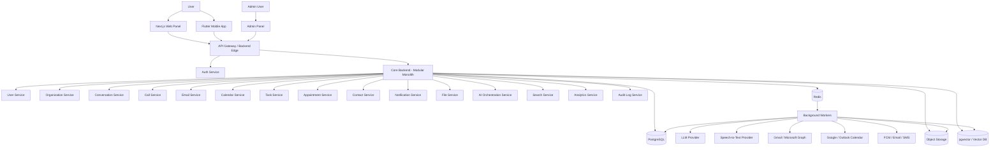

# 8. Monolith vs Microservice Kararı

## 8.1 Modular Monolith

Avantajlar:

- MVP daha hızlı geliştirilir.
- Deployment, monitoring ve debugging basittir.
- Tek repository ve tek transaction boundary ile ekip koordinasyonu kolaydır.
- Küçük ekiplerde operasyon maliyeti düşüktür.
- Domain modülleri iyi ayrılırsa ileride mikroservise bölünebilir.

Dezavantajlar:

- Modül sınırları disiplinli korunmazsa kod bağımlılıkları artar.
- Tüm backend aynı ölçekleme birimine bağlı olur.
- Çok yüksek trafik veya farklı workload profilleri için yetersiz kalabilir.

## 8.2 Microservice

Avantajlar:

- Servisler bağımsız ölçeklenir.
- AI, mail sync, notification, analytics gibi farklı workload’lar ayrıştırılır.
- Enterprise tenant ve güvenlik gereksinimleri daha ayrıntılı yönetilebilir.
- Takımlar servis sahipliği alabilir.

Dezavantajlar:

- İlk ürün için yüksek operasyon karmaşıklığı yaratır.
- Distributed tracing, service discovery, network hata yönetimi, contract testing gerektirir.
- Transaction yönetimi ve veri tutarlılığı daha zor hale gelir.

## 8.3 Karar

MVP için modular monolith seçilmelidir. AI processing, transcription, notification ve sync işleri ayrı worker süreçlerinde çalışmalıdır. Uzun vadede event-driven microservice architecture’a evrilmek için modül sınırları, event sözleşmeleri ve veri sahipliği baştan tanımlanmalıdır.

# 9. Önerilen Mimari Yaklaşım

Önerilen yaklaşım:

- Backend: Python + FastAPI + SQLAlchemy + Alembic.
- API: REST API + OpenAPI, realtime durumlar için WebSocket.
- Async jobs: Celery + Redis.
- Database: PostgreSQL.
- Vector search: MVP’de pgvector, ileri fazda Qdrant/Weaviate/Pinecone değerlendirmesi.
- Cache/queue: Redis.
- Object storage: MVP local MinIO, production S3/GCS/Azure Blob.
- Web: Next.js + React + TypeScript + Tailwind CSS + TanStack Query.
- Mobile: Flutter + Dart + Clean Architecture + MVVM.
- AI: LLM provider + embedding model + prompt versioning + RAG + evaluation.
- DevOps: Docker Compose local, production için managed DB/Redis ve Kubernetes veya managed container platformu.

# 10. MVP Mimarisi

MVP mimarisi, ürün değerini hızlı doğrulamak için sade tutulmalıdır.

MVP bileşenleri:

- FastAPI modular monolith.
- PostgreSQL ana veritabanı.
- Redis cache ve Celery broker.
- Basic AI worker.
- Web panel.
- Basit mobil uygulama.
- Google Calendar entegrasyonu.
- Manuel görüşme metni analizi.
- Basit dashboard.
- Kişi kartı.
- Görev ve randevu yönetimi.
- Basit AI Chat.

MVP dışı veya sınırlı:

- Otomatik telefon kayıt entegrasyonu.
- Tam WhatsApp kişisel sohbet okuma.
- Enterprise SSO.
- Dedicated tenant.
- Gelişmiş CRM pipeline.
- Gelişmiş analytics.

# 11. Ölçeklenebilir Nihai Mimari

Uzun vadeli mimari event-driven microservice architecture olmalıdır.

Nihai servis ayrışımı:

- Identity Service.
- Organization & Tenant Service.
- Conversation Service.
- Call & Transcription Service.
- Email Integration Service.
- Calendar Integration Service.
- Task Service.
- Appointment Service.
- Contact/CRM Service.
- AI Orchestration Service.
- Embedding & Search Service.
- Notification Service.
- Audit & Compliance Service.
- Analytics Service.
- Billing Service.
- Webhook/API Platform Service.

Mikroservise geçiş tetikleyicileri:

- AI job hacmi ana API performansını etkiliyor.
- Mail/calendar sync job’ları ayrı ölçekleme gerektiriyor.
- Enterprise müşteriler veri izolasyonu istiyor.
- Team ve analytics workload’ları büyüyor.
- Bağımsız release ihtiyacı artıyor.

# 12. Backend Mimarisi

Backend FastAPI tabanlı modular monolith olarak başlamalıdır. Kod seviyesinde modül yapısı bu dokümanda tanımlanmaz; ancak mantıksal domain sınırları açık olmalıdır.

Backend katmanları:

- API Layer: request validation, authentication, response format.
- Application Layer: use case orchestration, transaction boundary.
- Domain Layer: iş kuralları, entity davranışları, domain event üretimi.
- Infrastructure Layer: database repositories, external APIs, queues, storage, AI providers.
- Worker Layer: async jobs, retry, DLQ, scheduling.

Backend prensipleri:

- Tenant ID her sorgu ve komutta zorunlu bağlamdır.
- AI önerileri pending state ile saklanır.
- Kullanıcı onayı ayrı command olarak işlenir.
- OAuth tokenlarına doğrudan domain servisleri erişmemeli; Integration Service üzerinden erişmelidir.
- Audit log kritik işlemlerde otomatik yazılmalıdır.

# 13. Frontend Web Mimarisi

Next.js web panel, ürünün ana yönetim arayüzüdür.

Ana mimari kararlar:

- App Router kullanılmalıdır.
- TypeScript zorunlu olmalıdır.
- Server Components yalnızca güvenli ve uygun veri çekimi için kontrollü kullanılmalıdır.
- Client-side yoğun interaktif ekranlarda React Query/TanStack Query kullanılmalıdır.
- Form validation için schema tabanlı doğrulama yaklaşımı benimsenmelidir.
- Role-based UI rendering backend yetkilendirmesinin yerine geçmemeli, yalnızca deneyim katmanı olmalıdır.

Web katmanları:

- Layout sistemi: auth layout, app layout, admin layout.
- API client layer: typed request/response sözleşmeleri.
- Query layer: cache, invalidation, optimistic update sınırlı kullanımı.
- State management: Zustand küçük UI state için, server state için TanStack Query.
- Error boundary: sayfa ve modül bazlı.
- Loading/empty states: dashboard, arama, chat, görev, randevu ekranları için özel durumlar.
- Realtime updates: AI analiz durumu ve bildirimler için WebSocket veya polling.
- i18n: Türkçe varsayılan, ileri fazda İngilizce.
- Accessibility: keyboard navigation, focus states, ARIA, kontrast.

Ana web ekranları:

- Login, Register.
- Dashboard.
- Görüşmeler, Görüşme Detayı.
- AI Analiz Sonuçları.
- Görevler.
- Randevular ve Takvim.
- Mail Analizi.
- Kişiler ve Kişi Detayı.
- AI Chat.
- Arama.
- Bildirimler.
- Ayarlar.
- Entegrasyonlar.
- Admin Panel.
- Abonelik.

# 14. Mobil Uygulama Mimarisi

Mobil uygulama Flutter + Dart ile geliştirilmelidir. Hedef; saha kullanıcıları, satış ekipleri, emlak danışmanları ve profesyonellerin hızlı görev/randevu takibi yapmasıdır.

Mimari yaklaşım:

- Clean Architecture.
- Presentation layer: ekranlar, widget’lar, view model/state.
- Domain layer: use case, entity, repository interface.
- Data layer: API client, DTO, local cache, secure storage.
- Repository pattern.
- Use case pattern.
- MVVM yaklaşımı.

Mobil özellikler:

- Local cache ve offline-first sınırlı destek.
- Push notification: Firebase Cloud Messaging.
- Secure storage: token, cihaz id, hassas local metadata.
- Biometric login: ileri faz.
- Deep link: randevu, görev, bildirim ve kişi kartı açma.
- Background sync: platform kısıtlarına uyumlu, düşük frekanslı.
- Permission handling: bildirim, dosya seçimi, mikrofon, takvim izinleri.

Telefon görüşmesi kısıtları:

- iOS, üçüncü taraf uygulamaların telefon görüşmelerini otomatik kaydetmesine izin vermez.
- Android tarafında otomatik kayıt üretici, ülke, OS sürümü ve mağaza politikalarına bağlı olarak ciddi şekilde kısıtlıdır.
- MVP’de manuel metin yükleme, ses dosyası yükleme veya kullanıcı onaylı kayıt yaklaşımı daha güvenli ve uygulanabilirdir.
- Telefon görüşmesi işleme akışında kullanıcıya taraf bilgilendirme yükümlülükleri açıkça gösterilmelidir.

# 15. Admin Panel Mimarisi

Admin panel iki seviyede düşünülmelidir:

- Platform admin: NeuroDesk operasyon ekibi.
- Organization admin: kurumsal müşteri yöneticisi.

MVP admin özellikleri:

- Kullanıcı listesi.
- Hesap durumları.
- Plan/kota bilgisi.
- Sistem kullanım metrikleri.
- AI hata ve feedback kayıtları.
- Entegrasyon sağlık durumu.

Enterprise admin özellikleri:

- Rol yönetimi.
- SSO ayarları.
- Audit log export.
- Retention policy.
- Tenant security policy.
- SIEM export.
- Data deletion/export talepleri.

# 16. API Gateway Mimarisi

MVP’de API Gateway ayrı bir servis olmak zorunda değildir. FastAPI uygulamasının edge layer’ı gateway sorumluluklarının bir bölümünü üstlenebilir. Production olgunlaştıkça Nginx, cloud load balancer veya managed API gateway devreye alınabilir.

Gateway sorumlulukları:

- TLS termination.
- Request routing.
- Rate limiting.
- Authentication middleware.
- Request ID üretimi.
- CORS politikası.
- Payload size limit.
- API version routing.
- Webhook signature verification.
- WAF entegrasyonu, ileri faz.

# 17. Authentication & Authorization Mimarisi

Kimlik doğrulama:

- JWT access token.
- Refresh token rotation.
- OAuth 2.0.
- Google, Microsoft, Apple login.
- Password hashing.
- Device/session management.
- 2FA/MFA ileri faz.

Yetkilendirme:

- MVP: kullanıcı bazlı erişim + tenant_id.
- Team: RBAC.
- Enterprise: RBAC + ABAC opsiyonu.
- AI Chat dahil tüm veri erişimi authorization layer’dan geçmelidir.

Token güvenliği:

- Access token kısa ömürlü olmalıdır.
- Refresh token server-side revocation ile yönetilmelidir.
- OAuth provider tokenları encrypted saklanmalıdır.
- Token erişimi Integration Service ile sınırlandırılmalıdır.

# 18. Kullanıcı ve Organizasyon Mimarisi

MVP’de bireysel kullanıcı temel varlıktır. Ancak tüm veri modelinde tenant_id bulunmalıdır. Bireysel kullanıcı için tenant, kullanıcının kişisel workspace’i olarak düşünülebilir.

Evrim:

- MVP: user + personal tenant.
- Team: organization + teams + memberships + roles.
- Enterprise: dedicated tenant, SSO domain mapping, custom retention.

Veri sahipliği:

- Kullanıcı kendi kişisel verisinin sahibidir.
- Kurumsal tenant içinde veri sahipliği sözleşmeye ve admin politikalarına göre yönetilir.
- Paylaşımlı kişi hafızası yalnızca yetkili ekiplerde görünür.

# 19. Servis Mimarileri

Bu bölümde servisler mantıksal servis olarak tanımlanır. MVP’de aynı backend içinde modül olabilir; ileri fazlarda bağımsız mikroservise ayrılabilir.

## 19.1 Auth Service

| Alan | Detay |
|---|---|
| Servis Adı | Auth Service |
| Amaç | Kimlik doğrulama, token yönetimi ve oturum güvenliği |
| Sorumluluklar | Kayıt, giriş, şifre sıfırlama, OAuth login, refresh token rotation, session revocation |
| Kullandığı veriler | User credentials, sessions, OAuth identities |
| Bağlı servisler | User Service, Audit Log Service, Notification Service |
| Dış entegrasyonlar | Google OAuth, Microsoft OAuth, Apple Login, transactional mail |
| Senkron işlemler | Login, token refresh, logout |
| Asenkron işlemler | Şifre sıfırlama maili, güvenlik bildirimi |
| API endpoint grupları | /auth, /auth/oauth, /auth/sessions |
| Ölçeklenme ihtiyacı | Orta; login spike durumunda artar |
| Güvenlik gereksinimleri | Brute force protection, password hashing, token rotation, audit |
| Hata durumları | Geçersiz token, OAuth hata, kilitli hesap |
| MVP kapsamı | Email/password, Google login, session management |
| İleri faz kapsamı | MFA, SSO, SCIM |

## 19.2 User Service

| Alan | Detay |
|---|---|
| Servis Adı | User Service |
| Amaç | Kullanıcı profili ve tercihlerini yönetmek |
| Sorumluluklar | Profil, saat dilimi, bildirim tercihleri, dil tercihi, cihaz bilgileri |
| Kullandığı veriler | Users, profiles, preferences, devices |
| Bağlı servisler | Auth, Notification, Consent |
| Dış entegrasyonlar | Yok |
| Senkron işlemler | Profil güncelleme, tercih okuma |
| Asenkron işlemler | Profil değişikliği event yayını |
| API endpoint grupları | /users, /me, /devices |
| Ölçeklenme ihtiyacı | Düşük/orta |
| Güvenlik gereksinimleri | Kullanıcı yalnızca kendi profilini düzenler |
| Hata durumları | Geçersiz tercih, yetkisiz erişim |
| MVP kapsamı | Profil ve tercih yönetimi |
| İleri faz kapsamı | Delegated access, admin impersonation with audit |

## 19.3 Organization Service

| Alan | Detay |
|---|---|
| Servis Adı | Organization Service |
| Amaç | Kurum, tenant, ekip ve üyelik yapısını yönetmek |
| Sorumluluklar | Organization, team, membership, tenant settings |
| Kullandığı veriler | Organizations, teams, memberships, tenant settings |
| Bağlı servisler | Role & Permission, Billing, Audit |
| Dış entegrasyonlar | SSO provider ileri faz |
| Senkron işlemler | Organizasyon oluşturma, üye listeleme |
| Asenkron işlemler | organization.created event |
| API endpoint grupları | /organizations, /teams |
| Ölçeklenme ihtiyacı | Team/Enterprise fazında artar |
| Güvenlik gereksinimleri | Tenant isolation, admin role kontrolü |
| Hata durumları | Yetkisiz tenant erişimi |
| MVP kapsamı | Basit personal tenant |
| İleri faz kapsamı | Team, SSO, dedicated tenant |

## 19.4 Role & Permission Service

| Alan | Detay |
|---|---|
| Servis Adı | Role & Permission Service |
| Amaç | RBAC ve ileri fazda ABAC kararlarını merkezi yönetmek |
| Sorumluluklar | Rol tanımı, izin kontrolü, policy evaluation |
| Kullandığı veriler | Roles, permissions, memberships |
| Bağlı servisler | Organization, Auth, Audit |
| Dış entegrasyonlar | SSO/IdP ileri faz |
| Senkron işlemler | Permission check |
| Asenkron işlemler | Role change event |
| API endpoint grupları | /roles, /permissions |
| Ölçeklenme ihtiyacı | Orta |
| Güvenlik gereksinimleri | Backend enforced authorization |
| Hata durumları | Permission denied |
| MVP kapsamı | Basit owner/user |
| İleri faz kapsamı | Custom roles, ABAC |

## 19.5 Conversation Service

| Alan | Detay |
|---|---|
| Servis Adı | Conversation Service |
| Amaç | Tüm iletişim kayıtları için ortak model sağlamak |
| Sorumluluklar | Görüşme, mail, not, meeting transcript kayıtlarının ortak timeline varlığı |
| Kullandığı veriler | Conversations, sources, participants, metadata |
| Bağlı servisler | Call, Email, Contact, AI Analysis |
| Dış entegrasyonlar | Yok |
| Senkron işlemler | Kayıt oluşturma, listeleme, detay okuma |
| Asenkron işlemler | conversation.created event |
| API endpoint grupları | /conversations |
| Ölçeklenme ihtiyacı | Yüksek veri büyümesiyle artar |
| Güvenlik gereksinimleri | Tenant ve kaynak bazlı izin |
| Hata durumları | Eksik kaynak, yetkisiz erişim |
| MVP kapsamı | Manuel görüşme metni kayıtları |
| İleri faz kapsamı | Çok kaynaklı timeline |

## 19.6 Call Service

| Alan | Detay |
|---|---|
| Servis Adı | Call Service |
| Amaç | Telefon görüşmesi veya görüşme metni kaynaklarını yönetmek |
| Sorumluluklar | Metin yükleme, dosya ilişkilendirme, call metadata, consent check |
| Kullandığı veriler | Calls, call transcripts, consent records |
| Bağlı servisler | Conversation, Transcription, AI Analysis, Consent |
| Dış entegrasyonlar | STT provider ileri faz |
| Senkron işlemler | Metin kabulü, kayıt oluşturma |
| Asenkron işlemler | Transcription, AI analysis job |
| API endpoint grupları | /calls |
| Ölçeklenme ihtiyacı | Orta/yüksek |
| Güvenlik gereksinimleri | Açık rıza, PII masking |
| Hata durumları | Rıza yok, format desteklenmiyor |
| MVP kapsamı | Manuel metin analizi |
| İleri faz kapsamı | Ses dosyası ve STT |

## 19.7 Transcription Service

| Alan | Detay |
|---|---|
| Servis Adı | Transcription Service |
| Amaç | Ses dosyalarını metne dönüştürmek |
| Sorumluluklar | STT job, dil tespiti, konuşmacı ayrımı, kalite skoru |
| Kullandığı veriler | Audio files, transcripts, language metadata |
| Bağlı servisler | File, Call, AI Analysis |
| Dış entegrasyonlar | Whisper, cloud STT providers |
| Senkron işlemler | Job durumu sorgulama |
| Asenkron işlemler | Uzun süren transcription |
| API endpoint grupları | /transcriptions |
| Ölçeklenme ihtiyacı | Yüksek ve burst olabilir |
| Güvenlik gereksinimleri | Ses dosyası şifreleme, consent |
| Hata durumları | Düşük ses kalitesi, STT timeout |
| MVP kapsamı | Kapsam dışı veya beta |
| İleri faz kapsamı | Multi-language STT, diarization |

## 19.8 AI Orchestration Service

| Alan | Detay |
|---|---|
| Servis Adı | AI Orchestration Service |
| Amaç | AI analiz, chat, embedding ve tool çağrılarını koordine etmek |
| Sorumluluklar | Model seçimi, prompt çağrısı, rate limit, cost tracking, retry |
| Kullandığı veriler | AI jobs, prompts, model configs, usage logs |
| Bağlı servisler | Prompt Engine, Analysis, Memory, Search, Audit |
| Dış entegrasyonlar | LLM provider, embedding provider |
| Senkron işlemler | Kısa AI Chat requestleri |
| Asenkron işlemler | Görüşme/mail analizleri |
| API endpoint grupları | /ai/analyze, /ai/chat |
| Ölçeklenme ihtiyacı | Yüksek |
| Güvenlik gereksinimleri | PII masking, provider policy, tenant rate limit |
| Hata durumları | Provider timeout, quota exceeded, hallucination risk |
| MVP kapsamı | Özet/görev/randevu analizi, basit chat |
| İleri faz kapsamı | Tool calling, model routing, AI evaluation |

## 19.9 AI Prompt Engine

| Alan | Detay |
|---|---|
| Servis Adı | AI Prompt Engine |
| Amaç | Prompt şablonlarını, versiyonlarını ve çıktı şemalarını yönetmek |
| Sorumluluklar | Prompt versioning, template rendering, output schema validation |
| Kullandığı veriler | Prompt templates, versions, evaluation metadata |
| Bağlı servisler | AI Orchestration, AI Analysis |
| Dış entegrasyonlar | LLM provider |
| Senkron işlemler | Prompt resolve |
| Asenkron işlemler | Prompt evaluation batch |
| API endpoint grupları | /admin/ai/prompts |
| Ölçeklenme ihtiyacı | Düşük |
| Güvenlik gereksinimleri | Admin-only access |
| Hata durumları | Geçersiz prompt version, schema mismatch |
| MVP kapsamı | Versiyonlu sabit promptlar |
| İleri faz kapsamı | A/B test, evaluation suite |

## 19.10 AI Analysis Service

| Alan | Detay |
|---|---|
| Servis Adı | AI Analysis Service |
| Amaç | Kaynak içerikten yapılandırılmış AI çıktıları üretmek |
| Sorumluluklar | Özet, görev, randevu, kişi/firma, risk, öncelik, confidence |
| Kullandığı veriler | Source text, metadata, analysis results |
| Bağlı servisler | Conversation, Task, Appointment, Contact, Audit |
| Dış entegrasyonlar | AI Orchestration üzerinden LLM |
| Senkron işlemler | Analiz sonucu okuma |
| Asenkron işlemler | Analysis job processing |
| API endpoint grupları | /ai/analysis |
| Ölçeklenme ihtiyacı | Yüksek |
| Güvenlik gereksinimleri | İnsan onayı, kaynak gösterme |
| Hata durumları | Parse edilemeyen AI output, düşük confidence |
| MVP kapsamı | Görüşme metni analizi |
| İleri faz kapsamı | Mail, belge, mesaj analizi |

## 19.11 AI Memory Service

| Alan | Detay |
|---|---|
| Servis Adı | AI Memory Service |
| Amaç | Kişi/firma bazlı özet hafıza ve bağlam oluşturmak |
| Sorumluluklar | Memory summary, timeline synthesis, stale memory refresh |
| Kullandığı veriler | Conversations, tasks, appointments, contacts |
| Bağlı servisler | Contact, Search, AI Orchestration |
| Dış entegrasyonlar | LLM/embedding provider |
| Senkron işlemler | Memory read |
| Asenkron işlemler | Memory update after events |
| API endpoint grupları | /ai/memory |
| Ölçeklenme ihtiyacı | Orta/yüksek |
| Güvenlik gereksinimleri | Yetki ve kaynak sınırı |
| Hata durumları | Eski veya çelişkili hafıza |
| MVP kapsamı | Basit kişi özeti |
| İleri faz kapsamı | Long-term AI memory |

## 19.12 Semantic Search Service

| Alan | Detay |
|---|---|
| Servis Adı | Semantic Search Service |
| Amaç | Doğal dil ve anlamsal arama sağlamak |
| Sorumluluklar | Query embedding, vector search, hybrid ranking |
| Kullandığı veriler | Embeddings, source records, permissions |
| Bağlı servisler | Embedding, Conversation, Contact, AI Chat |
| Dış entegrasyonlar | Vector DB |
| Senkron işlemler | Search query |
| Asenkron işlemler | Index refresh |
| API endpoint grupları | /search |
| Ölçeklenme ihtiyacı | Yüksek |
| Güvenlik gereksinimleri | Tenant-filtered vector search |
| Hata durumları | Yavaş sorgu, yanlış eşleşme |
| MVP kapsamı | pgvector ile temel arama |
| İleri faz kapsamı | Hybrid search, reranking |

## 19.13 Embedding Service

| Alan | Detay |
|---|---|
| Servis Adı | Embedding Service |
| Amaç | İçerikleri vektöre dönüştürmek |
| Sorumluluklar | Chunking, embedding generation, vector persistence |
| Kullandığı veriler | Text chunks, metadata, embedding vectors |
| Bağlı servisler | Search, AI Memory, Document Processing |
| Dış entegrasyonlar | Embedding provider |
| Senkron işlemler | Query embedding |
| Asenkron işlemler | Content embedding |
| API endpoint grupları | /embeddings internal |
| Ölçeklenme ihtiyacı | Yüksek veriyle artar |
| Güvenlik gereksinimleri | PII masking opsiyonu |
| Hata durumları | Provider error, token limit |
| MVP kapsamı | Görüşme ve not embedding |
| İleri faz kapsamı | Belge/mail/message embedding |

## 19.14 Email Integration Service

| Alan | Detay |
|---|---|
| Servis Adı | Email Integration Service |
| Amaç | Gmail/Outlook mail verilerini izinli şekilde almak ve analiz akışına sokmak |
| Sorumluluklar | OAuth token, mail metadata, sync, rate limit handling |
| Kullandığı veriler | Email accounts, messages, sync cursors |
| Bağlı servisler | Integration, AI Analysis, Task, Contact |
| Dış entegrasyonlar | Gmail API, Microsoft Graph |
| Senkron işlemler | Bağlantı durumu, seçili mail okuma |
| Asenkron işlemler | Mail sync, analysis queue |
| API endpoint grupları | /email |
| Ölçeklenme ihtiyacı | Orta/yüksek |
| Güvenlik gereksinimleri | Minimum scope, encrypted tokens |
| Hata durumları | Rate limit, revoked token |
| MVP kapsamı | Opsiyonel Gmail beta |
| İleri faz kapsamı | Outlook, rules, webhooks |

## 19.15 Calendar Integration Service

| Alan | Detay |
|---|---|
| Servis Adı | Calendar Integration Service |
| Amaç | Takvim etkinliği okuma, yazma ve çakışma kontrolü |
| Sorumluluklar | Google/Outlook Calendar sync, event create/update/delete |
| Kullandığı veriler | Calendar accounts, events, sync tokens |
| Bağlı servisler | Appointment, Notification, Integration |
| Dış entegrasyonlar | Google Calendar, Outlook Calendar |
| Senkron işlemler | Çakışma kontrolü, etkinlik oluşturma |
| Asenkron işlemler | Calendar sync |
| API endpoint grupları | /calendar |
| Ölçeklenme ihtiyacı | Orta |
| Güvenlik gereksinimleri | Kullanıcı onayı olmadan yazma yok |
| Hata durumları | Rate limit, sync conflict |
| MVP kapsamı | Google Calendar |
| İleri faz kapsamı | Outlook Calendar, two-way sync |

## 19.16 Task Service

| Alan | Detay |
|---|---|
| Servis Adı | Task Service |
| Amaç | Görev yaşam döngüsünü yönetmek |
| Sorumluluklar | Görev oluşturma, öneri onayı, öncelik, son tarih, durum |
| Kullandığı veriler | Tasks, task suggestions, reminders |
| Bağlı servisler | AI Analysis, Contact, Notification, Scheduler |
| Dış entegrasyonlar | İleri faz project management tools |
| Senkron işlemler | CRUD, status update |
| Asenkron işlemler | Reminder scheduling, task.created event |
| API endpoint grupları | /tasks |
| Ölçeklenme ihtiyacı | Orta |
| Güvenlik gereksinimleri | Tenant and ownership |
| Hata durumları | Geçersiz deadline, yetkisiz update |
| MVP kapsamı | Basit görev yönetimi |
| İleri faz kapsamı | Team assignment, automation |

## 19.17 Appointment Service

| Alan | Detay |
|---|---|
| Servis Adı | Appointment Service |
| Amaç | Randevu ve toplantı kayıtlarını yönetmek |
| Sorumluluklar | Randevu öneri onayı, local calendar, external sync |
| Kullandığı veriler | Appointments, participants, reminders |
| Bağlı servisler | Calendar, Notification, Contact, AI Analysis |
| Dış entegrasyonlar | Google/Outlook Calendar |
| Senkron işlemler | Create/update/delete |
| Asenkron işlemler | Reminder schedule, external sync |
| API endpoint grupları | /appointments |
| Ölçeklenme ihtiyacı | Orta |
| Güvenlik gereksinimleri | Onaysız etkinlik yok |
| Hata durumları | Calendar conflict, provider failure |
| MVP kapsamı | Local + Google Calendar |
| İleri faz kapsamı | Availability suggestions |

## 19.18 Contact / CRM Service

| Alan | Detay |
|---|---|
| Servis Adı | Contact / CRM Service |
| Amaç | Kişi ve firma hafızasını yönetmek |
| Sorumluluklar | Contact, company, timeline, relation mapping |
| Kullandığı veriler | Contacts, companies, interactions, notes |
| Bağlı servisler | Conversation, Task, Appointment, AI Memory |
| Dış entegrasyonlar | CRM integrations ileri faz |
| Senkron işlemler | Contact CRUD, timeline read |
| Asenkron işlemler | contact.updated event, memory refresh |
| API endpoint grupları | /contacts |
| Ölçeklenme ihtiyacı | Orta/yüksek |
| Güvenlik gereksinimleri | Paylaşım ve tenant kuralları |
| Hata durumları | Duplicate contact, yanlış eşleşme |
| MVP kapsamı | Kişi kartı ve timeline |
| İleri faz kapsamı | CRM pipeline, deduplication |

## 19.19 Notification Service

| Alan | Detay |
|---|---|
| Servis Adı | Notification Service |
| Amaç | Push, e-posta, SMS ve resmi kanallar üzerinden bildirim göndermek |
| Sorumluluklar | Channel selection, template, delivery log, retry |
| Kullandığı veriler | Notification preferences, templates, delivery logs |
| Bağlı servisler | Scheduler, Task, Appointment, User |
| Dış entegrasyonlar | FCM, SMTP/transactional mail, SMS provider |
| Senkron işlemler | Bildirim tercihi okuma |
| Asenkron işlemler | Notification send |
| API endpoint grupları | /notifications |
| Ölçeklenme ihtiyacı | Burst durumunda yüksek |
| Güvenlik gereksinimleri | Hassas içerik minimizasyonu |
| Hata durumları | Provider failure, invalid device token |
| MVP kapsamı | E-posta ve temel push |
| İleri faz kapsamı | SMS, WhatsApp Business notification |

## 19.20 Scheduler Service

| Alan | Detay |
|---|---|
| Servis Adı | Scheduler Service |
| Amaç | Zamanlanmış işleri tetiklemek |
| Sorumluluklar | Reminder jobs, sync schedules, recurring tasks |
| Kullandığı veriler | Scheduled jobs, reminders, retry state |
| Bağlı servisler | Notification, Email, Calendar, Task |
| Dış entegrasyonlar | Yok |
| Senkron işlemler | Job durumu |
| Asenkron işlemler | Periyodik job tetikleme |
| API endpoint grupları | Internal |
| Ölçeklenme ihtiyacı | Orta |
| Güvenlik gereksinimleri | Idempotency |
| Hata durumları | Missed schedule, duplicate job |
| MVP kapsamı | Hatırlatma planlama |
| İleri faz kapsamı | Distributed scheduler |

## 19.21 File Service

| Alan | Detay |
|---|---|
| Servis Adı | File Service |
| Amaç | Dosya yükleme, saklama ve erişim kontrolü |
| Sorumluluklar | Signed URL, metadata, object storage access |
| Kullandığı veriler | File metadata, storage keys, ownership |
| Bağlı servisler | Document Processing, Call, Contact |
| Dış entegrasyonlar | S3/GCS/Azure Blob/MinIO |
| Senkron işlemler | Upload URL alma, file metadata |
| Asenkron işlemler | Malware scan, document processing |
| API endpoint grupları | /files |
| Ölçeklenme ihtiyacı | Dosya hacmine bağlı |
| Güvenlik gereksinimleri | Private bucket, signed URL, content type validation |
| Hata durumları | Upload fail, file too large |
| MVP kapsamı | Metin dosyası ve belge metadata |
| İleri faz kapsamı | Malware scanning, OCR |

## 19.22 Document Processing Service

| Alan | Detay |
|---|---|
| Servis Adı | Document Processing Service |
| Amaç | Belgelerden metin ve metadata çıkarmak |
| Sorumluluklar | OCR, parsing, chunking, embedding job |
| Kullandığı veriler | Files, extracted text, chunks |
| Bağlı servisler | File, Embedding, AI Analysis |
| Dış entegrasyonlar | OCR provider ileri faz |
| Senkron işlemler | Processing status |
| Asenkron işlemler | Parse/OCR/chunk/embed |
| API endpoint grupları | /documents |
| Ölçeklenme ihtiyacı | Yüksek dosya hacminde artar |
| Güvenlik gereksinimleri | PII handling, file access control |
| Hata durumları | Unsupported format, OCR failure |
| MVP kapsamı | Sınırlı metin dosyası |
| İleri faz kapsamı | PDF, DOCX, OCR |

## 19.23 Audit Log Service

| Alan | Detay |
|---|---|
| Servis Adı | Audit Log Service |
| Amaç | Kritik işlemleri değiştirilemez şekilde kayıt altına almak |
| Sorumluluklar | Append-only audit records, export, retention |
| Kullandığı veriler | Actor, action, entity, tenant, timestamp, metadata |
| Bağlı servisler | Tüm kritik servisler |
| Dış entegrasyonlar | SIEM ileri faz |
| Senkron işlemler | Audit write, query |
| Asenkron işlemler | SIEM export |
| API endpoint grupları | /audit |
| Ölçeklenme ihtiyacı | Yüksek yazma hacmi |
| Güvenlik gereksinimleri | Tamper resistance |
| Hata durumları | Audit write failure critical |
| MVP kapsamı | Kritik aksiyon audit |
| İleri faz kapsamı | SIEM export, immutable store |

## 19.24 Analytics Service

| Alan | Detay |
|---|---|
| Servis Adı | Analytics Service |
| Amaç | Kullanım, ürün ve ekip metriklerini üretmek |
| Sorumluluklar | DAU/WAU, task metrics, AI usage, reporting |
| Kullandığı veriler | Events, tasks, appointments, AI usage |
| Bağlı servisler | Dashboard, Billing, Admin |
| Dış entegrasyonlar | BI tools ileri faz |
| Senkron işlemler | Dashboard metrics |
| Asenkron işlemler | Aggregation jobs |
| API endpoint grupları | /analytics, /dashboard |
| Ölçeklenme ihtiyacı | Veri büyüdükçe artar |
| Güvenlik gereksinimleri | Aggregated access rules |
| Hata durumları | Stale metrics |
| MVP kapsamı | Basit dashboard metrikleri |
| İleri faz kapsamı | Team and enterprise analytics |

## 19.25 Admin Service

| Alan | Detay |
|---|---|
| Servis Adı | Admin Service |
| Amaç | Platform ve organizasyon yönetim işlemleri |
| Sorumluluklar | User status, plan, integrations health, support operations |
| Kullandığı veriler | Users, tenants, plans, health metrics |
| Bağlı servisler | Auth, Billing, Audit, Analytics |
| Dış entegrasyonlar | Support tools ileri faz |
| Senkron işlemler | Admin queries |
| Asenkron işlemler | Admin action notifications |
| API endpoint grupları | /admin |
| Ölçeklenme ihtiyacı | Düşük |
| Güvenlik gereksinimleri | Strong admin audit, least privilege |
| Hata durumları | Unauthorized admin action |
| MVP kapsamı | Basit platform admin |
| İleri faz kapsamı | Org admin, policy management |

## 19.26 Billing Service

| Alan | Detay |
|---|---|
| Servis Adı | Billing Service |
| Amaç | Abonelik, kota ve ödeme süreçlerini yönetmek |
| Sorumluluklar | Plans, subscriptions, usage quotas, invoices |
| Kullandığı veriler | Plans, subscriptions, usage, invoices |
| Bağlı servisler | AI Orchestration, Organization, Admin |
| Dış entegrasyonlar | Stripe/Iyzico/PayTR benzeri provider |
| Senkron işlemler | Plan okuma, kota kontrol |
| Asenkron işlemler | Webhook processing |
| API endpoint grupları | /billing |
| Ölçeklenme ihtiyacı | Orta |
| Güvenlik gereksinimleri | Idempotency, signed webhooks |
| Hata durumları | Payment failure, webhook duplicate |
| MVP kapsamı | Plan/kota temeli |
| İleri faz kapsamı | Tam ödeme ve faturalama |

## 19.27 Webhook Service

| Alan | Detay |
|---|---|
| Servis Adı | Webhook Service |
| Amaç | Dış sistemlerden gelen olayları güvenli almak ve dışarı webhook göndermek |
| Sorumluluklar | Signature verify, idempotency, event enqueue |
| Kullandığı veriler | Webhook events, delivery attempts |
| Bağlı servisler | Integration, Billing, Email, Calendar |
| Dış entegrasyonlar | Payment, calendar/mail webhooks, CRM |
| Senkron işlemler | Webhook receive |
| Asenkron işlemler | Webhook processing and delivery |
| API endpoint grupları | /webhooks |
| Ölçeklenme ihtiyacı | Burst olabilir |
| Güvenlik gereksinimleri | Signature verification |
| Hata durumları | Invalid signature, duplicate event |
| MVP kapsamı | Sınırlı provider webhook |
| İleri faz kapsamı | Public API webhooks |

## 19.28 Integration Service

| Alan | Detay |
|---|---|
| Servis Adı | Integration Service |
| Amaç | Tüm harici bağlantıları ortak soyutlama ile yönetmek |
| Sorumluluklar | OAuth accounts, token storage, provider adapters, sync state |
| Kullandığı veriler | Integration accounts, encrypted tokens, scopes |
| Bağlı servisler | Email, Calendar, File, Billing |
| Dış entegrasyonlar | Google, Microsoft, storage, payment |
| Senkron işlemler | Connect/disconnect/status |
| Asenkron işlemler | Token refresh, sync jobs |
| API endpoint grupları | /integrations |
| Ölçeklenme ihtiyacı | Orta |
| Güvenlik gereksinimleri | Encrypted token, least privilege |
| Hata durumları | Revoked token, scope mismatch |
| MVP kapsamı | Google Calendar integration |
| İleri faz kapsamı | Provider marketplace |

## 19.29 Consent Management Service

| Alan | Detay |
|---|---|
| Servis Adı | Consent Management Service |
| Amaç | Kullanıcı rızalarını ve aydınlatma metni kabullerini yönetmek |
| Sorumluluklar | Consent records, policy versions, withdrawal |
| Kullandığı veriler | Consent, policy documents, timestamps |
| Bağlı servisler | Call, Email, Data Privacy, Audit |
| Dış entegrasyonlar | Yok |
| Senkron işlemler | Consent check |
| Asenkron işlemler | consent.updated event |
| API endpoint grupları | /consents |
| Ölçeklenme ihtiyacı | Düşük/orta |
| Güvenlik gereksinimleri | Tam ve değiştirilemez kayıt |
| Hata durumları | Eksik rıza, eski metin versiyonu |
| MVP kapsamı | Temel rıza kayıtları |
| İleri faz kapsamı | Granular consent policies |

## 19.30 Data Privacy Service

| Alan | Detay |
|---|---|
| Servis Adı | Data Privacy Service |
| Amaç | Veri silme, dışa aktarma, maskeleme ve retention süreçlerini yönetmek |
| Sorumluluklar | Export, delete, anonymize, retention enforcement |
| Kullandığı veriler | User data map, deletion jobs, export packages |
| Bağlı servisler | Tüm data owner servisler, Audit |
| Dış entegrasyonlar | Object storage |
| Senkron işlemler | Talep oluşturma |
| Asenkron işlemler | Export/delete/anonymize jobs |
| API endpoint grupları | /privacy |
| Ölçeklenme ihtiyacı | Talep hacmine bağlı |
| Güvenlik gereksinimleri | Identity verification, audit |
| Hata durumları | Partial deletion, legal hold |
| MVP kapsamı | Veri silme ve export talebi |
| İleri faz kapsamı | Enterprise retention and legal hold |

# 20. AI Mimarisi

## 20.1 AI Pipeline

AI pipeline aşağıdaki aşamalardan oluşmalıdır:

1. Veri kaynağı:
   - Telefon görüşmesi metni.
   - Transcription sonucu.
   - Mail içeriği.
   - Takvim etkinliği.
   - Kullanıcı notu.
   - Belge.
   - Toplantı metni.
   - Resmi entegrasyonla gelen mesaj.

2. Pre-processing:
   - Dil tespiti.
   - Gereksiz karakter temizleme.
   - Kişisel veri maskeleme opsiyonu.
   - Segmentasyon.
   - Konuşmacı ayrımı.
   - Metadata ekleme: tenant_id, source_type, source_id, user_id, timestamp.

3. AI Analysis:
   - Özet çıkarma.
   - Görev çıkarma.
   - Randevu çıkarma.
   - Tarih/saat normalizasyonu.
   - Kişi/firma tespiti.
   - Öncelik puanı.
   - Risk tespiti.
   - Konu sınıflandırma.
   - Duygu analizi opsiyonel.
   - Bekleyen iş tespiti.
   - Confidence score.

4. Human Approval Layer:
   - AI önerileri otomatik uygulanmaz.
   - Kullanıcı onayı gerekir.
   - Kullanıcı düzenleyebilir, reddedebilir veya onaylayabilir.
   - Onaylanmayan öneriler dış sistemlere yazılmaz.

5. Persistence:
   - Structured data PostgreSQL’e kaydedilir.
   - Embedding vector database’e kaydedilir.
   - Dosyalar object storage’da tutulur.
   - AI kararları ve öneri yaşam döngüsü audit log’a yazılır.

6. Retrieval:
   - AI Chat.
   - Semantic search.
   - Kişi hafızası.
   - Dashboard önerileri.

7. Feedback Loop:
   - Kullanıcı öneriyi kabul etti mi?
   - Reddetti mi?
   - Düzenledi mi?
   - AI yanlış mıydı?
   - Bu veriler prompt evaluation ve model kalite ölçümü için saklanır.

## 20.2 Prompt Engine

Prompt engine, promptları kod içine gömmek yerine versiyonlu ve yönetilebilir hale getirmelidir.

Gereksinimler:

- Prompt ID.
- Prompt version.
- Model configuration.
- Input schema.
- Output schema.
- Safety instructions.
- Locale/language.
- Evaluation dataset bağlantısı.
- Rollback kabiliyeti.

## 20.3 RAG ve Semantic Search

AI Chat cevapları RAG yaklaşımıyla üretilmelidir:

- Kullanıcı sorusu embedding’e çevrilir.
- Tenant ve authorization filtreleri uygulanır.
- Vector search ile ilgili kayıtlar bulunur.
- Gerekirse keyword search ile hybrid sonuçlar birleştirilir.
- Context oluşturulur.
- LLM yalnızca kaynak context’e dayanarak cevap üretir.
- Cevap kaynaklarla gösterilir.

## 20.4 AI Evaluation

AI kalitesi MVP’den itibaren ölçülmelidir:

- Görev çıkarma doğruluk oranı.
- Randevu tarih doğruluğu.
- Özet kullanıcı memnuniyeti.
- Hallucination oranı.
- Kaynak gösterme oranı.
- Kullanıcı kabul/red/düzenleme oranları.
- Ortalama token maliyeti.

# 21. AI Güvenlik Prensipleri

- AI kullanıcı onayı olmadan mail gönderemez.
- AI kullanıcı onayı olmadan takvim etkinliği oluşturamaz.
- AI kullanıcı onayı olmadan görev atayamaz.
- AI kullanıcı onayı olmadan veri silemez.
- AI hassas verileri gereksiz yere LLM sağlayıcısına göndermemelidir.
- Kullanıcı isterse kişisel veriler maskelenmelidir.
- AI cevapları kaynak göstermelidir.
- AI belirsiz durumlarda kesin konuşmamalıdır.
- AI confidence score düşükse öneri “düşük güven” etiketiyle gösterilmelidir.
- AI hallucination riskine karşı kaynaklı cevap sistemi kurulmalıdır.
- AI promptları versiyonlanmalıdır.
- AI çıktıları loglanmalı, ancak loglarda gereksiz PII tutulmamalıdır.
- Kullanıcı feedback’i toplanmalıdır.
- Tool/function calling izinleri whitelist ile sınırlandırılmalıdır.
- AI action gateway, onay gerektiren aksiyonları bloklamalıdır.

# 22. Veri Akış Senaryoları

## 22.1 Telefon Görüşmesi Analizi Akışı

1. Kullanıcı görüşme metni yükler veya transcription tamamlanır.
2. Call Service rıza kontrolü yapar.
3. Conversation Service kayıt oluşturur.
4. AI Analysis Queue’ya job atılır.
5. AI Worker pre-processing yapar.
6. AI Analysis Service özet, görev ve randevu önerileri çıkarır.
7. Öneriler pending state ile kaydedilir.
8. Sonuç kullanıcıya gösterilir.
9. Kullanıcı onaylarsa Task/Appointment Service kayıt oluşturur.
10. Notification Service hatırlatmaları planlar.
11. Contact Service kişi timeline’ını günceller.
12. Embedding Service semantic search indexini günceller.

## 22.2 Mail Analizi Akışı

1. Kullanıcı Gmail/Outlook bağlar.
2. OAuth token Integration Service tarafından encrypted saklanır.
3. Email Integration Service mail metadata alır.
4. Uygun mailler analiz kuyruğuna alınır.
5. AI maili özetler.
6. Görev, randevu, son tarih ve bekleyen cevap çıkarır.
7. Kullanıcı onaylarsa ilgili işlem yapılır.
8. Mail kaynak kayıtları contact timeline’a bağlanır.

## 22.3 AI Chat Akışı

1. Kullanıcı soru sorar.
2. Authorization context oluşturulur.
3. Query embedding oluşturulur.
4. Vector DB üzerinde tenant-filtered arama yapılır.
5. İlgili görüşme, mail, görev, not kayıtları getirilir.
6. RAG context oluşturulur.
7. LLM cevap üretir.
8. Cevap kaynaklarla gösterilir.
9. Chat ve kullanım metrikleri loglanır.

## 22.4 Randevu Oluşturma Akışı

1. AI randevu önerir.
2. Kullanıcı detayları görür.
3. Calendar Service çakışma kontrolü yapar.
4. Kullanıcı onaylar.
5. Appointment Service yerel randevu oluşturur.
6. Kullanıcı izin verdiyse Calendar Integration Service harici takvime yazar.
7. Notification Service hatırlatmaları planlar.

## 22.5 Görev Oluşturma Akışı

1. AI görev önerir.
2. Kullanıcı düzenler veya onaylar.
3. Task Service görev oluşturur.
4. Deadline varsa Scheduler hatırlatma planlar.
5. Contact timeline güncellenir.
6. Audit log yazılır.

## 22.6 Bildirim Gönderme Akışı

1. Scheduler zamanı gelen job’ı bulur.
2. Notification Service kullanıcı tercihlerini okur.
3. Uygun kanal seçilir.
4. Push/e-posta/SMS gönderilir.
5. Teslim durumu loglanır.
6. Hata varsa retry veya DLQ uygulanır.

## 22.7 Kişi Hafızası Akışı

1. Yeni görüşme/mail geldiğinde kişi tespit edilir.
2. Contact Service mevcut kişiyle eşleştirir veya öneri üretir.
3. Timeline güncellenir.
4. AI Memory özet hafızayı günceller.
5. Search index güncellenir.

# 23. Veritabanı Mimari Kararları

Cilt 2 tablo detayına girmez; tablo tasarımları Cilt 3’te yapılacaktır.

Kararlar:

- Ana ilişkisel veritabanı PostgreSQL olacaktır.
- Kullanıcı, organizasyon, görev, randevu, görüşme, mail, kişi gibi structured data PostgreSQL’de saklanacaktır.
- Redis cache ve job queue için kullanılacaktır.
- Vector data için MVP’de pgvector tercih edilebilir.
- Ölçek büyüdüğünde Qdrant, Weaviate veya Pinecone değerlendirilecektir.
- Dosyalar object storage’da tutulacaktır.
- Audit logs append-only mantıkla saklanacaktır.
- Hassas veriler encryption at rest ile korunacaktır.
- Multi-tenant veri ayrımı tenant_id ile yapılacaktır.
- Enterprise için ayrı database veya schema-per-tenant opsiyonları değerlendirilecektir.

# 24. Cache Mimarisi

Redis kullanım alanları:

- Session/token denylist.
- Dashboard cache.
- Rate limiting counters.
- Temporary OAuth state.
- Queue broker.
- AI job status cache.
- Notification throttling.

Cache prensipleri:

- Hassas veri cache’e mümkün olduğunca yazılmamalıdır.
- Cache key’leri tenant_id içermelidir.
- TTL zorunlu olmalıdır.
- Cache miss durumunda sistem çalışmaya devam etmelidir.

# 25. Storage Mimarisi

Object storage kullanım alanları:

- Ses dosyaları.
- Yüklenen belgeler.
- Export paketleri.
- AI işlem ara dosyaları, gerekiyorsa kısa ömürlü.

MVP:

- Local development için MinIO.
- Production için AWS S3, GCS veya Azure Blob.

Güvenlik:

- Private bucket.
- Signed URL.
- Content type validation.
- Dosya boyutu limitleri.
- Malware scanning ileri faz.
- Retention ve deletion policy.

# 26. Entegrasyon Mimarisi

| Entegrasyon | Amaç | İzinler | Veri akışı | Token saklama | Güvenlik | Rate limit riski | Hata yönetimi | MVP durumu | İleri faz |
|---|---|---|---|---|---|---|---|---|---|
| Google OAuth | Login ve Google servis erişimi | profile, email, calendar scopes | OAuth callback ile token | Encrypted | Minimum scope | Düşük/orta | Reconnect | Must | Genişletilir |
| Microsoft OAuth | Login ve Outlook erişimi | profile, email, calendar | OAuth callback | Encrypted | Tenant policy | Orta | Reconnect | Should | Enterprise önemli |
| Gmail API | Mail analizi | readonly/minimum mail scope | Mail metadata/content | Encrypted | Scope açıklaması | Yüksek | Backoff, sync cursor | Opsiyonel | Pro değer |
| Microsoft Graph | Outlook mail/calendar | mail/calendar scopes | Graph API | Encrypted | Admin consent gerekebilir | Yüksek | Backoff | Faz 2 | Enterprise |
| Google Calendar | Takvim okuma/yazma | calendar read/write | Event sync/write | Encrypted | Kullanıcı onayı | Orta | Retry/conflict | Must | Two-way sync |
| Outlook Calendar | Takvim entegrasyonu | calendar scopes | Graph events | Encrypted | Admin consent | Orta | Retry/conflict | Faz 2 | Enterprise |
| FCM | Push notification | device token | Backend to FCM | Device token encrypted/limited | Token rotation | Orta | Invalid token cleanup | Should | Must mobile |
| SMS Provider | Kritik bildirim | phone number | API send | Provider key secret manager | Opt-in | Orta | Retry/fallback | Could | Paid plans |
| Transactional Mail | E-posta bildirim | email | API/SMTP send | API key secret | SPF/DKIM/DMARC | Orta | Bounce handling | Must | Templates |
| WhatsApp Business API | Resmi mesaj kanalı | business permissions | Approved messages | Encrypted credential | Resmi/izinli kullanım | Yüksek | Provider rules | Kapsam dışı | Faz 3/4 |
| STT Provider | Ses metne çeviri | audio processing | Audio to transcript | API key secret | Consent required | Yüksek maliyet | Retry/fallback | Opsiyonel | Faz 2/3 |
| LLM Provider | AI analiz/chat | text processing | Prompt/context to LLM | API key secret | PII masking | Kota/maliyet | Retry/model fallback | Must | Multi-provider |
| Object Storage | Dosya saklama | bucket access | Signed upload/download | IAM/secret | Private bucket | Düşük | Retry | Must | Regional storage |
| Payment Provider | Abonelik | payment/customer | Checkout/webhook | Secret manager | Signed webhook | Orta | Idempotency | Later MVP | Must monetization |
| CRM/ERP | İleri entegrasyon | CRM scopes | Contact/task sync | Encrypted | Tenant admin consent | Yüksek | Sync logs | Yok | Faz 5 |

# 27. Event-Driven Architecture

MVP’de domain eventler uygulama içinde üretilip Redis/Celery job’larına dönüşebilir. İleri fazda event broker üzerinden servisler arası haberleşme sağlanmalıdır.

Örnek eventler:

| Event | Açıklama |
|---|---|
| user.created | Yeni kullanıcı oluşturuldu |
| organization.created | Yeni organizasyon/tenant oluşturuldu |
| call.uploaded | Kullanıcı görüşme metni veya dosyası yükledi |
| call.transcription.completed | Ses metne dönüştürüldü |
| conversation.created | Yeni iletişim kaydı oluşturuldu |
| ai.analysis.requested | AI analiz işi kuyruğa alındı |
| ai.analysis.completed | AI analiz sonucu üretildi |
| task.suggested | AI görev önerisi oluşturdu |
| task.created | Kullanıcı onayıyla görev oluşturuldu |
| appointment.suggested | AI randevu önerdi |
| appointment.created | Kullanıcı onayıyla randevu oluşturuldu |
| calendar.event.created | Harici takvim etkinliği oluşturuldu |
| email.received | Yeni mail metadata alındı |
| email.analysis.completed | Mail analizi tamamlandı |
| notification.scheduled | Bildirim zamanlandı |
| notification.sent | Bildirim gönderildi |
| contact.updated | Kişi timeline veya profil güncellendi |
| document.uploaded | Belge yüklendi |
| embedding.created | Embedding kaydı oluşturuldu |
| subscription.updated | Abonelik değişti |
| consent.updated | Kullanıcı rızası değişti |

Broker seçenekleri:

- Redis Queue/Celery: MVP için yeterli, operasyonu basit.
- RabbitMQ: Daha güvenilir routing, retry ve queue yönetimi için iyi.
- Kafka: Yüksek hacimli event stream, analytics ve enterprise ölçekte güçlü; MVP için ağır.

Karar: MVP’de Redis/Celery, Faz 3/4 sonrası RabbitMQ veya Kafka değerlendirilmelidir.

# 28. Queue, Background Job ve Scheduler Mimarisi

Background job türleri:

- AI analysis job.
- Embedding generation job.
- Email sync job.
- Calendar sync job.
- Notification send job.
- Export/delete privacy job.
- Document processing job.
- Retry/DLQ job.

Job prensipleri:

- Idempotent olmalıdır.
- Retry politikası tanımlanmalıdır.
- Maksimum deneme sayısı olmalıdır.
- Dead letter queue kullanılmalıdır.
- Job status kullanıcıya gösterilebilir olmalıdır.
- AI job maliyeti izlenmelidir.

Scheduler:

- Hatırlatma zamanlarını tetikler.
- Periyodik mail/calendar sync başlatır.
- Retention cleanup çalıştırır.
- Metrics aggregation yapar.

# 29. API Tasarım Prensipleri

- REST API temel yaklaşım olmalıdır.
- WebSocket realtime bildirim ve analiz durumu için kullanılabilir.
- API versioning `/api/v1` şeklinde yapılmalıdır.
- Tüm endpointlerde authentication gerekli olmalıdır.
- Public endpointler sınırlı tutulmalıdır.
- Rate limiting uygulanmalıdır.
- Request validation zorunlu olmalıdır.
- Error response formatı standart olmalıdır.
- Pagination, filtering, sorting standardize edilmelidir.
- Idempotency key ödeme, webhook ve entegrasyon işlemlerinde kullanılmalıdır.
- Webhook endpointleri imzalanmalıdır.
- API dokümantasyonu OpenAPI/Swagger ile otomatik üretilmelidir.

Endpoint grupları:

- `/auth`
- `/users`
- `/organizations`
- `/calls`
- `/conversations`
- `/transcriptions`
- `/ai/analyze`
- `/ai/chat`
- `/tasks`
- `/appointments`
- `/calendar`
- `/email`
- `/contacts`
- `/notifications`
- `/files`
- `/search`
- `/dashboard`
- `/admin`
- `/billing`
- `/webhooks`

# 30. WebSocket / Realtime Mimarisi

Realtime kullanım alanları:

- AI analiz job durumu.
- Notification badge update.
- Calendar sync status.
- Chat streaming response, ileri faz.
- Admin monitoring events, ileri faz.

Prensipler:

- WebSocket bağlantısı authenticated olmalıdır.
- Tenant ve user context doğrulanmalıdır.
- Bağlantı başına rate limit uygulanmalıdır.
- Kritik işlem sonucu yalnızca REST command ile yapılmalı, WebSocket bilgi akışı için kullanılmalıdır.

# 31. Notification Delivery Architecture

Bildirim kanalları:

- Push notification.
- E-posta.
- SMS.
- WhatsApp Business API, yalnızca resmi ve izinli kullanım.

Delivery prensipleri:

- Kullanıcı tercihleri önceliklidir.
- Hassas içerik bildirim gövdesine gereksiz yazılmamalıdır.
- Her gönderim delivery log üretmelidir.
- Provider hata durumunda retry uygulanmalıdır.
- Duplicate notification engellenmelidir.
- Sessiz saatler desteklenmelidir.

# 32. Security Architecture

Güvenlik gereksinimleri:

- HTTPS zorunluluğu.
- JWT access token.
- Refresh token rotation.
- OAuth 2.0.
- MFA/2FA ileri faz.
- RBAC.
- ABAC ileri faz.
- Tenant isolation.
- Encryption at rest.
- Encryption in transit.
- Secret management.
- Password hashing.
- Rate limiting.
- Brute force protection.
- Device/session management.
- Audit logs.
- Data retention.
- Data deletion.
- User consent.
- Least privilege.
- API key management.
- Webhook signature verification.
- Secure file upload.
- Malware scanning ileri faz.
- PII masking.
- AI data leakage prevention.
- Backup encryption.

Secret management:

- Local: `.env` sadece development.
- Staging/Production: cloud secret manager veya vault.
- API keys rotate edilebilir olmalıdır.
- OAuth client secrets repo içinde tutulmamalıdır.

# 33. KVKK/GDPR Uyum Mimarisi

Bu bölüm ürün gereksinimi ve teknik uyumluluk çerçevesidir; hukuki danışmanlık değildir.

Mimariye yansıtılacak gereksinimler:

- Açık rıza yönetimi.
- Aydınlatma metni onayı.
- Veri kaynağı bazlı izinler.
- Kullanıcının verisini indirme hakkı.
- Kullanıcının verisini silme hakkı.
- Veri işleme amacı kaydı.
- Veri minimizasyonu.
- Saklama süresi politikası.
- Silme/anonimleştirme mekanizması.
- Audit trail.
- Telefon görüşmelerinde tarafların bilgilendirilmesi.
- Mail ve mesaj verilerinde yetki sınırları.
- WhatsApp tarafında yalnızca resmi API ve izinli veri işleme.
- AI sağlayıcılarına giden veriler için maskeleme opsiyonu.
- Kurumsal müşteriler için DPA ve veri merkezi seçimi ileri faz.

# 34. Veri Maskeleme ve Anonimleştirme

Maskeleme seviyeleri:

- Kullanıcı seçimli PII masking.
- AI provider öncesi otomatik hassas veri tespiti.
- Log masking.
- Export masking, role’a göre.

Maskelenecek veri örnekleri:

- Telefon numarası.
- E-posta.
- TC kimlik veya benzeri ulusal kimlik.
- Adres.
- Finansal bilgi.
- Sağlık veya hukuki hassas bilgi.

Anonimleştirme:

- Hesap silme sonrası kişiyle ilişkilendirilebilir alanlar temizlenir.
- Audit log yasal/güvenlik gerekçesiyle saklanacaksa minimum metadata korunur.
- AI feedback verisi ürün iyileştirme için kullanılacaksa kişisel veri ayrıştırılmalıdır.

# 35. Audit Log Mimarisi

Audit log zorunlu aksiyonlar:

- Kayıt/giriş/çıkış.
- Rıza verme/geri çekme.
- Entegrasyon bağlama/kaldırma.
- OAuth token yenileme hataları.
- AI önerisi oluşturma.
- AI önerisi onaylama/reddetme/düzenleme.
- Mail taslağı oluşturma/gönderim onayı.
- Takvim etkinliği oluşturma/güncelleme/silme.
- Görev oluşturma/güncelleme/silme.
- Veri export/silme talebi.
- Admin rol değişiklikleri.
- Billing ve plan değişiklikleri.

Audit alanları:

- actor_id.
- tenant_id.
- action.
- entity_type.
- entity_id.
- timestamp.
- ip_address.
- user_agent.
- metadata.
- request_id.

# 36. Rate Limiting ve Abuse Prevention

Rate limit katmanları:

- IP bazlı.
- Kullanıcı bazlı.
- Tenant bazlı.
- Endpoint bazlı.
- AI token/kota bazlı.
- Webhook bazlı.

Abuse prevention:

- Brute force protection.
- Suspicious login detection.
- AI prompt abuse detection.
- Large file upload limit.
- Mail/calendar sync backoff.
- Public API key quota, ileri faz.

# 37. Multi-Tenant Architecture

## MVP

- Tek kullanıcı ve basit organizasyon desteği.
- Her kullanıcı için personal tenant.
- Tüm ana tablolarda tenant_id.
- Query scope zorunlu.

## Team

- Organization.
- Team.
- Membership.
- Role.
- Permission.
- Paylaşımlı kişi hafızası.
- Ekip dashboard.

## Enterprise

- Tenant izolasyonu.
- Dedicated database opsiyonu.
- SSO.
- Audit log export.
- Custom retention policy.
- Private deployment opsiyonu.
- Regional data residency opsiyonu.

# 38. Enterprise Architecture

Enterprise gereksinimleri:

- SSO/SAML/OIDC.
- SCIM user provisioning.
- Dedicated tenant veya database.
- Custom retention.
- SIEM export.
- Advanced audit.
- SLA monitoring.
- DPA.
- Data residency.
- Advanced RBAC/ABAC.
- Admin policy enforcement.
- Private storage option.

MVP’den fark:

- Enterprise’da operasyonel güvenilirlik, uyum ve denetlenebilirlik ürün özelliği haline gelir.
- AI provider, veri saklama ve loglama politikaları müşteri sözleşmesine göre yapılandırılabilir olmalıdır.

# 39. Deployment Architecture

## Local Development

- Docker Compose.
- Backend.
- Frontend.
- PostgreSQL.
- Redis.
- MinIO.
- Worker.
- pgvector veya local vector DB.

## Staging

- Production’a benzer ortam.
- Test OAuth uygulamaları.
- Test mail provider.
- Test payment provider.
- Log ve monitoring aktif.
- Seed/test data.

## Production

- Load balancer.
- API servers.
- Worker nodes.
- Managed PostgreSQL.
- Managed Redis.
- Object Storage.
- Monitoring.
- Alerting.
- Backup.
- CDN.
- WAF ileri faz.

Cloud karşılaştırması:

| Seçenek | Güçlü yön | Zayıf yön | Öneri |
|---|---|---|---|
| AWS | Olgun servisler, enterprise kabul | Karmaşık ve maliyetli olabilir | Enterprise için güçlü |
| Google Cloud | AI/data servisleri güçlü | Bölgesel fiyat/uzmanlık değişebilir | AI ağırlıklı büyümede iyi |
| Azure | Microsoft entegrasyonu ve enterprise | Karmaşıklık | Outlook/Enterprise müşterilerde iyi |
| DigitalOcean | Basit ve uygun maliyetli | Enterprise servis derinliği sınırlı | MVP/SMB için uygun |
| Render/Railway/Fly.io | Hızlı MVP deployment | Enterprise kontrol sınırlı | Erken MVP için değerlendirilebilir |

# 40. Docker Mimarisi

Docker kullanım alanları:

- Local development standardizasyonu.
- Backend container.
- Frontend container.
- Worker container.
- Scheduler container.
- PostgreSQL/Redis/MinIO local servisleri.

Prensipler:

- Her runtime ayrı container image olarak paketlenmelidir.
- Secrets image içine gömülmemelidir.
- Production image minimal olmalıdır.
- Healthcheck tanımlanmalıdır.

# 41. Kubernetes Mimarisi

Kubernetes MVP için zorunlu değildir. Enterprise veya yüksek trafik fazında değerlendirilmelidir.

Kubernetes bileşenleri:

- API deployment.
- Worker deployment.
- Scheduler deployment.
- Ingress controller.
- Horizontal Pod Autoscaler.
- Secrets.
- ConfigMaps.
- CronJobs.
- Network policies.

Kubernetes’e geçiş tetikleyicileri:

- Çoklu worker türleri.
- Otomatik ölçekleme ihtiyacı.
- Enterprise deployment standardı.
- Multi-region planı.

# 42. CI/CD Mimarisi

GitHub Actions pipeline:

1. Pull request açılır.
2. Lint çalışır.
3. Type check çalışır.
4. Unit test çalışır.
5. Integration test çalışır.
6. Docker image build edilir.
7. Security scan yapılır.
8. Staging deploy yapılır.
9. Smoke test yapılır.
10. Manuel onay sonrası production deploy yapılır.

Branch stratejisi:

- `main`: production.
- `develop`: staging/integration.
- `feature/*`: özellik geliştirme.
- `release/*`: release hazırlık.
- `hotfix/*`: acil düzeltme.

# 43. Environment Strategy

| Ortam | Amaç | Veri | Entegrasyon |
|---|---|---|---|
| Local | Geliştirme | Lokal/test | Mock veya test provider |
| Development | Paylaşımlı geliştirme | Test | Test OAuth/app |
| Staging | Production provası | Anonim/test | Test provider |
| Production | Gerçek kullanım | Gerçek | Production provider |

Ortam prensipleri:

- Production verisi local ortama indirilmemelidir.
- Staging verileri anonim veya sentetik olmalıdır.
- Secret’lar ortam bazlı ayrılmalıdır.
- OAuth redirect URL’leri ortam bazlı yönetilmelidir.

# 44. Backup ve Disaster Recovery

Backup:

- PostgreSQL günlük full backup.
- Point-in-time recovery, managed DB destekliyorsa aktif.
- Object storage versioning.
- Redis kalıcı veri değilse backup kritik olmayabilir; queue kaybı değerlendirilmelidir.
- Audit log ayrı saklama politikası.

DR hedefleri:

- MVP RPO: 24 saat.
- MVP RTO: 8 saat.
- Enterprise RPO: 1 saat veya daha düşük.
- Enterprise RTO: 2 saat veya daha düşük.

Test:

- Periyodik restore testi.
- Backup integrity kontrolü.
- Incident runbook.

# 45. Logging, Monitoring ve Observability

## Logging

- Structured JSON logs.
- Request ID.
- User ID.
- Tenant ID.
- Trace ID.
- Error stack.
- AI request metadata.
- Provider latency.
- Token usage.
- PII redaction.

## Monitoring

- API latency.
- Error rate.
- Queue length.
- Worker success/fail rate.
- AI provider latency.
- AI cost.
- Database performance.
- Notification delivery rate.
- Mail/calendar sync success rate.

## Tracing

- OpenTelemetry.
- Distributed tracing.
- Request to worker correlation.

## Alerting

- High error rate.
- Queue backlog.
- AI provider failure.
- Database connection issue.
- Payment webhook failure.
- Notification failure.
- OAuth token refresh failure spike.

Araçlar:

- Prometheus.
- Grafana.
- Sentry.
- ELK/OpenSearch.

# 46. Performans ve Ölçeklenebilirlik

Hedefler:

- API response time çoğu endpoint için 300ms - 800ms.
- AI analizleri asenkron çalışmalıdır.
- Büyük görüşme analizleri background job olmalıdır.
- Dashboard cache kullanmalıdır.
- Semantic search 1-3 saniye içinde cevap vermelidir.
- AI Chat kaynak toplama dahil makul sürede cevap vermelidir.
- Bildirimler planlanan zamanda gönderilmelidir.
- Mail sync rate limitlere uygun yapılmalıdır.
- Dosya yükleme signed URL veya chunk yaklaşımıyla yapılmalıdır.

Ölçekleme stratejileri:

- API horizontal scaling.
- Worker pool scaling.
- Queue priority.
- Database indexing.
- Read replica, ileri faz.
- Vector DB ayrıştırma, ileri faz.
- CDN for static assets.
- Cache warming for dashboard.

# 47. Hata Yönetimi

Standart error response:

- error_code.
- message.
- details.
- request_id.
- timestamp.

Hata türleri:

- Validation error.
- Authentication error.
- Authorization error.
- Rate limit error.
- AI provider error.
- Speech-to-text error.
- Calendar API error.
- Email API error.
- Notification error.
- Storage error.

Prensipler:

- Kullanıcı mesajı teknik stack trace içermemelidir.
- Teknik detay loglarda tutulmalıdır.
- Retry sadece idempotent işlemlerde uygulanmalıdır.
- Provider hataları kullanıcıya anlaşılır gösterilmelidir.
- Dead letter queue incelenebilir olmalıdır.

# 48. Test Edilebilirlik

Test katmanları:

- Unit tests: domain logic, validators, permission rules.
- Integration tests: database, queue, provider adapters.
- Contract tests: API schemas, webhook payloads.
- E2E tests: kritik kullanıcı akışları.
- AI evaluation tests: prompt output schema, hallucination, extraction accuracy.
- Security tests: auth, tenant isolation, rate limit.
- Load tests: API, queue, AI job throughput.

Kritik test akışları:

- Kullanıcı kaydı/giriş.
- Rıza olmadan analiz engeli.
- Görüşme analizi.
- AI görev/randevu önerisi.
- Kullanıcı onayıyla görev/randevu oluşturma.
- Google Calendar yazma.
- AI Chat kaynaklı cevap.
- Tenant izolasyonu.
- Veri silme/export.

# 49. Mimari Diyagramlar

## 49.1 High Level System Architecture

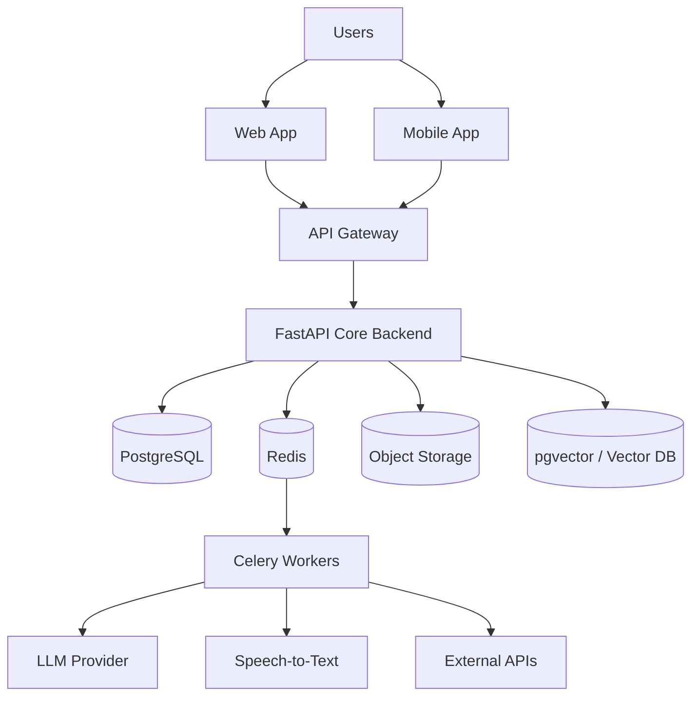

## 49.2 MVP Modular Monolith Architecture

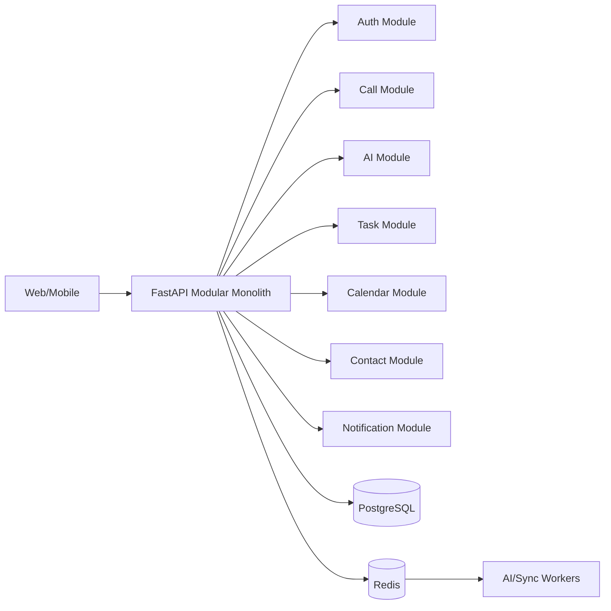

## 49.3 Future Microservice Architecture

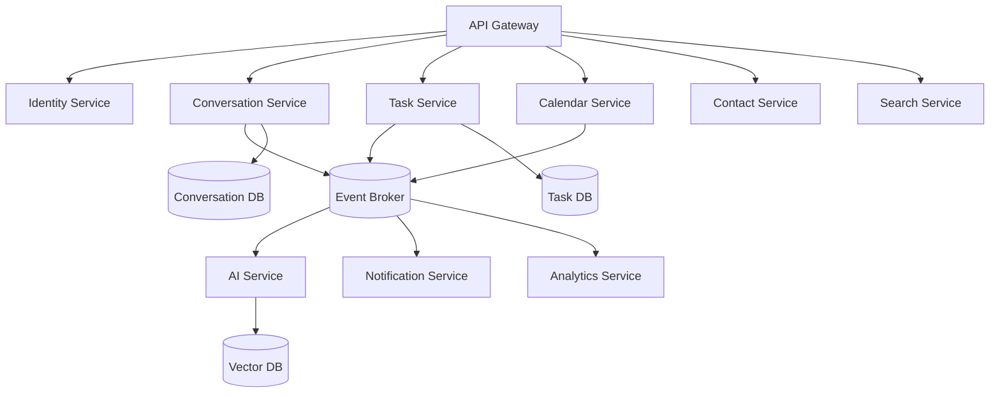

## 49.4 AI Processing Pipeline

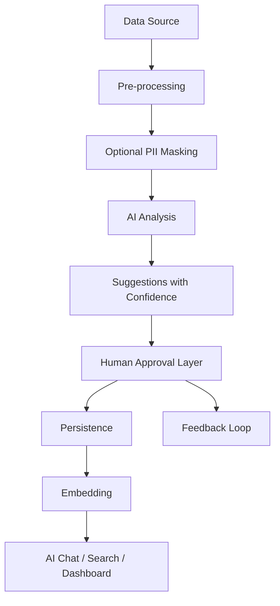

## 49.5 Call Analysis Sequence Diagram

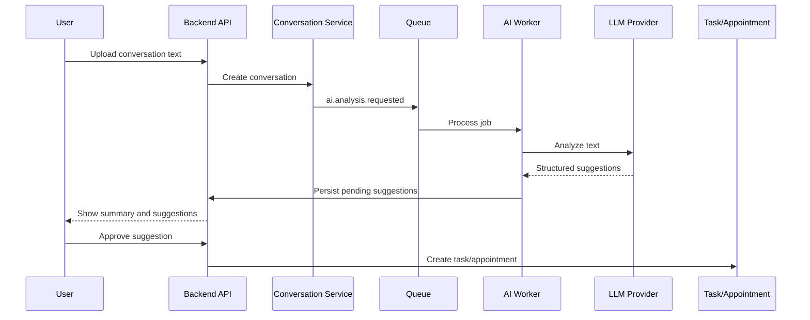

## 49.6 Email Analysis Sequence Diagram

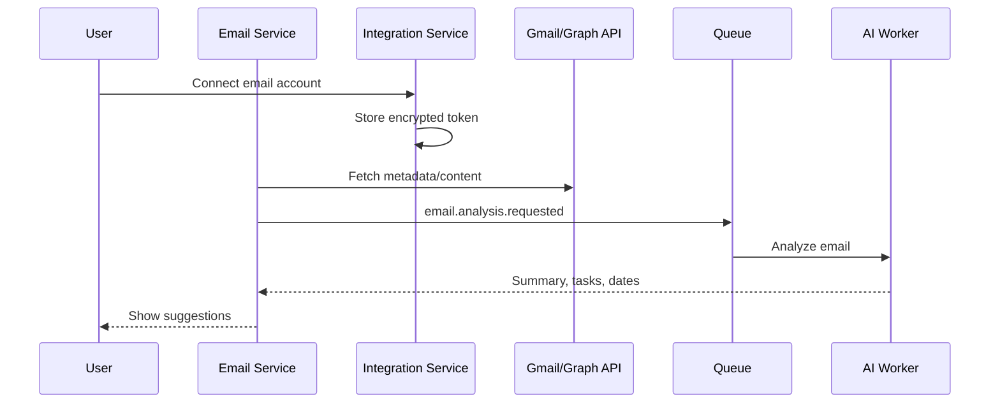

## 49.7 Appointment Creation Sequence Diagram

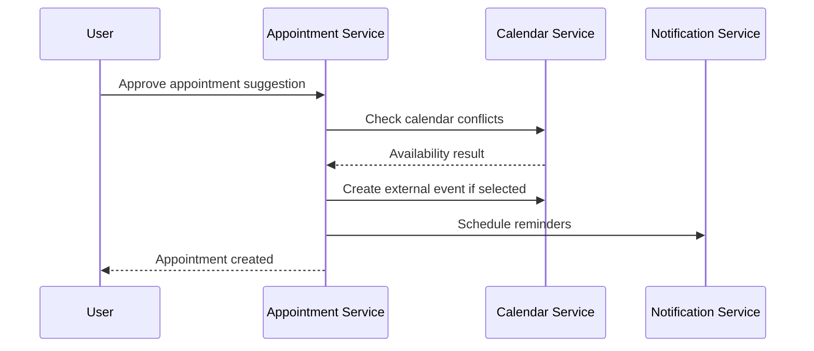

## 49.8 AI Chat RAG Flow

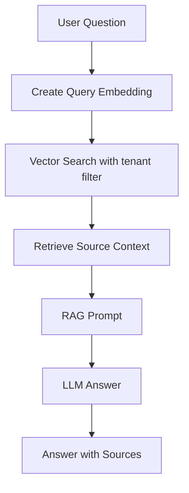

## 49.9 Notification Flow

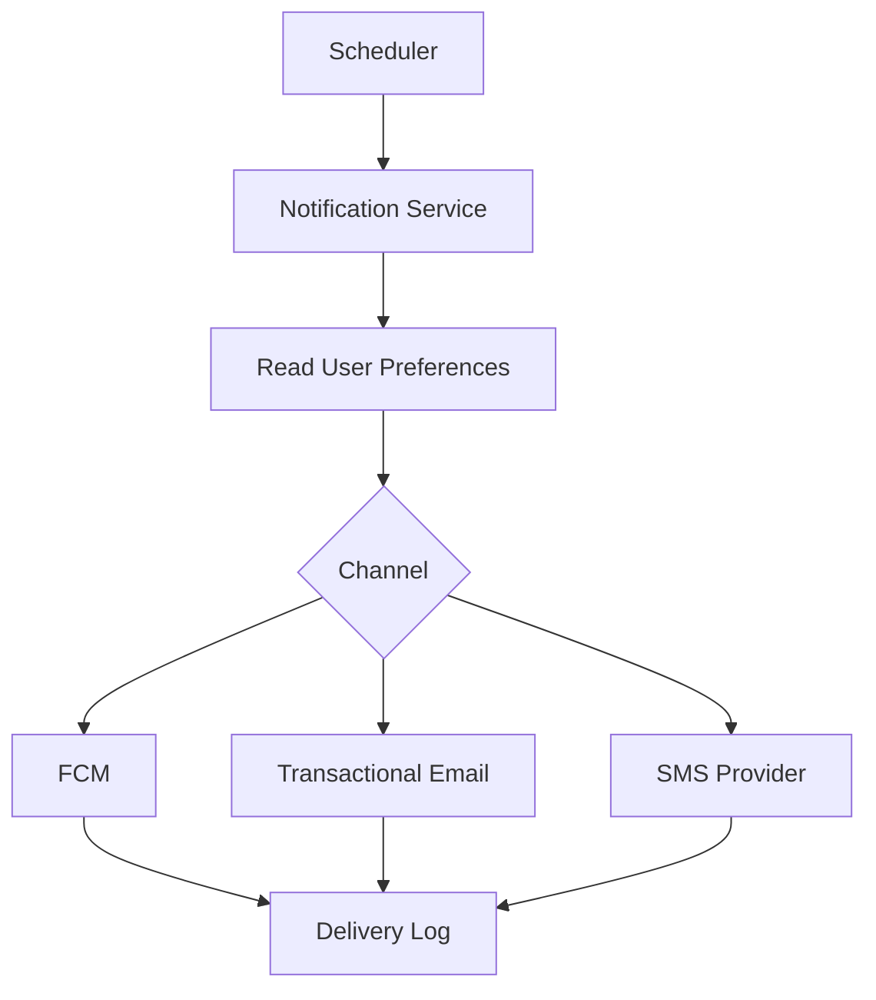

## 49.10 Deployment Diagram

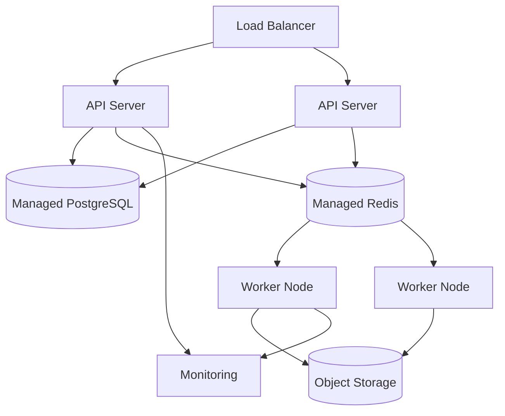

## 49.11 Multi-Tenant Data Isolation Diagram

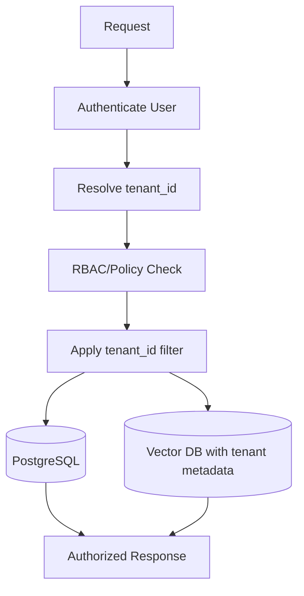

# 50. Teknik Riskler

| Risk | Risk açıklaması | Etki | Olasılık | Azaltma stratejisi |
|---|---|---|---|---|
| Telefon görüşmesi otomatik kayıt kısıtları | iOS/Android ve ülke mevzuatı otomatik çağrı kaydını kısıtlar | Yüksek | Yüksek | MVP’de manuel metin/ses dosyası; açık rıza ve taraf bilgilendirme; platform uyum araştırması |
| iOS/Android platform sınırlamaları | Background processing, call recording, permission ve push davranışları farklıdır | Orta/Yüksek | Yüksek | Platform-specific feature flags; graceful fallback; mobilde sınırlı MVP |
| WhatsApp kişisel sohbet erişim kısıtları | Kişisel WhatsApp sohbetlerine izinsiz erişim teknik/politik/yasal olarak uygun değildir | Yüksek | Yüksek | Sadece WhatsApp Business API ve resmi izinli kanallar |
| AI hallucination | AI kaynakta olmayan bilgi üretebilir | Yüksek | Orta/Yüksek | RAG, kaynak gösterme, confidence score, human approval, evaluation |
| AI maliyetleri | LLM/STT/embedding maliyetleri büyüyebilir | Yüksek | Orta | Kota, model routing, caching, token monitoring, plan bazlı limit |
| STT doğruluk problemleri | Gürültülü ses, aksan, çoklu konuşmacı doğruluğu düşürür | Orta/Yüksek | Orta | Confidence score, kullanıcı düzeltmesi, iyi provider seçimi, diarization kalitesi |
| KVKK/GDPR uyum riski | Kişisel veri işleme süreçleri eksik kalabilir | Çok yüksek | Orta | Consent service, DPA, retention, deletion/export, legal review |
| OAuth token güvenliği | Token sızıntısı mail/takvim erişimi riski yaratır | Çok yüksek | Orta | Encryption, secret manager, least privilege, rotation, audit |
| Mail API rate limitleri | Gmail/Graph limitleri sync gecikmesi yaratır | Orta | Yüksek | Backoff, incremental sync, queue throttling, user-level scheduling |
| Calendar API rate limitleri | Event sync/write işlemleri limitlenebilir | Orta | Orta | Batch, backoff, idempotency, cache |
| Büyük veri büyümesi | Görüşme, mail ve embedding verileri hızla büyür | Yüksek | Orta/Yüksek | Partitioning, retention, archive, object storage, indexing stratejisi |
| Vector search maliyeti | Embedding storage ve arama maliyeti artabilir | Orta/Yüksek | Orta | pgvector ile başlama, tenant partitioning, lifecycle, external vector DB değerlendirmesi |
| Multi-tenant veri izolasyonu | Hatalı sorgu farklı tenant verisi sızdırabilir | Çok yüksek | Orta | Mandatory tenant filter, tests, policy layer, code review, audit |
| Bildirim teslim sorunları | Push/mail/SMS provider gecikmesi veya başarısızlığı | Orta | Orta | Delivery logs, retry, fallback channels, invalid token cleanup |
| Enterprise güvenlik beklentileri | Enterprise müşteriler SSO, SIEM, DLP, SLA ister | Yüksek | Orta | Roadmap’te enterprise architecture, güvenlik dokümantasyonu, phased delivery |
| Vendor lock-in | LLM, cloud, vector DB veya payment provider bağımlılığı | Orta/Yüksek | Orta | Adapter pattern, provider abstraction, portable data formats |
| Worker queue backlog | AI/mail jobs birikip kullanıcı deneyimini bozabilir | Orta/Yüksek | Orta | Queue metrics, autoscaling, priority queues, rate limit |
| Prompt injection | Kullanıcı/veri içeriği AI davranışını manipüle edebilir | Yüksek | Orta | Prompt hardening, tool allowlist, context separation, output validation |
| Veri silme karmaşıklığı | Veriler DB, object storage, vector DB ve backup’larda dağılır | Yüksek | Orta | Data map, deletion jobs, retention policy, audit |
| Teknik borç birikimi | MVP hızı modül sınırlarını bozabilir | Orta/Yüksek | Yüksek | ADR, modular boundaries, refactor budget, architecture review |

# 51. Architecture Decision Records

## ADR-001

Başlık: MVP’de modular monolith kullanılması  
Durum: Accepted  
Bağlam: Ekip hızlı MVP çıkarmalı, ürün-pazar uyumu doğrulanmalı ve operasyonel karmaşıklık düşük tutulmalıdır.  
Karar: MVP backend tek deploy edilebilir FastAPI modular monolith olarak geliştirilecektir.  
Gerekçe: Küçük ekip için mikroservis erken karmaşıklık yaratır. Modular monolith domain sınırlarını korurken hızlı geliştirme sağlar.  
Alternatifler: Baştan mikroservis, serverless function tabanlı mimari.  
Sonuçlar: İlk geliştirme hızlı olur; modül sınırları korunmazsa teknik borç riski doğar.

## ADR-002

Başlık: Backend için FastAPI seçilmesi  
Durum: Proposed  
Bağlam: Ürün AI ağırlıklı, Python ekosistemi LLM, STT, embedding ve data processing için güçlüdür.  
Karar: Backend API için Python FastAPI kullanılacaktır.  
Gerekçe: OpenAPI üretimi, async desteği, Python AI ekosistemi ve hızlı geliştirme avantajı sağlar.  
Alternatifler: Node.js/NestJS, Go, Java/Spring.  
Sonuçlar: AI entegrasyonu kolaylaşır; yüksek CPU işleri worker’a taşınmalıdır.

## ADR-003

Başlık: PostgreSQL ana veritabanı seçilmesi  
Durum: Accepted  
Bağlam: Ürün kullanıcı, görev, randevu, kişi, organizasyon ve audit gibi ilişkisel veri içerir.  
Karar: Ana structured data PostgreSQL’de tutulacaktır.  
Gerekçe: Güçlü relational model, transaction desteği, JSONB, indexing ve pgvector desteği vardır.  
Alternatifler: MySQL, MongoDB, DynamoDB.  
Sonuçlar: Veri tutarlılığı güçlenir; ölçek büyüdükçe partitioning ve read replica gerekebilir.

## ADR-004

Başlık: Redis’in cache ve queue için kullanılması  
Durum: Accepted  
Bağlam: MVP’de cache, rate limit ve job queue ihtiyacı vardır.  
Karar: Redis cache, rate limit counter ve Celery broker olarak kullanılacaktır.  
Gerekçe: Operasyonu basit, yaygın ve MVP için yeterlidir.  
Alternatifler: RabbitMQ, Kafka, database queue.  
Sonuçlar: Hızlı başlangıç sağlar; yüksek hacimde RabbitMQ/Kafka’ya geçiş değerlendirilebilir.

## ADR-005

Başlık: Vector search için pgvector ile başlanması  
Durum: Accepted  
Bağlam: MVP’de semantic search gerekir, ancak ayrı vector DB operasyonu erken maliyet yaratır.  
Karar: MVP’de PostgreSQL pgvector kullanılacaktır.  
Gerekçe: Tek veritabanı operasyonu, tenant filtreleri ve ilişkisel veriyle yakın çalışma sağlar.  
Alternatifler: Pinecone, Weaviate, Qdrant, Elasticsearch vector search.  
Sonuçlar: MVP sadeleşir; büyük hacimde bağımsız vector DB’ye geçiş gerekebilir.

## ADR-006

Başlık: AI işlemlerinin asenkron worker olarak çalışması  
Durum: Accepted  
Bağlam: AI analizleri yavaş, maliyetli ve provider hatalarına açık olabilir.  
Karar: Görüşme, mail, embedding ve belge AI analizleri background worker ile çalışacaktır.  
Gerekçe: API latency korunur, retry ve queue yönetimi yapılır.  
Alternatifler: Senkron API içinde AI çağrısı.  
Sonuçlar: Kullanıcıya job status göstermek gerekir; queue observability zorunludur.

## ADR-007

Başlık: Kullanıcı onayı olmadan AI aksiyon almaması  
Durum: Accepted  
Bağlam: AI yanlış çıkarım yapabilir; mail/takvim/görev aksiyonları iş ve güven riski taşır.  
Karar: AI yalnızca öneri üretir; kullanıcı onayı olmadan dış sistemlere aksiyon yazamaz.  
Gerekçe: Güvenlik, KVKK/GDPR, kullanıcı güveni ve enterprise kabul için zorunludur.  
Alternatifler: Tam otomatik AI agent aksiyonları.  
Sonuçlar: Deneyim bir adım daha uzun olur; risk belirgin azalır.

## ADR-008

Başlık: Web için Next.js seçilmesi  
Durum: Proposed  
Bağlam: Web panel dashboard, chat, görev, takvim ve admin ekranlarını barındıracaktır.  
Karar: Web frontend Next.js + React + TypeScript ile geliştirilecektir.  
Gerekçe: Olgun ekosistem, iyi routing, performans ve TypeScript desteği sağlar.  
Alternatifler: Vite React SPA, Vue/Nuxt, Angular.  
Sonuçlar: Full-stack Next.js özellikleri kontrollü kullanılmalı; backend FastAPI ana API olarak kalmalıdır.

## ADR-009

Başlık: Mobil için Flutter seçilmesi  
Durum: Proposed  
Bağlam: iOS ve Android için hızlı, tek kod tabanlı mobil deneyim gerekir.  
Karar: Mobil uygulama Flutter + Dart ile geliştirilecektir.  
Gerekçe: Cross-platform hız, tutarlı UI ve FCM desteği sağlar.  
Alternatifler: React Native, native Swift/Kotlin.  
Sonuçlar: Platform-specific call recording kısıtları yine geçerlidir; native plugin ihtiyacı olabilir.

## ADR-010

Başlık: OAuth tokenlarının encrypted saklanması  
Durum: Accepted  
Bağlam: Gmail, Outlook ve Calendar tokenları yüksek hassasiyetli erişim sağlar.  
Karar: OAuth access/refresh tokenları encrypted at rest saklanacak ve erişim Integration Service ile sınırlandırılacaktır.  
Gerekçe: Token sızıntısı mail/takvim verisi sızıntısı anlamına gelir.  
Alternatifler: Plain DB storage, client-side token saklama.  
Sonuçlar: Key management ve rotation süreçleri gerekir.

## ADR-011

Başlık: Object storage kullanılması  
Durum: Accepted  
Bağlam: Ses dosyası, belge, export ve büyük içerikler ilişkisel DB’ye uygun değildir.  
Karar: Dosyalar object storage’da, metadata PostgreSQL’de tutulacaktır.  
Gerekçe: Ölçeklenebilir, maliyet etkin ve signed URL desteklidir.  
Alternatifler: DB BLOB, local filesystem.  
Sonuçlar: Storage lifecycle, deletion ve access control süreçleri gerekir.

## ADR-012

Başlık: Event-driven mimariye evrilecek yapı kurulması  
Durum: Accepted  
Bağlam: MVP modular monolith olsa da uzun vadede servis ayrışımı gerekecektir.  
Karar: Domain event isimleri ve event payload prensipleri MVP’den itibaren tanımlanacaktır.  
Gerekçe: Mikroservise geçişte veri akışları ve servis sınırları netleşir.  
Alternatifler: Sadece senkron servis çağrıları.  
Sonuçlar: Event disiplinine yatırım gerekir; debug için correlation ID şarttır.

## ADR-013

Başlık: OpenAPI standardı kullanılması  
Durum: Accepted  
Bağlam: Web, mobil ve backend ekipleri net API sözleşmesine ihtiyaç duyar.  
Karar: REST API dokümantasyonu OpenAPI/Swagger üzerinden üretilecektir.  
Gerekçe: FastAPI ile doğal destek gelir; client generation ve QA kolaylaşır.  
Alternatifler: Manuel dokümantasyon, GraphQL.  
Sonuçlar: API schema değişiklikleri versiyonlanmalıdır.

## ADR-014

Başlık: Multi-tenant yapının tenant_id ile başlaması  
Durum: Accepted  
Bağlam: Ürün bireysel başlasa da team ve enterprise’a evrilecektir.  
Karar: MVP’den itibaren ana tablolarda tenant_id kullanılacaktır.  
Gerekçe: Sonradan tenant eklemek çok maliyetlidir.  
Alternatifler: Başta sadece user_id, enterprise’da ayrı DB.  
Sonuçlar: Tüm sorgularda tenant filter zorunlu hale gelir; test kapsamı artmalıdır.

## ADR-015

Başlık: Audit log zorunlu tutulması  
Durum: Accepted  
Bağlam: Ürün hassas veri, AI önerileri ve dış sistem aksiyonları içerir.  
Karar: Kritik işlemler append-only audit log’a yazılacaktır.  
Gerekçe: Güvenlik, uyum, debugging ve enterprise satış için zorunludur.  
Alternatifler: Sadece application log.  
Sonuçlar: Audit storage büyür; retention policy gerekir.

## ADR-016

Başlık: AI promptlarının versiyonlanması  
Durum: Accepted  
Bağlam: AI davranışı ürün kalitesini doğrudan etkiler.  
Karar: Promptlar versiyonlu yönetilecek ve analiz sonuçları prompt version ile ilişkilendirilecektir.  
Gerekçe: Geriye dönük kalite analizi, rollback ve A/B test için gereklidir.  
Alternatifler: Promptları kod içine sabitlemek.  
Sonuçlar: Prompt yönetimi için admin/evaluation süreci gerekir.

## ADR-017

Başlık: MVP’de public API açılmaması  
Durum: Accepted  
Bağlam: Public API güvenlik, rate limit, dokümantasyon ve destek yükü getirir.  
Karar: MVP’de public API sunulmayacak; internal API web/mobil için kullanılacaktır.  
Gerekçe: Ürün değer hipotezi önce doğrulanmalıdır.  
Alternatifler: Baştan public developer platform.  
Sonuçlar: Platform fazında API gateway, API key ve webhook altyapısı eklenecektir.

## ADR-018

Başlık: WhatsApp entegrasyonunda yalnızca resmi API kullanılması  
Durum: Accepted  
Bağlam: Kişisel WhatsApp sohbetlerine izinsiz erişim hukuki ve platform açısından risklidir.  
Karar: WhatsApp tarafında yalnızca WhatsApp Business API gibi resmi ve izinli kanallar değerlendirilecektir.  
Gerekçe: Gizlilik, platform uyumu ve marka güveni için zorunludur.  
Alternatifler: Scraping, unofficial clients.  
Sonuçlar: Kapsam sınırlı olur; enterprise/business use case daha güvenli ilerler.

# 52. Fazlara Göre Mimari Evrim

## Faz 1 — MVP

Mimari:

- Modular monolith.
- PostgreSQL.
- Redis.
- Basic AI worker.
- Web panel.
- Basit mobil uygulama.
- Google Calendar.
- Manuel görüşme metni analizi.

Amaç:

- Ürün değerini doğrulamak.
- Görüşme metninden özet/görev/randevu çıkarmak.
- Kullanıcı onayıyla aksiyon kaydetmek.

Teknik odak:

- Domain modül sınırları.
- Rıza ve audit.
- AI job queue.
- Basit dashboard.
- Google Calendar integration.

## Faz 2 — Entegrasyonlar

Mimari:

- Gmail.
- Outlook.
- Calendar sync.
- Advanced notification.
- AI Chat.
- Semantic search.

Amaç:

- Veri kaynaklarını genişletmek.
- AI Chat ve semantic search ile ikinci beyin deneyimini güçlendirmek.

Teknik odak:

- OAuth token güvenliği.
- Mail/calendar rate limit yönetimi.
- pgvector/hybrid search.
- Notification retry ve delivery logs.

## Faz 3 — Team

Mimari:

- Organization.
- RBAC.
- Shared contacts.
- Team dashboard.
- Audit logs.

Amaç:

- Bireysel üründen takım ürününe geçmek.
- Paylaşımlı müşteri hafızası ve yönetici görünürlüğü sağlamak.

Teknik odak:

- Tenant isolation testleri.
- Role & Permission Service.
- Team-level analytics.
- Audit log genişletme.

## Faz 4 — Enterprise

Mimari:

- SSO.
- Dedicated tenant.
- Advanced security.
- SIEM export.
- Custom retention.
- SLA monitoring.

Amaç:

- Kurumsal güvenlik ve uyum gereksinimlerini karşılamak.

Teknik odak:

- SAML/OIDC SSO.
- SCIM.
- Dedicated DB/schema opsiyonları.
- SIEM export.
- Enterprise backup/DR.
- WAF ve advanced monitoring.

## Faz 5 — Platform

Mimari:

- Public API.
- Webhooks.
- Marketplace.
- Third-party integrations.
- Advanced AI agents.

Amaç:

- NeuroDesk AI’ı entegrasyon platformuna dönüştürmek.

Teknik odak:

- API key management.
- Developer portal.
- Webhook delivery guarantees.
- Marketplace permission model.
- Tool-calling safety gateway.
- Agent action approval framework.

# 53. Teknik Borç Yönetimi

MVP teknik borç riskleri:

- Modular monolith içinde domain sınırlarının bozulması.
- AI promptlarının hızlıca büyüyüp yönetilemez hale gelmesi.
- Tenant_id disiplininin bazı sorgularda unutulması.
- Audit log kapsamının sonradan tamamlanmaya bırakılması.
- Mail/calendar integration hatalarının kullanıcı deneyimini bozması.
- pgvector kullanımının büyüyen veri hacminde pahalı hale gelmesi.
- Queue observability’nin yetersiz kalması.

Yönetim stratejileri:

- Her büyük mimari karar ADR ile kayıt altına alınmalıdır.
- Domain modül bağımlılıkları düzenli incelenmelidir.
- Tenant isolation testleri release gate olmalıdır.
- Audit log kapsamı güvenlik checklist’inde yer almalıdır.
- AI prompt versioning MVP’den itibaren kurulmalıdır.
- Her sprintte teknik borç kapasitesi ayrılmalıdır.
- Faz geçişlerinde architecture review yapılmalıdır.

# 54. Codex İçin Sonraki Ciltlere Hazırlık Notları

Cilt 3, database design dokümanı olmalıdır. Bu mimari dokümandaki kararlar Cilt 3’te tablo tasarımlarına, veri ilişkilerine, index stratejilerine ve migration planına dönüştürülmelidir.

Cilt 3 hazırlanırken özellikle şu mimari kararlar dikkate alınmalıdır:

- PostgreSQL ana structured data store’dur.
- tenant_id tüm ana tablolarda zorunludur.
- Audit log append-only tasarlanmalıdır.
- AI analysis sonuçları kaynak kayıt, prompt version, model ve confidence score ile ilişkilendirilmelidir.
- Vector search MVP’de pgvector ile başlayabilir.
- Object storage metadata PostgreSQL’de tutulmalıdır.
- OAuth tokenları encrypted alanlarda veya ayrı secure secret yaklaşımıyla yönetilmelidir.
- Veri silme ve export için data map gereklidir.

# Codex İçin Sonraki Adım

Bir sonraki dokümanda Cilt 3 — Database Design hazırlanacaktır. Cilt 3; PostgreSQL tablo tasarımları, veri ilişkileri, indexler, foreign key yapıları, tenant_id stratejisi, audit log tabloları, AI analysis tabloları, vector database yapısı, migration stratejisi, veri saklama politikaları ve örnek ERD diyagramlarını içermelidir.
