# CILT 3 — Database Design Document: NeuroDesk AI

Sürüm: 1.0  
Tarih: 08 Temmuz 2026  
Doküman türü: Veritabanı Tasarımı Dokümanı  
Kapsam: PostgreSQL veri modeli, tenant stratejisi, tablolar, ilişkiler, indexler, partitioning, güvenlik, retention, migration, seed/test data ve ERD

> Not: Bu doküman veritabanı tasarımı ve teknik uyumluluk çerçevesidir. Hukuki danışmanlık değildir. KVKK/GDPR, finansal saklama yükümlülükleri, elektronik haberleşme, çalışan verisi ve sektörel regülasyonlar için uzman hukuk danışmanlığı alınmalıdır.

## İçindekiler

1. [Yönetici Özeti](#1-yönetici-özeti)
2. [Veritabanı Tasarım Vizyonu](#2-veritabanı-tasarım-vizyonu)
3. [Veri Modelleme İlkeleri](#3-veri-modelleme-ilkeleri)
4. [Teknoloji Kararları](#4-teknoloji-kararları)
5. [Multi-Tenant Veri Stratejisi](#5-multi-tenant-veri-stratejisi)
6. [Ortak Kolon Standartları](#6-ortak-kolon-standartları)
7. [ID, Timestamp ve Veri Tipi Stratejisi](#7-id-timestamp-ve-veri-tipi-stratejisi)
8. [Soft Delete ve Hard Delete Stratejisi](#8-soft-delete-ve-hard-delete-stratejisi)
9. [PII, Hassas Veri ve Encryption Stratejisi](#9-pii-hassas-veri-ve-encryption-stratejisi)
10. [KVKK/GDPR Veri Modeli](#10-kvkkgdpr-veri-modeli)
11. [Normalization / Denormalization](#11-normalization--denormalization)
12. [Enum / Status Yaklaşımı](#12-enum--status-yaklaşımı)
13. [Index Stratejisi](#13-index-stratejisi)
14. [Partitioning Stratejisi](#14-partitioning-stratejisi)
15. [Archiving, Backup ve Restore](#15-archiving-backup-ve-restore)
16. [Migration Stratejisi](#16-migration-stratejisi)
17. [Seed Data Stratejisi](#17-seed-data-stratejisi)
18. [Test Data ve Test Senaryoları](#18-test-data-ve-test-senaryoları)
19. [Performans Hedefleri](#19-performans-hedefleri)
20. [Detaylı Kritik Tablo Tasarımları](#20-detaylı-kritik-tablo-tasarımları)
21. [Tablo Kataloğu](#21-tablo-kataloğu)
22. [Temel İlişkiler](#22-temel-ilişkiler)
23. [MVP Veri Modeli](#23-mvp-veri-modeli)
24. [İleri Faz ve Enterprise Veri Modeli](#24-ileri-faz-ve-enterprise-veri-modeli)
25. [Veri Büyüme, Performans ve Güvenlik Riskleri](#25-veri-büyüme-performans-ve-güvenlik-riskleri)
26. [Mermaid ERD Diyagramları](#26-mermaid-erd-diyagramları)
27. [Codex İçin Sonraki Ciltlere Hazırlık Notları](#27-codex-için-sonraki-ciltlere-hazırlık-notları)
28. [Codex İçin Sonraki Adım](#codex-için-sonraki-adım)

# 1. Yönetici Özeti

NeuroDesk AI, telefon görüşmesi metinleri, transkripsiyonlar, e-postalar, takvim etkinlikleri, görevler, randevular, notlar, belgeler, kişi/firma hafızası ve AI analiz sonuçlarını işleyen çok kaynaklı bir SaaS platformudur. Bu nedenle veritabanı tasarımı yalnızca kayıt saklama işlevi görmemeli; tenant izolasyonu, veri gizliliği, auditability, AI kaynak ilişkisi, semantic search, kullanıcı onayı, veri silme/dışa aktarma ve enterprise retention gereksinimlerini doğrudan desteklemelidir.

Ana kararlar:

- Ana ilişkisel veritabanı PostgreSQL olacaktır.
- MVP multi-tenant modeli shared database + shared schema + tenant_id stratejisiyle başlayacaktır.
- Her tenant tablosunda tenant_id bulunmalı ve tenant_id indexlenmelidir.
- Büyük ve sürekli büyüyen tablolar için tarih bazlı partitioning önerilir.
- Enterprise müşteriler için tenant bazlı veya hybrid partitioning ve ayrı database/schema opsiyonları değerlendirilmelidir.
- Vector search MVP’de pgvector ile başlayabilir; ölçek büyüdüğünde Qdrant, Weaviate, Pinecone veya Milvus değerlendirilebilir.
- Dosya binary verisi veritabanına yazılmamalıdır; object storage kullanılmalıdır.
- OAuth token, mail body, transcription text, AI içerikleri ve payment verileri hassas kabul edilmelidir.
- AI önerileri gerçek aksiyona dönüşmeden önce ai_action_approvals tablosunda onay akışından geçmelidir.
- Audit log append-only olmalı, silme talepleri dahil kritik işlemler audit’e yazılmalıdır.

# 2. Veritabanı Tasarım Vizyonu

Veri modeli, MVP’de hızlı geliştirilebilir ama enterprise seviyeye evrilebilir olmalıdır. NeuroDesk AI’ın uzun vadeli değeri kullanıcıların iş iletişim hafızasından gelir; bu hafıza doğru ilişkilendirilmiş, aranabilir, silinebilir, dışa aktarılabilir ve yetki sınırları içinde erişilebilir olmalıdır.

Tasarım vizyonu:

- Transactional data normalize edilir.
- Analytics ve dashboard için denormalized/pre-aggregated yapılar kullanılır.
- Contact ve company timeline için activity/event tabanlı model kurulur.
- AI analysis çıktıları kaynak kayıtla, modelle, prompt versiyonuyla ve confidence score ile bağlanır.
- Semantic search tenant izolasyonundan asla bağımsız çalışmaz.
- KVKK/GDPR gereksinimleri tablo tasarımına baştan yansıtılır.

# 3. Veri Modelleme İlkeleri

- Her ana tabloda UUID primary key kullanılmalıdır.
- Her tenant kapsamlı tabloda tenant_id zorunlu olmalıdır.
- organization_id, team_id, user_id ilişkileri tenant_id ile birlikte doğrulanmalıdır.
- Foreign key alanları indexlenmelidir.
- Soft delete kullanılan tablolarda normal sorgular deleted_at is null ve is_deleted = false filtresiyle çalışmalıdır.
- Metadata için JSONB kullanılabilir; ancak ana iş kuralları JSONB içine gömülmemelidir.
- Arama yapılacak metin alanlarında full-text search veya trigram index değerlendirilmelidir.
- JSONB alanlarında GIN index dikkatli kullanılmalı, yalnızca gerçekten sorgulanan path’ler indexlenmelidir.
- Embedding verileri VECTOR tipinde veya harici vector DB’de tutulmalıdır.
- Binary dosya için BYTEA kullanılmamalı, dosyalar object storage’da saklanmalıdır.

# 4. Teknoloji Kararları

## 4.1 PostgreSQL

PostgreSQL seçilme nedenleri:

- Güçlü relational model.
- Transaction güvenilirliği.
- JSONB desteği.
- Full-text search desteği.
- pgvector desteği.
- Gelişmiş index seçenekleri.
- Multi-tenant SaaS mimarilerine uygunluk.
- Audit log ve structured data için olgun yapı.

## 4.2 Redis

Redis veritabanı yerine geçmez. Kullanım alanları:

- Cache.
- Rate limit counter.
- Queue/broker metadata.
- Geçici job status.
- Kısa ömürlü OAuth state.

## 4.3 Vector Database

MVP:

- pgvector.

İleri faz:

- Qdrant.
- Weaviate.
- Pinecone.
- Milvus.

Karar ilkesi:

- Veri hacmi, latency, tenant filtreleme, maliyet ve operasyonel karmaşıklık birlikte değerlendirilmelidir.

## 4.4 Object Storage

Dosyalar veritabanında tutulmamalıdır. Ses kayıtları, attachment’lar, export paketleri ve belge dosyaları object storage’da saklanmalıdır.

Seçenekler:

- AWS S3.
- Google Cloud Storage.
- Azure Blob Storage.
- Local development için MinIO.

# 5. Multi-Tenant Veri Stratejisi

## 5.1 MVP Yaklaşımı

- Shared database.
- Shared schema.
- tenant_id ile ayrım.

Avantajlar:

- Geliştirmesi hızlıdır.
- Maliyet düşüktür.
- Tek migration hattı vardır.

Riskler:

- Her sorguda tenant_id zorunludur.
- Yanlış sorgu veri sızıntısı yaratabilir.
- Büyük tenant küçük tenantları performans olarak etkileyebilir.

## 5.2 Enterprise Opsiyonları

| Yaklaşım | Avantaj | Dezavantaj | Kullanım zamanı |
|---|---|---|---|
| Shared DB, shared schema, tenant_id | Basit, ucuz, hızlı | İzolasyon uygulama disiplinine bağlı | MVP, SMB |
| Shared DB, separate schema | Daha iyi mantıksal izolasyon | Migration karmaşıklığı artar | Orta enterprise |
| Separate database per tenant | En güçlü izolasyon | Operasyon maliyeti yüksek | Büyük enterprise, regülasyon |

## 5.3 Tenant Isolation Kuralları

- Tüm tenant tablolarında tenant_id zorunlu olmalıdır.
- tenant_id + id composite index önerilir.
- tenant_id + created_at composite index kullanılmalıdır.
- tenant_id + status index kullanılmalıdır.
- Vector search metadata içinde tenant_id zorunludur.
- Background job, audit, notification ve webhook kayıtlarında tenant_id bulunmalıdır.
- Testlerde tenant isolation özel senaryo olarak koşulmalıdır.

# 6. Ortak Kolon Standartları

Tüm ana tablolarda mümkün olduğunda şu kolonlar kullanılmalıdır:

| Kolon | Tip | Açıklama |
|---|---|---|
| id | UUID | Primary key |
| tenant_id | UUID | SaaS veri ayrımı |
| organization_id | UUID | Kurumsal ilişki |
| created_by | UUID | Kaydı oluşturan kullanıcı |
| updated_by | UUID | Son güncelleyen kullanıcı |
| deleted_by | UUID | Soft delete yapan kullanıcı |
| created_at | TIMESTAMPTZ | UTC oluşturma zamanı |
| updated_at | TIMESTAMPTZ | UTC güncelleme zamanı |
| deleted_at | TIMESTAMPTZ | Soft delete zamanı |
| is_deleted | BOOLEAN | Soft delete hızlı filtre |
| status | VARCHAR veya enum | Durum |
| metadata | JSONB | Esnek ek metadata |

Notlar:

- Her tabloya organization_id gerekmeyebilir; bireysel kullanıcı tablolarında nullable olabilir.
- is_deleted + deleted_at birlikte kullanılacaksa tutarlılık constraint’i değerlendirilmelidir.
- status alanı için MVP’de PostgreSQL enum, daha esnek enterprise yapıda lookup table tercih edilebilir.

# 7. ID, Timestamp ve Veri Tipi Stratejisi

## 7.1 ID Stratejisi

- id alanları UUID olmalıdır.
- PostgreSQL gen_random_uuid() kullanılabilir.
- Public endpointlerde tahmin edilebilir integer ID kullanılmamalıdır.
- Büyük tablolarda UUID index fragmentation dikkate alınmalıdır.
- Alternatif olarak ULID değerlendirilebilir.
- External provider ID’leri ayrı kolonlarda tutulmalıdır.

## 7.2 Timestamp Stratejisi

- Tüm tarih/saat alanlarında TIMESTAMPTZ kullanılmalıdır.
- Uygulama içinde UTC saklanmalı, kullanıcı arayüzünde kullanıcı saat dilimine çevrilmelidir.
- created_at ve updated_at tüm ana tablolarda zorunlu olmalıdır.

## 7.3 Genel Veri Tipi Önerileri

| Tip | Kullanım |
|---|---|
| UUID | id ve ilişki alanları |
| TEXT | Uzun metin |
| VARCHAR | Kısa kontrollü metin |
| TIMESTAMPTZ | Tarih/saat |
| BOOLEAN | Flag alanları |
| JSONB | Esnek metadata |
| NUMERIC | Finansal değerler |
| INTEGER | Sayaçlar |
| BIGINT | Büyük sayaçlar |
| VECTOR | pgvector embedding |

BYTEA kullanılmamalı, dosya binary veritabanına yazılmamalıdır.

# 8. Soft Delete ve Hard Delete Stratejisi

## 8.1 Soft Delete

Soft delete, kaydı fiziksel olarak silmeden deleted_at ve is_deleted ile normal sorgulardan gizler. Kullanıcı deneyimi, geri alma, audit ve ilişki bütünlüğü için uygundur.

Soft delete kullanması önerilen tablolar:

- users.
- organizations.
- contacts.
- tasks.
- appointments.
- conversations.
- emails.
- files.
- notes.
- companies.

Soft delete kuralları:

- Normal sorgular is_deleted = false ve deleted_at is null filtresi kullanmalıdır.
- Unique constraint’lerde soft-deleted kayıtlar dikkate alınacaksa partial unique yaklaşımı değerlendirilmelidir.
- Soft delete audit log’a yazılmalıdır.

## 8.2 Hard Delete

Hard delete, kaydın fiziksel olarak silinmesidir. KVKK/GDPR silme taleplerinde, yasal saklama zorunluluğu yoksa kişisel veriler hard delete veya anonimleştirme ile temizlenmelidir.

Hard delete edilebilecek veriler:

- Geçici tokenlar.
- Expired sessions.
- Temporary upload records.
- Failed background jobs, retention sonrası.
- Kullanıcının silme talebi kapsamındaki kişisel veri, yasal saklama gerekmiyorsa.

## 8.3 Silme Talebi İlkesi

- Kullanıcı verisini silebilmelidir.
- Kullanıcı verisini dışa aktarabilmelidir.
- Veriler amacı dışında saklanmamalıdır.
- Silme talepleri audit log’a yazılmalıdır.
- Bazı finansal veya audit verileri yasal gerekçeyle belirli süre tutulabilir; bu karar hukuki danışmanlık gerektirir.

# 9. PII, Hassas Veri ve Encryption Stratejisi

## 9.1 Hassas Kabul Edilen Alanlar

- OAuth access token.
- OAuth refresh token.
- Telefon numarası.
- E-posta adresi.
- Mail body.
- Transcription text.
- Ses dosyası storage key.
- Kişisel notlar.
- AI analiz içeriği.
- Dosya metadata.
- Payment bilgileri.
- IP adresi.
- Device bilgileri.

## 9.2 Şifreleme Kararları

| Karar | Açıklama |
|---|---|
| Encryption at rest | PostgreSQL disk/storage seviyesinde şifrelenmelidir |
| Field-level encryption | Token, mail body, transcription text, payment alanları için değerlendirilmelidir |
| KMS kullanımı | Production’da encryption key yönetimi için KMS/Vault kullanılmalıdır |
| Token encryption | OAuth access/refresh tokenlar kesinlikle encrypted saklanmalıdır |
| Secrets management | DB password, API key ve provider secret repo dışında tutulmalıdır |
| Backup encryption | Backup paketleri şifreli saklanmalıdır |

## 9.3 Deterministic Encryption

E-posta veya telefon numarası gibi alanlarda arama/unique kontrol gerekiyorsa deterministic encryption veya ek hash kolonları değerlendirilebilir. Bu yaklaşım güvenlik ve arama kabiliyeti arasında denge ister.

# 10. KVKK/GDPR Veri Modeli

Teknik gereksinimler:

- Rıza kayıtları consent_records tablosunda tutulmalıdır.
- Rıza metni versiyonları consent_versions ve privacy_policies ile saklanmalıdır.
- Veri işleme amacı data_processing_records ile kayıt altına alınmalıdır.
- Kullanıcı export talepleri data_export_requests ile izlenmelidir.
- Kullanıcı silme talepleri data_deletion_requests ile izlenmelidir.
- Retention politikaları tenant veya enterprise bazında data_retention_policies ile yönetilmelidir.
- PII masking rules merkezi tanımlanmalıdır.

Özel rıza alanları:

- Telefon görüşmesi işleme rızası.
- Mail erişim rızası.
- Takvim erişim rızası.
- AI analiz rızası.
- Üçüncü taraf AI sağlayıcılarına veri gönderme izni.
- Resmi mesajlaşma entegrasyonu rızası.

# 11. Normalization / Denormalization

- Core transactional data normalize edilmelidir.
- Analytics için denormalized tablolar kullanılabilir.
- Dashboard için materialized view veya cache düşünülebilir.
- AI memory summary tabloları denormalized olabilir.
- Contact timeline performans için event tablosu üzerinden beslenebilir.
- Email, conversation ve activity tablolarında kaynak ilişki polymorphic tutulabilir; kritik rapor alanları normalize edilmelidir.

# 12. Enum / Status Yaklaşımı

MVP için PostgreSQL enum kullanılabilir. Ancak admin tarafından yönetilecek veya sık değişmesi beklenen değerlerde lookup table daha uygundur.

Örnek status değerleri:

| Alan | Değerler |
|---|---|
| tasks.status | pending, in_progress, completed, cancelled, overdue |
| appointments.status | suggested, confirmed, cancelled, completed, rescheduled |
| ai_analysis_jobs.status | queued, processing, completed, failed, cancelled |
| notifications.status | pending, scheduled, sent, failed, read, cancelled |

Karar:

- MVP’de teknik durumlar için enum kullanılabilir.
- Enterprise ve admin tarafından yönetilecek değerlerde lookup table tercih edilmelidir.
- Status history gereken domainlerde ayrı history tablosu kullanılmalıdır.

# 13. Index Stratejisi

Bu dokümanda SQL kodu verilmez. Indexler açıklama formatında tanımlanır.

Genel kurallar:

- Her tenant tablosunda tenant_id index olmalıdır.
- tenant_id + created_at composite index kullanılmalıdır.
- tenant_id + status index kullanılmalıdır.
- Foreign key alanlarında index olmalıdır.
- tenant_id + id composite index önerilir.
- Soft delete kullanılan tablolarda tenant_id + is_deleted + created_at indexi değerlendirilmelidir.
- Arama yapılacak metin alanlarında full-text search veya trigram index değerlendirilmelidir.
- JSONB alanlarında GIN index yalnızca sorgulanan alanlar için kullanılmalıdır.
- embeddings için vector index kullanılmalıdır.
- Büyük tablolarda index sayısı yazma performansını etkileyeceği için ölçümle karar verilmelidir.

# 14. Partitioning Stratejisi

Partitioning çok büyük tablolarda düşünülmelidir. MVP’de her tabloyu partition etmek gereksiz operasyon yükü yaratır; ancak büyümesi kesin olan tablolar partition-ready tasarlanmalıdır.

Partition önerilen tablolar:

- audit_logs.
- activity_events.
- notifications.
- notification_deliveries.
- ai_provider_logs.
- ai_cost_logs.
- emails.
- call_transcriptions.
- background_jobs.
- webhook_deliveries.

Partition stratejileri:

| Strateji | Açıklama | Uygun tablo |
|---|---|---|
| Tarih bazlı partition | Aylık/haftalık partition | audit_logs, events, notifications, logs |
| Tenant bazlı partition | Büyük enterprise tenantları ayırma | emails, transcriptions, audit_logs |
| Hybrid yaklaşım | Önce tenant, sonra tarih veya tersi | Büyük enterprise ve yüksek hacim |

Notlar:

- Tarih bazlı partition retention silmeyi kolaylaştırır.
- Tenant bazlı partition noisy neighbor riskini azaltır.
- Hybrid yaklaşım güçlü ama migration ve query karmaşıklığı yaratır.

# 15. Archiving, Backup ve Restore

Archiving:

- Eski audit, notification delivery ve provider logları archive storage’a taşınabilir.
- Mail body ve transcription text için retention sonrası anonimleştirme veya silme uygulanabilir.
- AI provider logs maliyet ve gizlilik nedeniyle kısa süre tutulmalıdır.

Backup:

- Production migration öncesi backup alınmalıdır.
- PostgreSQL backup şifreli olmalıdır.
- Object storage versioning ve lifecycle policy kullanılmalıdır.
- Restore testleri periyodik yapılmalıdır.

# 16. Migration Stratejisi

Alembic kullanılacağı varsayılır.

Kurallar:

- Migration dosyaları versiyonlanmalıdır.
- Her migration reversible olmalıdır.
- Production migration öncesi backup alınmalıdır.
- Büyük tablo migrationları dikkatli yapılmalıdır.
- Zero-downtime migration prensipleri uygulanmalıdır.
- Kolon ekleme önce nullable yapılmalıdır.
- Backfill ayrı job ile yapılmalıdır.
- Daha sonra not null constraint eklenmelidir.
- Indexler concurrent oluşturulmalıdır.
- Migrationlar CI/CD içinde test edilmelidir.
- Veri dönüşümü yapan migrationlar batch çalışmalı ve rollback planı içermelidir.

# 17. Seed Data Stratejisi

Seed data:

- Varsayılan tenant.
- Varsayılan organization.
- Admin rolü.
- User rolü.
- Manager rolü.
- Default permissions.
- Notification templates.
- AI prompt templates.
- Subscription plans.
- Feature flags.

Seed data ortam bazlı olmalıdır. Production seed yalnızca sistemin çalışması için gerekli minimum kayıtları oluşturmalıdır.

# 18. Test Data ve Test Senaryoları

Test verileri:

- Fake users.
- Fake organizations.
- Fake calls.
- Fake transcriptions.
- Fake tasks.
- Fake appointments.
- Fake contacts.
- Fake emails.
- Fake AI analysis results.
- GDPR silme testleri.
- Tenant isolation testleri.
- Performance test dataset.

Test senaryoları:

- Kullanıcı başka tenant verisine erişememeli.
- Silinmiş veri normal sorgularda görünmemeli.
- Tokenlar plain text saklanmamalı.
- Audit log değiştirilememeli.
- AI analysis sonuçları kaynak tenant dışına çıkmamalı.
- Dosya erişimi yetkisiz kullanıcıya kapalı olmalı.
- Kullanıcı veri dışa aktarma talebi doğru çalışmalı.
- Kullanıcı veri silme talebi doğru çalışmalı.

# 19. Performans Hedefleri

- Dashboard sorguları cache ile hızlı çalışmalıdır.
- Kullanıcı bazlı görev listesi 500ms altında dönmelidir.
- Randevu listesi 500ms altında dönmelidir.
- Contact timeline pagination ile çalışmalıdır.
- AI Chat semantic search 1-3 saniye hedeflemelidir.
- Büyük transkripsiyonlar chunk yapısıyla saklanmalıdır.
- Mail sync batch mantığıyla çalışmalıdır.
- Analytics tabloları pre-aggregated olmalıdır.

# 20. Detaylı Kritik Tablo Tasarımları

Bu bölüm bazı kritik tabloları istenen detay seviyesinde açar. Diğer tüm tablolar [Tablo Kataloğu](#21-tablo-kataloğu) bölümünde aynı karar alanlarıyla kataloglanmıştır.

## 20.1 users

Tablo Adı: users  
Amaç: Sistemdeki kullanıcı hesaplarını tutar.  
MVP Durumu: Must  
Açıklama: Kullanıcının auth, tenant ve temel hesap durumunu temsil eder.

| Kolon | Tip | Zorunlu | Açıklama |
|---|---|---|---|
| id | UUID | Evet | Kullanıcı benzersiz kimliği |
| tenant_id | UUID | Evet | Kullanıcının bağlı olduğu tenant |
| organization_id | UUID | Hayır | Varsayılan organizasyon |
| email | VARCHAR(255) | Evet | Kullanıcı e-posta adresi |
| email_hash | VARCHAR(128) | Hayır | Arama/unique için hash |
| password_hash | TEXT | Hayır | Şifre ile giriş varsa hash |
| auth_provider | VARCHAR(50) | Evet | local, google, microsoft, apple |
| is_email_verified | BOOLEAN | Evet | E-posta doğrulama durumu |
| status | VARCHAR(50) | Evet | active, invited, suspended, deleted |
| last_login_at | TIMESTAMPTZ | Hayır | Son giriş zamanı |
| created_at | TIMESTAMPTZ | Evet | Oluşturulma zamanı |
| updated_at | TIMESTAMPTZ | Evet | Güncellenme zamanı |
| deleted_at | TIMESTAMPTZ | Hayır | Soft delete zamanı |
| is_deleted | BOOLEAN | Evet | Soft delete flag |
| metadata | JSONB | Hayır | Ek metadata |

Primary Key: id  
Foreign Key: tenant_id -> tenants.id, organization_id -> organizations.id  
Indexler: tenant_id, tenant_id + email unique, tenant_id + status, tenant_id + created_at, organization_id, deleted_at/is_deleted filtresi  
Unique Constraints: tenant_id + email veya tenant_id + email_hash  
Check Constraints: status geçerli değerlerden biri olmalı  
Soft Delete: Var  
Encryption: email için field-level veya deterministic encryption değerlendirilebilir  
PII İçerir mi: Evet  
Tahmini Veri Büyümesi: Orta  
İlişkili Servisler: Auth Service, User Service, Organization Service  
Notlar: Şifre hiçbir zaman plain text tutulmamalıdır. OAuth kullanıcılarında password_hash null olabilir.

## 20.2 embeddings

Tablo Adı: embeddings  
Amaç: Semantic search ve RAG için kaynak içerik chunk embeddinglerini tutar.  
MVP Durumu: Should  
Açıklama: pgvector kullanılıyorsa vektörler PostgreSQL’de tutulur; ölçek büyüdüğünde harici vector DB’ye taşınabilir.

| Kolon | Tip | Zorunlu | Açıklama |
|---|---|---|---|
| id | UUID | Evet | Embedding kaydı |
| tenant_id | UUID | Evet | Tenant izolasyonu |
| source_type | VARCHAR(50) | Evet | conversation, call_transcription, email, note, document, task, appointment, contact_memory |
| source_id | UUID | Evet | Kaynak kayıt id |
| chunk_id | UUID | Evet | Chunk kimliği |
| embedding_model | VARCHAR(100) | Evet | Kullanılan embedding modeli |
| embedding_vector | VECTOR | Evet | Embedding vektörü |
| content_hash | VARCHAR(128) | Evet | Aynı içerik için tekrar embedding önleme |
| metadata | JSONB | Hayır | Dil, tarih, kaynak, skor gibi metadata |
| created_at | TIMESTAMPTZ | Evet | Oluşturma zamanı |

Primary Key: id  
Foreign Key: tenant_id -> tenants.id, source_id polymorphic olduğu için uygulama seviyesinde doğrulanır  
Indexler: tenant_id, tenant_id + source_type + source_id, tenant_id + created_at, content_hash, vector index  
Unique Constraints: tenant_id + source_type + source_id + chunk_id + embedding_model  
Check Constraints: source_type whitelist içinde olmalı  
Soft Delete: Genellikle yok; kaynak silinirse hard delete/anonymize edilir  
Encryption: Embedding doğrudan metin olmasa da hassas içerikten türediği için tenant izolasyonu zorunludur  
PII İçerir mi: Dolaylı olarak evet  
Tahmini Veri Büyümesi: Çok yüksek  
İlişkili Servisler: Embedding Service, Semantic Search Service, AI Chat  
Notlar: Vector search içinde tenant_id filtresi zorunludur.

Vector search akışı:

1. Kullanıcı soru sorar.
2. Query embedding oluşturulur.
3. tenant_id filtresiyle arama yapılır.
4. En alakalı kaynak kayıtlar bulunur.
5. RAG context oluşturulur.
6. AI cevap üretir.
7. Kaynaklar kullanıcıya gösterilir.

## 20.3 ai_action_approvals

Tablo Adı: ai_action_approvals  
Amaç: AI önerilerinin kullanıcı onayı olmadan uygulanmamasını sağlamak.  
MVP Durumu: Must  
Açıklama: AI gerçek aksiyona doğrudan gitmez; öneri önce bu tabloda pending olarak saklanır.

| Kolon | Tip | Zorunlu | Açıklama |
|---|---|---|---|
| id | UUID | Evet | Onay kaydı |
| tenant_id | UUID | Evet | Tenant izolasyonu |
| user_id | UUID | Evet | Önerinin sahibi |
| action_type | VARCHAR(80) | Evet | create_task, create_appointment, create_calendar_event, create_email_draft, send_email, update_contact, schedule_notification |
| status | VARCHAR(50) | Evet | pending, approved, rejected, expired, cancelled |
| suggested_payload | JSONB | Evet | AI tarafından önerilen payload |
| approved_payload | JSONB | Hayır | Kullanıcının onayladığı/düzenlediği payload |
| reviewed_by | UUID | Hayır | Onaylayan/reddeden kullanıcı |
| reviewed_at | TIMESTAMPTZ | Hayır | İnceleme zamanı |
| expires_at | TIMESTAMPTZ | Hayır | Önerinin geçerlilik süresi |
| confidence_score | NUMERIC | Hayır | AI güven skoru |
| source_type | VARCHAR(50) | Evet | call, email, note, ai_chat, manual |
| source_id | UUID | Evet | Kaynak kayıt |
| created_at | TIMESTAMPTZ | Evet | Oluşturma zamanı |
| updated_at | TIMESTAMPTZ | Evet | Güncelleme zamanı |
| metadata | JSONB | Hayır | Ek bağlam |

Primary Key: id  
Foreign Key: tenant_id -> tenants.id, user_id -> users.id, reviewed_by -> users.id  
Indexler: tenant_id, tenant_id + status, tenant_id + created_at, user_id, source_type + source_id, reviewed_by  
Unique Constraints: İş kuralına göre aynı source/action için duplicate engeli değerlendirilebilir  
Check Constraints: confidence_score 0-1 aralığında olmalı  
Soft Delete: Yok; audit niteliği nedeniyle status ile yönetilir  
Encryption: suggested_payload ve approved_payload hassas içerik içerebilir; field-level encryption değerlendirilmeli  
PII İçerir mi: Evet  
Tahmini Veri Büyümesi: Yüksek  
İlişkili Servisler: AI Analysis Service, Task Service, Appointment Service, Email Service, Audit Log Service  
İş Kuralı: AI sadece öneri üretir. Sistem gerçek aksiyonu ancak approval approved olduğunda çalıştırır.

# 21. Tablo Kataloğu

Katalog formatı:

- PK varsayılan olarak id UUID’dir.
- Tenant kapsamlı tablolarda tenant_id zorunludur.
- Indexler bölümünde "standart tenant indexleri" ifadesi tenant_id, tenant_id + created_at, tenant_id + status ve FK indexlerini kapsar.
- Soft delete, encryption, PII ve büyüme alanları tablo bazında belirtilir.

| No | Tablo Adı | Amaç | MVP Durumu | Ana Alanlar | Primary Key | Foreign Key | Indexler | Unique / Check | Soft Delete | Encryption / PII | Tahmini Büyüme | İlişkili Servisler | Notlar |
|---:|---|---|---|---|---|---|---|---|---|---|---|---|---|
| 1 | tenants | SaaS tenant kayıtları | Must | name, status, plan_type, region, metadata | id | - | status, created_at | name opsiyonel unique | Should | PII düşük | Orta | Organization, Billing | MVP’de personal tenant üretir |
| 2 | organizations | Organizasyon/workspace kayıtları | Must | tenant_id, name, type, status | id | tenant_id | standart tenant indexleri | tenant_id + name | Var | PII düşük | Orta | Organization | Soft delete kullanır |
| 3 | organization_settings | Organizasyon ayarları | Should | tenant_id, organization_id, settings JSONB | id | organization_id | organization_id, tenant_id | org başına key unique | Yok | Düşük | Düşük | Organization | JSONB GIN dikkatli |
| 4 | users | Kullanıcı hesapları | Must | tenant_id, email, password_hash, auth_provider, status | id | tenant_id, organization_id | standart tenant indexleri, email_hash | tenant_id + email_hash | Var | Evet, email encrypted/hash | Orta | Auth, User | Detay üst bölümde |
| 5 | user_profiles | Profil bilgileri | Must | user_id, full_name, title, avatar_file_id | id | user_id, tenant_id | user_id, tenant_id | user_id unique | Var | Evet | Orta | User | Kişisel profil |
| 6 | user_preferences | Kullanıcı tercihleri | Should | user_id, locale, timezone, notification_settings | id | user_id | user_id | user_id unique | Yok | Düşük | Orta | User, Notification | JSONB kontrollü |
| 7 | user_devices | Cihaz kayıtları | Should | user_id, device_id, platform, push_token, last_seen_at | id | user_id | user_id, tenant_id, push_token hash | user_id + device_id | Var | Device bilgisi hassas | Yüksek | Mobile, Notification | Push token encrypted olabilir |
| 8 | user_sessions | Oturumlar | Must | user_id, device_id, ip_address, user_agent, expires_at | id | user_id | user_id, expires_at, tenant_id | session token hash unique | Hard retention | IP/device hassas | Yüksek | Auth | Expired hard delete |
| 9 | refresh_tokens | Refresh token kayıtları | Must | user_id, token_hash, revoked_at, expires_at | id | user_id | user_id, token_hash, expires_at | token_hash unique | Hard retention | Token hassas | Yüksek | Auth | Plain token saklanmaz |
| 10 | password_reset_tokens | Şifre reset tokenları | Must | user_id, token_hash, expires_at, used_at | id | user_id | token_hash, expires_at | token_hash unique | Hard delete | Hassas | Orta | Auth | Kısa retention |
| 11 | email_verification_tokens | E-posta doğrulama tokenları | Must | user_id, token_hash, expires_at, used_at | id | user_id | token_hash, expires_at | token_hash unique | Hard delete | Hassas | Orta | Auth | Kısa retention |
| 12 | roles | Rol tanımları | Must | tenant_id, name, scope, status | id | tenant_id | tenant_id + name | tenant_id + name | Soft optional | Düşük | Düşük | RBAC | Admin/User/Manager |
| 13 | permissions | Yetki tanımları | Must | code, description, resource, action | id | - | code | code unique | Yok | Düşük | Düşük | RBAC | Global olabilir |
| 14 | role_permissions | Rol-yetki ilişkisi | Must | role_id, permission_id | id | role_id, permission_id | role_id, permission_id | role_id + permission_id | Yok | Düşük | Orta | RBAC | Join tablo |
| 15 | user_roles | Kullanıcı-rol ilişkisi | Must | tenant_id, user_id, role_id, scope | id | user_id, role_id | tenant_id, user_id, role_id | user_id + role_id + scope | Yok | Düşük | Orta | RBAC | Tenant filter zorunlu |
| 16 | organization_members | Organizasyon üyeleri | Should | organization_id, user_id, status, joined_at | id | organization_id, user_id | organization_id, user_id, tenant_id + status | org + user unique | Var | PII düşük | Orta | Organization | Team fazı |
| 17 | teams | Ekipler | Future | organization_id, name, status | id | organization_id | tenant_id, organization_id | org + name | Var | Düşük | Orta | Team | Faz 3 |
| 18 | team_members | Ekip üyeleri | Future | team_id, user_id, role | id | team_id, user_id | team_id, user_id | team_id + user_id | Var | Düşük | Orta | Team | Faz 3 |
| 19 | consent_records | Kullanıcı rıza kayıtları | Must | tenant_id, user_id, consent_type, version_id, granted_at, revoked_at | id | user_id, consent_versions | tenant_id + user_id, consent_type | aktif rıza constraint | Yok | Evet | Yüksek | Consent | Audit niteliğinde |
| 20 | consent_versions | Rıza metni versiyonları | Must | consent_type, version, content_hash, effective_at | id | - | consent_type + version | unique | Yok | Hayır | Düşük | Consent | Değiştirilemez |
| 21 | privacy_policies | Gizlilik politikası versiyonları | Must | version, locale, content_hash, effective_at | id | - | version, locale | version + locale | Yok | Hayır | Düşük | Privacy | Hukuki metin versiyonu |
| 22 | user_privacy_settings | Kullanıcı privacy ayarları | Should | user_id, masking_enabled, ai_provider_allowed | id | user_id | user_id | user_id unique | Yok | Evet | Orta | Privacy | AI masking |
| 23 | data_processing_records | Veri işleme amaç kayıtları | Should | tenant_id, purpose, data_category, legal_basis | id | tenant_id | tenant_id + purpose | - | Yok | Evet | Orta | Privacy | KVKK/GDPR envanteri |
| 24 | data_export_requests | Veri dışa aktarma talepleri | Must | user_id, status, requested_at, completed_at, file_id | id | user_id, file_id | tenant_id + status, user_id | - | Yok | Evet | Orta | Privacy | Export audit |
| 25 | data_deletion_requests | Veri silme talepleri | Must | user_id, status, requested_at, completed_at, reason | id | user_id | tenant_id + status, user_id | - | Yok | Evet | Orta | Privacy | Silme audit’e yazılır |
| 26 | data_retention_policies | Saklama politikaları | Should | tenant_id, data_type, retention_days, action | id | tenant_id | tenant_id + data_type | tenant + data_type | Var | Düşük | Düşük | Privacy | Enterprise override |
| 27 | pii_masking_rules | PII maskeleme kuralları | Should | tenant_id, field_type, strategy, enabled | id | tenant_id | tenant_id + enabled | tenant + field_type | Var | Evet | Düşük | Privacy, AI | AI öncesi masking |
| 28 | integration_providers | Entegrasyon provider katalogu | Must | code, name, category, status, scopes_schema | id | - | code, status | code unique | Yok | Hayır | Düşük | Integration | Google/Microsoft vb. |
| 29 | user_integrations | Kullanıcı entegrasyon hesapları | Must | tenant_id, user_id, provider_id, status, connected_at | id | user_id, provider_id | standart tenant indexleri, user_id | user + provider + external_account | Var | Evet | Orta | Integration | Google Calendar MVP |
| 30 | integration_tokens | OAuth tokenları | Must | integration_id, access_token_enc, refresh_token_enc, scopes, expires_at | id | integration_id | integration_id, expires_at | integration_id unique opsiyonel | Hard/rotate | Çok hassas encrypted | Orta | Integration | Plain text yasak |
| 31 | integration_sync_states | Sync cursor/state | Should | integration_id, resource_type, cursor, last_synced_at | id | integration_id | integration_id + resource_type | unique | Yok | Düşük | Orta | Email, Calendar | Incremental sync |
| 32 | integration_webhook_events | Provider webhook eventleri | Future | provider_id, tenant_id, event_type, payload, processed_at | id | provider_id, tenant_id | tenant_id + created_at, event_type | provider event id unique | Retention | Payload hassas olabilir | Yüksek | Webhook | Partition aday |
| 33 | oauth_state_tokens | OAuth state/CSRF tokenları | Must | user_id, state_hash, provider, expires_at | id | user_id | state_hash, expires_at | state_hash unique | Hard delete | Hassas | Orta | Auth | Kısa retention |
| 34 | conversations | Tüm iletişim üst kaydı | Must | tenant_id, user_id, source_type, title, status | id | user_id | standart tenant indexleri, user_id | - | Var | İçerik hassas olabilir | Yüksek | Conversation | Call/mail/note üst soyut |
| 35 | conversation_participants | Katılımcılar | Should | conversation_id, participant_type, participant_id, display_name | id | conversation_id | conversation_id, participant_id | - | Yok | PII | Yüksek | Conversation | Polymorphic |
| 36 | calls | Telefon görüşmesi kayıtları | Must | conversation_id, call_direction, phone_number, started_at, duration | id | conversation_id | tenant_id + created_at, conversation_id | - | Var | Telefon hassas | Yüksek | Call | phone encrypted/hash |
| 37 | call_recordings | Ses dosyası metadata | Future | call_id, file_id, storage_key, duration, consent_status | id | call_id, file_id | call_id, tenant_id | - | Var | storage_key hassas | Yüksek | Call, File | Raw audio DB’de yok |
| 38 | call_transcriptions | Tam transkripsiyon | Must | call_id, transcript_text, language, confidence, status | id | call_id | tenant_id + created_at, call_id, status | - | Var/retention | Çok hassas encrypted | Çok yüksek | Transcription | Partition aday |
| 39 | transcription_segments | Segmentler | Must | transcription_id, speaker_id, start_ms, end_ms, text | id | transcription_id, speaker_id | transcription_id, speaker_id | order check | Retention | Hassas | Çok yüksek | Transcription | Büyük metin chunk |
| 40 | speakers | Konuşmacı kayıtları | Should | tenant_id, label, contact_id, confidence | id | contact_id | tenant_id, contact_id | - | Var | PII olabilir | Orta | Transcription | Speaker diarization |
| 41 | conversation_summaries | Görüşme özetleri | Must | conversation_id, summary_text, summary_type, ai_result_id | id | conversation_id, ai_result_id | conversation_id, tenant_id | - | Var | Hassas | Yüksek | AI, Conversation | Kaynakla bağlanır |
| 42 | conversation_topics | Konu sınıfları | Should | conversation_id, topic, confidence | id | conversation_id | conversation_id, tenant_id + topic | - | Yok | Düşük | Yüksek | AI | Analitik için |
| 43 | conversation_tags | Conversation-tag join | Should | conversation_id, tag_id | id | conversation_id, tag_id | conversation_id, tag_id | unique | Yok | Düşük | Orta | Tag | Join |
| 44 | conversation_entities | AI entity çıkarımı | Should | conversation_id, entity_type, entity_value, confidence | id | conversation_id | tenant_id + entity_type, conversation_id | - | Yok | PII olabilir | Yüksek | AI | Kişi/firma/tarih |
| 45 | ai_analysis_jobs | AI job kayıtları | Must | tenant_id, source_type, source_id, status, queued_at | id | tenant_id | tenant_id + status, tenant_id + created_at | - | Retention | Hassas metadata | Yüksek | AI | Queue status |
| 46 | ai_analysis_results | AI analiz sonuçları | Must | job_id, result_type, result_payload, prompt_version_id, model_config_id | id | job_id, prompt_version_id | tenant_id + created_at, job_id | - | Retention | Çok hassas | Yüksek | AI | Payload encrypted olabilir |
| 47 | ai_extracted_tasks | AI görev önerileri | Must | result_id, title, due_at, priority, confidence | id | result_id | tenant_id + status, result_id | - | Yok | Hassas | Yüksek | AI, Task | Approval’a bağlanır |
| 48 | ai_extracted_appointments | AI randevu önerileri | Must | result_id, title, start_at, end_at, confidence | id | result_id | tenant_id + status, result_id | - | Yok | Hassas | Yüksek | AI, Appointment | Çakışma kontrolü |
| 49 | ai_extracted_entities | AI entityleri | Should | result_id, entity_type, value, normalized_value | id | result_id | tenant_id + entity_type | - | Yok | PII olabilir | Yüksek | AI | Entity normalize |
| 50 | ai_extracted_deadlines | Son tarih çıkarımları | Should | result_id, deadline_at, phrase, confidence | id | result_id | tenant_id + deadline_at | - | Yok | Hassas | Orta | AI | Görev/randevu aday |
| 51 | ai_extracted_risks | Risk çıkarımları | Should | result_id, risk_type, severity, explanation | id | result_id | tenant_id + severity | - | Yok | Hassas | Orta | AI | Sales/support |
| 52 | ai_confidence_scores | Detaylı güven skorları | Should | result_id, metric, score, explanation | id | result_id | result_id, metric | result + metric | Yok | Düşük | Orta | AI | Model quality |
| 53 | ai_user_feedback | AI feedback | Should | result_id, user_id, feedback_type, edited_payload | id | result_id, user_id | tenant_id + created_at, user_id | - | Retention | PII olabilir | Yüksek | AI | Kalite ölçümü |
| 54 | ai_prompt_templates | Prompt şablonları | Must | key, name, task_type, status | id | - | key, status | key unique | Yok | Hayır | Düşük | AI Prompt | Seed |
| 55 | ai_prompt_versions | Prompt versiyonları | Must | template_id, version, prompt_text, output_schema | id | template_id | template_id + version | unique | Yok | Prompt hassas olabilir | Düşük | AI Prompt | Versiyon zorunlu |
| 56 | ai_model_configs | Model ayarları | Should | provider, model_name, temperature, max_tokens, status | id | - | provider + model_name | - | Var | Hayır | Düşük | AI | Model routing |
| 57 | ai_provider_logs | Provider çağrı logları | Should | tenant_id, provider, model, latency_ms, status, request_hash | id | tenant_id | tenant_id + created_at, provider | - | Retention | PII loglanmamalı | Çok yüksek | AI Ops | Partition aday |
| 58 | ai_cost_logs | AI maliyet logları | Should | tenant_id, user_id, provider, tokens, cost_amount | id | tenant_id, user_id | tenant_id + created_at, user_id | - | Retention | Finansal/usage | Çok yüksek | Billing, AI | Partition aday |
| 59 | ai_moderation_logs | AI güvenlik/moderasyon | Future | tenant_id, source_type, verdict, policy_flags | id | tenant_id | tenant_id + created_at | - | Retention | Hassas | Orta | AI Safety | Enterprise |
| 60 | ai_action_approvals | AI aksiyon onayı | Must | action_type, status, suggested_payload, approved_payload | id | user_id, tenant_id | tenant_id + status, source_id | confidence check | Yok | Çok hassas | Yüksek | AI, Task, Calendar | Detay üst bölümde |
| 61 | ai_chat_sessions | Chat oturumları | Must | tenant_id, user_id, title, status | id | user_id | tenant_id + user_id, status | - | Var | Hassas | Orta | AI Chat | Kullanıcı chat geçmişi |
| 62 | ai_chat_messages | Chat mesajları | Must | session_id, role, content, sources_count | id | session_id | session_id, tenant_id + created_at | role check | Retention | Çok hassas | Yüksek | AI Chat | Content encrypted olabilir |
| 63 | ai_chat_context_items | RAG context kayıtları | Should | message_id, source_type, source_id, rank, score | id | message_id | message_id, source_type + source_id | - | Yok | PII olabilir | Yüksek | AI Chat | Kaynak izlenebilirliği |
| 64 | ai_memory_profiles | Memory profil başlıkları | Future | tenant_id, profile_type, subject_id, status | id | tenant_id | tenant_id + profile_type | unique değerlendir | Var | Hassas | Orta | AI Memory | kişi/firma/user |
| 65 | ai_memory_items | Memory bilgi parçaları | Future | profile_id, memory_type, content, confidence | id | profile_id | profile_id, tenant_id | - | Var | Hassas | Yüksek | AI Memory | Long-term memory |
| 66 | ai_memory_summaries | Hafıza özetleri | Future | profile_id, summary_text, generated_at, model_config_id | id | profile_id | profile_id, tenant_id | - | Var | Hassas | Orta | AI Memory | Denormalized |
| 67 | ai_memory_links | Memory kaynak bağlantıları | Future | memory_item_id, source_type, source_id | id | memory_item_id | memory_item_id, source | unique | Yok | Hassas | Yüksek | AI Memory | Kaynak zorunlu |
| 68 | semantic_search_queries | Arama sorgu logu | Should | tenant_id, user_id, query_text, latency_ms | id | user_id | tenant_id + created_at, user_id | - | Retention | Query PII olabilir | Yüksek | Search | Kısa retention |
| 69 | semantic_search_results | Arama sonuç logu | Should | query_id, source_type, source_id, rank, score | id | query_id | query_id, source | - | Retention | Dolaylı PII | Çok yüksek | Search | Opsiyonel log |
| 70 | embeddings | Vektör kayıtları | Should | source_type, source_id, chunk_id, embedding_vector | id | tenant_id | vector + tenant, source | unique | Hard on source delete | Dolaylı PII | Çok yüksek | Search | Detay üst bölümde |
| 71 | email_accounts | Mail hesapları | Should | user_id, provider, email_address, status | id | user_id | tenant_id + user_id, provider | user + provider + address | Var | Email hassas | Orta | Email | Token integration_tokens |
| 72 | emails | Mail kayıtları | Should | account_id, thread_id, provider_message_id, subject, body | id | account_id, thread_id | tenant_id + created_at, thread_id, status | provider msg unique | Var/retention | Çok hassas encrypted | Çok yüksek | Email | Partition aday |
| 73 | email_threads | Mail thread | Should | account_id, provider_thread_id, subject, last_message_at | id | account_id | tenant_id + last_message_at | account + provider_thread | Var | PII olabilir | Yüksek | Email | Thread arama |
| 74 | email_recipients | Alıcı/gönderenler | Should | email_id, type, email_address, display_name | id | email_id | email_id, email_hash | - | Retention | PII | Çok yüksek | Email | Email encrypted/hash |
| 75 | email_attachments | Mail attachment metadata | Could | email_id, file_id, filename, mime_type | id | email_id, file_id | email_id, file_id | - | Var | Dosya metadata hassas | Yüksek | Email, File | Binary storage’da |
| 76 | email_labels | Mail etiketleri | Could | account_id, provider_label_id, name | id | account_id | account_id + name | unique | Var | Düşük | Orta | Email | Provider label |
| 77 | email_label_assignments | Email-label join | Could | email_id, label_id | id | email_id, label_id | email_id, label_id | unique | Yok | Düşük | Yüksek | Email | Join |
| 78 | email_analysis_results | Mail AI sonuçları | Should | email_id, ai_result_id, summary, status | id | email_id, ai_result_id | email_id, tenant_id | - | Retention | Hassas | Yüksek | Email, AI | Kaynaklı analiz |
| 79 | email_drafts | AI/manual mail taslakları | Could | user_id, email_id, draft_body, status, approved_at | id | user_id, email_id | tenant_id + status, user_id | - | Var | Çok hassas | Orta | Email | Onaysız gönderim yok |
| 80 | email_sync_logs | Mail sync logları | Should | account_id, status, started_at, completed_at, error | id | account_id | tenant_id + created_at, status | - | Retention | Hata PII olabilir | Yüksek | Email | Rate limit takibi |
| 81 | calendar_accounts | Takvim hesapları | Must | user_id, provider, external_account_id, status | id | user_id | tenant_id + user_id, provider | unique | Var | PII | Orta | Calendar | Google Calendar MVP |
| 82 | calendars | Provider calendar listesi | Must | account_id, provider_calendar_id, name, timezone | id | account_id | account_id, tenant_id | account + provider_calendar | Var | PII düşük | Orta | Calendar | Primary calendar |
| 83 | calendar_events | Harici takvim etkinlikleri | Must | calendar_id, provider_event_id, title, start_at, end_at, status | id | calendar_id | tenant_id + start_at, status | calendar + provider_event | Var | Hassas | Yüksek | Calendar | Çakışma kontrolü |
| 84 | calendar_event_attendees | Etkinlik katılımcıları | Should | event_id, email, display_name, response_status | id | event_id | event_id, email_hash | - | Var | PII | Yüksek | Calendar | Email encrypted/hash |
| 85 | calendar_event_reminders | Provider reminder | Should | event_id, method, minutes_before | id | event_id | event_id | - | Yok | Düşük | Orta | Calendar | Sync |
| 86 | calendar_sync_logs | Takvim sync logları | Should | account_id, status, started_at, completed_at, error | id | account_id | tenant_id + created_at, status | - | Retention | Hata PII olabilir | Yüksek | Calendar | Rate limit |
| 87 | appointments | Uygulama içi randevular | Must | tenant_id, user_id, title, start_at, end_at, status | id | user_id, contact_id | tenant_id + start_at, tenant_id + status | - | Var | Hassas | Yüksek | Appointment | AI/manual |
| 88 | appointment_participants | Randevu katılımcıları | Should | appointment_id, participant_type, participant_id, email | id | appointment_id | appointment_id | - | Var | PII | Orta | Appointment | Polymorphic |
| 89 | appointment_reminders | Randevu hatırlatmaları | Must | appointment_id, remind_at, channel, status | id | appointment_id | tenant_id + status, remind_at | - | Retention | Düşük | Yüksek | Appointment, Notification | Scheduler |
| 90 | appointment_sources | Randevu kaynakları | Must | appointment_id, source_type, source_id, ai_approval_id | id | appointment_id | appointment_id, source | - | Yok | Hassas | Orta | Appointment | call/email/manual |
| 91 | tasks | Görevler | Must | tenant_id, title, description, status, due_at, priority | id | user_id, contact_id | tenant_id + status, tenant_id + due_at | - | Var | Hassas | Yüksek | Task | 500ms hedef |
| 92 | task_assignees | Görev atamaları | Future | task_id, user_id, assigned_by | id | task_id, user_id | task_id, user_id | task + user | Var | PII düşük | Orta | Task | Team fazı |
| 93 | task_comments | Görev yorumları | Should | task_id, user_id, comment_text | id | task_id, user_id | task_id, tenant_id + created_at | - | Var | Hassas | Yüksek | Task | Metin encrypted olabilir |
| 94 | task_attachments | Görev dosyaları | Could | task_id, file_id | id | task_id, file_id | task_id, file_id | unique | Var | Metadata hassas | Orta | Task, File | Join |
| 95 | task_reminders | Görev hatırlatmaları | Must | task_id, remind_at, channel, status | id | task_id | tenant_id + status, remind_at | - | Retention | Düşük | Yüksek | Task, Notification | Scheduler |
| 96 | task_sources | Görev kaynakları | Must | task_id, source_type, source_id, ai_approval_id | id | task_id | task_id, source | - | Yok | Hassas | Orta | Task | AI kaynak |
| 97 | task_status_history | Görev durum geçmişi | Should | task_id, old_status, new_status, changed_by | id | task_id, user_id | task_id, tenant_id + created_at | - | Yok | Düşük | Yüksek | Task | Audit dışı ürün geçmişi |
| 98 | task_priorities | Öncelik lookup | Could | tenant_id, code, label, sort_order | id | tenant_id | tenant_id + code | unique | Var | Düşük | Düşük | Task | Enterprise custom |
| 99 | notifications | Bildirim ana kayıtları | Must | tenant_id, user_id, title, body, status, scheduled_at | id | user_id | tenant_id + status, tenant_id + created_at | - | Retention | Body hassas olabilir | Çok yüksek | Notification | Partition aday |
| 100 | notification_templates | Bildirim şablonları | Must | key, channel, locale, template_body, status | id | - | key + locale | unique | Var | Düşük | Düşük | Notification | Seed |
| 101 | notification_preferences | Bildirim tercihleri | Should | user_id, channel, enabled, quiet_hours | id | user_id | user_id, channel | user + channel | Yok | Düşük | Orta | Notification | User pref |
| 102 | notification_deliveries | Teslim denemeleri | Must | notification_id, channel, provider, status, sent_at | id | notification_id | tenant_id + created_at, status | - | Retention | IP/device olabilir | Çok yüksek | Notification | Partition aday |
| 103 | notification_channels | Kanal lookup | Should | code, name, status | id | - | code | unique | Yok | Düşük | Düşük | Notification | push/email/sms |
| 104 | scheduled_notifications | Zamanlanmış bildirimler | Must | tenant_id, notification_id, run_at, status | id | notification_id | tenant_id + status, run_at | - | Retention | Düşük | Yüksek | Scheduler | Due jobs |
| 105 | contacts | Kişi/müşteri kayıtları | Must | tenant_id, owner_user_id, full_name, status | id | owner_user_id | tenant_id + status, full_name trigram | - | Var | PII | Yüksek | Contact | CRM hafızası |
| 106 | contact_emails | Kişi e-postaları | Should | contact_id, email, email_hash, type | id | contact_id | contact_id, email_hash | contact + email_hash | Var | PII encrypted/hash | Yüksek | Contact | Dedup |
| 107 | contact_phones | Kişi telefonları | Should | contact_id, phone, phone_hash, type | id | contact_id | contact_id, phone_hash | contact + phone_hash | Var | PII encrypted/hash | Yüksek | Contact | Dedup |
| 108 | contact_addresses | Kişi adresleri | Could | contact_id, address_text, city, country | id | contact_id | contact_id | - | Var | PII | Orta | Contact | Field encryption |
| 109 | contact_social_profiles | Sosyal profiller | Could | contact_id, platform, url, handle | id | contact_id | contact_id, platform | - | Var | PII | Orta | Contact | CRM |
| 110 | contact_organizations | Kişi-organizasyon ilişkisi | Should | contact_id, company_id, title, status | id | contact_id, company_id | contact_id, company_id | unique | Var | PII düşük | Orta | Contact, Company | İş ilişkisi |
| 111 | contact_relationships | Kişi ilişkileri | Future | contact_id, related_contact_id, relation_type | id | contact_id, related_contact_id | contact_id | - | Var | PII | Orta | Contact | Network |
| 112 | contact_notes | Kişi notları | Should | contact_id, note_text, created_by | id | contact_id, user_id | contact_id, tenant_id + created_at | - | Var | Çok hassas | Yüksek | Contact, Notes | Encryption |
| 113 | contact_timeline_events | Kişi timeline | Must | contact_id, event_type, source_type, source_id, occurred_at | id | contact_id | contact_id + occurred_at, tenant_id + created_at | - | Retention | Dolaylı PII | Çok yüksek | Contact | Pagination |
| 114 | contact_tags | Contact-tag join | Should | contact_id, tag_id | id | contact_id, tag_id | contact_id, tag_id | unique | Yok | Düşük | Orta | Tag | Join |
| 115 | companies | Firma kayıtları | Should | tenant_id, name, status, website | id | tenant_id | tenant_id + status, name trigram | tenant + normalized name | Var | PII düşük | Orta | Company | CRM temel |
| 116 | company_domains | Firma domainleri | Could | company_id, domain | id | company_id | domain, company_id | domain unique per tenant | Var | Düşük | Orta | Company | Auto match |
| 117 | company_contacts | Firma-kişi ilişkisi | Should | company_id, contact_id, role | id | company_id, contact_id | company_id, contact_id | unique | Var | PII | Orta | Company | Join |
| 118 | company_notes | Firma notları | Could | company_id, note_text, created_by | id | company_id | company_id, tenant_id + created_at | - | Var | Hassas | Orta | Company | Encryption |
| 119 | company_timeline_events | Firma timeline | Could | company_id, event_type, source_type, source_id, occurred_at | id | company_id | company_id + occurred_at | - | Retention | Dolaylı PII | Yüksek | Company | CRM |
| 120 | company_tags | Company-tag join | Could | company_id, tag_id | id | company_id, tag_id | company_id, tag_id | unique | Yok | Düşük | Orta | Tag | Join |
| 121 | company_deals | Basit deal/fırsat | Future | company_id, title, value, stage, status | id | company_id | tenant_id + status, company_id | - | Var | Finansal | Orta | CRM | İleri CRM |
| 122 | company_status_history | Firma durum geçmişi | Future | company_id, old_status, new_status, changed_by | id | company_id | company_id, tenant_id + created_at | - | Yok | Düşük | Orta | CRM | History |
| 123 | files | Dosya metadata | Must | tenant_id, owner_user_id, storage_key, filename, mime_type, size | id | owner_user_id | tenant_id + created_at, owner_user_id | storage_key unique | Var | storage_key/metadata hassas | Yüksek | File | Binary DB’de yok |
| 124 | file_versions | Dosya versiyonları | Could | file_id, version_no, storage_key, size | id | file_id | file_id + version_no | unique | Var | Hassas | Orta | File | Versioning |
| 125 | file_permissions | Dosya erişim izinleri | Should | file_id, principal_type, principal_id, permission | id | file_id | file_id, principal | unique | Var | PII düşük | Orta | File | Yetkisiz erişim engeli |
| 126 | document_texts | Belge çıkarılan metni | Could | file_id, extracted_text, language, status | id | file_id | file_id, tenant_id | - | Retention | Çok hassas | Yüksek | Document | OCR/text extraction |
| 127 | document_analysis_results | Belge AI analizi | Future | file_id, ai_result_id, summary, status | id | file_id, ai_result_id | file_id, tenant_id | - | Retention | Hassas | Orta | Document, AI | Kaynaklı |
| 128 | document_entities | Belge entityleri | Future | document_text_id, entity_type, value, confidence | id | document_text_id | tenant_id + entity_type | - | Retention | PII olabilir | Orta | Document | AI entity |
| 129 | document_embeddings | Belge embedding linkleri | Future | document_text_id, embedding_id, chunk_no | id | document_text_id, embedding_id | document_text_id | unique | Hard on delete | Dolaylı PII | Yüksek | Search | embeddings ile ilişkili |
| 130 | notes | Kullanıcı notları | Should | tenant_id, user_id, title, body, status | id | user_id | tenant_id + created_at, user_id | - | Var | Çok hassas | Yüksek | Notes | Body encrypted olabilir |
| 131 | note_links | Not bağlantıları | Should | note_id, target_type, target_id | id | note_id | note_id, target | unique | Yok | Dolaylı PII | Orta | Notes | Polymorphic |
| 132 | tags | Etiketler | Should | tenant_id, name, color, status | id | tenant_id | tenant_id + name | unique | Var | Düşük | Orta | Tags | Genel etiket |
| 133 | tag_assignments | Entity-tag join | Should | tag_id, entity_type, entity_id | id | tag_id | tag_id, entity | unique | Yok | Düşük | Yüksek | Tags | Polymorphic |
| 134 | activity_events | Ürün içi aktivite | Must | tenant_id, actor_id, event_type, entity_type, entity_id, occurred_at | id | actor_id | tenant_id + occurred_at, event_type | - | Retention | Dolaylı PII | Çok yüksek | Activity | Partition aday |
| 135 | activity_event_links | Aktivite bağlantıları | Should | activity_event_id, target_type, target_id | id | activity_event_id | activity_event_id, target | - | Yok | Düşük | Yüksek | Activity | Timeline |
| 136 | timeline_items | Genel timeline read model | Should | tenant_id, subject_type, subject_id, event_type, occurred_at | id | tenant_id | subject + occurred_at, tenant_id | - | Retention | Dolaylı PII | Çok yüksek | Dashboard, Contact | Denormalized |
| 137 | analytics_daily_user_stats | Kullanıcı günlük metrik | Should | tenant_id, user_id, date, metrics JSONB | id | user_id | tenant_id + date, user_id | user + date | Retention | Aggregated | Yüksek | Analytics | Pre-aggregated |
| 138 | analytics_daily_team_stats | Takım günlük metrik | Future | tenant_id, team_id, date, metrics JSONB | id | team_id | tenant_id + date, team_id | team + date | Retention | Aggregated | Orta | Analytics | Team |
| 139 | analytics_task_metrics | Görev metrikleri | Should | tenant_id, date, completed_count, overdue_count | id | tenant_id | tenant_id + date | tenant + date | Retention | Aggregated | Orta | Analytics | Dashboard |
| 140 | analytics_call_metrics | Görüşme metrikleri | Should | tenant_id, date, call_count, analyzed_count | id | tenant_id | tenant_id + date | tenant + date | Retention | Aggregated | Orta | Analytics | Dashboard |
| 141 | analytics_email_metrics | Mail metrikleri | Future | tenant_id, date, email_count, action_count | id | tenant_id | tenant_id + date | tenant + date | Retention | Aggregated | Orta | Analytics | Faz 2 |
| 142 | analytics_ai_metrics | AI metrikleri | Should | tenant_id, date, request_count, cost_amount, avg_latency | id | tenant_id | tenant_id + date | tenant + date | Retention | Cost data | Orta | Analytics, Billing | AI cost |
| 143 | analytics_customer_followup_metrics | Müşteri takip metrikleri | Future | tenant_id, date, pending_followups, overdue_followups | id | tenant_id | tenant_id + date | tenant + date | Retention | Aggregated | Orta | Analytics | Sales |
| 144 | plans | Abonelik planları | Should | code, name, price, billing_period, status | id | - | code, status | code unique | Var | Finansal | Düşük | Billing | Seed |
| 145 | subscriptions | Tenant aboneliği | Should | tenant_id, plan_id, status, current_period_end | id | tenant_id, plan_id | tenant_id + status | - | Var | Finansal | Orta | Billing | Plan kontrol |
| 146 | subscription_items | Abonelik kalemleri | Future | subscription_id, item_type, quantity, unit_price | id | subscription_id | subscription_id | - | Var | Finansal | Orta | Billing | Seat/quota |
| 147 | invoices | Faturalar | Future | tenant_id, subscription_id, amount, currency, status | id | subscription_id | tenant_id + created_at, status | provider_invoice_id | Retention | Finansal | Orta | Billing | Legal retention |
| 148 | payments | Ödemeler | Future | invoice_id, provider_payment_id, amount, status | id | invoice_id | tenant_id + created_at, status | provider_payment_id | Retention | Payment hassas | Orta | Billing | PCI veri saklanmaz |
| 149 | payment_methods | Ödeme yöntemi metadata | Future | tenant_id, provider, token_ref, last4, brand | id | tenant_id | tenant_id | provider method unique | Var | Payment hassas | Düşük | Billing | Kart raw veri yok |
| 150 | usage_quotas | Kullanım kotaları | Should | tenant_id, quota_type, limit_value, period | id | tenant_id | tenant_id + quota_type | unique | Var | Düşük | Orta | Billing | AI quota |
| 151 | usage_records | Kullanım kayıtları | Should | tenant_id, user_id, usage_type, quantity, occurred_at | id | user_id | tenant_id + occurred_at, usage_type | - | Retention | Usage | Çok yüksek | Billing | AI/search/transcription |
| 152 | admin_users | Platform admin kullanıcıları | Future | user_id, admin_role, status | id | user_id | user_id, status | user_id unique | Var | PII | Düşük | Admin | Ayrı yetki |
| 153 | admin_audit_logs | Admin audit | Future | admin_user_id, action, target_type, target_id | id | admin_user_id | created_at, action | - | Yok | Hassas | Orta | Admin | Append-only |
| 154 | system_settings | Sistem ayarları | Should | key, value JSONB, environment | id | - | key, environment | unique | Var | Düşük | Düşük | Admin | Feature configs |
| 155 | feature_flags | Feature flag | Must | key, enabled, rollout_rules | id | - | key | key unique | Var | Düşük | Düşük | Platform | Seed |
| 156 | maintenance_windows | Bakım pencereleri | Future | starts_at, ends_at, message, status | id | - | starts_at, status | - | Var | Düşük | Düşük | Admin | Ops |
| 157 | error_logs | Uygulama hata logları | Should | tenant_id, service, error_code, request_id, occurred_at | id | tenant_id | tenant_id + occurred_at, error_code | - | Retention | PII redacted | Çok yüksek | Observability | PII temizlenmeli |
| 158 | api_keys | Public/internal API key | Future | tenant_id, key_hash, name, scopes, expires_at | id | tenant_id | key_hash, tenant_id | key_hash unique | Var | Secret hash | Orta | API Platform | Plain key saklanmaz |
| 159 | webhook_endpoints | Tenant webhook hedefleri | Future | tenant_id, url, secret_enc, status, events | id | tenant_id | tenant_id + status | tenant + url | Var | Secret/url hassas | Orta | Webhook | Signature |
| 160 | webhook_deliveries | Webhook teslim logları | Future | endpoint_id, event_id, status, attempt_count, delivered_at | id | endpoint_id | tenant_id + created_at, status | - | Retention | Payload hassas olabilir | Çok yüksek | Webhook | Partition aday |
| 161 | outbox_events | Outbox event | Should | tenant_id, event_type, payload, status, available_at | id | tenant_id | tenant_id + status, available_at | - | Retention | Payload hassas olabilir | Çok yüksek | Event | Outbox pattern |
| 162 | background_jobs | Job metadata | Must | tenant_id, job_type, status, payload, run_at | id | tenant_id | tenant_id + status, run_at | - | Retention | Payload hassas | Çok yüksek | Worker | Partition aday |
| 163 | job_attempts | Job deneme kayıtları | Must | job_id, attempt_no, status, error_message | id | job_id | job_id, created_at | job + attempt | Retention | Error PII olabilir | Çok yüksek | Worker | Retry |
| 164 | dead_letter_jobs | Başarısız job DLQ | Should | original_job_id, reason, payload, failed_at | id | original_job_id | tenant_id + failed_at | - | Retention | Payload hassas | Orta | Worker | İnceleme |
| 165 | audit_logs | Kritik audit log | Must | tenant_id, actor_id, action, entity_type, entity_id, occurred_at | id | actor_id | tenant_id + occurred_at, action | - | Yok | Hassas metadata | Çok yüksek | Audit | Append-only, partition |
| 166 | audit_log_details | Audit detayları | Should | audit_log_id, before_state, after_state, metadata | id | audit_log_id | audit_log_id | - | Yok | Çok hassas | Yüksek | Audit | Encrypted olabilir |
| 167 | security_events | Güvenlik olayları | Should | tenant_id, user_id, event_type, severity, ip_address | id | user_id | tenant_id + created_at, severity | - | Retention | IP/device hassas | Yüksek | Security | Alerting |

# 22. Temel İlişkiler

Temel ilişkiler:

- tenant 1-n organizations.
- organization 1-n users.
- organization n-n users via organization_members.
- user n-n roles.
- role n-n permissions.
- user 1-n conversations.
- conversation 1-n calls.
- call 1-n transcriptions.
- transcription 1-n segments.
- conversation 1-n ai_analysis_results.
- ai_analysis_result 1-n extracted_tasks.
- ai_analysis_result 1-n extracted_appointments.
- user 1-n tasks.
- user 1-n appointments.
- contact 1-n timeline_events.
- company 1-n contacts.
- email_thread 1-n emails.
- calendar 1-n calendar_events.
- file 1-n file_versions.
- tenant 1-n audit_logs.

# 23. MVP Veri Modeli

MVP Must tabloları:

- tenants.
- organizations.
- users.
- user_profiles.
- user_sessions.
- refresh_tokens.
- roles.
- permissions.
- user_roles.
- consent_records.
- user_integrations.
- integration_tokens.
- conversations.
- calls.
- call_transcriptions.
- transcription_segments.
- conversation_summaries.
- ai_analysis_jobs.
- ai_analysis_results.
- ai_extracted_tasks.
- ai_extracted_appointments.
- ai_action_approvals.
- ai_chat_sessions.
- ai_chat_messages.
- tasks.
- task_sources.
- appointments.
- appointment_sources.
- calendar_accounts.
- calendars.
- calendar_events.
- notifications.
- notification_templates.
- scheduled_notifications.
- contacts.
- contact_timeline_events.
- activity_events.
- audit_logs.
- files.
- feature_flags.
- background_jobs.
- job_attempts.

# 24. İleri Faz ve Enterprise Veri Modeli

İleri faz:

- Gmail/Outlook mail tabloları.
- Full semantic search.
- AI memory.
- Document processing.
- Team, RBAC genişletmeleri.
- Analytics pre-aggregation.
- Billing/subscription.

Enterprise:

- Separate schema/database tenant opsiyonları.
- Custom retention.
- SIEM export için audit/security event zenginleştirme.
- SSO/SCIM tabloları, Cilt 4/Enterprise ekinde detaylandırılabilir.
- Tenant bazlı partitioning.
- Legal hold alanları.

# 25. Veri Büyüme, Performans ve Güvenlik Riskleri

| Risk | Açıklama | Azaltma stratejisi |
|---|---|---|
| Transcription text çok büyüyebilir | Uzun görüşmeler ve segmentler DB hacmini artırır | Chunk/segment modeli, compression değerlendirmesi, retention, partitioning, object storage opsiyonu |
| Mail body verisi hızla artabilir | Gmail/Outlook sync büyük veri üretir | Sadece izinli/seçili mail, body retention, metadata-first sync, batch processing |
| AI logs maliyet ve depolama oluşturabilir | Provider log ve result payload büyür | Kısa retention, PII redaction, aggregated metrics |
| Embedding verisi pahalı büyüyebilir | Her chunk vector storage maliyeti doğurur | Content hash dedup, lifecycle, pgvector ölçüm, harici vector DB değerlendirmesi |
| Audit logs hızlı büyüyebilir | Kritik işlem hacmi artar | Tarih bazlı partition, archive, özet raporlar |
| Notification delivery logs çok büyüyebilir | Her bildirim birden fazla delivery attempt üretir | Partition, TTL/retention, aggregation |
| Multi-tenant yapıda büyük müşteriler küçük müşterileri etkileyebilir | Noisy neighbor performans riski | Tenant bazlı kota, partition, dedicated tenant/database, query limits |
| JSONB aşırı kullanımı performans bozabilir | Kritik alanlar metadata içine gömülürse index ve sorgu zorlaşır | Core alanları normalize et, GIN indexleri ölçümle ekle |
| Yanlış tenant filtresi veri sızıntısı yaratabilir | Uygulama hatası farklı tenant verisi döndürebilir | Repository-level tenant enforcement, RLS değerlendirmesi, tenant isolation testleri |
| Token sızıntısı dış sistemlere erişim sağlar | OAuth tokenlar yüksek risklidir | Field encryption, KMS, rotation, access audit |

# 26. Mermaid ERD Diyagramları

## 26.1 Core User & Organization ERD

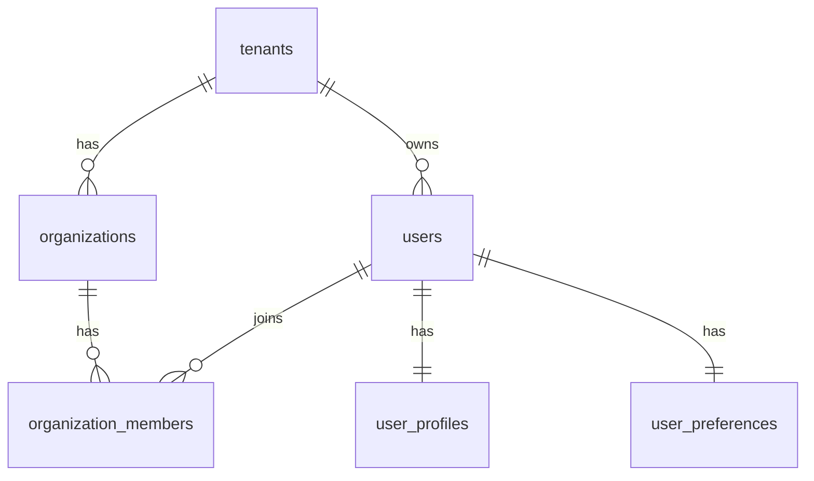

## 26.2 Auth & Role Permission ERD

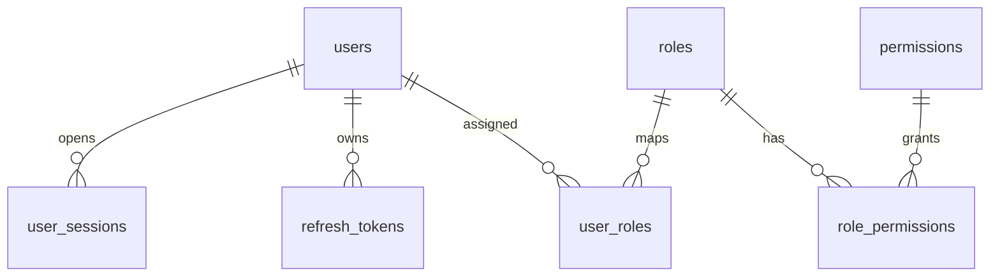

## 26.3 Consent & Privacy ERD

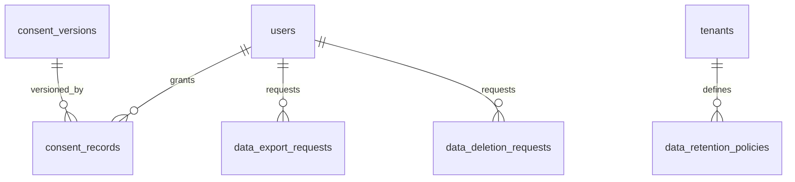

## 26.4 Conversation & Call ERD

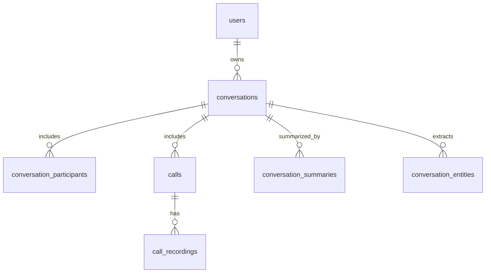

## 26.5 Transcription ERD

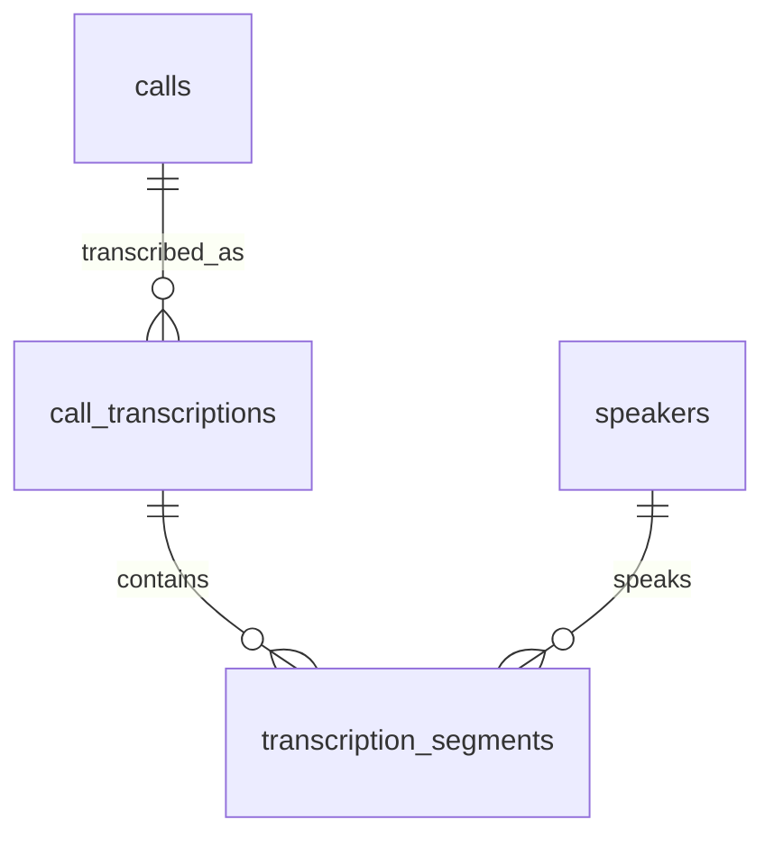

## 26.6 AI Analysis ERD

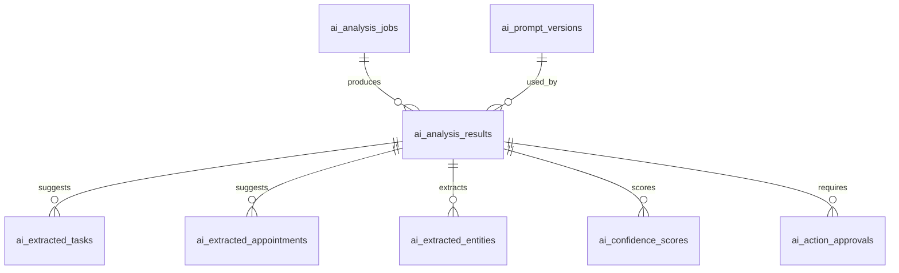

## 26.7 AI Chat & Memory ERD

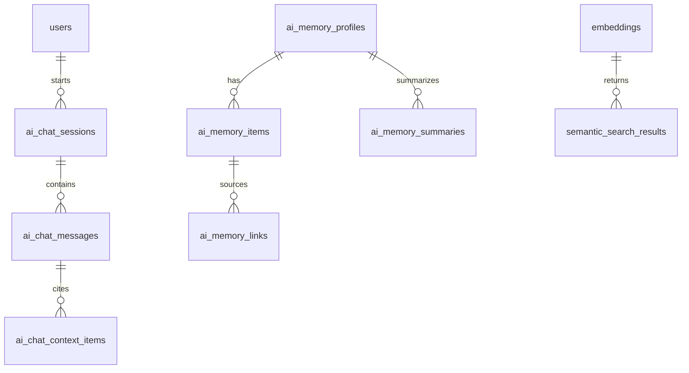

## 26.8 Email ERD

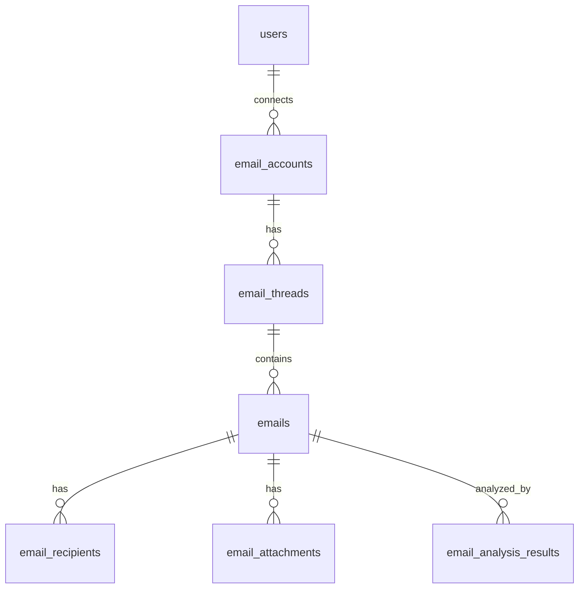

## 26.9 Calendar & Appointment ERD

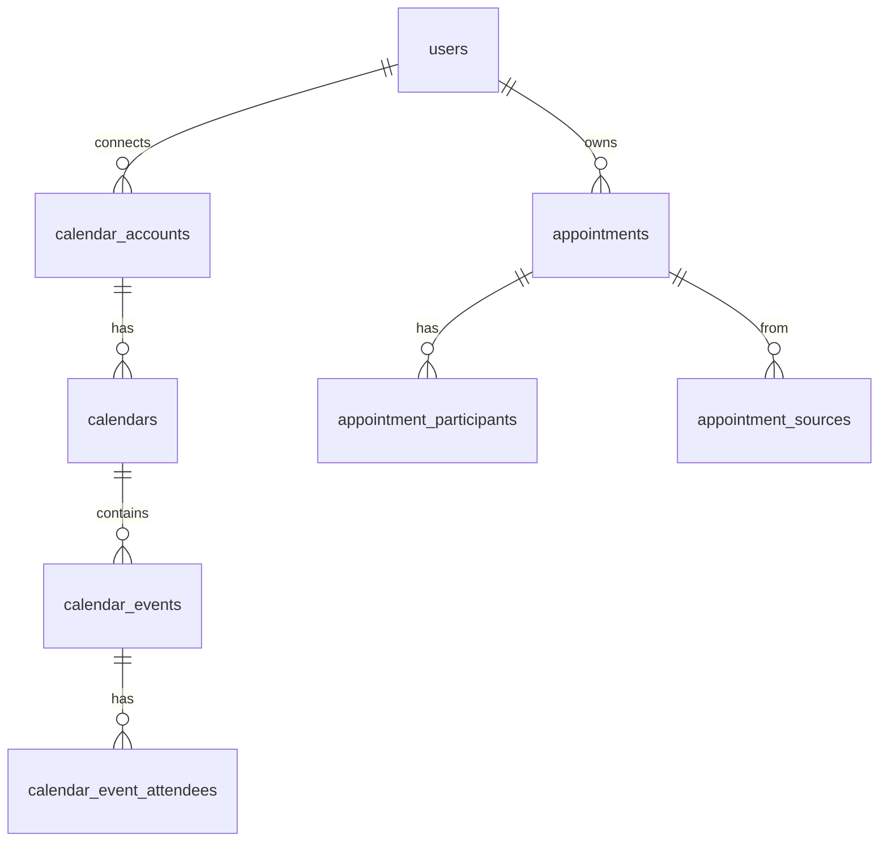

## 26.10 Task ERD

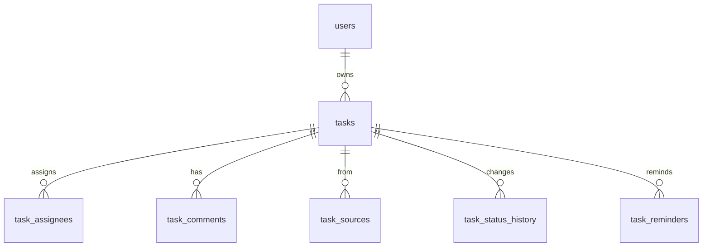

## 26.11 Contact & CRM ERD

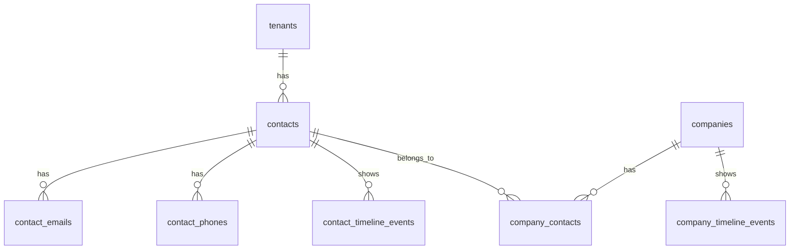

## 26.12 File & Document ERD

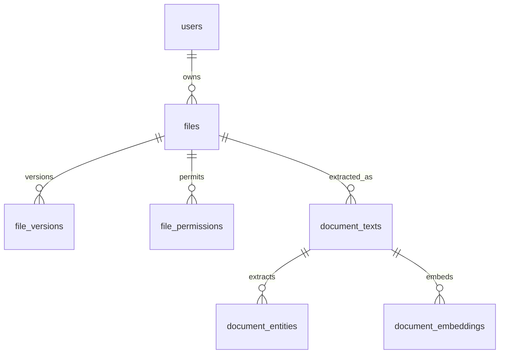

## 26.13 Notification ERD

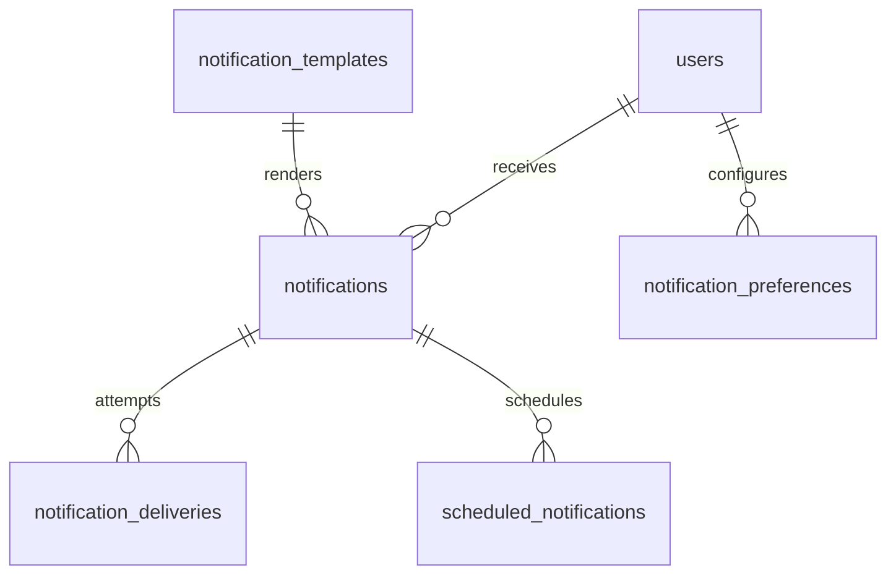

## 26.14 Billing ERD

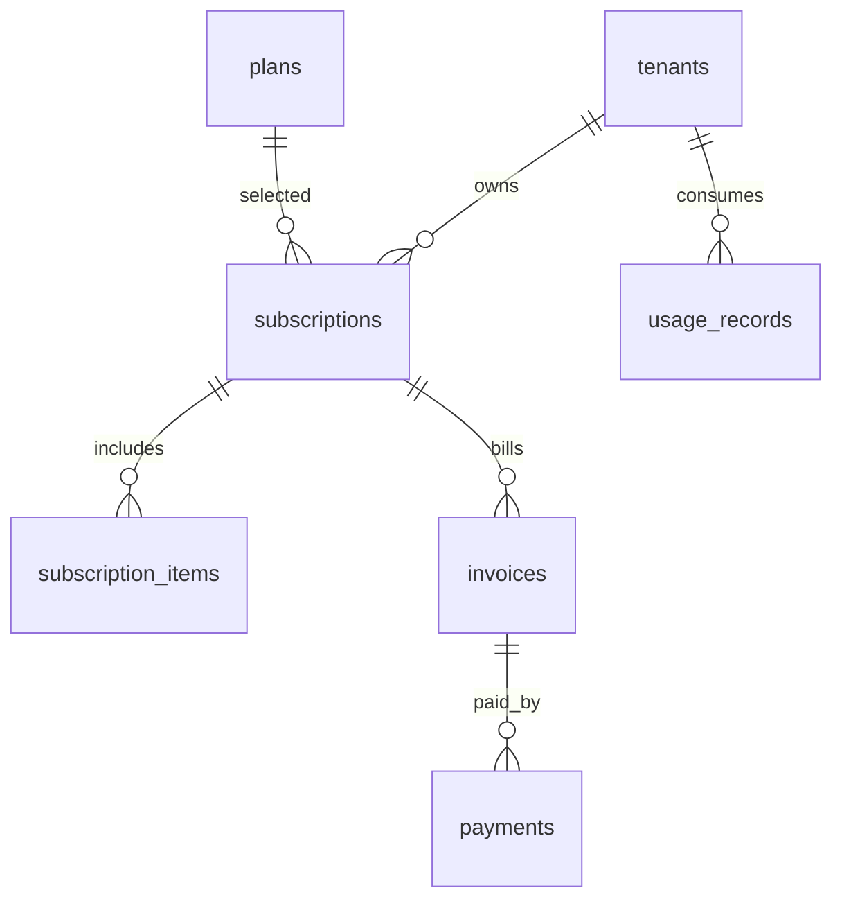

## 26.15 Audit & Security ERD

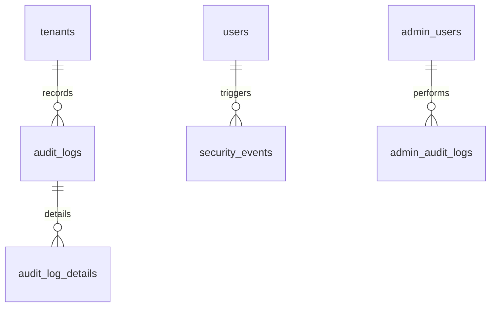

## 26.16 MVP Combined ERD

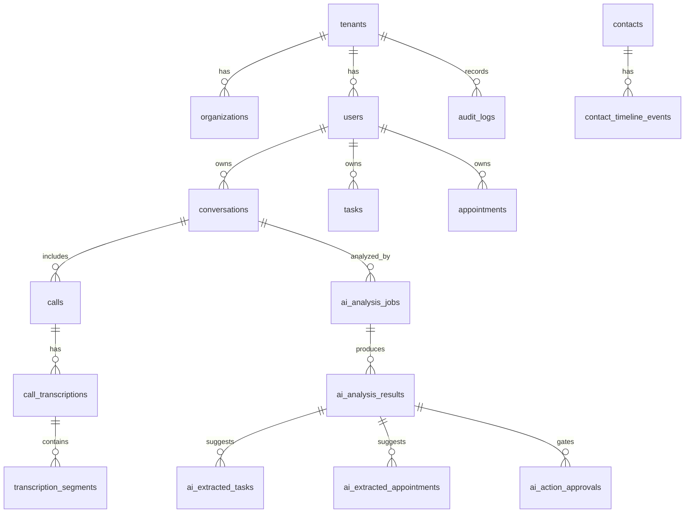

# 27. Codex İçin Sonraki Ciltlere Hazırlık Notları

Cilt 4 hazırlanırken bu veritabanı tasarımı backend servis sınırlarına ve repository/use case yapısına dönüştürülmelidir. Özellikle tenant_id enforcement, soft delete filtreleri, AI action approval transaction flow, audit log yazımı, encrypted field erişimi, background job metadata ve export/delete süreçleri backend tasarımında açıkça ele alınmalıdır.

# Codex İçin Sonraki Adım

Bir sonraki dokümanda Cilt 4 — Backend Design hazırlanacaktır. Cilt 4; FastAPI backend yapısı, modüler monolith proje yapısı, servis katmanı, repository pattern, API endpoint tasarımı, authentication akışı, background worker yapısı, queue sistemi, AI service entegrasyonu, error handling, OpenAPI dokümantasyonu ve backend kod üretim talimatlarını içermelidir.
