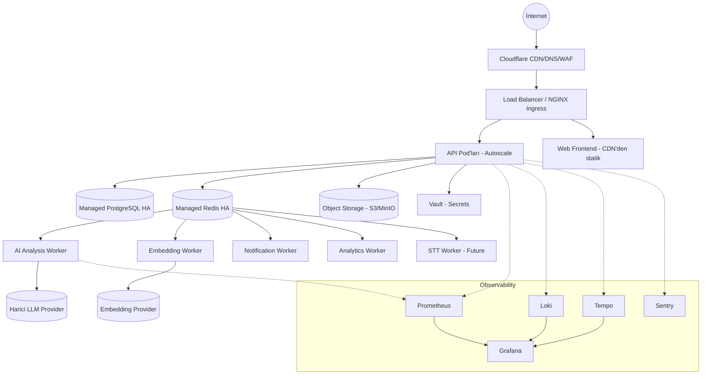
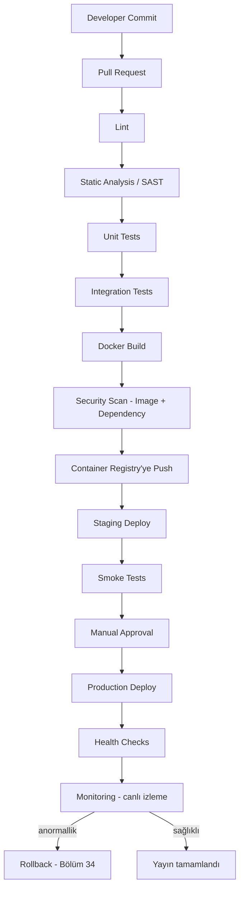

# CILT 8 — DevOps, Cloud & Infrastructure Architecture Documentation: NeuroDesk AI

Sürüm: 1.0
Tarih: 09 Temmuz 2026
Dil: Türkçe
Doküman türü: DevOps, Cloud ve Altyapı Mimari Dokümanı, Cilt 8
Kapsam: Cloud strateji, network/altyapı mimarisi, container/Kubernetes, storage/backup/DR, CI/CD, observability, güvenlik operasyonları, AI worker altyapısı, uyumluluk ve operasyon (runbook/SLA) dokümanı

> Not: Bu doküman altyapı mimarisi ve operasyon çerçevesidir; nihai cloud provider sözleşmesi, maliyet teklifi veya hukuki uyumluluk onayının yerine geçmez.

> Süreklilik notu: Bu doküman CILT_1 — CILT_7'nin devamıdır ve önceki ciltlerde zaten alınmış altyapı kararlarını **değiştirmez, derinleştirir**: kuyruk teknolojisi Redis + Celery'dir (Cilt 2 §23, §28, Cilt 5 §15) — RabbitMQ değerlendirilmiş ancak MVP'de ek bir altyapı bileşeni olarak eklenmemiştir; bulut sağlayıcı karşılaştırması Cilt 2 §39'daki tabloyu temel alır ve derinleştirir; Kubernetes Cilt 2 §41'de "MVP için zorunlu değil, tetikleyicilerle devreye girer" olarak işaretlenmiştir — bu cilt K8s/Helm/ArgoCD'nin **hedef (post-MVP/ölçek fazı) mimarisini** tam olarak tasarlar, MVP'nin daha basit bir dağıtım modeliyle başladığını değiştirmez (Bölüm 14). CI/CD'nin 10 adımlık iskeleti (Cilt 2 §42) bu ciltte tam akışa (Bölüm 29) genişletilmiştir. Loglama alanları Cilt 4 §38.1 ile birebir aynıdır. Backup/DR RPO-RTO hedefleri (MVP 24s/8s, Enterprise 1s/2s, Cilt 2 §44) korunmuş, granüler hale getirilmiştir (Bölüm 23-24). Log toplama aracı olarak Cilt 2 §45'te alternatif belirtilen ELK/OpenSearch yerine, Prometheus+Grafana ile aynı ekosistemde (Grafana LGTM yığını) çalışan **Loki + Tempo** tercih edilmiştir — bu, araç sayısını azaltan bilinçli bir birleştirmedir, çelişki değildir.

## İçindekiler

1. [Executive Summary](#1-executive-summary)
2. [Cloud Strategy](#2-cloud-strategy)
3. [Cloud Provider Karşılaştırması](#3-cloud-provider-karşılaştırması)
4. [Hedef Altyapı Mimarisi](#4-hedef-altyapı-mimarisi)
5. [Network Topology](#5-network-topology)
6. [VPC Tasarımı](#6-vpc-tasarımı)
7. [Subnet Yapısı](#7-subnet-yapısı)
8. [Load Balancer Stratejisi](#8-load-balancer-stratejisi)
9. [DNS Mimarisi](#9-dns-mimarisi)
10. [CDN Kullanımı](#10-cdn-kullanımı)
11. [TLS / SSL Yönetimi](#11-tls--ssl-yönetimi)
12. [Container Strategy](#12-container-strategy)
13. [Docker Standardı](#13-docker-standardı)
14. [Kubernetes Cluster Tasarımı](#14-kubernetes-cluster-tasarımı)
15. [Namespace Stratejisi](#15-namespace-stratejisi)
16. [Node Pool Tasarımı](#16-node-pool-tasarımı)
17. [Autoscaling (HPA/VPA)](#17-autoscaling-hpavpa)
18. [Service Mesh (Future)](#18-service-mesh-future)
19. [Storage Architecture](#19-storage-architecture)
20. [PostgreSQL HA](#20-postgresql-ha)
21. [Redis HA](#21-redis-ha)
22. [Object Storage](#22-object-storage)
23. [Backup Strategy](#23-backup-strategy)
24. [Disaster Recovery](#24-disaster-recovery)
25. [Multi-Region Strategy](#25-multi-region-strategy)
26. [Secrets Management](#26-secrets-management)
27. [Identity & Access Management](#27-identity--access-management)
28. [DevSecOps Yaklaşımı](#28-devsecops-yaklaşımı)
29. [CI/CD Pipeline](#29-cicd-pipeline)
30. [Git Branching Strategy](#30-git-branching-strategy)
31. [Release Management](#31-release-management)
32. [Blue/Green Deployment](#32-bluegreen-deployment)
33. [Canary Deployment](#33-canary-deployment)
34. [Rollback Strategy](#34-rollback-strategy)
35. [Feature Flags](#35-feature-flags)
36. [Monitoring](#36-monitoring)
37. [Metrics](#37-metrics)
38. [Logging](#38-logging)
39. [Tracing](#39-tracing)
40. [Alerting](#40-alerting)
41. [Cost Optimization](#41-cost-optimization)
42. [Capacity Planning](#42-capacity-planning)
43. [AI Worker Deployment](#43-ai-worker-deployment)
44. [Background Worker Scaling](#44-background-worker-scaling)
45. [Queue Monitoring](#45-queue-monitoring)
46. [WebSocket Scaling](#46-websocket-scaling)
47. [API Gateway](#47-api-gateway)
48. [Rate Limiting](#48-rate-limiting)
49. [WAF](#49-waf)
50. [DDoS Protection](#50-ddos-protection)
51. [Compliance (KVKK/GDPR)](#51-compliance-kvkkgdpr)
52. [Audit Infrastructure](#52-audit-infrastructure)
53. [Incident Management](#53-incident-management)
54. [Runbooks](#54-runbooks)
55. [SLA / SLO / Error Budget](#55-sla--slo--error-budget)
56. [Environment Management](#56-environment-management)
57. [Infrastructure Testing](#57-infrastructure-testing)
58. [Chaos Engineering (Future)](#58-chaos-engineering-future)
59. [Enterprise Operations](#59-enterprise-operations)
60. [Uygulama Rehberi](#60-uygulama-rehberi)
61. [Kabul Kriterleri](#61-kabul-kriterleri)
62. [Sonraki Cilt İçin Hazırlık Notları](#sonraki-cilt-için-hazırlık-notları)
63. [Sonraki Adım](#sonraki-adım)

# 1. Executive Summary

NeuroDesk AI'ın altyapısı, MVP'de basit ve işletilebilir, ölçek geldiğinde önceden tasarlanmış bir Kubernetes hedefine kayabilecek şekilde iki fazlı planlanır. Faz 1 (MVP), Cilt 2 §41'de tanımlanan "Kubernetes zorunlu değil" kararına sadık kalarak yönetilen container servisleri (managed PaaS veya Docker Compose tabanlı tek/az sayıda VM) üzerinde çalışır; Faz 2 (ölçek), bu ciltte tam olarak tasarlanan Kubernetes + Helm + ArgoCD GitOps mimarisine geçer. Bu iki fazlı yaklaşım, erken aşamada gereksiz operasyonel karmaşıklığı (Cilt 1'in "staj/küçük ekip" gerçekliğiyle uyumlu) önlerken, büyüme geldiğinde mimarinin yeniden yazılmasını değil yalnızca yeniden konuşlandırılmasını gerektirir — çünkü uygulama katmanı (Cilt 2 §5 Modular Monolith) zaten container-native tasarlanmıştır.

Altyapının değişmez ilkeleri: her ortamda tenant izolasyonu korunur (Cilt 2 §37), hiçbir secret kod/image içine gömülmez (Bölüm 26), her production değişikliği CI/CD üzerinden izlenebilir şekilde geçer (Bölüm 29), ve AI worker'lar (Bölüm 43) API sunucusundan bağımsız ölçeklenir çünkü AI iş yükü (token bazlı, değişken süreli) API trafiğinden (istek/yanıt, kısa süreli) yapısal olarak farklıdır.

# 2. Cloud Strategy

Strateji "cloud-agnostic çekirdek, managed servis pragmatizmi"dir: uygulama katmanı (backend, worker) herhangi bir Kubernetes uyumlu ortamda çalışabilecek şekilde container-native yazılır (vendor lock-in yaratmaz), ancak PostgreSQL, Redis, Object Storage gibi stateful bileşenler için başlangıçta **managed servisler** tercih edilir (kendi başına HA PostgreSQL/Redis işletmek, küçük bir ekip için gereksiz operasyonel risktir). Bu, Cilt 2 §39'daki "Production: Managed PostgreSQL, Managed Redis" kararıyla birebir uyumludur.

# 3. Cloud Provider Karşılaştırması

Cilt 2 §39'daki karşılaştırma tablosu bu ciltte derinleştirilir:

| Sağlayıcı | Güçlü yön | Zayıf yön | NeuroDesk AI için öneri |
|---|---|---|---|
| AWS | En olgun servis seti, enterprise satışta güven, geniş bölge ağı (Multi-Region, Bölüm 25 için avantaj) | Maliyet karmaşıklığı, öğrenme eğrisi | Enterprise/ölçek fazı için birincil aday |
| Google Cloud (GCP) | AI/veri servisleri güçlü, Cloud Run gibi hafif başlangıç seçenekleri | Bölgesel kapsam AWS kadar geniş değil | AI ağırlıklı büyüme senaryosunda güçlü alternatif |
| Azure | Microsoft 365/Outlook entegrasyonlu kurumsal müşterilerde (Cilt 1 §6 hedef kitle) güven avantajı | Karmaşıklık AWS'ye yakın | Kurumsal/Microsoft-ekosistemli müşteri segmentinde tercih |
| DigitalOcean | Basit, öngörülebilir fiyat, küçük ekip için düşük operasyonel yük | Enterprise servis derinliği (SIEM export, gelişmiş IAM) sınırlı | **MVP/Faz 1 için önerilen** |
| Render / Railway / Fly.io | Dakikalar içinde deploy, Docker Compose'a yakın deneyim | Kubernetes'e geçiş, multi-region, enterprise kontrol sınırlı | Erken MVP/demo için değerlendirilebilir, büyüme ile terk edilir |

Karar: **Faz 1 (MVP) DigitalOcean (veya benzeri basit managed Kubernetes/PaaS) üzerinde başlar; Faz 2 (Kubernetes'e geçiş tetikleyicileri gerçekleştiğinde, Bölüm 14) AWS'ye taşınır.** Bu geçiş, uygulamanın container-native olması (Bölüm 12) sayesinde bir "yeniden platformlaştırma" değil bir "yeniden konuşlandırma" işlemidir.

# 4. Hedef Altyapı Mimarisi

Hedef mimari, Cilt 2 §49.1'deki "High Level System Architecture" diagramının altyapı seviyesinde somutlaşmış halidir:

Bu diyagram Faz 2 (Kubernetes) hedefini gösterir; Faz 1'de (Bölüm 14) API/Worker pod'ları yerine daha az sayıda container/VM, Ingress yerine tek bir yönetilen load balancer bulunur — bileşenlerin mantıksal ilişkisi aynı kalır.

# 5. Network Topology

Ağ topolojisi üç bölgeye ayrılır: **Public** (Load Balancer, CDN edge — yalnızca 443/80 dışa açık), **Private/App** (API, worker pod'ları — yalnızca Load Balancer'dan gelen trafiği kabul eder), **Private/Data** (PostgreSQL, Redis, Vault — yalnızca App katmanından gelen trafiği kabul eder, internete asla doğrudan açılmaz). Bu üç katman, Network Policies (Bölüm 15, 28) ile Kubernetes seviyesinde de zorunlu kılınır.

# 6. VPC Tasarımı

Her ortam (Bölüm 56) kendi izole VPC'sinde çalışır; ortamlar arası hiçbir doğrudan network erişimi yoktur (staging, production veritabanına asla erişemez — Cilt 2 §43 "Production verisi local ortama indirilmemelidir" ilkesinin ağ seviyesindeki karşılığı). Production VPC, çok bölgeli genişlemeye (Bölüm 25) hazır CIDR planlamasıyla kurulur (ileride subnet çakışması yaşanmayacak şekilde geniş, seyrek kullanılan bir CIDR bloğu ayrılır).

# 7. Subnet Yapısı

| Subnet | Erişilebilirlik | İçerik |
|---|---|---|
| Public Subnet | İnternete açık | Load Balancer, NAT Gateway |
| Private App Subnet | Yalnızca VPC içi + LB | API, Worker, WebSocket pod'ları |
| Private Data Subnet | Yalnızca App Subnet | PostgreSQL, Redis, Vault |
| Management Subnet | VPN/bastion üzerinden | CI/CD runner'lar, admin erişimi |

Her Availability Zone'da bu dört subnet tekrarlanır (Bölüm 20-21'deki HA gereksinimini karşılamak için en az 2-3 AZ).

# 8. Load Balancer Stratejisi

Faz 1'de cloud sağlayıcının yönetilen Load Balancer'ı (L7, HTTPS termination) tek giriş noktasıdır. Faz 2'de (Kubernetes) **NGINX Ingress Controller** birincil tercih, **Traefik** ise özellikle canary/blue-green (Bölüm 32-33) trafiği ağırlıklı yönlendirme ihtiyacı arttığında değerlendirilecek alternatiftir — ikisi de Ingress standardını konuştuğundan geçiş düşük maliyetlidir. Load Balancer, health check (Bölüm 29 "Health Checks" adımı) başarısız pod'lara trafik göndermez.

# 9. DNS Mimarisi

DNS, Cloudflare üzerinde yönetilir (Bölüm 10 CDN ile aynı sağlayıcı, tek panel operasyonel kolaylık sağlar). Kubernetes fazında **External DNS** controller'ı, yeni Ingress/Service kaynaklarına göre DNS kayıtlarını otomatik oluşturur/günceller — manuel DNS kaydı riski (unutulan/yanlış kayıt) ortadan kalkar. Ortam bazlı alt alan adları (`app.neurodesk.ai`, `staging.neurodesk.ai`, `api.neurodesk.ai`) Bölüm 56 ortam ayrımını yansıtır.

# 10. CDN Kullanımı

Cloudflare CDN, statik web varlıklarını (Cilt 6 Next.js build çıktısı, Bölüm 59 Performans hedefi) ve object storage'daki herkese açık olmayan-ama-önbelleklenebilir içerikleri (imzalı URL'ler hariç) önbellekler. CDN aynı zamanda WAF (Bölüm 49) ve temel DDoS koruması (Bölüm 50) katmanını da taşır — üç işlev (CDN+WAF+DDoS) tek sağlayıcıda birleştirilerek operasyonel yüzey azaltılır.

# 11. TLS / SSL Yönetimi

Faz 1'de sertifikalar cloud sağlayıcının yönetilen sertifika servisiyle otomatik yenilenir. Faz 2'de (Kubernetes) **cert-manager**, Let's Encrypt ile entegre çalışarak Ingress kaynaklarına otomatik TLS sertifikası sağlar ve yenileme sürecini (90 günlük Let's Encrypt döngüsü) tam otomatikleştirir — manuel sertifika yenileme operasyonu (kesinti riski taşıyan bir klasik hata kaynağı) ortadan kaldırılır. Tüm iç servis-servis iletişimi de (Bölüm 18 Service Mesh devreye girdiğinde) mTLS ile şifrelenir; bu, Cilt 2 §32 "encryption in transit" ilkesinin altyapı seviyesindeki uygulanışıdır.

# 12. Container Strategy

Her runtime (API, her worker tipi, scheduler) Cilt 2 §40 ilkesiyle uyumlu şekilde ayrı bir image olarak paketlenir. Image'lar çok aşamalı (multi-stage) build ile üretilir: build aşaması bağımlılıkları derler, final aşama yalnızca çalışma zamanı gereksinimlerini içeren minimal bir taban image (distroless veya slim) kullanır — saldırı yüzeyini ve image boyutunu küçültmek için. Hiçbir image `latest` tag'i ile production'a alınmaz; her image, Git commit SHA'sıyla etiketlenir (Bölüm 29 CI/CD'nin izlenebilirlik gereksinimi).

# 13. Docker Standardı

Cilt 2 §40 ilkeleri (secrets image içine gömülmez, healthcheck zorunlu, production image minimal) bu ciltte somutlaşır: her Dockerfile bir `HEALTHCHECK` talimatı içerir (Load Balancer/Kubernetes bunu kullanır, Bölüm 8, 29); her container non-root kullanıcıyla çalışır (Bölüm 28 container security); `.dockerignore` ile sır/gereksiz dosyaların (`.env`, `.git`) image'a asla dahil olmaması garanti edilir. Local development, Docker Compose ile Cilt 2 §39 "Local Development" bileşen listesini (Backend, Frontend, PostgreSQL, Redis, MinIO, Worker, pgvector) tek komutla ayağa kaldırır.

# 14. Kubernetes Cluster Tasarımı

Cilt 2 §41'deki geçiş tetikleyicileri (çoklu worker türü, otomatik ölçekleme ihtiyacı, enterprise deployment standardı, multi-region planı) gerçekleştiğinde, hedef mimari şu şekildedir: yönetilen Kubernetes (EKS/GKE/AKS — Bölüm 3 kararına göre), **Helm** ile paketlenmiş uygulama chart'ları (API, her worker tipi, scheduler için ayrı chart veya tek bir umbrella chart altında alt chart'lar), **ArgoCD** ile GitOps tabanlı sürekli senkronizasyon (Git deposundaki manifest durumu = cluster'ın gerçek durumu; `kubectl apply` ile manuel değişiklik yapılmaz, her değişiklik Git commit'i üzerinden geçer — bu, Bölüm 29 CI/CD'nin "Production Deploy" adımının somut mekanizmasıdır).

MVP'de (Faz 1) Kubernetes **kurulmaz**; bu bölüm, tetikleyiciler gerçekleştiğinde doğrudan uygulanabilecek hazır bir hedef mimari olarak var olur.

# 15. Namespace Stratejisi

| Namespace | İçerik | Network Policy |
|---|---|---|
| `neurodesk-api` | API deployment'ları | Yalnızca ingress-nginx'ten trafik kabul eder |
| `neurodesk-workers` | Tüm worker tipleri (Bölüm 43) | Yalnızca Redis/PostgreSQL/harici provider'lara çıkış |
| `neurodesk-data` | Self-hosted yardımcı bileşenler (varsa) | En kısıtlı, yalnızca API/worker namespace'lerinden giriş |
| `neurodesk-observability` | Prometheus, Grafana, Loki, Tempo | Cluster geneli metrik/log toplama izni |
| `neurodesk-system` | cert-manager, external-dns, ArgoCD | Cluster admin kapsamlı, sınırlı erişim |

Enterprise fazında (Bölüm 59) dedicated tenant gereksinimi olan büyük müşteriler için tenant başına ayrı namespace (veya ayrı cluster) opsiyonu değerlendirilir — bu, Cilt 2 §37 Enterprise "Dedicated database opsiyonu" kararının Kubernetes seviyesindeki genişlemesidir.

# 16. Node Pool Tasarımı

| Node Pool | Amaç | Özellik |
|---|---|---|
| `general` | API, scheduler, sistem bileşenleri | Genel amaçlı, orta boyut, her zaman ≥2 node (HA) |
| `worker-standard` | AI Analysis, Embedding, Notification, Analytics Worker'lar | Burst'e uygun, autoscale 0-N (trafiksiz saatlerde küçülür) |
| `worker-gpu` (Future) | Yalnızca self-hosted STT/embedding modeli seçilirse | GPU'lu, yalnızca gerektiğinde 0'dan yukarı ölçeklenir |
| `observability` | Prometheus/Loki/Tempo | Depolama-yoğun, ayrı disk profili |

GPU node pool, Cilt 5 §10'daki "sağlayıcı seçimi backend'e sızmaz, harici LLM/embedding API kullanılır" kararı gereği **MVP'de ve öngörülebilir gelecekte gerekli değildir**; yalnızca ürün ileride kendi STT/embedding modelini self-host etmeye karar verirse devreye girer (Bölüm 43).

# 17. Autoscaling (HPA/VPA)

**Horizontal Pod Autoscaler (HPA)**: API pod'ları CPU/istek oranına göre yatay ölçeklenir (Cilt 2 §46 "API horizontal scaling" ile birebir); her worker tipi (Bölüm 43) **kendi kuyruk derinliğine** göre ayrı ayrı ölçeklenir (KEDA benzeri kuyruk-tabanlı autoscaler — CPU değil, Redis/Celery kuyruk uzunluğu tetikleyicidir, çünkü AI worker yükü CPU-yoğun değil I/O-bekleme-yoğundur). **Vertical Pod Autoscaler (VPA)**, PostgreSQL/Redis gibi stateful bileşenlerin (managed servis kullanılmıyorsa) kaynak taleplerini öneri modunda izler, otomatik yeniden boyutlandırma production'da dikkatli/manuel onaylı uygulanır.

# 18. Service Mesh (Future)

Service mesh (Istio/Linkerd), MVP ve Faz 2'nin ilk sürümünde **gerekli değildir** — Modular Monolith (Cilt 2 §5) mimarisi zaten az sayıda servis arası çağrı içerir. Service mesh, mimari gerçekten mikroservislere evrildiğinde (Cilt 2 §6 "Gelecekte Microservice'e Evrim Stratejisi", Cilt 2 §49.3 diyagramı) mTLS (Bölüm 11), servisler arası trafik izleme (Bölüm 39 Tracing'in tamamlayıcısı) ve ince taneli trafik yönetimi (Bölüm 33 Canary) için değerlendirilir.

# 19. Storage Architecture

Üç storage sınıfı: **İlişkisel** (PostgreSQL + pgvector, Bölüm 20), **In-memory/Cache/Queue** (Redis, Bölüm 21), **Nesne depolama** (S3 uyumlu, Bölüm 22 — dosya/ses/belge). Hiçbir büyük ikili veri (Cilt 3 §3 "Binary dosya için BYTEA kullanılmamalı") PostgreSQL'de tutulmaz; bu kural altyapı seviyesinde de zorunlu kılınır (uygulama, dosya yazma isteğini yalnızca object storage'a yönlendirir).

# 20. PostgreSQL HA

Faz 1: managed PostgreSQL, tek birincil + otomatik failover destekli standby (sağlayıcının yönetilen HA seçeneği). Faz 2/Enterprise: bölge içi çoklu AZ senkron replikasyon + okuma replikaları (Cilt 2 §46 "Read replica, ileri faz" ile uyumlu) — okuma yoğun endpoint'ler (dashboard, analytics, Cilt 6 §34) read replica'ya yönlendirilebilir, yazma her zaman birincile gider. Connection pooling (PgBouncer benzeri) API/worker pod sayısı arttıkça bağlantı tükenmesini önlemek için zorunludur.

# 21. Redis HA

Redis, hem cache hem Celery broker olarak kullanıldığından (Cilt 2 §24, §28) kaybı iki farklı etkiye sahiptir: cache kaybı performans düşüşüdür (kritik değil), **queue/broker kaybı ise işlenmemiş AI job'larının kaybı anlamına gelebilir** (Cilt 2 §44 "Redis kalıcı veri değilse backup kritik olmayabilir; queue kaybı değerlendirilmelidir" notunun bu ciltteki çözümü). Bu nedenle: Redis AOF (Append Only File) kalıcılığı açık çalıştırılır, managed Redis'in HA/failover seçeneği (sentinel veya cluster mod) production'da zorunludur, ve kritik job'lar (AI Action Approval'a giden analiz job'ları) için ek bir dayanıklılık önlemi olarak job kabul edildiğinde PostgreSQL'e de bir "job kaydı" düşülür (Cilt 4 `ai_analysis_results.status=queued`) — Redis kaybolsa bile hangi job'ların kaybolduğu tespit edilip yeniden kuyruğa alınabilir.

# 22. Object Storage

Faz 1/geliştirme: MinIO (S3 uyumlu, self-hosted, Cilt 2 §39 Local Development'ta zaten kullanılıyor). Production: gerçek S3 (veya sağlayıcı eşdeğeri). Versioning açık (Cilt 2 §44 "Object storage versioning"), yanlışlıkla silinen/üzerine yazılan dosyalar kurtarılabilir. Yaşam döngüsü politikası: KVKK/GDPR silme talepleri (Bölüm 51) geldiğinde ilgili nesneler hard-delete edilir (versioning'in "kurtarma" avantajı bu durumda devre dışı bırakılır — silme talebi kalıcı olmalıdır).

# 23. Backup Strategy

| Varlık | Sıklık | Saklama süresi | Geri yükleme prosedürü | RPO | RTO |
|---|---|---|---|---|---|
| PostgreSQL | Günlük full + sürekli WAL (point-in-time recovery) | 30 gün (MVP), 90 gün+ (Enterprise, sözleşmeye göre) | Managed servis restore aracı + runbook (Bölüm 54) | MVP 24s / Enterprise 1s | MVP 8s / Enterprise 2s |
| Redis | AOF sürekli kalıcılık + günlük snapshot | 7 gün | Snapshot'tan yeniden başlatma; kritik job'lar PostgreSQL job kaydından (Bölüm 21) yeniden kuyruklanır | Saatler (kritik değil, iş verisi PostgreSQL'de) | < 1s |
| Object Storage | Sağlayıcı native versioning + çapraz bölge replikasyon (Enterprise) | Versiyon geçmişi 30 gün, sonra sıkıştırılır | Versiyon geri alma veya çapraz bölge kopyadan restore | MVP 24s / Enterprise 1s | MVP 8s / Enterprise 4s |
| Configuration (IaC/Helm values) | Her değişiklikte (Git) | Sınırsız (Git geçmişi) | `git revert` + ArgoCD re-sync (Bölüm 14) | Anlık | Dakikalar |
| Secrets (Vault) | Günlük şifreli snapshot | 30 gün | Vault restore prosedürü + anahtar rotasyonu | 24s | 4s |
| Audit Logs | Sürekli, append-only | Cilt 2 §35/Enterprise sözleşmesine göre uzun süreli (1 yıl+) | Yalnızca okuma amaçlı arşivden erişim, restore gerektirmez | — | — |

# 24. Disaster Recovery

Cilt 2 §44'teki RPO/RTO hedefleri (MVP 24s/8s, Enterprise 1s/2s) bu cildin temel SLA girdisidir (Bölüm 55 ile bağlantılı). DR prosedürü: (1) olay tespiti (Bölüm 40 Alerting), (2) incident açma (Bölüm 53), (3) ilgili runbook'un (Bölüm 54) izlenmesi, (4) gerekiyorsa yedek bölgeye/son sağlıklı yedeğe geçiş, (5) post-mortem. Periyodik DR tatbikatı (en az yılda bir, Enterprise'da çeyreklik) yapılır ve gerçek bir restore'un çalıştığı doğrulanır — test edilmemiş bir backup, backup değildir.

# 25. Multi-Region Strategy

MVP tek bölgede çalışır. Multi-region, iki farklı amaçla ileri fazda devreye girer: **DR amaçlı** (birincil bölge tamamen kaybedilirse ikincil bölgeye geçiş, Enterprise RTO hedefi için) ve **veri ikamet (data residency) amaçlı** (Cilt 2 §38 Enterprise "Regional data residency opsiyonu" — belirli bir bölgede veri tutma zorunluluğu olan kurumsal müşteriler için). İkisi farklı mimari gerektirir: DR için pasif/warm standby yeterliyken, data residency için o bölgeye özel, tam izole bir dağıtım (ayrı VPC, Bölüm 6) gerekir.

# 26. Secrets Management

**Vault**, tüm ortamlardaki secret'ların (DB şifreleri, OAuth client secret'ları, LLM/embedding API anahtarları, JWT imzalama anahtarları) tek merkezi kaynağıdır. Kurallar: hiçbir secret Git'e commit edilmez (`.gitignore` + pre-commit secret tarama, Bölüm 28), Kubernetes'te secret'lar Vault'tan `External Secrets Operator` benzeri bir mekanizmayla senkronize edilir (düz Kubernetes Secret objesi olarak elle girilmez), her secret erişimi audit'lenir (Bölüm 52). **Secrets Rotation**: OAuth/DB secret'ları periyodik (örn. 90 gün) veya şüpheli olay sonrası otomatik rotasyona tabidir; JWT signing key rotasyonu Cilt 2 §17 token rotasyon mekanizmasıyla uyumlu çalışır.

# 27. Identity & Access Management

Bu bölüm **altyapı/cloud IAM**'ı kapsar (uygulama içi kullanıcı RBAC'ı Cilt 2 §17'de tanımlıdır, karıştırılmamalıdır). Prensip: en az ayrıcalık (least privilege) — her CI/CD pipeline, her operatör, yalnızca ihtiyaç duyduğu cloud kaynağına erişir. İnsan operatörler için SSO tabanlı cloud konsol erişimi + MFA zorunlu; servis hesapları (CI/CD, ArgoCD) için kısa ömürlü, otomatik rotasyona tabi kimlik bilgileri (OIDC federasyonu, statik anahtar değil) tercih edilir.

# 28. DevSecOps Yaklaşımı

Güvenlik, pipeline'ın sonunda bir kapı değil, her aşamaya gömülü bir kontroldür:

| Aşama | Kontrol |
|---|---|
| Kod yazma | Pre-commit secret tarama (Bölüm 26), lint (Bölüm 29) |
| PR | Statik analiz (SAST), bağımlılık taraması (Dependency Scanning — bilinen CVE'li paket tespiti) |
| Build | **Image Scanning** (Trivy benzeri, container image'daki OS/paket zafiyetleri) |
| Deploy öncesi | Policy-as-code kontrolü (non-root container, kaynak limiti tanımlı mı — Bölüm 13, 16) |
| Runtime | **Runtime Protection** (beklenmeyen process/network davranışı tespiti, Kubernetes'te), Network Policies (Bölüm 15) |

Container Security ilkeleri: non-root kullanıcı (Bölüm 13), read-only root filesystem (mümkün olan container'larda), gereksiz Linux capability'lerinin düşürülmesi, image'ların yalnızca güvenilir bir private registry'den çekilmesi.

# 29. CI/CD Pipeline

Cilt 2 §42'deki 10 adımlık iskelet, bu ciltte tam akışa genişletilir:

Her adım bir öncekinin başarısına bağımlıdır (fail-fast); Security Scan (H) kritik/yüksek zafiyet bulursa pipeline durur, Container Registry'ye push edilmez. Production Deploy (M), Faz 2'de ArgoCD'nin Git'teki hedef durumu senkronize etmesiyle gerçekleşir (Bölüm 14); Faz 1'de doğrudan managed servise deploy komutuyla. Health Checks (N) başarısız olursa otomatik olarak Rollback (P) tetiklenir, manuel müdahale beklenmez.

# 30. Git Branching Strategy

Cilt 2 §42'deki strateji birebir korunur: `main` (production), `develop` (staging/integration), `feature/*`, `release/*`, `hotfix/*`. `hotfix/*` dalları, Manual Approval adımını (Bölüm 29) atlamadan ama hızlandırılmış bir onay SLA'sıyla (Bölüm 55) production'a alınabilir.

# 31. Release Management

Sürümler semantik versiyonlama (major.minor.patch) ile etiketlenir; her release, değişiklik günlüğü (changelog) ve etkilenen modüllerin (Cilt 1-7'deki cilt referanslarıyla) listesini taşır. Release notu, AI prompt versiyon değişiklikleri (Cilt 5 §7) varsa bunu ayrıca vurgular çünkü bu tür değişiklikler kullanıcı görünür davranışı etkileyebilir.

# 32. Blue/Green Deployment

Blue/Green, özellikle veritabanı migration'ı içermeyen veya geriye uyumlu migration'larla yapılan büyük sürümlerde kullanılır: yeni sürüm ("green") mevcut sürümle ("blue") paralel ayağa kaldırılır, trafik health check sonrası anlık olarak green'e çevrilir, blue bir süre yedek olarak tutulur (hızlı rollback için, Bölüm 34). Veritabanı migration'ları her zaman geriye uyumlu (backward-compatible) yazılır ki Blue/Green sırasında iki sürüm aynı şemaya güvenle erişebilsin.

# 33. Canary Deployment

Canary, riskli veya davranış değişikliği içeren sürümlerde (özellikle AI prompt versiyon geçişleri, Cilt 5 §7'nin "kademeli açılış" ilkesiyle birebir) tercih edilir: yeni sürüm trafiğin küçük bir yüzdesine (%5→%25→%50→%100) kademeli olarak açılır, her adımda Bölüm 37 metrikleri (hata oranı, gecikme, AI confidence dağılımı) izlenir, anormallik varsa otomatik geri çekilir. Traefik/NGINX Ingress'in ağırlıklı yönlendirme özelliği (Bölüm 8) bu kademeli açılışın mekanizmasıdır.

# 34. Rollback Strategy

Rollback her zaman **önceden test edilmiş, bilinen-iyi bir sürüme dönüş**tür, ileri düzeltme (roll-forward) değildir — acil durumda hız önceliklidir. Faz 2'de ArgoCD, Git'teki bir önceki commit'e senkronize edilerek saniyeler içinde rollback yapar. Veritabanı migration'ı geri alınamaz bir değişiklik içeriyorsa (örn. kolon silme), bu değişiklik en az bir release gecikmeli, iki adımlı (önce "kullanılmıyor" işaretleme, sonraki release'de silme) uygulanır ki rollback her zaman güvenli olsun.

# 35. Feature Flags

Feature flag altyapısı, Cilt 6 §43 ve Cilt 7 §55'te tanımlanan uygulama-seviyesi flag'lerin **operasyonel/altyapı karşılığıdır**: flag değerleri merkezi bir konfigürasyon deposunda (backend admin panel + Cilt 6/7'nin tükettiği `/admin/feature-flags` endpoint'i, Cilt 4 §27) tutulur, deploy gerektirmeden değiştirilebilir. Bu, Canary Deployment'tan (Bölüm 33, altyapı seviyesinde trafik yüzdesi) farklı bir kademeli açılış boyutudur (uygulama seviyesinde özellik açma/kapama) — ikisi birlikte kullanılabilir (örn. yeni kod %25 trafiğe canary ile açılır VE o kod içindeki yeni özellik ayrıca flag ile kapalı tutulabilir).

# 36. Monitoring

İzleme yığını **Prometheus (metrik toplama) + Grafana (görselleştirme/dashboard) + Loki (log) + Tempo (trace) + Sentry (hata/exception)**'dir — Cilt 2 §45'te belirtilen araçların bu ciltte netleştirilmiş, birbirini tamamlayan hedef seti. Her servis (API, her worker tipi) `/metrics` endpoint'i üzerinden Prometheus'a scrape edilir; Grafana'da servis bazlı ve iş-metriği bazlı (Bölüm 37) dashboard'lar tanımlanır.

# 37. Metrics

| Kategori | Örnek metrikler | Kaynak |
|---|---|---|
| API Metrics | İstek oranı, p50/p95/p99 gecikme, hata oranı, endpoint bazlı dağılım | Cilt 2 §46 performans hedefleriyle karşılaştırılır |
| Worker Metrics | Job süresi, başarı/hata oranı, worker doluluk oranı (Cilt 5 §68) | Her worker tipi (Bölüm 43) için ayrı |
| Queue Metrics | Kuyruk derinliği, bekleme süresi, dead letter kuyruğu boyutu | Bölüm 45 |
| Database Metrics | Bağlantı havuzu doluluğu, sorgu süresi, replikasyon gecikmesi (Bölüm 20) | Managed PostgreSQL izleme |
| AI Cost Metrics | Token kullanımı, istek başına maliyet, analiz türü bazlı maliyet (Cilt 5 §67-68) | AI Orchestration Service log'ları |
| Request ID / Correlation ID | Her istek/job'a atanan benzersiz kimlik, uçtan uca izlenebilirlik | Cilt 4 §38.1 log alanlarıyla birebir |

Request ID, API'de üretilir (Cilt 2 §16 API Gateway); worker job'larına (Bölüm 43) taşınarak Correlation ID olarak devam eder — bir kullanıcı isteğinin API'den worker'a, oradan LLM provider çağrısına kadar tüm yolculuğu tek bir kimlikle izlenebilir (Bölüm 39 Tracing ile birleşir).

# 38. Logging

Log alanları Cilt 4 §38.1 ile birebir aynıdır: `timestamp, level, service, environment, request_id, trace_id, user_id, tenant_id, organization_id, endpoint, method, status_code, duration_ms, error_code, job_id, provider, ai_model, ai_cost, message`. Loglanmaması gerekenler de aynı kalır (şifre, token, tam mail/transkript metni, ödeme verisi, hassas kişisel veri — Cilt 4 §38.1). Tüm loglar JSON yapılandırılmış formatta üretilir ve Loki'ye toplanır; Loki'nin etiket (label) tabanlı indeksleme modeli, `tenant_id`/`service`/`level` gibi alanlar üzerinden hızlı filtreleme sağlar.

# 39. Tracing

OpenTelemetry (Cilt 2 §45, Cilt 4 §38.3 ile birebir), API isteklerinden worker job'larına ve oradan harici provider çağrılarına (LLM, embedding, Gmail/Outlook, Google Calendar) kadar uçtan uca dağıtık izleme sağlar. Her trace, Bölüm 37'deki Request ID/Correlation ID ile ilişkilendirilir. Tempo, bu trace'leri saklar ve Grafana üzerinden bir isteğin "nerede yavaşladığını" (örn. LLM provider çağrısı mı, veritabanı sorgusu mu) görsel olarak analiz etmeyi sağlar.

# 40. Alerting

Cilt 2 §45'teki alarm listesi (yüksek hata oranı, kuyruk birikmesi, AI provider hatası, veritabanı bağlantı sorunu, webhook/bildirim hatası, OAuth refresh hata artışı) bu ciltte operasyonel eşiklerle somutlaştırılır ve her alarm bir Runbook'a (Bölüm 54) bağlanır — alarm gelen operatör "ne yapacağını bilmeden" alarmla karşılaşmaz. Alarmlar önem derecesine göre kanallara yönlendirilir (kritik → doğrudan arama/PagerDuty benzeri, uyarı → Slack/e-posta), gece nöbeti yalnızca kritik seviyede uyandırır (alarm yorgunluğunu önlemek için).

# 41. Cost Optimization

Maliyet kontrolü üç eksende: **Altyapı** (worker node pool'larının kuyruk boşken 0'a inmesi — Bölüm 17, managed servislerin doğru boyutlandırılması — Bölüm 42), **AI** (Cilt 5 §13 AI Cost Optimization ile birebir — model routing, cache, dedup), **Observability** (log/metrik saklama sürelerinin gereksiz uzun tutulmaması, yalnızca audit log gibi zorunlu olanlar uzun saklanır — Bölüm 23). Aylık maliyet, kategori bazlı (compute/data/AI/observability) izlenir ve ani sıçramalar (Bölüm 40) alarm üretir.

# 42. Capacity Planning

Kapasite planlaması, Cilt 1 §44 büyüme metrikleri (kullanıcı sayısı, haftalık analiz sayısı) ile altyapı kapasitesini (Bölüm 16 node pool boyutları, Bölüm 20 PostgreSQL bağlantı limiti) periyodik olarak eşleştirir. MVP'de kapasite manuel gözden geçirilir (aylık); Faz 2'de HPA/KEDA (Bölüm 17) büyük ölçüde otomatikleştirir, ancak stateful bileşenler (PostgreSQL, Bölüm 20) için büyüme öngörüsü hâlâ manuel planlama gerektirir (otomatik ölçeklenmez, önceden boyutlandırılır).

# 43. AI Worker Deployment

AI worker'lar, Cilt 4 §16 AI Worker Architecture ve Cilt 5'te tanımlanan iş yüklerinin altyapı karşılığıdır; her tip **bağımsız deployment ve bağımsız autoscaling** (Bölüm 17, kuyruk derinliğine göre) alır ki biri yoğunken diğeri gereksiz kaynak tüketmesin:

| Worker | İş yükü kaynağı | MVP durumu | Ölçekleme sinyali |
|---|---|---|---|
| AI Analysis Worker | `conversation_summary`, `task_extraction`, `appointment_extraction` vb. (Cilt 5 §9) | Must | `ai_analysis` kuyruk derinliği |
| Embedding Worker | Embedding Pipeline (Cilt 5 §38) | Must (görüşme/not embedding) | `embedding` kuyruk derinliği |
| RAG Worker | AI Chat retrieval+generation (Cilt 5 §43) — çoğu zaman API içinde senkron çalışır (Cilt 5 §5), yoğun yükte ayrı worker'a taşınabilir | Must (API içi), ayrı worker Future | AI Chat eşzamanlı istek sayısı |
| Notification Worker | Push/e-posta/SMS gönderimi (Cilt 4 §34, Cilt 7 Bölüm 16) | Must | `notification` kuyruk derinliği |
| Analytics Worker | Dashboard/analitik pre-aggregation (Cilt 3 §2 "denormalized/pre-aggregated") | Should | Zamanlanmış (cron), sürekli değil |
| Speech-to-Text Worker | Görüşme ses dosyası transkripsiyonu (Cilt 5 §17-18) | **MVP dışı** — Cilt 1/5'te açıkça kapsam dışı | Devreye alındığında GPU node pool (Bölüm 16) gerekebilir |

**GPU gereksinimi**: yalnızca STT Worker (ileri fazda self-hosted bir model seçilirse, Bölüm 16) veya self-hosted embedding modeli gerektirir; MVP'nin tüm AI worker'ları harici API çağrısı yaptığından (Cilt 5 §10) CPU-yeterli node'larda çalışır. **Provider failover**: AI Orchestration Service'in adapter mimarisi (Cilt 5 §12) sayesinde, birincil LLM/embedding sağlayıcısı kesintiye girerse (Bölüm 40 alarmı tetiklenir) worker'lar konfigürasyon değişikliğiyle (kod deploy'u değil) ikincil sağlayıcıya yönlendirilebilir — bu, Faz 2'nin bir yeteneğidir, MVP'de tek sağlayıcı + retry (Cilt 5 §69) yeterlidir.

# 44. Background Worker Scaling

Worker ölçekleme, CPU değil **kuyruk derinliği ve mesaj yaşı**na göre yapılır (Bölüm 17): bir kuyrukta bekleyen iş sayısı eşiği aşarsa yeni worker pod'u eklenir; kuyruk boşalırsa (bir soğuma periyodundan sonra) worker sayısı minimuma iner. Her worker tipi için minimum (0 veya 1, iş kritikliğine göre — Notification Worker minimum 1, Analytics Worker minimum 0) ve maksimum pod sayısı tanımlanır (maliyet tavanı, Bölüm 41).

# 45. Queue Monitoring

İzlenen sinyaller: kuyruk derinliği (Bölüm 37), en eski mesajın bekleme süresi, dead letter queue (DLQ) boyutu (Cilt 2 §47 "Dead letter queue incelenebilir olmalıdır"). DLQ'ya düşen job'lar otomatik silinmez; bir operatör tarafından incelenip (kalıcı hata mı, geçici mi) yeniden kuyruğa alınır veya kapatılır — bu süreç bir Runbook'a (Bölüm 54) bağlıdır.

# 46. WebSocket Scaling

WebSocket bağlantıları (Cilt 2 §30, bildirim/gerçek-zamanlı güncelleme için — Cilt 6 §21/§37, Cilt 7 Bölüm 16) stateful olduğundan, API pod'ları yatay ölçeklendiğinde bağlantıların hangi pod'da olduğu takip edilmelidir: Redis pub/sub, bir pod'a bağlı istemciye başka bir pod'da üretilen olayın (örn. worker'ın tamamladığı bir analiz) iletilmesini sağlar (fan-out). Load Balancer, WebSocket bağlantılarında sticky session (aynı istemci mümkünse aynı pod'a yönlenir) kullanır, ancak pod düşerse istemci sorunsuz yeniden bağlanabilmeli (client-side reconnect + Redis pub/sub sayesinde mesaj kaybı yaşanmaz).

# 47. API Gateway

Cilt 2 §16 API Gateway sorumlulukları (TLS termination, routing, rate limiting, auth middleware, request ID üretimi, CORS, payload limit, webhook signature verification) bu ciltte Load Balancer (Bölüm 8) + Ingress (Bölüm 14) + uygulama katmanı middleware'inin birleşimi olarak konumlanır. Cilt 2'de belirtildiği gibi MVP'de ayrı bir gateway servisi zorunlu değildir; Faz 2'de trafik/güvenlik ihtiyacı büyürse dedicated bir API Gateway katmanı (Kong/managed API Gateway) değerlendirilebilir.

# 48. Rate Limiting

Cilt 2 §36 ve Cilt 4 §37'deki rate limit katmanları (IP, kullanıcı, tenant, endpoint, AI token/kota, webhook bazlı — login/password-reset sıkı limit, AI analysis/chat plan+tenant+user kotası, dosya yükleme boyut+günlük limit) bu ciltte altyapı seviyesinde iki noktada uygulanır: **Edge** (Cloudflare/Ingress seviyesinde kaba IP bazlı koruma, botlara karşı ilk savunma) ve **Uygulama** (Redis tabanlı token bucket, ince taneli kullanıcı/tenant/endpoint kotaları — gerçek iş kuralı burada uygulanır). Edge katmanı bir DDoS/bot filtresi, uygulama katmanı asıl iş kuralı motorudur.

# 49. WAF

Cloudflare WAF (Bölüm 10 CDN ile aynı sağlayıcı), bilinen saldırı imzalarına (SQL injection denemesi, path traversal, kötü amaçlı bot) karşı edge'de filtreleme yapar; bu, uygulama katmanındaki girdi doğrulamasının (Cilt 2 §22, Cilt 6 §52 Zod şemaları) **yerine geçmez, önüne ek bir katman ekler** (defense in depth).

# 50. DDoS Protection

Cloudflare'in ağ katmanı (L3/L4) ve uygulama katmanı (L7) DDoS koruması, Bölüm 49 WAF ile aynı edge'de çalışır. L7 DDoS'a karşı ek önlem: Bölüm 48'deki rate limiting'in agresif eşikleri, anormal trafik paternlerinde (tek bir IP'den saniyede yüzlerce istek gibi) otomatik geçici IP engelleme ile desteklenir.

# 51. Compliance (KVKK/GDPR)

Bu bölüm hukuki danışmanlık değildir, Cilt 1 §35-37 ve Cilt 5 §58'de tanımlanan gereksinimlerin **altyapı uygulanabilirliğidir**: veri saklama süreleri (Bölüm 23 backup retention tabloları) sözleşme/yasal gereksinimle uyumlu yapılandırılır; veri silme talebi (Cilt 4 `/privacy/delete-request`) geldiğinde yalnızca uygulama veritabanı değil, backup'lardaki (Bölüm 23) ve object storage'daki (Bölüm 22) kopyalar da silme kapsamına girecek şekilde bir "silme yayılımı" prosedürü tanımlanır — bir backup'tan geri yükleme, silinmiş bir kullanıcının verisini "diriltmemelidir" (restore prosedürü, Bölüm 54 runbook'unda bu riski açıkça ele alır). Enterprise data residency (Bölüm 25) ve DPA (Data Processing Agreement) gereksinimleri, ilgili müşteri sözleşmesine göre bölgesel dağıtımla desteklenir.

# 52. Audit Infrastructure

Cilt 2 §35'teki audit alanları (`actor_id, tenant_id, action, entity_type, entity_id, timestamp, ip_address, user_agent, metadata, request_id`) uygulama veritabanında append-only tutulur (Cilt 2 §35); bu ciltte ek olarak **altyapı seviyesi audit** tanımlanır: Vault erişim logları (Bölüm 26), Kubernetes/cloud konsol erişim logları (kim, ne zaman, hangi kaynağa eriştiyse — Bölüm 27 IAM ile ilişkili), CI/CD deploy geçmişi (Bölüm 29-31, kim hangi sürümü ne zaman production'a aldı). Enterprise müşteriler için bu loglar SIEM export (Cilt 2 §38) formatında dışa aktarılabilir.

# 53. Incident Management

Olay yönetimi akışı: (1) Alerting (Bölüm 40) veya kullanıcı bildirimi ile tespit, (2) önem derecesi sınıflandırma (P1: tam kesinti, P2: kısmi/kritik özellik etkilendi, P3: düşük etkili), (3) ilgili Runbook (Bölüm 54) uygulanır, (4) durum sayfası/iç kanal üzerinden düzenli güncelleme, (5) çözüm sonrası **blameless post-mortem** (kişiyi değil süreci sorgulayan, tekrarını önlemeye odaklanan) yazılır ve bulgular ilgili Runbook'a geri beslenir.

# 54. Runbooks

Her kritik alarm/senaryo için önceden yazılmış, adım adım bir runbook bulunur: "PostgreSQL bağlantı havuzu tükendi", "AI provider kesintide" (Cilt 5 §69 ile bağlantılı), "kuyruk birikmesi kritik seviyede", "production deploy sonrası hata oranı sıçradı" (→ Bölüm 34 Rollback), "backup restore gerekiyor" (Bölüm 23-24). Runbook'lar canlı doküman olarak tutulur; her incident (Bölüm 53) sonrası eksik/yanlış bulunan adımlar güncellenir.

# 55. SLA / SLO / Error Budget

| Seviye | Hedef |
|---|---|
| MVP API Uptime SLO | %99.5 (aylık ~3.6 saat kesinti bütçesi) |
| Enterprise API Uptime SLA | %99.9 (aylık ~43 dakika kesinti bütçesi), sözleşmeye bağlı |
| API p95 gecikme SLO | Cilt 2 §46 hedefiyle uyumlu, 300-800ms çoğu endpoint |
| AI analiz job tamamlanma SLO | Cilt 1 §11.5 "15 saniye altı" MVP hedefiyle uyumlu |

Error budget (SLO ile gerçekleşen arasındaki fark), yeni özellik hızını mı yoksa güvenilirlik çalışmasını mı önceliklendireceğine karar vermek için kullanılır: bütçe tükendiğinde (SLO ihlali sık tekrarlanıyorsa) yeni özellik geliştirmesi geçici olarak yavaşlatılıp güvenilirlik iyileştirmesine odaklanılır — bu, Cilt 1'in staj/küçük ekip gerçekliğinde resmi bir süreçten çok bir karar ilkesi olarak uygulanır.

# 56. Environment Management

Cilt 2 §43'teki 4 ortam (Local, Development, Staging, Production), kullanıcı promptu doğrultusunda **QA** eklenerek 5 ortama genişletilir:

| Ortam | Amaç | Veritabanı | AI Provider | Storage | Logging/Monitoring | Feature Flags | Deployment yöntemi |
|---|---|---|---|---|---|---|---|
| Local | Geliştirici makinesi | Docker Compose PostgreSQL | Mock adapter (Cilt 5 §10) | MinIO (yerel) | Konsol log, monitoring yok | Tümü açık (geliştirici kontrolünde) | `docker compose up` |
| Development | Paylaşımlı geliştirme/entegrasyon | Paylaşımlı dev DB, test verisi | Mock veya düşük kotalı gerçek provider (test anahtarı) | Dev MinIO/bucket | Temel loglama, monitoring opsiyonel | Yeni özellikler varsayılan açık | CI otomatik deploy (her `develop` merge'i) |
| QA | Manuel/otomatik test ekibi doğrulaması | İzole QA DB, senaryo bazlı seed veri | Test anahtarı, gerçek çağrı (sınırlı kota) | QA bucket | Tam loglama, temel monitoring | Test edilecek flag'ler manuel açılır | CI otomatik deploy + test suite tetikleme |
| Staging | Production provası, son onay | Anonimleştirilmiş/sentetik veri (Cilt 2 §43) | Test provider (production'a en yakın konfigürasyon) | Staging bucket | Production ile birebir aynı stack (Bölüm 36) | Production'a çıkacak flag durumu burada doğrulanır | ArgoCD/managed deploy, Smoke Test zorunlu |
| Production | Gerçek kullanıcı trafiği | Managed PostgreSQL HA (Bölüm 20) | Gerçek provider, tam kota | Gerçek bucket, versioning açık | Tam stack + Alerting aktif | Kademeli açılış (Bölüm 33, 35) | Manual Approval sonrası ArgoCD/managed deploy |

QA ortamının eklenme gerekçesi: Development (sürekli değişen, kararsız) ile Staging (production provası, kararlı olması beklenen) arasında, test ekibinin senaryo bazlı doğrulama yapabileceği ayrı ve göreceli kararlı bir alan sağlamaktır — bu, Cilt 2'nin 4 ortamlık modelini çelişkiye düşürmeden genişletir.

# 57. Infrastructure Testing

Altyapı da kod gibi test edilir: IaC (Terraform/Helm values) için `terraform plan`/`helm template` çıktısının PR'da otomatik gözden geçirilmesi, policy-as-code testleri (Bölüm 28 "deploy öncesi" kontrolleri), periyodik DR tatbikatı (Bölüm 24), yük testi (Cilt 2 §48 "Load tests: API, queue, AI job throughput" ile birebir, gerçek production benzeri trafik altında Bölüm 55 SLO'ların tutup tutmadığının doğrulanması).

# 58. Chaos Engineering (Future)

MVP ve Faz 2'nin ilk sürümünde kapsam dışıdır; sistem olgunlaştığında (çoklu bölge, çok sayıda worker tipi) kontrollü hata enjeksiyonu (bir node'u kapatma, bir AZ'yi izole etme, Redis'i geçici durdurma) ile HA/failover mekanizmalarının (Bölüm 20-21) gerçekten çalıştığının kanıtlanması için değerlendirilir. Bu bölüm bir taahhüt değil, ölçek fazında değerlendirilecek bir olgunluk pratiğidir.

# 59. Enterprise Operations

Cilt 2 §38 Enterprise Architecture gereksinimleri (SSO/SAML/OIDC, SCIM, dedicated tenant/database, custom retention, SIEM export, advanced audit, SLA monitoring, DPA, data residency, private storage) bu ciltte altyapısal karşılıklarıyla eşleştirilir: dedicated tenant → Bölüm 15 namespace/cluster izolasyonu, SLA monitoring → Bölüm 55, SIEM export → Bölüm 52, data residency → Bölüm 25, private storage → Bölüm 22'nin müşteriye özel bucket/şifreleme anahtarıyla genişlemesi. Enterprise operasyonları, MVP'nin paylaşımlı (shared) altyapısından **isteğe bağlı, sözleşme bazlı izolasyon** katmanına geçiştir — varsayılan mimari değildir.

# 60. Uygulama Rehberi

Altyapı kurulumuna başlanacağında izlenmesi önerilen sıra:

1. Faz 1 hedefi netleştirilir: tek bulut sağlayıcı (Bölüm 3 önerisi: DigitalOcean veya benzeri), managed PostgreSQL + Redis + Object Storage (Bölüm 20-22).
2. Docker Compose ile local ortam (Bölüm 13, Cilt 2 §39) ve CI pipeline'ın ilk üç aşaması (Lint/Static Analysis/Unit Test, Bölüm 29) kurulur.
3. Staging ortamı (Bölüm 56) production'dan önce kurulur; her deploy önce staging'den geçer.
4. Temel Observability (Bölüm 36-40): Prometheus+Grafana+Loki+Sentry, en azından API ve bir worker tipi için — özellik geliştirmeyle paralel, sona bırakılmaz.
5. Secrets Management (Vault, Bölüm 26) ve temel IAM (Bölüm 27) en baştan kurulur; sonradan eklemek (secret'ları koddan Vault'a taşımak) daha maliyetlidir.
6. Production Faz 1 deploy: tek/az sayıda API instance + worker tipleri (Bölüm 43), managed Load Balancer (Bölüm 8), Cloudflare DNS/CDN/WAF (Bölüm 9-10, 49-50).
7. Backup ve restore prosedürü (Bölüm 23) kurulur VE **test edilir** (bir restore denemesi yapılmadan backup "var" sayılmaz).
8. Bölüm 55 SLA/SLO hedefleri ve Bölüm 54 temel runbook'lar (en az: "provider kesintisi", "yüksek hata oranı", "restore gerekiyor") yazılır.
9. Kubernetes'e geçiş tetikleyicileri (Bölüm 14) gerçekleştiğinde: Helm chart'ları yazılır, ArgoCD kurulur, Faz 1 altyapısı kademeli olarak (bileşen bileşen, tek seferde değil) Faz 2'ye taşınır.
10. Chaos Engineering (Bölüm 58) ve Service Mesh (Bölüm 18) gibi olgunluk gerektiren pratikler, temel operasyon (izleme, backup, runbook) sağlam oturduktan sonra değerlendirilir.

# 61. Kabul Kriterleri

- Production ortamı yüksek erişilebilirdir: PostgreSQL/Redis HA (Bölüm 20-21) ve en az 2 API pod/instance her zaman aktiftir.
- Tek node/instance arızasında sistem trafiği diğer node'lara otomatik yönlenerek çalışmaya devam eder (Bölüm 8 Load Balancer + Bölüm 20-21 HA).
- Otomatik ölçeklenme desteklenir: API (HPA, Bölüm 17) ve her AI worker tipi (kuyruk bazlı, Bölüm 43-44) bağımsız ölçeklenir.
- CI/CD kesintisiz çalışır: her PR otomatik doğrulanır (Bölüm 29), production deploy Manual Approval + Health Check ile güvenceye alınır.
- Monitoring ve Alerting aktiftir: Bölüm 36-40'taki tüm metrik/log/trace/alarm hattı canlıdır ve her kritik alarm bir Runbook'a (Bölüm 54) bağlıdır.
- Backup ve restore test edilmiştir: Bölüm 23'teki her varlık için en az bir gerçek restore denemesi belgelidir.
- Güvenlik denetimleri uygulanır: Bölüm 28 DevSecOps kontrolleri (SAST, image/dependency scanning) her pipeline çalışmasında aktiftir.
- Audit log altyapısı kurulmuştur: Bölüm 52'deki hem uygulama hem altyapı audit kayıtları çalışır durumdadır.
- AI worker'lar bağımsız ölçeklenebilir: Bölüm 43'teki her worker tipi ayrı deployment/autoscaling tanımına sahiptir.
- Maliyet izleme panelleri mevcuttur: Bölüm 41'deki kategori bazlı maliyet görünürlüğü (altyapı + AI) Grafana'da izlenebilir durumdadır.

# Sonraki Cilt İçin Hazırlık Notları

Bu ciltte dağınık halde geçen güvenlik kararları (Cilt 2 §32, Cilt 4 §36-37, Cilt 5 §54-58/§71, Cilt 6 §60, Cilt 7 Bölüm 40-42/61, bu cildin Bölüm 26-28/49-52) hâlâ **tek bir uçtan uca Security & Compliance cildinde** (orijinal 15 cilt planındaki Cilt 9) birleştirilip derinleştirilmemiştir: JWT/OAuth akış detayları, AES şifreleme standartları, RBAC/ABAC matrisi, KVKK/GDPR uygulama checklist'i, penetrasyon testi/SOC2 hazırlığı gibi konular şu ana kadar yalnızca ilgili oldukları cilde dağılmış halde işlendi. Bu, hâlâ en net "eksik" cilt olarak duruyor.

Ayrıca not: orijinal 15 cilt planındaki **Cilt 13 — Deployment** (Local/Development/Staging/Production, Blue/Green, Canary, Rollback), bu ciltte (Bölüm 29-34, 56) zaten tam kapsamıyla işlendiğinden **artık ayrı bir cilt olarak gerekli değildir** — plan bu noktada 15'ten fiilen 13-14 cilde daralmıştır. Benzer şekilde orijinal Cilt 14 (Enterprise) içeriğinin büyük kısmı da Cilt 2 §38, Cilt 6 §65, Cilt 7 Bölüm 61 ve bu cildin Bölüm 59'unda zaten dağıtılmış durumdadır.

# Sonraki Adım

Bir sonraki doküman için önerilen başlık **Cilt 9 — Security & Compliance Documentation**'dır (orijinal plandaki Cilt 9 ile aynı numarada kalır): JWT/OAuth/AES/RBAC/ABAC derinliği, rate limiting/audit/SIEM'in tek dokümanda konsolidasyonu, KVKK/GDPR uygulama checklist'i, ISO 27001/SOC2 hazırlık kontrol listesi. Ürün sahibi bunun yerine doğrudan **Sprint Planı** (orijinal Cilt 11 — proje yürütme planlaması, şu ana kadar hiçbir ciltte işlenmemiş tek konu) ile devam etmeyi de tercih edebilir; her iki seçenek de bu doküman setinde hâlâ boşluk olan alanlardır.
