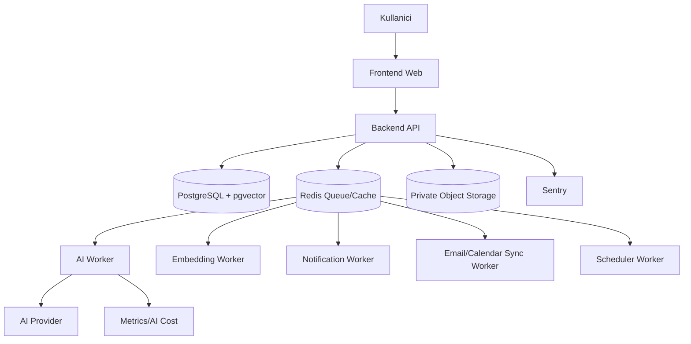
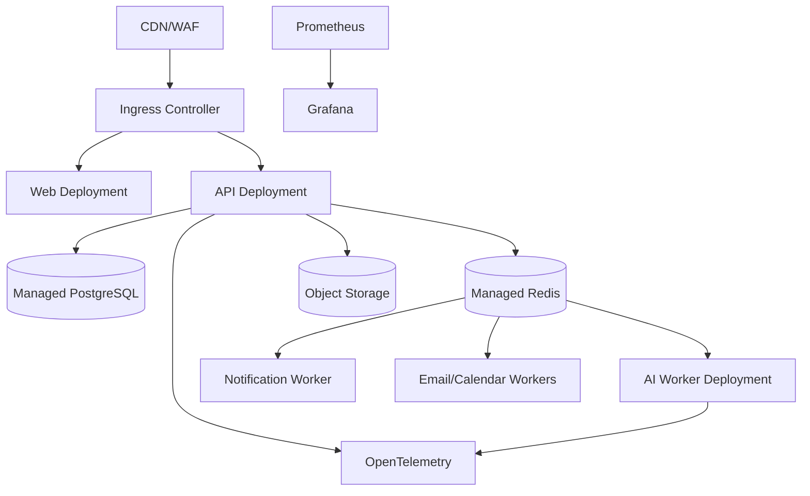
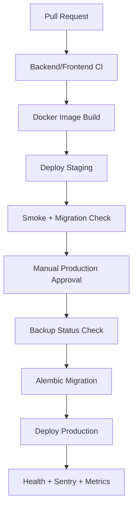
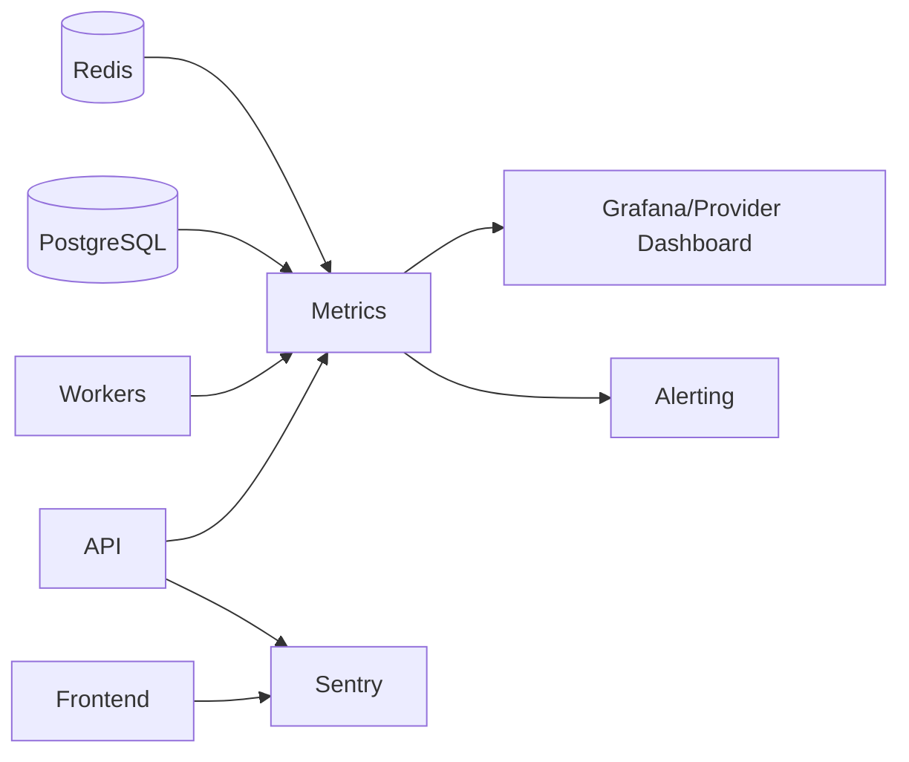

# CILT 10 - DevOps & Deployment Documentation: NeuroDesk AI

Surum: 1.0  
Tarih: 09 Temmuz 2026  
Dil: Turkce  
Dokuman turu: DevOps, Deployment ve Operasyon Dokumani, Cilt 10  
Kapsam: Local development, Docker/Docker Compose tasarimi, CI/CD, GitHub Actions stratejisi, deployment akislari, migration pipeline, monitoring, logging, backup, restore, rollback, cloud/Kubernetes/Terraform fazlari, AI cost monitoring ve operasyonel runbook'lar

> Onemli not: Bu cilt uygulama kodu veya altyapi kodu uretmez. Dockerfile, docker-compose.yml, Kubernetes manifesti, Terraform dosyasi veya GitHub Actions workflow dosyasi bu asamada yazilmamalidir. Bu dokuman, ileride bu dosyalar uretilirken takip edilecek mimari, siralama, kabul kriteri ve operasyonel surecleri tanimlar.

> Sureklilik notu: Cilt 8, DevOps/Cloud/Infrastructure icin hedef mimariyi tanimlamisti. Bu cilt, Cilt 8 ile celismeden daha uygulamaya donuk deployment el kitabi, pipeline sirasi, local development standardi, release/rollback sureci ve operasyon checklist'lerini derinlestirir. Kubernetes manifestleri ve Terraform dosyalari MVP sonrasi fazda ele alinacaktir.

## Icindekiler

1. [Yonetici Ozeti](#1-yonetici-ozeti)
2. [DevOps Vizyonu](#2-devops-vizyonu)
3. [DevOps Ilkeleri](#3-devops-ilkeleri)
4. [Platform Mimarisi](#4-platform-mimarisi)
5. [Deployment Stratejisi](#5-deployment-stratejisi)
6. [Environment Strategy](#6-environment-strategy)
7. [Local Development Ortami](#7-local-development-ortami)
8. [Development Ortami](#8-development-ortami)
9. [Staging Ortami](#9-staging-ortami)
10. [Production Ortami](#10-production-ortami)
11. [Docker Mimarisi](#11-docker-mimarisi)
12. [Docker Compose Mimarisi](#12-docker-compose-mimarisi)
13. [Container Image Stratejisi](#13-container-image-stratejisi)
14. [Container Registry Stratejisi](#14-container-registry-stratejisi)
15. [Kubernetes Mimarisi](#15-kubernetes-mimarisi)
16. [Kubernetes Namespace Stratejisi](#16-kubernetes-namespace-stratejisi)
17. [Kubernetes Workload Tasarimi](#17-kubernetes-workload-tasarimi)
18. [Kubernetes Service ve Ingress Tasarimi](#18-kubernetes-service-ve-ingress-tasarimi)
19. [Kubernetes ConfigMap ve Secret Yonetimi](#19-kubernetes-configmap-ve-secret-yonetimi)
20. [Kubernetes Autoscaling Stratejisi](#20-kubernetes-autoscaling-stratejisi)
21. [Kubernetes Resource Limits](#21-kubernetes-resource-limits)
22. [Kubernetes Health Check Stratejisi](#22-kubernetes-health-check-stratejisi)
23. [Kubernetes Rollout ve Rollback](#23-kubernetes-rollout-ve-rollback)
24. [Cloud Provider Karsilastirmasi](#24-cloud-provider-karsilastirmasi)
25. [AWS Deployment Mimarisi](#25-aws-deployment-mimarisi)
26. [Google Cloud Deployment Mimarisi](#26-google-cloud-deployment-mimarisi)
27. [Azure Deployment Mimarisi](#27-azure-deployment-mimarisi)
28. [MVP Cloud Deployment Onerisi](#28-mvp-cloud-deployment-onerisi)
29. [Production Cloud Deployment Onerisi](#29-production-cloud-deployment-onerisi)
30. [Database Deployment Stratejisi](#30-database-deployment-stratejisi)
31. [PostgreSQL Yonetimi](#31-postgresql-yonetimi)
32. [Redis Yonetimi](#32-redis-yonetimi)
33. [Vector Database Deployment](#33-vector-database-deployment)
34. [Object Storage Deployment](#34-object-storage-deployment)
35. [File Storage ve CDN](#35-file-storage-ve-cdn)
36. [Background Worker Deployment](#36-background-worker-deployment)
37. [AI Worker Deployment](#37-ai-worker-deployment)
38. [Scheduler Deployment](#38-scheduler-deployment)
39. [Notification Worker Deployment](#39-notification-worker-deployment)
40. [Email Sync Worker Deployment](#40-email-sync-worker-deployment)
41. [Calendar Sync Worker Deployment](#41-calendar-sync-worker-deployment)
42. [CI/CD Vizyonu](#42-cicd-vizyonu)
43. [Git Branch Stratejisi](#43-git-branch-stratejisi)
44. [Pull Request Sureci](#44-pull-request-sureci)
45. [Code Review Sureci](#45-code-review-sureci)
46. [GitHub Actions Pipeline](#46-github-actions-pipeline)
47. [Backend CI Pipeline](#47-backend-ci-pipeline)
48. [Frontend CI Pipeline](#48-frontend-ci-pipeline)
49. [Mobile CI Pipeline](#49-mobile-ci-pipeline)
50. [AI Worker CI Pipeline](#50-ai-worker-ci-pipeline)
51. [Docker Image Build Pipeline](#51-docker-image-build-pipeline)
52. [Security Scanning Pipeline](#52-security-scanning-pipeline)
53. [Test Pipeline](#53-test-pipeline)
54. [Staging Deployment Pipeline](#54-staging-deployment-pipeline)
55. [Production Deployment Pipeline](#55-production-deployment-pipeline)
56. [Release Management](#56-release-management)
57. [Versioning Stratejisi](#57-versioning-stratejisi)
58. [Rollback Stratejisi](#58-rollback-stratejisi)
59. [Blue/Green Deployment](#59-bluegreen-deployment)
60. [Canary Deployment](#60-canary-deployment)
61. [Rolling Deployment](#61-rolling-deployment)
62. [Feature Flag Stratejisi](#62-feature-flag-stratejisi)
63. [Infrastructure as Code](#63-infrastructure-as-code)
64. [Terraform Stratejisi](#64-terraform-stratejisi)
65. [Environment Variables Yonetimi](#65-environment-variables-yonetimi)
66. [Secret Management](#66-secret-management)
67. [SSL/TLS Yonetimi](#67-ssltls-yonetimi)
68. [Domain ve DNS Yonetimi](#68-domain-ve-dns-yonetimi)
69. [API Gateway / Reverse Proxy](#69-api-gateway--reverse-proxy)
70. [Nginx / Traefik / Cloud Load Balancer](#70-nginx--traefik--cloud-load-balancer)
71. [Monitoring Mimarisi](#71-monitoring-mimarisi)
72. [Logging Mimarisi](#72-logging-mimarisi)
73. [Distributed Tracing](#73-distributed-tracing)
74. [Observability Stratejisi](#74-observability-stratejisi)
75. [Prometheus](#75-prometheus)
76. [Grafana](#76-grafana)
77. [Sentry](#77-sentry)
78. [ELK / OpenSearch](#78-elk--opensearch)
79. [OpenTelemetry](#79-opentelemetry)
80. [Alerting Stratejisi](#80-alerting-stratejisi)
81. [On-Call Sureci](#81-on-call-sureci)
82. [Incident Management](#82-incident-management)
83. [Backup Stratejisi](#83-backup-stratejisi)
84. [Restore Stratejisi](#84-restore-stratejisi)
85. [Disaster Recovery](#85-disaster-recovery)
86. [Business Continuity](#86-business-continuity)
87. [High Availability](#87-high-availability)
88. [Scalability Strategy](#88-scalability-strategy)
89. [Performance Strategy](#89-performance-strategy)
90. [Cost Management](#90-cost-management)
91. [AI Cost Monitoring](#91-ai-cost-monitoring)
92. [Security Operations](#92-security-operations)
93. [Vulnerability Management](#93-vulnerability-management)
94. [Dependency Management](#94-dependency-management)
95. [Container Security](#95-container-security)
96. [Cloud Security Operations](#96-cloud-security-operations)
97. [Compliance Operations](#97-compliance-operations)
98. [Data Retention Operations](#98-data-retention-operations)
99. [Log Retention Operations](#99-log-retention-operations)
100. [Audit Log Export](#100-audit-log-export)
101. [SLA / SLO / SLI Tanimlari](#101-sla--slo--sli-tanimlari)
102. [Runbook Tasarimlari](#102-runbook-tasarimlari)
103. [Operational Checklists](#103-operational-checklists)
104. [DevOps Riskleri](#104-devops-riskleri)
105. [DevOps Kabul Kriterleri](#105-devops-kabul-kriterleri)
106. [Codex Icin DevOps Uygulama Talimatlari](#106-codex-icin-devops-uygulama-talimatlari)
107. [Codex Icin Sonraki Ciltlere Hazirlik Notlari](#107-codex-icin-sonraki-ciltlere-hazirlik-notlari)

# 1. Yonetici Ozeti

NeuroDesk AI'nin DevOps yaklasimi, hassas veri isleyen AI destekli bir SaaS urununun guvenli, izlenebilir ve geri alinabilir sekilde yayina alinmasini hedefler. MVP asamasinda oncelik, karmasik bir platform kurmak degil, local development'i tek komutla calistirabilmek, backend/frontend/worker servislerini container standardina oturtmak, temel CI pipeline'larini calistirmak, staging ve production ayrimini netlestirmek, migration akisini kontrollu hale getirmek, Sentry ve minimum monitoring ile hatalari yakalamak ve rollback planini yazili hale getirmektir.

Production ve enterprise fazda bu temel; managed PostgreSQL, managed Redis, private object storage, container registry, immutable image tag, security scanning, manual approval'li production deploy, merkezi loglama, Prometheus/Grafana, OpenTelemetry, backup/restore testleri, Kubernetes, Terraform ve SIEM entegrasyonu ile olgunlasir. Kubernetes manifestleri ve Terraform dosyalari MVP baslangicinda yazilmaz; Cilt 8'de tanimlanan hedef mimariye uygun olarak MVP sonrasi production olgunlugu geldiginde devreye alinir.

# 2. DevOps Vizyonu

DevOps vizyonu "hizli ama kontrollu teslimat"tir. NeuroDesk AI'da hiz, ozellikle AI ve entegrasyon ozelliklerinde onemlidir; fakat hiz, guvenlik ve veri butunlugu pahasina olmamalidir. Her deployment izlenebilir, test edilmis, geri alinabilir ve hangi commit'ten uretildigi belli olmalidir.

Vizyonun ana hedefleri:

- Gelistirici onboarding suresini dusurmek.
- Local, staging ve production arasinda environment parity saglamak.
- CI/CD ile insan hatasini azaltmak.
- Production deploy'u manuel onay ve checklist ile guvenceye almak.
- Migration ve rollback risklerini onceden tasarlamak.
- AI maliyetlerini ve worker backlog'unu operasyonel metrik olarak izlemek.
- Hassas verinin log, trace, Sentry ve analytics icine sizmasini engellemek.

# 3. DevOps Ilkeleri

| Ilke | NeuroDesk AI yorumu | MVP | Production / Enterprise |
|---|---|---|---|
| Infrastructure as Code | Ortamlar manuel bilgiye bagli kalmamalidir. | Dokumante edilmis ortam kurulumu | Terraform + review + state security |
| Automation First | Build, test, deploy ve backup otomatiklesir. | CI + staging deploy | Full CD, policy gates |
| Security by Default | Secret repo'ya girmez, least privilege uygulanir. | `.env.example` placeholder | Secret manager, OIDC, KMS |
| Observability First | Calismak yetmez, izlenebilir olmak gerekir. | Sentry + provider metrics | Prometheus, Grafana, tracing, SIEM |
| Immutable Infrastructure | Production sunucuda elle degisiklik yapilmaz. | Image tag ile deploy | GitOps/ArgoCD |
| Environment Parity | Ortamlar benzer davranir. | Docker Compose + staging | Multi-env IaC |
| Safe Deployment | Rollback her zaman mumkun olur. | Manual approval + checklist | Blue/Green, Canary |
| Least Privilege | Servisler minimum yetki alir. | Ayrik env secret'lari | IAM roles, workload identity |
| Cost Awareness | AI ve cloud maliyeti metriklesir. | Budget alert | Per-tenant cost allocation |
| Disaster Preparedness | Backup test edilmeden backup sayilmaz. | Aylik restore testi | RPO/RTO ve DR drill |

# 4. Platform Mimarisi

Platform, dort ana runtime ailesinden olusur: web frontend, backend API, background worker'lar ve data/infra servisleri. Backend API senkron istekleri karsilar; worker processleri AI analiz, embedding, notification, email sync, calendar sync ve scheduler gibi asenkron isleri yurutur. Worker processleri ayni backend image uzerinden farkli command'larla calistirilmalidir; bu, dependency ve release uyumunu korur.

# 5. Deployment Stratejisi

Deployment stratejisi fazlara ayrilir:

| Faz | Hedef | Yaklasim |
|---|---|---|
| Local | Gelistirici tek komutla calisir | Docker Compose |
| MVP Dev/Staging | Hizi ve guvenli dogrulamayi saglar | Managed PaaS veya basit container hosting |
| MVP Production | Kucuk ekip icin operasyonel olarak sade | Managed PostgreSQL/Redis/Object Storage, manual approval |
| Scale Production | Trafik ve musteri sayisi artar | Kubernetes, centralized observability |
| Enterprise | Compliance ve izolasyon gerekir | Terraform, dedicated tenant, SIEM, CMK, DR drill |

Siralama net olmalidir: once local Docker Compose, sonra backend production-ready Dockerfile, sonra frontend production-ready Dockerfile, sonra worker command standardi, sonra `.env.example`, sonra CI workflow'lari, sonra image build, staging deploy, manual approval'li production deploy.

# 6. Environment Strategy

| Ortam | Amac | Kullanici | Veri | Deployment | Secret | Monitoring | Backup |
|---|---|---|---|---|---|---|---|
| Local | Gelistirme | Gelistirici | Seed/mock | Docker Compose | `.env` local, gercek secret yok | Konsol + opsiyonel Sentry disabled | Gerekmez |
| Development | Entegrasyon | Ekip | Test verisi | Otomatik veya manuel dev deploy | Dev secret manager | Temel log | Opsiyonel |
| Staging | Release provasi | Ekip/QA | Sentetik veya anonim | CI/CD staging | Staging secret manager | Sentry + metrics | Evet |
| Production | Gercek kullanim | Musteri | Gercek veri | Manual approval | Production secret manager | Tam izleme | Zorunlu |
| Enterprise Dedicated | Izole musteri | Kurumsal musteri | Musteri verisi | IaC/GitOps | Musteri/tenant bazli | SIEM dahil | SLA bazli |

Environment parity icin servis isimleri, env variable isimleri, health check path'leri, migration komutlari, queue isimleri ve object storage davranisi ortamlar arasinda ayni kalmalidir. Farkliliklar yalnizca kapasite, secret degeri, provider endpoint'i ve feature flag seviyesinde olmalidir.

# 7. Local Development Ortami

Local ortam Docker Compose ile kurulmalidir. Amac, yeni gelistiricinin backend, frontend, PostgreSQL, Redis, MinIO, worker'lar, mail test araci ve mock provider'lari hizla ayaga kaldirmasidir.

Local servisler:

| Servis | Amac | Port | Bagimlilik | Health check | Production karsiligi |
|---|---|---|---|---|---|
| backend-api | API gelistirme | 8000/benzeri | postgres, redis, minio | `/health` | API service |
| frontend-web | Next.js web | 3000/benzeri | backend-api | HTTP root/build check | Web service/CDN |
| postgres | Iliskisel DB + pgvector | 5432 | volume | connection check | Managed PostgreSQL |
| redis | Cache/queue | 6379 | volume opsiyonel | ping | Managed Redis |
| minio | S3 uyumlu local object storage | 9000/9001 | volume | bucket check | S3/R2/GCS |
| ai-worker | AI jobs | internal | redis, backend env | worker heartbeat | Worker deployment |
| notification-worker | Bildirim jobs | internal | redis, mailpit | queue heartbeat | Worker deployment |
| scheduler-worker | Zamanlanmis isler | internal | redis, postgres | scheduler heartbeat | Scheduler |
| email-worker | Mail sync test | internal | mock/mailpit | queue heartbeat | Email sync worker |
| calendar-worker | Calendar sync test | internal | mock provider | queue heartbeat | Calendar sync worker |
| mailpit | Local e-posta yakalama | 8025/1025 | yok | HTTP check | Email provider |

Local komutlar dokumanda aciklama seviyesinde yer alabilir: compose ayaga kaldirma, migration calistirma, seed data yukleme, test calistirma, worker log izleme. Ancak bu ciltte Docker Compose dosyasi veya komut script'i uretilmez.

# 8. Development Ortami

Development ortami ekip ici entegrasyon alanidir. Bu ortamda feature branch'ler veya develop branch'i uzerinden erken entegrasyon denenir. Gercek kullanici verisi bulunmamalidir. OAuth, mail ve calendar icin test uygulamalari kullanilmalidir.

Development ortaminda otomatik deploy yapilabilir; ancak bu ortam production dogrulamasi yerine gecmez. Monitoring seviyesi temel log ve hata takibi ile sinirli olabilir. AI provider kullanimi dusuk kota ve test key ile yapilmalidir.

# 9. Staging Ortami

Staging production'a en yakin ortamdir. Release oncesi son dogrulama burada yapilir. Staging ortaminda production'a benzer service topology, environment variable isimleri, migration akisi, object storage davranisi ve monitoring bulunmalidir.

Staging kurallari:

- Production verisi dogrudan kullanilmaz; anonim veya sentetik veri tercih edilir.
- Her release staging'e deploy edilir.
- Backend health check, frontend smoke test ve worker queue check gecmeden production onayi verilmez.
- Alembic migration staging'de once denenir.
- Sentry environment ayrimi `staging` olarak yapilir.

# 10. Production Ortami

Production gercek kullanici verisinin bulundugu tek ortamdir. Production deploy manual approval gerektirir. Production'a elle dosya kopyalama, SSH ile manuel degisiklik veya database uzerinde plansiz migration calistirma yasaklanmalidir.

Production bilesenleri: load balancer, web frontend, backend API, worker processleri, managed PostgreSQL, managed Redis, private object storage, Sentry, log/metric toplama, backup, alerting ve secret manager.

# 11. Docker Mimarisi

Backend icin production-ready Dockerfile ileride multi-stage, minimal base, non-root user, dependency cache ve runtime optimizasyonu ile hazirlanmalidir. Production'da Gunicorn + Uvicorn worker modeli degerlendirilebilir. Development image'i hot reload icerebilir; production image'i yalnizca runtime gereksinimlerini icermelidir.

Frontend icin production-ready Dockerfile, Node build stage ve kucuk runtime image prensibiyle tasarlanmalidir. Next.js standalone output kullanimi degerlendirilmelidir. Static asset'ler CDN ile uyumlu uretilmelidir.

Worker'lar backend image'i uzerinden farkli command'larla calistirilmalidir. AI worker, scheduler, notification worker, email sync worker ve calendar sync worker icin ayrik image uretmek yerine ayni release artifact kullanmak versiyon tutarliligi saglar.

# 12. Docker Compose Mimarisi

Compose dosya ailesi ileride su mantikla ayrilmalidir:

- Ana compose tanimi: ortak servis topolojisi.
- Local override: hot reload, local volume, debug ayarlari.
- Test compose: izole test DB/Redis ve CI uyumu.
- Production compose: yalnizca kucuk MVP deployment icin, Kubernetes oncesi gecici secenek.

Compose servisleri icin tasarim kriterleri: servis amaci, port, env variable seti, dependency, volume, health check, local-only olup olmadigi ve production karsiligi yazili olmalidir. Compose local ortami uretir; production standardinin birebir kopyasi degildir, fakat davranis olarak mumkun oldugunca benzer kalmalidir.

# 13. Container Image Stratejisi

Image tag'leri immutable olmalidir. Production'da `latest` kullanilmaz. Onerilen tag'ler:

- Commit SHA tag'i: her build izlenebilir olur.
- Semantic version: release icin.
- Release candidate tag: staging icin.
- Branch tag: sadece dev/test icin.

Image metadata'sinda commit SHA, build time, repository ve version bilgisi bulunmalidir. Image scan sonucunda Critical bulgu varsa production deploy durmalidir.

# 14. Container Registry Stratejisi

Registry secenekleri GitHub Container Registry, AWS ECR, GCP Artifact Registry, Azure Container Registry veya cloud provider registry'sidir. MVP icin GitHub Container Registry yeterli olabilir. Enterprise/production fazda cloud-native registry IAM, vulnerability scanning ve regional replication avantajlariyla tercih edilebilir.

Registry erisimi least privilege ile sinirlanir. CI image push yapabilir; runtime ortam image pull yapabilir. Developer makineleri production image push yetkisine sahip olmamalidir.

# 15. Kubernetes Mimarisi

Kubernetes MVP baslangicinda zorunlu degildir. MVP sonrasi, worker sayisi, traffic, enterprise beklentisi ve otomatik scaling ihtiyaci arttiginda devreye alinmalidir. Kubernetes manifestleri bu ciltte yazilmaz; sadece hedef mimari tanimlanir.

# 16. Kubernetes Namespace Stratejisi

Namespace'ler ortam ve fonksiyon bazli ayrilmalidir. Basit baslangic: `neurodesk-dev`, `neurodesk-staging`, `neurodesk-prod`, `monitoring`, `ingress`, `security`. Daha olgun yapida production app namespace'i, worker namespace'i ve observability namespace'i ayrilabilir.

Network policy ile app, worker, data ve observability trafikleri sinirlanmalidir. Enterprise dedicated tenant icin namespace, cluster veya database seviyesinde izolasyon degerlendirilir.

# 17. Kubernetes Workload Tasarimi

Workload'lar: API deployment, web deployment, AI worker, embedding worker, notification worker, scheduler, email sync worker, calendar sync worker, analytics worker. Worker processleri servis gerektirmeyebilir; queue uzerinden is alirlar. Scheduler tek aktif instance veya leader election ile calismalidir.

# 18. Kubernetes Service ve Ingress Tasarimi

Ingress hostlari: `app.neurodesk.ai`, `api.neurodesk.ai`, `admin.neurodesk.ai`, `webhook.neurodesk.ai`. Worker'lar disariya acilmaz. Webhook endpointleri signature validation gerektirir. Internal service isimleri ortamlar arasinda tutarli olmalidir.

# 19. Kubernetes ConfigMap ve Secret Yonetimi

ConfigMap yalnizca hassas olmayan config icindir. Secret degerleri Kubernetes Secret icinde bile duz yonetilmemeli; External Secrets Operator, cloud secret manager veya Vault ile entegre edilmelidir. Production secret'lari Git reposuna yazilmaz. Sealed secret gibi cozumler degerlendirilebilir ancak ana ilke secret'in plain text repo'da olmamasidir.

# 20. Kubernetes Autoscaling Stratejisi

API CPU/memory ve request latency sinyalleriyle yatay olceklenir. Worker'lar queue length, oldest job age, job duration ve failure rate sinyalleriyle olceklenmelidir. AI worker icin AI provider latency ve token throughput da izlenir. Cluster autoscaler node sayisini artirabilir; worker node pool'u API node pool'undan ayrilabilir.

# 21. Kubernetes Resource Limits

Her workload icin CPU/memory request ve limit tanimlanmalidir. API icin dusuk latency, worker icin job throughput, AI/transcription icin daha yuksek memory/CPU ihtiyaci ayrica degerlendirilir. Limitler monitoring verisine gore duzenli ayarlanir.

# 22. Kubernetes Health Check Stratejisi

Health check endpointleri minimum olarak API icin `/health`, readiness icin DB/Redis baglanti durumunu dogrulayan daha derin bir endpoint ve worker heartbeat metrikleri seklinde planlanmalidir. Liveness, readiness ve startup probe farkli amaclara hizmet eder; readiness basarisizsa trafik kesilmeli, liveness basarisizsa pod yeniden baslatilmalidir.

# 23. Kubernetes Rollout ve Rollback

Rolling update varsayilan olabilir. Rollback icin onceki image tag'i ve migration uyumlulugu bilinmelidir. Backward incompatible migration varsa rollback yalnizca uygulama image'ini geri almakla tamamlanmaz; bu nedenle migration pipeline expand-contract prensibine gore tasarlanmalidir.

# 24. Cloud Provider Karsilastirmasi

| Provider | Avantaj | Dezavantaj | Oneri |
|---|---|---|---|
| AWS | RDS, ElastiCache, S3, EKS/ECS, WAF, KMS olgun | Maliyet ve karmasiklik yuksek | Production/enterprise guclu aday |
| GCP | Cloud Run, GKE, Cloud SQL, AI/data ekosistemi | Kurumsal beklentiye gore degisir | AI/data agirlikli buyume |
| Azure | Microsoft 365/Entra ID uyumu, AKS, Key Vault | Konfigurasyon karmasikligi | Microsoft entegrasyonlu musteriler |
| DigitalOcean | Basit, MVP dostu managed servisler | Enterprise derinligi sinirli | MVP icin guclu aday |
| Render/Railway/Fly.io | Hizli kurulum, dusuk operasyon | Compliance/scale sinirli olabilir | Demo/MVP baslangici |

# 25. AWS Deployment Mimarisi

AWS hedef mimaride CloudFront/WAF, ALB, ECS veya EKS, RDS PostgreSQL, ElastiCache Redis, S3, Secrets Manager, KMS, CloudWatch ve ECR kullanilabilir. MVP icin ECS Fargate EKS'e gore daha dusuk operasyon yuku saglayabilir; enterprise ve complex worker scaling durumunda EKS degerlendirilir.

# 26. Google Cloud Deployment Mimarisi

GCP'de Cloud Run, Cloud SQL, Memorystore, Cloud Storage, Secret Manager, Artifact Registry ve GKE secenekleri vardir. Cloud Run MVP icin sade bir container deploy deneyimi saglar; GKE daha ileri orchestration ihtiyacinda devreye girer.

# 27. Azure Deployment Mimarisi

Azure, Microsoft Graph, Outlook, Calendar ve Entra ID entegrasyonlari nedeniyle kurumsal musterilerde stratejik avantaj saglayabilir. AKS, Azure Database for PostgreSQL, Azure Cache for Redis, Blob Storage, Key Vault ve Application Insights kullanilabilir.

# 28. MVP Cloud Deployment Onerisi

MVP icin onerilen sade yapi: frontend Vercel/Render, backend Render/Fly.io/DigitalOcean, managed PostgreSQL, managed Redis, S3 veya Cloudflare R2, Sentry, provider logs ve temel uptime monitoring. Bu fazda Kubernetes ve Terraform zorunlu degildir; dokumante edilmis manuel adimlar ve CI/CD yeterli olabilir.

# 29. Production Cloud Deployment Onerisi

Production buyume fazinda managed database, managed Redis, private object storage, container registry, autoscaling, central monitoring, backup/restore, WAF/CDN ve secret manager zorunlu hale gelir. AWS veya Azure birincil adaydir; secim musteri profili, ekip uzmanligi, maliyet ve compliance gereksinimine gore yapilir.

# 30. Database Deployment Stratejisi

Database icin managed PostgreSQL tercih edilmelidir. Pgvector kullanimi planlandigi icin extension destegi dogrulanmalidir. Migration'lar production deploy oncesi kontrollu calistirilir. Alembic migration pipeline'i staging'de dogrulanmadan production'a gecmez.

# 31. PostgreSQL Yonetimi

PostgreSQL icin backup, PITR, connection pooling, slow query logging, index review, migration review ve disk usage alertleri gerekir. Migration stratejisi:

1. Migration PR'da review edilir.
2. Staging'de migration calisir.
3. Backward compatibility kontrol edilir.
4. Production deploy oncesi Alembic migration manual approval sonrasi calisir.
5. Migration sonucu health check ve smoke test ile dogrulanir.

# 32. Redis Yonetimi

Redis cache, queue, rate limit ve session/ephemeral state icin kullanilabilir. Cache verisi yeniden uretilebilir, fakat queue ve rate limit verisi operasyonel etki yaratabilir. Redis memory usage, evictions, queue length ve command latency izlenmelidir.

# 33. Vector Database Deployment

MVP'de PostgreSQL + pgvector tercih edilebilir. Ayrik vector database (Qdrant/Pinecone/Weaviate) ancak performans, scale veya operasyonel ihtiyac belirginlestiginde degerlendirilmelidir. Her vector query tenant_id filtresiyle calismalidir.

# 34. Object Storage Deployment

Object storage private olmalidir. Dosya indirme/yukleme signed URL ile yapilmalidir. Public bucket yasaktir. Bucket versioning, lifecycle policy, malware scan ve retention policy production icin degerlendirilir.

# 35. File Storage ve CDN

Statik frontend asset'leri CDN uzerinden sunulabilir. Kullanici dosyalari public CDN asset'i gibi ele alinmaz; signed URL, kisa TTL ve authorization kontrolu gerekir. CDN cache key'leri tenant verisi sizdirmayacak sekilde tasarlanir.

# 36. Background Worker Deployment

Worker'lar API'den bagimsiz olceklenir. Ayni backend image uzerinden farkli command'larla calisir. Her worker tipi icin queue, concurrency, retry, dead-letter, timeout ve idempotency stratejisi tanimlanmalidir.

# 37. AI Worker Deployment

AI worker, ozetleme, gorev/randevu cikarimi, chat/RAG yardimci islemleri ve model provider cagrilarini yurutur. AI cost metrics, token usage, provider latency, provider error rate ve low-confidence rate izlenmelidir. Prompt ve response loglari Cilt 9 politikalarina uygun olarak maskelenmelidir.

# 38. Scheduler Deployment

Scheduler reminder, retention jobs, sync jobs ve cleanup processlerini tetikler. Aynı anda birden fazla scheduler calismasi duplicate is yaratabilir; leader election, distributed lock veya single replica politikasi gerekir.

# 39. Notification Worker Deployment

Notification worker push, e-posta, SMS ve uygulama ici bildirimleri isler. Provider rate limit, retry, dead-letter ve delivery status izlenir. Bildirim iceriginde hassas veri minimum tutulur.

# 40. Email Sync Worker Deployment

Email sync worker OAuth token kullanir; token degeri loglanmaz. Sync incremental olmalidir. Provider rate limit, mailbox boyutu, retry storm ve consent revoke durumlari ele alinmalidir.

# 41. Calendar Sync Worker Deployment

Calendar sync worker read/write izinlerini ayri ele alir. AI tarafindan onerilen etkinlikler kullanici onayi olmadan yazilmaz. Calendar provider rate limit ve webhook event tekrarlarina karsi idempotency gerekir.

# 42. CI/CD Vizyonu

CI/CD'nin hedefi her degisikligin test edilmis, izlenebilir ve geri alinabilir sekilde ilerlemesidir. Pipeline'lar hizli feedback verir, staging'e guvenli cikis saglar ve production deploy'u manual approval ile sinirlar.

# 43. Git Branch Stratejisi

Onerilen strateji:

- `main`: production'a aday stabil branch.
- `create-ciltX` veya feature branch: dokuman/ozellik calismalari.
- Pull request zorunlu.
- Main'e merge sonrasi staging veya production pipeline tetiklenebilir.

Kod fazinda branch protection, required checks ve linear history degerlendirilmelidir.

# 44. Pull Request Sureci

Her PR amac, kapsam, test kaniti, migration etkisi, env variable etkisi, rollback notu ve guvenlik etkisi icermelidir. Dokuman PR'lari icin markdown linkleri ve README indeksi kontrol edilir. Kod PR'lari icin CI gecmeden merge yapilmaz.

# 45. Code Review Sureci

Review yalnizca stil degil, davranis ve operasyon etkisi uzerinden yapilir. Backend review migration, auth, tenant isolation ve loglama riskine bakar. Frontend review token handling ve hata durumlarini kontrol eder. DevOps review secret, deployment ve rollback etkisini inceler.

# 46. GitHub Actions Pipeline

GitHub Actions dosyalari bu ciltte yazilmaz; hazirlanacak workflow sirasi ve sorumluluklari tanimlanir:

1. Backend CI workflow.
2. Frontend CI workflow.
3. Docker image build workflow.
4. Staging deployment workflow.
5. Production deployment workflow, manual approval ile.

Workflow'lar OIDC/secrets, branch protection, environment protection rules ve artifact retention ile guvenli tasarlanmalidir.

# 47. Backend CI Pipeline

Backend CI asamalari: dependency install, lint, format check, type check, unit test, integration test, migration dry-run/check, security scan ve artifact metadata. PostgreSQL migration dosyalari PR'da review edilir. Test DB sentetik ve ephemeral olmalidir.

# 48. Frontend CI Pipeline

Frontend CI asamalari: dependency install, lint, type check, unit/component test, production build, bundle size kontrolu, basic accessibility smoke, Sentry source map stratejisi kontrolu. Gercek secret build-time env icine gomulmemelidir.

# 49. Mobile CI Pipeline

Mobil fazda Flutter analyze, test, build, signing secret management ve crash reporting config kontrolu gerekir. MVP web/backend oncelikli oldugu icin mobile CI Cilt 7 planina gore sonraki fazda devreye girebilir.

# 50. AI Worker CI Pipeline

AI worker CI, backend testlerine ek olarak prompt regression, prompt injection test corpus, provider adapter mock testleri, token budget testleri ve queue idempotency testlerini icermelidir.

# 51. Docker Image Build Pipeline

Image build pipeline backend ve frontend image'larini commit SHA ile uretir, vulnerability scan yapar, SBOM opsiyonel uretir ve registry'ye push eder. Worker image'i backend image ile aynidir; farkli command runtime config ile belirlenir.

# 52. Security Scanning Pipeline

Security scanning: secret scan, dependency scan, SAST, container scan ve IaC scan. Critical bulgu varsa production deploy bloklanir. False positive'ler gerekceli ve sureli exception ile kaydedilir.

# 53. Test Pipeline

Test pipeline katmanlari:

- Unit test: hizli feedback.
- Integration test: DB/Redis/provider mock.
- Contract test: API response ve provider adapter.
- E2E smoke: staging release oncesi.
- Security regression: tenant isolation, auth, prompt injection.

# 54. Staging Deployment Pipeline

Staging pipeline image'i staging'e deploy eder, Alembic migration'i staging DB'de calistirir, health check, smoke test, worker queue check ve Sentry release kaydi yapar. Basarisizsa production onayi acilmaz.

# 55. Production Deployment Pipeline

Production pipeline manual approval gerektirir. Approval oncesi checklist: staging basarili, migration sonucu biliniyor, rollback plan yazili, backup durumu saglam, critical alert yok, env variable degisikligi review edildi. Alembic migration production deploy oncesi dikkatli ve kontrollu calistirilir. Deploy sonrasi health check, smoke test, queue metric ve Sentry error rate izlenir.

# 56. Release Management

Release bir commit SHA, image tag, migration seti, env variable degisikligi, feature flag durumu ve rollback notundan olusur. Release notlari kullanici etkisini, yeni ozellikleri, riskleri ve operasyonel notlari icermelidir.

# 57. Versioning Stratejisi

Semantic versioning production release'leri icin kullanilabilir. Internal image'lar commit SHA ile takip edilir. Release candidate tag'leri staging icin kullanilir. Mobil uygulama surumleri app store/release cycle nedeniyle ayrica yonetilir.

# 58. Rollback Stratejisi

Rollback README ve release dokumaninda acik yazilmalidir. Basit rollback: onceki image tag'ine donmek. Zor rollback: migration geri alinamiyorsa forward fix veya compatibility layer gerekir. Bu nedenle migration'lar expand-contract modeline uygun yazilmalidir: once geriye uyumlu alan eklenir, uygulama gecirilir, sonra eski alan kaldirilir.

Rollback tetikleyicileri: error rate spike, API down, critical job failure, migration failure, auth/login bozulmasi, AI maliyet patlamasi, cross-tenant risk sinyali.

# 59. Blue/Green Deployment

Blue/Green, iki production ortamindan birini aktif tutup yenisini pasif ortamda dogrulamayi saglar. Kucuk MVP icin fazla maliyetli olabilir; enterprise veya yuksek trafikte kesintisiz deploy icin degerlendirilir.

# 60. Canary Deployment

Canary, yeni surumu kullanicilarin kucuk yuzdesine acar. API error rate, latency, Sentry issue ve business metric izlenir. AI ozellikleri icin canary cok degerlidir; model/prompt degisikligi tum kullanicilara ayni anda acilmamalidir.

# 61. Rolling Deployment

Rolling deployment Kubernetes'in varsayilan guvenli secenegidir. Readiness check dogru degilse risklidir; yeni pod hazir olmadan trafik almamalidir. DB migration uyumlulugu rolling deployment icin kritik kosuldur.

# 62. Feature Flag Stratejisi

Feature flag'ler riskli ozellikleri kademeli acmak icin kullanilir. AI provider degisikligi, yeni prompt versiyonu, mail write ozelligi, calendar write ozelligi ve enterprise policy kontrolleri flag ile acilmalidir. Flag state'i environment ve tenant bazli olabilir.

# 63. Infrastructure as Code

IaC production olgunlugunda zorunludur; ancak MVP baslangicinda dokumante edilmis managed servis kurulumu yeterli olabilir. IaC'nin hedefi manuel drift'i azaltmak, review edilebilir degisiklik saglamak ve DR sirasinda ortam yeniden kurabilmektir.

# 64. Terraform Stratejisi

Terraform dosyalari MVP sonrasi production fazinda olusturulmalidir. State dosyasi encrypted remote backend'de tutulur. State icinde secret bulunabilecegi unutulmaz. Workspace veya environment folder ayrimi net tasarlanir. DNS, bucket, database, registry, IAM ve monitoring kaynaklari Terraform ile yonetilebilir.

# 65. Environment Variables Yonetimi

`.env.example` mutlaka olusturulmalidir ve gercek secret icermemelidir. Env variable'lar kategori bazli belgelenir: app config, database, Redis, object storage, OAuth, AI provider, email, Sentry, security, feature flags. Her variable icin zorunlu/opsiyonel, ortam, aciklama ve secret olup olmadigi belirtilir.

Sentry icin environment degiskenleri: DSN, environment, release, traces sample rate ve PII scrubbing davranisi dokumante edilmelidir. Degerler gercek secret olarak repo'ya yazilmaz.

# 66. Secret Management

Secret'lar GitHub repository, Docker image, frontend bundle, log veya dokuman icine yazilmaz. Local `.env` gelistirici tarafindan doldurulur. Staging/production secret'lari GitHub Environment Secrets, cloud secret manager veya Vault ile saklanir. Production secret erisimi auditlenir ve rotasyon planlanir.

# 67. SSL/TLS Yonetimi

TLS zorunludur. TLS 1.2 minimum, TLS 1.3 onerilir. Sertifika auto-renew olmalidir. HSTS production'da etkinlestirilir. Internal TLS/mTLS Kubernetes/service mesh fazinda degerlendirilir. Sertifika expiration alert'i critical seviyeye yakin olmalidir.

# 68. Domain ve DNS Yonetimi

Domain stratejisi: `app.neurodesk.ai`, `api.neurodesk.ai`, `admin.neurodesk.ai`, `webhook.neurodesk.ai`, `docs.neurodesk.ai`, `status.neurodesk.ai`. DNS Cloudflare gibi bir provider uzerinden yonetilebilir. Production DNS degisiklikleri PR/review ve change window gerektirir.

# 69. API Gateway / Reverse Proxy

MVP'de platform load balancer veya reverse proxy yeterlidir. Production olgunlugunda API Gateway auth, rate limiting, request size, CORS, WAF entegrasyonu ve webhook route ayrimi icin kullanilabilir. Uygulama seviyesindeki authz kontrollerinin yerine gecmez.

# 70. Nginx / Traefik / Cloud Load Balancer

Nginx ve Traefik Kubernetes/VM ortaminda reverse proxy ve ingress icin adaydir. Cloud Load Balancer managed operasyon kolayligi saglar. MVP'de managed load balancer tercih edilmelidir; self-managed proxy ancak gereklilik dogdugunda kullanilmalidir.

# 71. Monitoring Mimarisi

Minimum viable monitoring: uptime check, API latency/error rate, DB connection/disk, Redis memory, worker queue backlog, Sentry error rate, AI provider error/latency ve AI cost metric. Bu metrikler MVP'de bile baslatilmalidir.

# 72. Logging Mimarisi

Structured JSON logs onerilir. Her logda timestamp, environment, service, level, request_id, trace_id, tenant_id, endpoint, status_code, duration_ms ve error_code bulunabilir. Loglarda password, access token, refresh token, OAuth token, API key, full mail body, full transcription, payment card data ve sensitive document content bulunmamalidir.

Log maskelenme kontrolleri CI ve runtime seviyesinde eklenmelidir. Sentry ve log pipeline PII scrubbing ile calismalidir.

# 73. Distributed Tracing

OpenTelemetry ile login, AI analysis job, email sync, calendar sync, notification delivery, AI Chat RAG flow, file upload, data export ve payment webhook akislari trace edilebilir. Trace ID API'den worker job'ina tasinmalidir.

# 74. Observability Stratejisi

Observability metrics, logs ve traces'in birlikte yorumlanmasidir. Bir incident sirasinda su sorulara hizli cevap verilmelidir: hangi servis bozuldu, hangi tenantlar etkilendi, hangi release'ten sonra basladi, queue backlog ne durumda, AI provider hatasi mi var, rollback gerekli mi?

# 75. Prometheus

Prometheus MVP'de zorunlu olmayabilir; production ve Kubernetes fazinda ana metrics toplama katmani olur. API, worker, Redis exporter, PostgreSQL exporter ve custom AI cost exporter benzeri metrik kaynaklari planlanir.

# 76. Grafana

Grafana dashboard'lari: API health, DB health, Redis/queue, worker throughput, AI cost, provider latency, notification delivery, deployment health ve SLO dashboard. Dashboard'lar release sirasinda kontrol edilen operasyon ekranlari olmalidir.

# 77. Sentry

Sentry backend exception, frontend error, mobile crash, performance tracing ve release tracking icin kullanilir. PII scrubbing aktif olmalidir. Source map yukleme guvenli yapilmalidir. Sentry environment `local`, `development`, `staging`, `production` olarak ayrilmalidir.

# 78. ELK / OpenSearch

Merkezi loglama icin ELK/OpenSearch veya Loki degerlendirilebilir. Cilt 8'de Grafana ekosistemiyle Loki onerilmisti; bu ciltte ELK/OpenSearch alternatif olarak ele alinir. Secim ekip deneyimi, maliyet, sorgu ihtiyaci ve retention gereksinimine gore yapilir.

# 79. OpenTelemetry

OpenTelemetry vendor-neutral trace/metric/log standardi olarak tercih edilmelidir. Provider bagimsiz kalmak, ileride Grafana Tempo, Jaeger, Datadog veya cloud-native tracing arasinda gecisi kolaylastirir.

# 80. Alerting Stratejisi

Alert seviyeleri Low, Medium, High, Critical olarak ayrilir. Critical alertler: API down, DB connection failure, queue backlog critical, AI provider tamamen basarisiz, backup failure, production deploy failure, cross-tenant access attempt, SSL expiration yaklasmasi. Alert fatigue'i onlemek icin actionable olmayan alertler dashboard metriği olarak kalmalidir.

# 81. On-Call Sureci

MVP'de resmi 7/24 on-call olmayabilir; ancak production icin incident sahibi belirlenmelidir. Enterprise'da on-call rotasyonu, escalation path, response time hedefi ve postmortem sureci tanimlanir.

# 82. Incident Management

Incident sureci detection, triage, containment, remediation, recovery, communication ve postmortem adimlarindan olusur. Security incident'larda Cilt 9 incident response politikasi izlenir. Deployment incident'larda rollback runbook'u uygulanir.

# 83. Backup Stratejisi

Backup kapsami: PostgreSQL, object storage, gerekli ise Redis, vector data, configuration, Terraform state, audit logs ve AI memory data. PostgreSQL icin daily full backup, PITR, encryption ve restore testi gerekir. Object storage icin versioning/lifecycle policy ve accidental delete protection degerlendirilir.

# 84. Restore Stratejisi

Restore sureci once staging'de denenir. Adimlar: ihtiyac belirleme, etki analizi, backup secimi, staging restore, production plan onayi, maintenance duyurusu gerekirse, restore, data integrity check, health check, postmortem. MVP icin aylik restore testi; enterprise icin SLA'ya gore daha sik test onerilir.

# 85. Disaster Recovery

DR senaryolari: DB corruption, region outage, object storage sorunu, Kubernetes cluster failure, DNS failure, secret leak, AI provider outage, payment provider outage, accidental deletion, DDoS. DR kontrolleri: automated backup, cross-region backup, IaC, restore runbook, DNS failover, provider fallback ve degraded mode.

# 86. Business Continuity

AI provider kapaliysa manuel gorev/randevu sistemi calismaya devam etmelidir. Mail sync bozuksa mevcut veriler okunabilmelidir. Notification provider arizaliysa retry ve fallback uygulanir. Semantic search kapaliysa klasik arama calisabilir.

# 87. High Availability

Production'da API birden fazla replica, worker birden fazla replica, managed HA PostgreSQL, managed HA Redis, provider HA object storage ve load balancer bulunmalidir. Single point of failure analizi DB, Redis, AI provider, SMTP provider, object storage, DNS, CI/CD ve secret manager icin yapilir.

# 88. Scalability Strategy

API ve worker'lar horizontal scaling ile buyur. Database vertical scaling ve read replica ile buyuyebilir. Worker scaling queue backlog ve oldest job age ile yapilir. Email sync, embedding ve analytics batch isleri kontrollu concurrency ile calismalidir.

# 89. Performance Strategy

Hedefler: API endpointlerinin cogunda p95 300-800ms, AI chat 1-5 saniye, semantic search 1-3 saniye, background job'lar icin queue backlog kontrolu. Optimization alanlari: index tuning, connection pooling, Redis cache, CDN, pagination, async processing, provider rate limit yonetimi ve vector index tuning.

# 90. Cost Management

Maliyet kalemleri compute, DB, Redis, object storage, bandwidth, vector DB, AI provider, STT provider, email/SMS provider, monitoring/logging, CI/CD minutes, backup ve CDN'dir. Dev ortam auto-sleep, storage lifecycle, log retention, AI token limit, budget alert ve per-tenant cost tracking uygulanmalidir.

# 91. AI Cost Monitoring

AI cost metrics zorunlu operasyon metriğidir. Toplanacak alanlar: model, tenant, user, feature, prompt token, completion token, embedding count, transcription minute, request count, latency, provider error, estimated cost. Cost spike alertleri tenant ve feature bazinda calismalidir.

# 92. Security Operations

Production erisimi MFA ve least privilege ile sinirlanir. SSH/shell erisimi istisnai olmalidir. Production DB erisimi onayli ve auditli olur. Secret rotation, dependency patching, container scan, WAF, DDoS protection ve security alerting uygulanir.

# 93. Vulnerability Management

Vulnerability sureci: scan, triage, severity, owner, remediation, verification. Critical aciklar 24-72 saat icinde, High aciklar 7 gun icinde ele alinmalidir. Exception'lar sureli ve gerekceli olur.

# 94. Dependency Management

Backend, frontend, mobile ve DevOps action dependency'leri lockfile ile yonetilir. Dependabot veya benzeri araclarla update PR'lari acilir. Major update'ler staging'de test edilir. Kullanilmayan paketler kaldirilir.

# 95. Container Security

Minimal base image, non-root user, image scan, immutable tag, no secret in image, pinned dependency, read-only filesystem ve capability drop degerlendirilir. Production image'i debug tool ve gereksiz package icermemelidir.

# 96. Cloud Security Operations

Cloud IAM least privilege, MFA, audit logs, private networking, encrypted storage, security group hardening, WAF ve secret manager ile korunur. Manual cloud console degisiklikleri change record olmadan yapilmamalidir.

# 97. Compliance Operations

KVKK/GDPR operasyonlari: data export jobs, data deletion jobs, consent record, retention jobs, audit log retention, subprocessor record, privacy request SLA ve backup deletion propagation. Bu operasyonlar Cilt 9 ile uyumlu olmalidir.

# 98. Data Retention Operations

Retention job'lari veri tipine gore calisir: raw audio, transcription, mail content, AI analysis, notification logs, refresh token, export files, backup. Retention degisikligi product, legal/security ve DevOps review gerektirir.

# 99. Log Retention Operations

Application logs 30-90 gun, security logs daha uzun, audit logs yasal/kurumsal gereksinime gore saklanir. Debug logs production'da kapali veya cok kisa sureli olmalidir. AI provider logs maskeli ve kisa retention ile tutulur.

# 100. Audit Log Export

Enterprise musteriler audit log export isteyebilir. Export tenant-scoped, maskeli ve imzali/signed delivery ile yapilmalidir. SIEM hedefleri webhook, S3-compatible bucket, syslog veya JSON stream olabilir.

# 101. SLA / SLO / SLI Tanimlari

| Seviye | API uptime | API latency | AI job success | Notification |
|---|---|---|---|---|
| MVP | %99.0 | p95 < 1s | %95 | %95 |
| Production | %99.5+ | p95 < 800ms | %98 | %98 |
| Enterprise | %99.9 veya sozlesme | Musteri SLA | Musteri SLA | Musteri SLA |

SLI'lar: availability, latency, error rate, job success, queue backlog, AI cost, provider error, export completion time.

# 102. Runbook Tasarimlari

Her runbook su alanlari icermelidir: belirti, olasi neden, ilk kontrol, mudahale, escalation, kullanici iletisimi, postmortem gereksinimi. Zorunlu runbook'lar: API down, DB failure, Redis failure, queue backlog, AI provider outage, email sync failure, calendar sync failure, notification failure, file upload failure, high error rate, high latency, deployment rollback, DB restore, secret leak, security incident, cross-tenant alert, payment webhook failure, storage misconfiguration, SSL expiration, DNS issue.

# 103. Operational Checklists

Production deployment checklist:

- Staging deploy basarili.
- Backend/frontend CI gecti.
- Image scan kritik bulgu yok.
- Alembic migration staging'de calisti.
- Backup durumu saglam.
- Env variable degisikligi review edildi.
- Sentry release hazir.
- Rollback image tag'i biliniyor.
- Smoke test senaryolari hazir.
- Onay veren kisi ve zaman kayitli.

Diger checklist'ler: new developer onboarding, local setup, new environment setup, pre-release, rollback, database migration, security release, incident response, backup restore test, monthly operations, quarterly security, enterprise onboarding.

# 104. DevOps Riskleri

| ID | Risk | Aciklama | Etki | Olasilik | Azaltma | MVP | Sorumlu |
|---|---|---|---|---|---|---|---|
| D-001 | Production secret leak | Secret repo/log/image icine sizar | Critical | Medium | Secret scan, manager | Evet | DevOps/Sec |
| D-002 | Database backup failure | Backup alinmaz veya bozuk | Critical | Medium | Backup alert, restore test | Evet | DevOps |
| D-003 | Restore test yok | Backup calisiyor sanilir | High | High | Aylik restore drill | Evet | DevOps |
| D-004 | Migration failure | Production schema bozulur | Critical | Medium | Staging test, expand-contract | Evet | Backend |
| D-005 | Queue backlog | Worker yetmez | High | High | Queue metrics, autoscale | Evet | Backend/DevOps |
| D-006 | AI provider outage | AI ozellikleri calismaz | High | Medium | Retry, fallback, degraded mode | Evet | AI/Ops |
| D-007 | AI cost spike | Maliyet patlar | High | High | Quota, cost alert | Evet | AI/Ops |
| D-008 | Redis memory exhaustion | Queue/cache etkilenir | High | Medium | Memory alert, sizing | Evet | DevOps |
| D-009 | Public bucket | Dosyalar sizabilir | Critical | Low | Bucket policy scan | Evet | DevOps/Sec |
| D-010 | Docker image vulnerability | CVE exploit edilir | High | Medium | Image scan | Evet | DevOps |
| D-011 | CI/CD compromise | Pipeline ele gecirilir | Critical | Low | OIDC, branch protection | Evet | DevOps/Sec |
| D-012 | Incorrect env var | Yanlis provider/DB kullanilir | High | Medium | Env validation | Evet | DevOps |
| D-013 | Staging-prod parity eksik | Prod'da beklenmeyen hata | High | Medium | Parity checklist | Evet | DevOps |
| D-014 | Missing rollback | Hata uzar | High | Medium | Rollback plan | Evet | DevOps |
| D-015 | K8s resource exhaustion | Podlar dusmeye baslar | High | Medium | Requests/limits | Hayir | DevOps |
| D-016 | Monitoring eksik | Hata gec fark edilir | High | High | Minimum monitoring | Evet | DevOps |
| D-017 | Alert fatigue | Kritik alert kacirilir | Medium | High | Actionable alerts | Evet | Ops |
| D-018 | Sensitive logs | PII/token loglanir | Critical | Medium | Masking, scrubber | Evet | Backend/Sec |
| D-019 | Cross-tenant cache leak | Cache tenant ayirmadan doner | Critical | Medium | Tenant-aware keys | Evet | Backend |
| D-020 | DNS misconfiguration | Servis erisilemez | High | Medium | DNS review | Evet | DevOps |
| D-021 | SSL expiration | HTTPS kesilir | High | Low | Auto-renew alert | Evet | DevOps |
| D-022 | Vendor lock-in | Gecis maliyeti artar | Medium | Medium | Container/IaC standard | Hayir | Architecture |
| D-023 | Cloud cost overrun | Butce asilir | High | Medium | Budget alert | Evet | Ops |
| D-024 | Worker deadlock | Jobs ilerlemez | High | Medium | Heartbeat, timeout | Evet | Backend |
| D-025 | Webhook retry storm | Sistem asiri yuklenir | High | Medium | Idempotency, backoff | Evet | Backend |
| D-026 | Email rate limit | Sync/gonderim aksar | Medium | High | Backoff, queue | Evet | Backend |
| D-027 | Calendar rate limit | Etkinlik akisi aksar | Medium | High | Backoff, queue | Evet | Backend |
| D-028 | Data export failure | Privacy SLA ihlali | High | Medium | Export monitoring | Evet | Backend |
| D-029 | Data deletion failure | KVKK/GDPR riski | Critical | Medium | Deletion audit | Evet | Backend/Privacy |
| D-030 | Terraform state leak | Secret/resource bilgisi sizar | Critical | Low | Remote encrypted state | Hayir | DevOps |
| D-031 | Manual production changes | Drift ve geri alinmaz hata | High | Medium | Change policy, IaC | Evet | DevOps |

# 105. DevOps Kabul Kriterleri

MVP kabul kriterleri:

- Local Docker Compose ortami tek komutla calisir.
- Backend, frontend, PostgreSQL, Redis ve worker'lar local ortamda calisir.
- `.env.example` gercek secret icermez.
- Backend CI ve frontend CI calisir.
- Docker image build edilebilir.
- Staging deployment workflow'u vardir.
- Production deployment manual approval gerektirir.
- Alembic migration staging'de dogrulanir ve production oncesi kontrollu calisir.
- Sentry environment variable'lari tanimlidir.
- Temel monitoring, backup ve rollback plani vardir.
- Loglarda hassas veri olmamasi icin masking kontrolleri vardir.
- Queue backlog ve AI cost metrics izlenir.

Enterprise kabul kriterleri:

- Kubernetes production mimarisi uygulanabilir durumdadir.
- Terraform/IaC production kaynaklarini yonetir.
- Multi-zone HA, centralized logging, Prometheus/Grafana, SIEM export, audit export, custom retention ve DR drill vardir.

# 106. Codex Icin DevOps Uygulama Talimatlari

Codex ileride DevOps dosyalarini uretirken su sirayi izlemelidir:

1. Once local development icin Docker Compose yapisi hazirlanmalidir.
2. Backend icin production-ready Dockerfile hazirlanmalidir.
3. Frontend icin production-ready Dockerfile hazirlanmalidir.
4. Worker processleri ayni backend image uzerinden farkli command'larla calistirilmalidir.
5. `.env.example` olusturulmalidir.
6. Gercek secret hicbir dosyaya yazilmamalidir.
7. GitHub Actions backend CI workflow hazirlanmalidir.
8. GitHub Actions frontend CI workflow hazirlanmalidir.
9. Docker image build workflow hazirlanmalidir.
10. Staging deployment workflow hazirlanmalidir.
11. Production deployment workflow manual approval ile hazirlanmalidir.
12. Basic health check endpointleri kullanilmalidir.
13. Sentry entegrasyonu icin environment degiskenleri tanimlanmalidir.
14. PostgreSQL migration pipeline dikkatli tasarlanmalidir.
15. Alembic migration production deploy oncesi calistirilmalidir.
16. Rollback stratejisi README icinde yazilmalidir.
17. Kubernetes manifestleri MVP sonrasi ayri fazda olusturulmalidir.
18. Terraform dosyalari MVP sonrasi production fazinda olusturulmalidir.
19. Monitoring ve alerting minimum viable seviyede baslatilmalidir.
20. Backup ve restore komutlari dokumante edilmelidir.
21. Loglarda hassas veri olmamasi icin maskelenme kontrolleri eklenmelidir.
22. Worker joblarinin queue backlog metrikleri izlenmelidir.
23. AI cost metrics toplanmalidir.
24. Environment parity korunmalidir.
25. Production deployment icin checklist olusturulmalidir.

# 107. Codex Icin Sonraki Ciltlere Hazirlik Notlari

Bir sonraki dokumanda Cilt 11 - Sprint Plani ve Agile Delivery Documentation hazirlanacaktir. Cilt 11; urun gelistirme sprintleri, MVP backlog, modul bazli is paketleri, story point tahminleri, sprint hedefleri, kabul kriterleri, release plani, ekip rolleri, onceliklendirme, risk yonetimi ve Codex ile modul modul gelistirme sirasini icermelidir.

# 108. Local Mobile Emulator API Runbook

Mobil MVP smoke testlerinde Android emulator host makineye `localhost` ile degil `10.0.2.2` ile erisir. Bu nedenle local backend asagidaki kosullari saglamalidir:

- Backend API host makinede `0.0.0.0:8000` veya en azindan emulator tarafindan erisilebilir bir interface uzerinde calismalidir.
- Mobil debug build `--dart-define=API_BASE_URL=http://10.0.2.2:8000` ile uretilmelidir.
- Host kontrolu: `GET http://localhost:8000/health` 200 donmelidir.
- Emulator kontrolu: `adb shell` uzerinden `10.0.2.2:8000` portuna TCP erisimi dogrulanmalidir.

Docker compose API servisi port veya dependency cakismasi nedeniyle kalkmazsa MVP local smoke icin gecici kabul edilen yol:

1. `docker compose up -d db minio` ve Redis icin mevcut saglikli local/container Redis kullanilir.
2. `backend/.env` icindeki `DATABASE_URL` ve `REDIS_URL` local servisleri gostermelidir.
3. Migration `python -m alembic upgrade head` ile calistirilir.
4. API `python -m uvicorn app.main:app --host 0.0.0.0 --port 8000 --reload` ile baslatilir.

Bu yol production deployment yerine gecmez; yalnizca local mobile emulator smoke testini hizlandirmak icindir. Kalici cozum, Docker compose port cakismalarini temizlemek ve `api`, `db`, `redis`, `minio` servislerini ayni compose network'u icinde tutmaktir.
