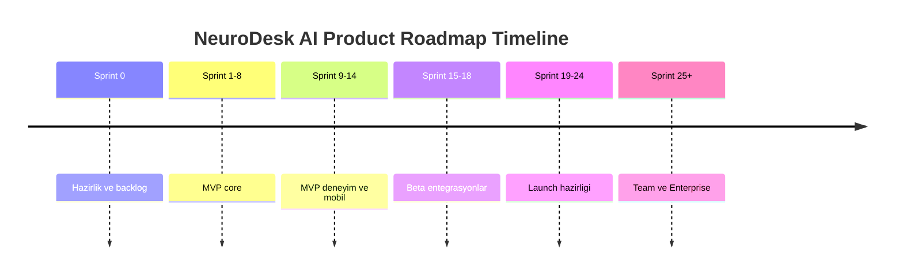
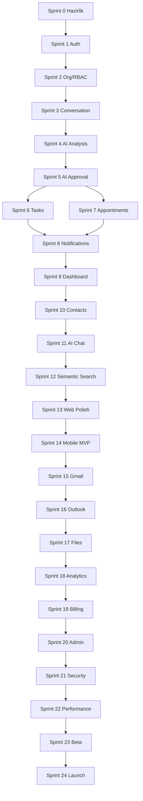
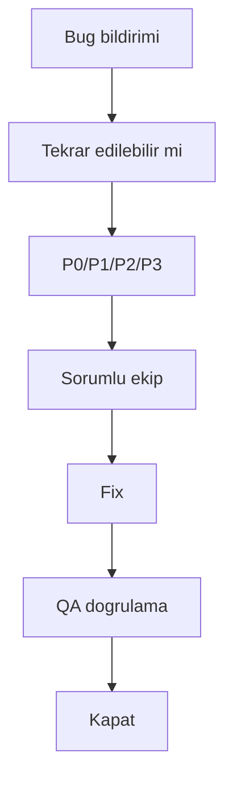
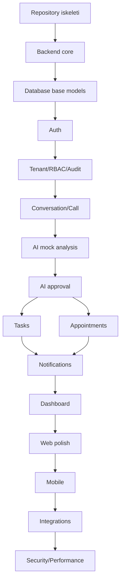
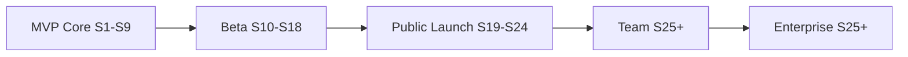

# CILT 11 - Sprint Plani ve Agile Delivery Documentation: NeuroDesk AI

Surum: 1.0  
Tarih: 09 Temmuz 2026  
Dil: Turkce  
Dokuman turu: Sprint Plani, Agile Teslimat ve Gelistirme Yol Haritasi Dokumani, Cilt 11  
Kapsam: MVP backlog, sprint takvimi, epic/story yapisi, story point tahminleri, release plan, ekip rolleri, RACI, QA/UAT, risk yonetimi, Codex ile sprint bazli gelistirme sirasi

> Onemli: Bu asamada kesinlikle kod yazma. Sadece Cilt 11 Sprint Plani ve Agile Delivery dokumani olustur.

> Sureklilik notu: Bu dokuman Cilt 1-10'un urun, mimari, backend, AI, web, mobil, guvenlik ve DevOps kararlarini uygulama planina donusturur. Kod uretimi bu ciltte baslamaz; bu cilt, kod uretimi basladiginda Codex'in hangi sprintte hangi modulu hangi kurallarla ele alacagini tarif eder.

## Icindekiler

1. [Yonetici Ozeti](#1-yonetici-ozeti)
2. [Agile Delivery Vizyonu](#2-agile-delivery-vizyonu)
3. [Urun Gelistirme Stratejisi](#3-urun-gelistirme-stratejisi)
4. [MVP Yaklasimi](#4-mvp-yaklasimi)
5. [Beta Yaklasimi](#5-beta-yaklasimi)
6. [Public Launch Yaklasimi](#6-public-launch-yaklasimi)
7. [Enterprise Faz Yaklasimi](#7-enterprise-faz-yaklasimi)
8. [Agile Metodoloji Secimi](#8-agile-metodoloji-secimi)
9. [Scrum / Kanban / Hybrid Yaklasim Karari](#9-scrum--kanban--hybrid-yaklasim-karari)
10. [Sprint Suresi Karari](#10-sprint-suresi-karari)
11. [Sprint Rituelleri](#11-sprint-rituelleri)
12. [Ekip Rolleri](#12-ekip-rolleri)
13. [Sorumluluk Matrisi](#13-sorumluluk-matrisi)
14. [Definition of Ready](#14-definition-of-ready)
15. [Definition of Done](#15-definition-of-done)
16. [Backlog Yonetimi](#16-backlog-yonetimi)
17. [Epic Yapisi](#17-epic-yapisi)
18. [Feature Yapisi](#18-feature-yapisi)
19. [User Story Standardi](#19-user-story-standardi)
20. [Story Point Tahminleme](#20-story-point-tahminleme)
21. [Onceliklendirme Yaklasimi](#21-onceliklendirme-yaklasimi)
22. [MoSCoW Onceliklendirme](#22-moscow-onceliklendirme)
23. [RICE Onceliklendirme](#23-rice-onceliklendirme)
24. [Risk Bazli Onceliklendirme](#24-risk-bazli-onceliklendirme)
25. [MVP Backlog](#25-mvp-backlog)
26. [MVP Disi Backlog](#26-mvp-disi-backlog)
27. [Teknik Backlog](#27-teknik-backlog)
28. [AI Backlog](#28-ai-backlog)
29. [DevOps Backlog](#29-devops-backlog)
30. [Security Backlog](#30-security-backlog)
31. [Mobile Backlog](#31-mobile-backlog)
32. [Web Backlog](#32-web-backlog)
33. [Backend Backlog](#33-backend-backlog)
34. [Data / Database Backlog](#34-data--database-backlog)
35. [Integration Backlog](#35-integration-backlog)
36. [Testing Backlog](#36-testing-backlog)
37. [Release Plani](#37-release-plani)
38. [Sprint Takvimi](#38-sprint-takvimi)
39. [Sprint 0 - Urun ve Teknik Hazirlik](#39-sprint-0---urun-ve-teknik-hazirlik)
40. [Sprint 1 - Proje Temeli ve Auth](#40-sprint-1---proje-temeli-ve-auth)
41. [Sprint 2 - Kullanici, Organizasyon ve RBAC](#41-sprint-2---kullanici-organizasyon-ve-rbac)
42. [Sprint 3 - Conversation ve Call Temeli](#42-sprint-3---conversation-ve-call-temeli)
43. [Sprint 4 - AI Analysis MVP](#43-sprint-4---ai-analysis-mvp)
44. [Sprint 5 - AI Action Approval](#44-sprint-5---ai-action-approval)
45. [Sprint 6 - Task Modulu](#45-sprint-6---task-modulu)
46. [Sprint 7 - Appointment ve Calendar MVP](#46-sprint-7---appointment-ve-calendar-mvp)
47. [Sprint 8 - Notification ve Scheduler](#47-sprint-8---notification-ve-scheduler)
48. [Sprint 9 - Dashboard MVP](#48-sprint-9---dashboard-mvp)
49. [Sprint 10 - Contact / CRM Hafizasi MVP](#49-sprint-10---contact--crm-hafizasi-mvp)
50. [Sprint 11 - AI Chat MVP](#50-sprint-11---ai-chat-mvp)
51. [Sprint 12 - Semantic Search MVP](#51-sprint-12---semantic-search-mvp)
52. [Sprint 13 - Web Panel Iyilestirme](#52-sprint-13---web-panel-iyilestirme)
53. [Sprint 14 - Mobil Uygulama MVP](#53-sprint-14---mobil-uygulama-mvp)
54. [Sprint 15 - Gmail Entegrasyonu MVP](#54-sprint-15---gmail-entegrasyonu-mvp)
55. [Sprint 16 - Outlook / Microsoft Entegrasyonu](#55-sprint-16---outlook--microsoft-entegrasyonu)
56. [Sprint 17 - File Upload ve Document Analysis](#56-sprint-17---file-upload-ve-document-analysis)
57. [Sprint 18 - Analytics MVP](#57-sprint-18---analytics-mvp)
58. [Sprint 19 - Billing ve Subscription MVP](#58-sprint-19---billing-ve-subscription-mvp)
59. [Sprint 20 - Admin Panel MVP](#59-sprint-20---admin-panel-mvp)
60. [Sprint 21 - Security Hardening](#60-sprint-21---security-hardening)
61. [Sprint 22 - Performance ve Scale Hazirligi](#61-sprint-22---performance-ve-scale-hazirligi)
62. [Sprint 23 - Beta Release Hazirligi](#62-sprint-23---beta-release-hazirligi)
63. [Sprint 24 - Public Launch Hazirligi](#63-sprint-24---public-launch-hazirligi)
64. [Sprint 25+ - Team ve Enterprise Fazi](#64-sprint-25---team-ve-enterprise-fazi)
65. [Sprint Bazli Riskler](#65-sprint-bazli-riskler)
66. [Sprint Bazli Kabul Kriterleri](#66-sprint-bazli-kabul-kriterleri)
67. [QA ve Test Plani](#67-qa-ve-test-plani)
68. [UAT Plani](#68-uat-plani)
69. [Release Candidate Sureci](#69-release-candidate-sureci)
70. [Bug Triage Sureci](#70-bug-triage-sureci)
71. [Teknik Borc Yonetimi](#71-teknik-borc-yonetimi)
72. [Dokumantasyon Plani](#72-dokumantasyon-plani)
73. [Codex ile Gelistirme Sirasi](#73-codex-ile-gelistirme-sirasi)
74. [Codex Prompt Stratejisi](#74-codex-prompt-stratejisi)
75. [Modul Modul Kod Uretim Plani](#75-modul-modul-kod-uretim-plani)
76. [Insan Kontrol Noktalari](#76-insan-kontrol-noktalari)
77. [Git Branch Stratejisi](#77-git-branch-stratejisi)
78. [Pull Request Standardi](#78-pull-request-standardi)
79. [Code Review Standardi](#79-code-review-standardi)
80. [Sprint Raporlama](#80-sprint-raporlama)
81. [Basari Metrikleri](#81-basari-metrikleri)
82. [Velocity Takibi](#82-velocity-takibi)
83. [Risk Matrisi](#83-risk-matrisi)
84. [Bagimlilik Matrisi](#84-bagimlilik-matrisi)
85. [Yol Haritasi](#85-yol-haritasi)
86. [Codex Icin Sprint Bazli Uygulama Talimatlari](#86-codex-icin-sprint-bazli-uygulama-talimatlari)
87. [Codex Icin Sonraki Adim](#87-codex-icin-sonraki-adim)

# 1. Yonetici Ozeti

NeuroDesk AI kapsam olarak genis, veri hassasiyeti yuksek ve cok disiplinli bir SaaS urunudur. Bu nedenle gelistirme sureci "tum projeyi tek hamlede uretme" yaklasimi ile yurutulemez. Dogru model, calisan ve test edilen kucuk artimlarla ilerleyen sprint bazli delivery modelidir. Her sprint sonunda demo yapilabilir, test edilebilir ve insan review'una sunulabilir bir cikti uretilmelidir.

Bu dokuman, MVP'den enterprise faza kadar urun gelistirme yolunu tanimlar. Ilk odak; auth, tenant context, RBAC, conversation, AI analysis, AI action approval, task, appointment, notification, dashboard ve temel web akisini calistiran guvenli MVP'dir. Beta fazda AI Chat, semantic search, contact memory, mobil MVP ve Gmail/Outlook entegrasyonlari olgunlastirilir. Public Launch fazda billing, admin, security hardening, performance, support ve production operasyonlari tamamlanir. Team ve Enterprise fazda SSO, SCIM, audit export, dedicated tenant ve advanced RBAC gibi ozellikler eklenir.

# 2. Agile Delivery Vizyonu

Agile delivery vizyonu, her iki haftada bir olculebilir urun artimi cikarmak ve buyuk belirsizlikleri erken azaltmaktir. NeuroDesk AI'da en buyuk belirsizlikler AI dogrulugu, kullanici onay akislari, tenant isolation, OAuth entegrasyonlari, worker queue performansi ve hassas veri guvenligidir. Bu nedenle riskli alanlar gec faza saklanmaz; once guvenli iskelet, sonra domain akislari, sonra entegrasyonlar ve polish gelir.

# 3. Urun Gelistirme Stratejisi

Strateji bes fazlidir: Hazirlik, MVP, Beta, Public Launch, Team/Enterprise. Her faz kendi basina bir release hedefi tasir. Faz gecisleri yalnizca ozellik tamamlama ile degil, test, guvenlik, operasyon ve product feedback kriterleri ile onaylanir.



# 4. MVP Yaklasimi

MVP, urunun ana vaadini kanitlamalidir: kullanici bir gorusme metni ekler, AI bunu ozetler, gorev/randevu onerir, kullanici onaylar, sistem gorev/randevu olusturur, hatirlatir ve dashboard'da gosterir. MVP'de onaysiz AI aksiyonu, otomatik mail gonderme, otomatik takvim yazma, enterprise SSO, advanced CRM ve tam otomatik telefon kaydi kapsam disidir.

# 5. Beta Yaklasimi

Beta, gercek kullanici feedback'iyle urun davranisini olgunlastirma fazidir. Contact memory, AI Chat, semantic search, Gmail/Google Calendar, Outlook/Microsoft Graph, mobil MVP ve document analysis beta kapsaminda stabil hale getirilir. Beta'da telemetry, feedback, known issues, support workflow ve error reporting aktif olmalidir.

# 6. Public Launch Yaklasimi

Public Launch, urunun odeme, destek, yasal metin, production monitoring, backup/restore ve security hardening ile genel kullanima acilmasidir. Launch oncesi security checklist, privacy checklist, performance check, billing check ve production deployment checklist tamamlanmalidir.

# 7. Enterprise Faz Yaklasimi

Enterprise faz, team collaboration ve kurumsal guvenlik gereksinimlerine odaklanir: SSO, SAML/OIDC, SCIM, advanced RBAC, shared contacts, shared dashboard, audit export, SIEM, custom retention, data residency, dedicated tenant ve SLA raporlama. Bu faz MVP'den sonra musteri talebi ve gelir potansiyeline gore planlanir.

# 8. Agile Metodoloji Secimi

Onerilen metodoloji Hybrid Agile'dir. Scrum, iki haftalik sprint planlama ve demo ritmi icin kullanilir. Kanban, bug triage, production incident, AI prompt iyilestirme ve entegrasyon blokajlari icin kullanilir. Bu hibrit yapi, hem planli teslimati hem de belirsizligin yonetimini destekler.

# 9. Scrum / Kanban / Hybrid Yaklasim Karari

Scrum parcasi: Sprint planning, daily check-in, review, retrospective, backlog refinement. Kanban parcasi: support bugs, incident response, provider blokajlari, research spike'lari. Karar: core product delivery Scrum; operasyonel ve belirsiz isler Kanban.

# 10. Sprint Suresi Karari

Sprint suresi 2 haftadir. Sprint 0, 1-2 hafta hazirlik sprinti olabilir. AI veya entegrasyon belirsizligi icin spike task 1-3 gunluk timebox ile sinirlanir. 13+ story point isler sprint'e girmeden parcalanmalidir.

# 11. Sprint Rituelleri

| Ritueller | Sure | Katilimci | Cikti |
|---|---|---|---|
| Sprint Planning | 1-2 saat | PO, TL, ekip | Sprint goal ve backlog |
| Daily Check-in | 15 dk | Ekip | Blokaj ve ilerleme |
| Backlog Refinement | Haftalik | PO, TL, QA | Ready story'ler |
| Sprint Review/Demo | 1 saat | Ekip, stakeholder | Demo ve feedback |
| Retrospective | 45 dk | Ekip | Iyilestirme aksiyonlari |
| Risk Review | Haftalik | PO, TL, Sec, DevOps | Risk guncellemesi |

# 12. Ekip Rolleri

| Rol | Sorumluluk | Sprint gorevi | Karar alani |
|---|---|---|---|
| Product Owner | Kapsam, oncelik, kabul | Story hazirlar, kabul verir | Urun onceligi |
| Scrum Master / PM | Surec, blokaj, raporlama | Sprint akisini korur | Delivery sureci |
| CTO / Tech Lead | Teknik karar ve mimari | Review, tasarim, risk | Mimari |
| Backend Developer | API, DB, worker | Backend tasklari | Backend tasarimi |
| Frontend Developer | Web UI | Web tasklari | Frontend deneyim |
| Mobile Developer | Flutter app | Mobil tasklari | Mobil deneyim |
| AI Engineer | Prompt, RAG, evaluation | AI tasklari | AI kalite |
| DevOps Engineer | CI/CD, env, monitoring | DevOps tasklari | Deployment |
| QA Engineer | Test stratejisi | Test/UAT | Kalite |
| Security Engineer | Guvenlik review | Threat/test review | Guvenlik |
| Legal/Compliance | KVKK/GDPR | Riza/metin review | Hukuki uygunluk |

# 13. Sorumluluk Matrisi

| Alan | PO | TL | BE | FE | AI | DevOps | QA | Sec | Legal |
|---|---|---|---|---|---|---|---|---|---|
| PRD | A/R | C | I | I | C | I | C | C | C |
| Architecture | C | A/R | C | C | C | C | I | C | I |
| Backend | I | A | R | I | C | C | C | C | I |
| Frontend | C | A | C | R | I | I | C | C | I |
| AI | C | A | C | I | R | I | C | C | I |
| DevOps | I | A | C | C | I | R | C | C | I |
| Security | C | A | C | C | C | C | C | R | C |
| Compliance | A | C | I | I | C | I | C | C | R |
| QA | C | C | C | C | C | I | A/R | C | I |
| Release | A | C | C | C | C | R | R | C | I |
| Incident | I | A | R | C | C | R | C | R | C |

# 14. Definition of Ready

Bir story sprint'e girmeden once acik user story, kabul kriterleri, story point, bagimlilik, test notlari, security/tenant etkisi, AI etkisi, database etkisi, UI gereksinimi ve product onceligi net olmalidir. Belirsiz isler story olarak degil spike olarak girer.

# 15. Definition of Done

Bir is tamamlanmis sayilmak icin kodu yazilmis, testleri gecmis, lint/type check temiz, review tamam, security kontrolu yapilmis, tenant isolation korunmus, audit gereksinimi karsilanmis, AI aksiyonu varsa approval modeli uygulanmis, staging'de dogrulanmis ve PO tarafindan kabul edilmis olmalidir.

# 16. Backlog Yonetimi

Backlog epic -> feature -> user story -> technical task olarak kirilir. Her sprint basinda en yuksek risk ve en yuksek degerli isler one alinir. Backlog sismesi "MVP, Beta, Launch, Enterprise" etiketleriyle kontrol edilir.

# 17. Epic Yapisi

| Epic | Amac | MVP | Bagimlilik | Ana risk |
|---|---|---|---|---|
| EPIC-001 Auth & User | Kayit/giris/profil | Must | DevOps, DB | Token guvenligi |
| EPIC-002 Organization & RBAC | Tenant ve yetki | Must | Auth | Tenant leak |
| EPIC-003 Conversation & Call | Gorusme verisi | Must | Tenant | Hassas veri |
| EPIC-004 Transcription/STT | Ses/metin | Should/Future | Storage/AI | Riza ve maliyet |
| EPIC-005 AI Analysis | Ozet/gorev/randevu | Must | Conversation | Hallucination |
| EPIC-006 AI Approval | Onay kapisi | Must | AI Analysis | Onaysiz aksiyon |
| EPIC-007 Tasks | Gorev yonetimi | Must | Approval | Yetki |
| EPIC-008 Appointment & Calendar | Randevu/takvim | Must | Approval | Calendar write |
| EPIC-009 Notification | Hatirlatma | Must | Task/Appointment | Teslimat |
| EPIC-010 Dashboard | Ozet ekran | Must | Domain data | Performans |
| EPIC-011 Contact Memory | Kisi hafizasi | Should | Conversation | PII |
| EPIC-012 AI Chat | Dogal dil sorgu | Should | Search/AI | Data leak |
| EPIC-013 Semantic Search | Arama/RAG | Should | Embedding | Tenant leak |
| EPIC-014 Email Integration | Gmail/Outlook | Should | OAuth | Scope/rate |
| EPIC-015 File Analysis | Belge analizi | Could | Storage/AI | Malware/PII |
| EPIC-016 Mobile | Mobil MVP | Should | API | Platform farki |
| EPIC-017 Web Panel | Web deneyimi | Must | API | UX borcu |
| EPIC-018 Admin | Admin panel | Launch | RBAC | Yetki asimi |
| EPIC-019 Billing | Plan/kota | Launch | Usage | Odeme hatasi |
| EPIC-020 Analytics | Raporlama | Launch | Events | Yanlis metrik |
| EPIC-021 Security | Guvenlik | Must | Tum moduller | Gec kalma |
| EPIC-022 DevOps | Deploy/monitoring | Must | Repo | Operasyon riski |
| EPIC-023 QA | Test | Must | Tum moduller | Regression |
| EPIC-024 Enterprise | Kurumsal | Future | Team | Scope creep |

# 18. Feature Yapisi

Feature'lar bir sprintte demo edilebilir is parcasi olmalidir: "Register/Login", "Conversation CRUD", "AI Summary", "Task Approval", "Calendar Event Create", "Dashboard Metrics", "Gmail Connect" gibi. Her feature bir veya daha fazla user story ve technical task icerir.

# 19. User Story Standardi

Format:

```text
US-XXX
Baslik:
Rol olarak:
Istiyorum ki:
Boylece:
Oncelik: Must / Should / Could / Won't
Story Point:
Epic:
Sprint:
Bagimliliklar:
Kabul kriterleri:
Test notlari:
```

# 20. Story Point Tahminleme

| Point | Anlam | Ornek |
|---|---|---|
| 1 | Cok kucuk | Metin/validasyon |
| 2 | Kucuk | Basit endpoint/komponent |
| 3 | Standart | CRUD veya tek ekran |
| 5 | Orta | Birden cok katman |
| 8 | Karmasik | Backend + UI + test/AI |
| 13 | Buyuk | Bolunmeli/spike |
| 21 | Cok buyuk | Sprint'e alinmaz |

# 21. Onceliklendirme Yaklasimi

Once guvenli temel, sonra core value, sonra entegrasyon, sonra polish. Tenant isolation, auth, AI approval ve audit gibi sistemik riskler ertelenmez. Kullanici degeri yuksek ama riskli isler kucuk artimlara bolunur.

# 22. MoSCoW Onceliklendirme

Must: Auth, tenant, conversation, AI summary, AI approval, task, appointment, notification, dashboard, basic web, audit, consent, DevOps. Should: AI Chat, semantic search, contact, Gmail/Calendar, mobile MVP. Could: document analysis, analytics, billing polish. Won't MVP: Enterprise SSO, advanced agents, auto WhatsApp scraping, onaysiz actions.

# 23. RICE Onceliklendirme

RICE skoru Reach x Impact x Confidence / Effort ile hesaplanir. AI Chat gibi yuksek impact ama daha yuksek effort isleri Beta'ya alinabilir. Auth/RBAC gibi dusuk gorunur ama yuksek riskli isler risk bazli oncelik nedeniyle one alinir.

# 24. Risk Bazli Onceliklendirme

Risk bazli onceliklendirme su alanlari one alir: tenant isolation, token security, AI action approval, OAuth token storage, consent, audit log, data export/delete, migration, worker idempotency. Bu isler "sonra sertlestiririz" diye ertelenmemelidir.

# 25. MVP Backlog

Aşağıdaki MVP backlog, 120 story seviyesinde planlanir. Her story'nin kabul kriterleri sprint planlama sirasinda detaylandirilir; bu tablo delivery takibini saglar.

| ID | Baslik | Epic | Sprint | Oncelik | SP | Kabul ozeti |
|---|---|---|---|---|---|---|
| US-001 | E-posta ile kayit | Auth | S1 | Must | 5 | Benzersiz e-posta, hash |
| US-002 | E-posta ile giris | Auth | S1 | Must | 5 | Token doner |
| US-003 | Refresh token yenileme | Auth | S1 | Must | 5 | Rotation |
| US-004 | Logout | Auth | S1 | Must | 3 | Token revoke |
| US-005 | Current user | Auth | S1 | Must | 2 | Profil doner |
| US-006 | Password validation | Auth | S1 | Must | 2 | Zayif sifre engel |
| US-007 | Rate limited login | Auth | S1 | Must | 3 | Brute force azaltma |
| US-008 | Frontend login | Web | S1 | Must | 3 | Basarili giris |
| US-009 | Frontend register | Web | S1 | Must | 3 | Basarili kayit |
| US-010 | Protected route | Web | S1 | Must | 3 | Auth guard |
| US-011 | Profil goruntuleme | User | S2 | Must | 3 | Kullanici profili |
| US-012 | Profil guncelleme | User | S2 | Must | 3 | Validasyon |
| US-013 | Organizasyon olusturma | Org | S2 | Must | 5 | Tenant olusur |
| US-014 | Member listeleme | Org | S2 | Must | 3 | Tenant scoped |
| US-015 | Rol modeli | RBAC | S2 | Must | 5 | Owner/Admin/Member |
| US-016 | Permission guard | RBAC | S2 | Must | 5 | Yetkisiz erisim engel |
| US-017 | Tenant context | RBAC | S2 | Must | 8 | Server-side tenant |
| US-018 | Audit log baslangic | Security | S2 | Must | 5 | Kritik event kaydi |
| US-019 | Conversation listeleme | Conversation | S3 | Must | 3 | Tenant scoped |
| US-020 | Conversation olusturma | Conversation | S3 | Must | 5 | Baslik/metin |
| US-021 | Conversation detay | Conversation | S3 | Must | 3 | Detay ekran |
| US-022 | Call kaydi olusturma | Calls | S3 | Must | 5 | Metadata |
| US-023 | Manuel transkript ekleme | Calls | S3 | Must | 5 | Hassas veri |
| US-024 | Participant ekleme | Calls | S3 | Should | 3 | Kisi baglami |
| US-025 | AI summary job | AI | S4 | Must | 8 | Mock provider |
| US-026 | AI task extraction | AI | S4 | Must | 8 | Oneri uretir |
| US-027 | AI appointment extraction | AI | S4 | Must | 8 | Oneri uretir |
| US-028 | AI job status | AI | S4 | Must | 5 | Pending/success/fail |
| US-029 | Worker skeleton | AI | S4 | Must | 5 | Queue calisir |
| US-030 | Prompt version kaydi | AI | S4 | Should | 3 | Izlenebilir |
| US-031 | AI approval list | Approval | S5 | Must | 5 | Oneriler listelenir |
| US-032 | AI task approve | Approval | S5 | Must | 5 | Gorev olusur |
| US-033 | AI appointment approve | Approval | S5 | Must | 5 | Randevu olusur |
| US-034 | AI suggestion reject | Approval | S5 | Must | 3 | Reddedilir |
| US-035 | Approval audit log | Approval | S5 | Must | 3 | Audit kaydi |
| US-036 | Onaysiz action engeli | Security | S5 | Must | 5 | Bypass yok |
| US-037 | Task CRUD | Tasks | S6 | Must | 5 | Liste/detay |
| US-038 | Task status | Tasks | S6 | Must | 3 | Todo/done |
| US-039 | Task due date | Tasks | S6 | Must | 3 | Tarih |
| US-040 | Task frontend list | Web | S6 | Must | 5 | UI |
| US-041 | Task filters | Tasks | S6 | Should | 3 | Durum/tarih |
| US-042 | Task audit | Security | S6 | Must | 2 | Degisim kaydi |
| US-043 | Appointment CRUD | Appointment | S7 | Must | 5 | Randevu |
| US-044 | Calendar view | Calendar | S7 | Must | 5 | Basit takvim |
| US-045 | Google Calendar skeleton | Calendar | S7 | Should | 8 | OAuth hazir |
| US-046 | Calendar write approval | Calendar | S7 | Must | 5 | Onayli yazma |
| US-047 | Appointment UI | Web | S7 | Must | 5 | Liste/detay |
| US-048 | Timezone handling | Calendar | S7 | Must | 3 | Dogru tarih |
| US-049 | Reminder model | Notification | S8 | Must | 5 | Hatirlatma |
| US-050 | Scheduler worker | Notification | S8 | Must | 5 | Zamanli is |
| US-051 | Email notification | Notification | S8 | Should | 5 | Mailpit/provider |
| US-052 | In-app notification | Notification | S8 | Must | 5 | UI badge |
| US-053 | Notification preferences | Notification | S8 | Should | 3 | Tercih |
| US-054 | Retry/DLQ | Worker | S8 | Must | 5 | Hata yonetimi |
| US-055 | Dashboard summary | Dashboard | S9 | Must | 5 | Gosterge |
| US-056 | Upcoming appointments | Dashboard | S9 | Must | 3 | Liste |
| US-057 | Open tasks widget | Dashboard | S9 | Must | 3 | Liste |
| US-058 | Recent conversations | Dashboard | S9 | Must | 3 | Liste |
| US-059 | AI insights panel | Dashboard | S9 | Should | 5 | Ozet |
| US-060 | Dashboard loading/error | Web | S9 | Must | 2 | UX |
| US-061 | Contact CRUD | Contacts | S10 | Must | 5 | Kisi |
| US-062 | Contact timeline | Contacts | S10 | Must | 8 | Gorusme baglari |
| US-063 | Contact notes | Contacts | S10 | Should | 3 | Not |
| US-064 | Contact from conversation | Contacts | S10 | Should | 5 | Cikarim |
| US-065 | Contact search | Contacts | S10 | Must | 3 | Arama |
| US-066 | Contact privacy | Security | S10 | Must | 3 | PII koruma |
| US-067 | AI chat endpoint | AI Chat | S11 | Must | 8 | Soru-cevap |
| US-068 | Chat UI | AI Chat | S11 | Must | 5 | Web |
| US-069 | Tenant-scoped retrieval | AI Chat | S11 | Must | 8 | Veri izolasyonu |
| US-070 | Chat history | AI Chat | S11 | Should | 5 | Kayit |
| US-071 | Low confidence state | AI Chat | S11 | Should | 3 | Uyari |
| US-072 | Prompt injection tests | Security | S11 | Must | 5 | Test |
| US-073 | Embedding pipeline | Search | S12 | Must | 8 | Vektor |
| US-074 | Semantic search API | Search | S12 | Must | 8 | Arama |
| US-075 | Search UI | Search | S12 | Must | 5 | Web |
| US-076 | Tenant vector filter | Search | S12 | Must | 5 | Izolasyon |
| US-077 | Re-index job | Search | S12 | Should | 5 | Bakim |
| US-078 | Search audit | Security | S12 | Should | 2 | Izleme |
| US-079 | Web nav polish | Web | S13 | Must | 3 | UX |
| US-080 | Responsive polish | Web | S13 | Must | 5 | Mobil web |
| US-081 | Empty/error states | Web | S13 | Must | 3 | UX |
| US-082 | Accessibility pass | Web | S13 | Should | 5 | A11y |
| US-083 | Settings page | Web | S13 | Should | 5 | Ayarlar |
| US-084 | Consent UI | Web | S13 | Must | 5 | Riza |
| US-085 | Mobile skeleton | Mobile | S14 | Should | 8 | Flutter temel |
| US-086 | Mobile auth | Mobile | S14 | Should | 5 | Giris |
| US-087 | Mobile dashboard | Mobile | S14 | Should | 5 | Ana ekran |
| US-088 | Mobile tasks | Mobile | S14 | Should | 5 | Gorev |
| US-089 | Mobile appointments | Mobile | S14 | Should | 5 | Randevu |
| US-090 | Mobile secure storage | Security | S14 | Must | 5 | Token |
| US-091 | Gmail OAuth connect | Integration | S15 | Should | 8 | Baglanti |
| US-092 | Gmail metadata sync | Integration | S15 | Should | 8 | Metadata |
| US-093 | Gmail analysis opt-in | Integration | S15 | Must | 5 | Riza |
| US-094 | Gmail rate handling | Integration | S15 | Should | 5 | Backoff |
| US-095 | Gmail token encryption | Security | S15 | Must | 5 | Guvenlik |
| US-096 | Gmail revoke | Integration | S15 | Must | 3 | Kaldirma |
| US-097 | Microsoft OAuth | Integration | S16 | Should | 8 | Baglanti |
| US-098 | Outlook mail sync | Integration | S16 | Should | 8 | Mail |
| US-099 | Outlook calendar sync | Integration | S16 | Should | 8 | Takvim |
| US-100 | Graph rate handling | Integration | S16 | Should | 5 | Backoff |
| US-101 | File signed upload | Files | S17 | Could | 5 | Guvenli upload |
| US-102 | File metadata | Files | S17 | Could | 3 | DB kaydi |
| US-103 | Malware scan hook | Security | S17 | Must | 5 | Guvenlik |
| US-104 | Document text extract | Files | S17 | Could | 8 | PDF/DOCX/TXT |
| US-105 | Document summary | AI | S17 | Could | 8 | AI ozet |
| US-106 | File permissions | Security | S17 | Must | 5 | Yetki |
| US-107 | Usage analytics | Analytics | S18 | Should | 5 | Metrik |
| US-108 | AI usage metric | Analytics | S18 | Must | 5 | Cost |
| US-109 | Analytics dashboard | Analytics | S18 | Should | 5 | Grafik |
| US-110 | Aggregation worker | Analytics | S18 | Should | 5 | Precompute |
| US-111 | Plans model | Billing | S19 | Could | 5 | Paket |
| US-112 | Subscription model | Billing | S19 | Could | 5 | Abonelik |
| US-113 | Usage quota | Billing | S19 | Must | 5 | AI limit |
| US-114 | Billing UI | Billing | S19 | Could | 5 | Paket gor |
| US-115 | Admin auth guard | Admin | S20 | Must | 5 | Yetki |
| US-116 | Admin tenant list | Admin | S20 | Could | 5 | Liste |
| US-117 | Admin audit logs | Admin | S20 | Must | 5 | Audit |
| US-118 | Admin AI cost view | Admin | S20 | Should | 5 | Maliyet |
| US-119 | Security hardening checklist | Security | S21 | Must | 8 | Kontrol |
| US-120 | Production launch checklist | DevOps | S24 | Must | 8 | Launch hazir |

# 26. MVP Disi Backlog

MVP disi backlog: enterprise SSO, SCIM, SIEM export, dedicated tenant, advanced billing, ERP/SAP, auto WhatsApp scraping, advanced AI agents, no-approval automated outbound actions, complex CRM automation, data residency per tenant ve customer-managed keys.

# 27. Teknik Backlog

Teknik backlog, kod borcu ve platform kalitesini yonetir. Ornek task havuzu:

| ID | Baslik | Modul | Sprint | Rol | SP | Kabul |
|---|---|---|---|---|---|---|
| TT-001 | Repo iskeleti | DevOps | S1 | DevOps | 3 | Standart klasorler |
| TT-002 | Backend app skeleton | Backend | S1 | BE | 5 | App calisir |
| TT-003 | DB connection | Backend | S1 | BE | 3 | Test DB baglanir |
| TT-004 | Alembic setup | DB | S1 | BE | 3 | Migration calisir |
| TT-005 | Auth model migration | DB | S1 | BE | 5 | User/session |
| TT-006 | Frontend skeleton | Web | S1 | FE | 5 | App build |
| TT-007 | Docker Compose local | DevOps | S1 | DevOps | 5 | Local calisir |
| TT-008 | Test harness | QA | S1 | QA/BE | 3 | Unit test |
| TT-009 | Tenant middleware | Backend | S2 | BE | 8 | Tenant context |
| TT-010 | RBAC guard | Backend | S2 | BE | 5 | Permission check |
| TT-011 | Audit logger | Backend | S2 | BE | 5 | Append-only |
| TT-012 | Conversation repository | Backend | S3 | BE | 5 | Tenant scoped |
| TT-013 | Worker queue setup | Worker | S4 | BE | 5 | Redis queue |
| TT-014 | AI provider adapter | AI | S4 | AI/BE | 5 | Mock provider |
| TT-015 | Approval state machine | Backend | S5 | BE | 5 | Pending/approved |
| TT-016 | Task API tests | QA | S6 | QA | 3 | CRUD tests |
| TT-017 | Calendar timezone utility | Backend | S7 | BE | 3 | TZ tests |
| TT-018 | Scheduler lock | Worker | S8 | BE | 5 | No duplicate |
| TT-019 | Dashboard aggregation | Backend | S9 | BE | 5 | Fast API |
| TT-020 | Contact PII masking | Security | S10 | Sec/BE | 3 | Mask tests |
| TT-021 | Chat prompt eval | AI | S11 | AI | 5 | Eval set |
| TT-022 | Embedding job | AI | S12 | AI/BE | 8 | Tenant filter |
| TT-023 | Web a11y pass | Web | S13 | FE/QA | 5 | A11y checks |
| TT-024 | Mobile secure storage | Mobile | S14 | Mobile | 5 | Token secure |
| TT-025 | Gmail token encryption | Security | S15 | BE/Sec | 5 | Encrypted |
| TT-026 | Graph adapter | Integration | S16 | BE | 8 | Mock tests |
| TT-027 | Upload scan hook | Files | S17 | BE/Sec | 5 | Scan result |
| TT-028 | AI cost collector | Analytics | S18 | AI/BE | 5 | Cost metrics |
| TT-029 | Billing quota guard | Billing | S19 | BE | 5 | Limit enforced |
| TT-030 | Admin audit filter | Admin | S20 | BE/FE | 5 | Tenant safe |
| TT-031 | SAST config | Security | S21 | DevOps | 3 | CI scan |
| TT-032 | Load test script plan | QA | S22 | QA | 5 | Scenario |
| TT-033 | Beta feedback model | Product | S23 | BE/FE | 3 | Feedback |
| TT-034 | Launch monitoring checklist | DevOps | S24 | DevOps | 5 | Alerts ready |

Devam eden teknik task kategorileri: backend setup, database migration, API design, worker setup, AI provider adapter, frontend architecture, mobile architecture, DevOps, security, testing, monitoring, logging, performance. Her kategori sprint backlog'a bolunerek 80+ task seviyesine ayrilmalidir; 13 point uzeri task sprint'e alinmadan parcalanir.

# 28. AI Backlog

AI backlog: mock provider, prompt versioning, conversation summary, task extraction, appointment extraction, confidence score, approval payload, prompt injection tests, AI Chat, RAG retrieval, semantic search, embedding, AI cost tracking, low confidence behavior, hallucination evaluation, provider fallback.

# 29. DevOps Backlog

DevOps backlog: local Docker Compose, backend Dockerfile, frontend Dockerfile, worker command standardi, `.env.example`, backend CI, frontend CI, image build, staging deploy, production manual approval, health checks, Sentry env, migration pipeline, rollback README, monitoring, backup/restore.

# 30. Security Backlog

Security backlog: password hashing, JWT/refresh rotation, OAuth token encryption, tenant isolation tests, RBAC, audit log, consent enforcement, AI approval bypass tests, prompt injection tests, file upload scanning, sensitive log masking, rate limiting, data export/delete review.

# 31. Mobile Backlog

Mobil backlog: Flutter skeleton, auth, secure storage, dashboard, tasks, appointments, notifications, deep link/OAuth callback, offline cache policy, crash reporting, responsive API errors.

# 32. Web Backlog

Web backlog: auth screens, protected routes, dashboard, conversation list/detail, AI approval UI, tasks, appointments, calendar view, contacts, AI chat, semantic search, settings, consent UI, admin screens, responsive polish.

# 33. Backend Backlog

Backend backlog: app skeleton, DB, migrations, auth, user, org, RBAC, audit, conversations, calls, AI jobs, approvals, tasks, appointments, notifications, dashboard, contacts, chat, search, integrations, files, analytics, billing, admin.

# 34. Data / Database Backlog

Data backlog: schema migrations, indexes, tenant_id constraints, audit tables, job tables, vector columns/indexes, retention jobs, export/delete jobs, backup/restore validation, query performance.

# 35. Integration Backlog

Integration backlog: Google OAuth, Google Calendar, Gmail, Microsoft OAuth, Outlook Mail, Outlook Calendar, email provider, notification provider, Sentry, payment provider, object storage, AI provider.

# 36. Testing Backlog

Testing backlog: unit, integration, API, E2E, tenant isolation, auth security, prompt injection, AI eval, worker retry/DLQ, migration tests, performance/load, mobile, UAT, regression suite.

# 37. Release Plani

| Release | Sprint araligi | Kapsam | Cikis kriteri |
|---|---|---|---|
| 0.1 Internal Alpha | S1-S5 | Auth, conversation, AI summary, approval | Ic demo |
| 0.2 MVP Alpha | S6-S9 | Task, appointment, notification, dashboard | Core flow calisir |
| 0.3 MVP Beta | S10-S14 | Contact, AI Chat, search, web polish, mobile | Beta hazir |
| 0.4 Integration Beta | S15-S18 | Gmail, Outlook, files, analytics | Entegrasyon test |
| 1.0 Public Launch | S19-S24 | Billing, admin, security, performance, launch | Production ready |
| 1.5 Team | S25+ | Team features | Team pilot |
| 2.0 Enterprise | S25+ | SSO, audit export, dedicated tenant | Enterprise pilot |

# 38. Sprint Takvimi



# 39. Sprint 0 - Urun ve Teknik Hazirlik

Sure: 1-2 hafta. Amac: Cilt 1-11 dokumanlarini, repo stratejisini, backlog'u, ilk sprint planini ve ekip rollerini netlestirmek. Cikti: onayli dokuman seti, backlog, release plan, branch stratejisi, ilk 4 sprint hazirligi. Insan kontrolu: PO, TL, Security, DevOps onayi.

# 40. Sprint 1 - Proje Temeli ve Auth

Sure: 2 hafta. Amac: repo iskeleti, backend/frontend temel, local development ve auth akisini calistirmak.

Kapsam: backend core, DB connection, Alembic, user/session modelleri, register/login/logout/current-user, JWT, refresh token, web login/register, local Docker Compose. Testler: auth unit/integration, password validation, duplicate email, token refresh, protected route. Guvenlik: hash, refresh rotation, rate limit, no secret. Yapilmamali: OAuth, org/RBAC disina tasma, AI modulu. Insan review: auth, token, migration, Docker/env.

# 41. Sprint 2 - Kullanici, Organizasyon ve RBAC

Amac: tenant context ve temel yetkilendirme. Kapsam: profile, organization, member, role, permission, tenant-scoped query, audit log baslangici. Testler: cross-tenant access, permission deny, audit event. Guvenlik: tenant frontend'den alinmaz. Yapilmamali: domain modulleri tenant guard tamamlanmadan baslamaz. Insan review: tenant isolation ve RBAC.

# 42. Sprint 3 - Conversation ve Call Temeli

Amac: gorusme/call verisini guvenli saklamak. Kapsam: conversation CRUD, call CRUD, manuel transkript, participant, list/detail UI. Testler: CRUD, tenant scoped, validation, PII log kontrolu. Yapilmamali: otomatik telefon kaydi. Review: hassas veri modeli.

# 43. Sprint 4 - AI Analysis MVP

Amac: mock provider ile AI summary/task/appointment extraction. Kapsam: AI job, worker, prompt version, status, result model. Testler: provider mock, job retry, failure, prompt output schema. Guvenlik: raw prompt loglanmaz, tenant context korunur. Yapilmamali: gercek provider'a hassas veri plansiz gonderilmez.

# 44. Sprint 5 - AI Action Approval

Amac: AI onerilerini kullanici onayina baglamak. Kapsam: approval list, approve/reject, task/randevu olusturma, audit. Testler: onaysiz action engeli, permission, audit. Guvenlik: AI kendi basina mail/takvim/gorev yapamaz. Review: approval state machine.

# 45. Sprint 6 - Task Modulu

Amac: gorev CRUD ve web task deneyimi. Kapsam: task model/API/UI, status, due date, filter, audit. Testler: CRUD, tenant, status transition. Risk: AI'dan gelen hatali gorev. Review: task creation rules.

# 46. Sprint 7 - Appointment ve Calendar MVP

Amac: randevu ve basit takvim. Kapsam: appointment CRUD, calendar view, timezone, Google Calendar skeleton, write approval. Testler: timezone, approval, tenant. Yapilmamali: onaysiz calendar write.

# 47. Sprint 8 - Notification ve Scheduler

Amac: hatirlatma altyapisi. Kapsam: reminder model, scheduler, notification worker, in-app/email notification, retry/DLQ. Testler: scheduled job, duplicate prevention, retry. Risk: fazla bildirim.

# 48. Sprint 9 - Dashboard MVP

Amac: kullaniciya is ozeti sunmak. Kapsam: open tasks, upcoming appointments, recent conversations, AI insights, dashboard UI. Testler: aggregation, permission, performance. Demo: kullanici tek ekranda is durumunu gorur.

# 49. Sprint 10 - Contact / CRM Hafizasi MVP

Amac: kisi ve musteri hafizasi. Kapsam: contact CRUD, timeline, notes, conversation link, contact search. Testler: PII masking, tenant, timeline. Risk: yanlis kisi eslestirme.

# 50. Sprint 11 - AI Chat MVP

Amac: gecmis veriler uzerinde kontrollu soru-cevap. Kapsam: chat endpoint, UI, tenant-scoped retrieval, history, low confidence. Testler: prompt injection, data leakage, permission. Yapilmamali: baska tenant verisi dondurme.

# 51. Sprint 12 - Semantic Search MVP

Amac: anlamsal arama. Kapsam: embedding pipeline, search API/UI, tenant vector filter, re-index job. Testler: vector tenant isolation, relevance smoke, permission. Risk: retrieval leak.

# 52. Sprint 13 - Web Panel Iyilestirme

Amac: MVP web deneyimini toparlamak. Kapsam: navigation, responsive polish, empty/error states, settings, consent UI, accessibility pass. Testler: browser/responsive, a11y smoke, route guards.

# 53. Sprint 14 - Mobil Uygulama MVP

Amac: temel mobil deneyim. Kapsam: Flutter skeleton, auth, secure storage, dashboard, task, appointment. Testler: mobile auth, secure token storage, API error handling. Risk: platform izinleri.

# 54. Sprint 15 - Gmail Entegrasyonu MVP

Amac: Gmail baglantisi ve minimum sync. Kapsam: Google OAuth, Gmail metadata, consent, token encryption, revoke, rate handling. Testler: OAuth state, token encryption, scope, rate limit. Review: OAuth/token.

# 55. Sprint 16 - Outlook / Microsoft Entegrasyonu

Amac: Microsoft Graph mail/calendar temeli. Kapsam: Microsoft OAuth, Outlook mail/calendar sync, token refresh, rate handling. Testler: Graph mock, revoke, tenant. Risk: provider quota.

# 56. Sprint 17 - File Upload ve Document Analysis

Amac: dosya yukleme ve belge analizi. Kapsam: signed upload, object storage, metadata, malware scan hook, text extraction, document summary, permissions. Testler: file type, size, permission, scan. Yapilmamali: public bucket.

# 57. Sprint 18 - Analytics MVP

Amac: kullanici/urun metrikleri. Kapsam: usage metrics, AI cost, analytics dashboard, aggregation worker. Testler: metric accuracy, tenant, performance. Risk: yanlis metrikle karar.

# 58. Sprint 19 - Billing ve Subscription MVP

Amac: plan ve kota temeli. Kapsam: plans, subscriptions, usage quota, AI usage guard, billing UI. Testler: quota enforcement, plan switch, payment skeleton. Review: billing/security.

# 59. Sprint 20 - Admin Panel MVP

Amac: operasyonel gorunurluk. Kapsam: admin guard, tenant/user list, audit logs, AI cost logs, feature flags, system health. Testler: admin RBAC, masked data, audit. Risk: admin overreach.

# 60. Sprint 21 - Security Hardening

Amac: beta/launch oncesi guvenlik. Kapsam: tenant tests, rate limit, sensitive logging, OAuth encryption, file security, webhook signature, consent, prompt injection. Cikti: security checklist ve fix list. Review: Security Engineer zorunlu.

# 61. Sprint 22 - Performance ve Scale Hazirligi

Amac: beta kullanici yukune hazirlik. Kapsam: query optimization, indexes, dashboard cache, queue monitoring, AI timeout, pagination, load test, cost monitoring. Testler: load/performance. Cikti: performance report.

# 62. Sprint 23 - Beta Release Hazirligi

Amac: sinirli kullanici testi. Kapsam: beta onboarding, feedback, in-app feedback, error reporting, product analytics, invite, help docs, known issues, release notes. Cikti: Beta RC.

# 63. Sprint 24 - Public Launch Hazirligi

Amac: genel kullanima cikis. Kapsam: production checklist, billing, security checklist, privacy/terms, landing, status page, support, backup/restore test, monitoring alerts. Cikti: Release 1.0.

# 64. Sprint 25+ - Team ve Enterprise Fazi

Amac: takim ve kurumsal ozellikler. Kapsam: team dashboard, shared contacts/tasks/appointments, advanced RBAC, SSO, SAML/OIDC, SCIM, audit export, custom retention, dedicated tenant, SIEM export, SLA reporting. Cikti: Team pilot ve Enterprise pilot.

# 65. Sprint Bazli Riskler

| Sprint | Ana risk | Azaltma |
|---|---|---|
| S1 | Auth/token hatasi | Manual security review |
| S2 | Tenant leak | Cross-tenant tests |
| S3 | Hassas veri loglama | Log masking |
| S4 | AI hallucination | Mock/eval |
| S5 | Onaysiz action | Approval gate tests |
| S6-S8 | Domain tutarsizliklari | Integration tests |
| S9-S12 | Performans/retrieval leak | Query/vector tests |
| S15-S16 | OAuth/rate limit | Provider mocks/backoff |
| S17 | File security | Scan/allowlist |
| S21-S24 | Launch riski | Checklist/RC |

# 66. Sprint Bazli Kabul Kriterleri

Her sprint sonunda: testler calisir, demo yapilir, PO kabul verir, critical bug yoktur, tenant isolation bozulmaz, hassas veri loglanmaz, review tamamlanir, dokumantasyon guncellenir. Sprint gecis kapisi: Sprint N tamamlanmadan Sprint N+1 koduna gecilmez.

# 67. QA ve Test Plani

Sprint 1-2 auth/tenant; Sprint 3-5 conversation/AI/approval; Sprint 6-8 task/appointment/notification; Sprint 9-12 dashboard/contact/chat/search; Sprint 13-16 web/mobile/integration; Sprint 17-20 file/analytics/billing/admin; Sprint 21-24 security/performance/beta/launch. Test turleri: unit, integration, API, E2E, AI eval, security, performance, mobile, regression, UAT.

# 68. UAT Plani

| Senaryo | Amac | On kosul | Beklenen sonuc |
|---|---|---|---|
| UAT-01 Kayit/giris | Kullanici baslar | S1 tamam | Oturum acilir |
| UAT-02 Gorusme ekleme | Veri girisi | S3 | Gorusme gorunur |
| UAT-03 AI analiz | Ozet/gorev/randevu | S4 | Oneriler olusur |
| UAT-04 AI gorev onayi | Human-in-loop | S5/S6 | Gorev olusur |
| UAT-05 AI randevu onayi | Takvim akisi | S5/S7 | Randevu olusur |
| UAT-06 Hatirlatma | Notification | S8 | Bildirim gider |
| UAT-07 Dashboard | Ozet | S9 | Metrikler gorunur |
| UAT-08 Contact timeline | Hafiza | S10 | Iliskili kayitlar |
| UAT-09 AI Chat | Soru-cevap | S11 | Yetkili veriyle cevap |
| UAT-10 Search | Bulma | S12 | Ilgili kayit |
| UAT-11 Gmail | Entegrasyon | S15 | Mail metadata |
| UAT-12 Data export/delete | Privacy | S21 | Talep olusur |

# 69. Release Candidate Sureci

RC branch/tag olusturulur, staging'e deploy edilir, migration uygulanir, smoke/regression/security testleri calisir, known issues listesi guncellenir, rollback plan yazilir, PO/TL/Security/DevOps onayi alinir. RC onaylanmadan production yoktur.

# 70. Bug Triage Sureci

P0: sistem calismiyor, veri kaybi, guvenlik, cross-tenant. P1: ana akis bozuk, login/AI approval/gorev/randevu bozuk. P2: alternatif yolu olan hata. P3: kozmetik/iyilestirme. Her bug tekrar adimi, beklenen/gercek sonuc, ortam, log/screenshot, oncelik, sorumlu ekip ve hedef sprint icerir.



# 71. Teknik Borc Yonetimi

Teknik borc her sprint sonunda kaydedilir ve severity verilir. Security, data integrity, tenant isolation ve production stability borclari ertelenemez. Her sprint kapasitesinin %10-20'si teknik borc ve test iyilestirmeye ayrilmalidir.

# 72. Dokumantasyon Plani

Her modul tamamlandiginda API notlari, env variable notlari, test senaryolari, operasyon notlari ve kullanici akisi guncellenir. Dokuman guncelleme Definition of Done parcasidir.

# 73. Codex ile Gelistirme Sirasi



Codex sirasi: repository iskeleti, backend core, database base models, auth, user, organization, RBAC, audit, conversation, call, AI skeleton, worker infrastructure, AI mock provider, AI action approval, task, appointment, notification, dashboard API, web auth, web dashboard, web conversation/task/appointment, contact, AI Chat, semantic search, Google Calendar, Gmail, mobile skeleton, mobile auth/dashboard, Docker Compose, CI, tests, security hardening.

# 74. Codex Prompt Stratejisi

Her modul prompt'u su alanlari icermelidir: modul adi, amac, bagli dokumanlar, kapsam, kapsam disi, teknolojiler, DB tablolari, API endpointleri, is kurallari, guvenlik kurallari, test beklentileri, kabul kriterleri, kod uretim kurallari. Codex tek seferde tum projeyi uretmemelidir; her modul ayri prompt ile uretilmelidir.

# 75. Modul Modul Kod Uretim Plani

| Sira | Modul | On kosul | Test beklentisi | Insan kontrolu |
|---|---|---|---|---|
| 1 | Repo/DevOps local | Cilt 10 | Local smoke | TL/DevOps |
| 2 | Backend core | Repo | Unit smoke | TL |
| 3 | DB/Auth | Core | Auth integration | Security |
| 4 | Tenant/RBAC | Auth | Cross-tenant | Security/TL |
| 5 | Conversation | Tenant | CRUD/API | PO/QA |
| 6 | AI mock | Conversation | AI eval/mock | AI/Security |
| 7 | Approval | AI | Bypass tests | Security/PO |
| 8 | Tasks/Appointments | Approval | Domain tests | PO/QA |
| 9 | Notifications | Domain | Worker tests | DevOps/QA |
| 10 | Dashboard/Web | Domain | E2E smoke | PO/FE |
| 11 | Integrations | OAuth | Provider mock | Security |
| 12 | Hardening | All | Regression/security | Security/TL |

# 76. Insan Kontrol Noktalari

Zorunlu review alanlari: auth, JWT/refresh, OAuth token saklama, tenant isolation, RBAC, AI action approval, mail send, calendar write, data deletion, data export, billing, admin panel, file upload, security middleware, production deployment, DB migration, AI promptlar, prompt injection korumasi. Bu alanlarda Codex ciktilari manuel incelenmeden merge edilmez.

# 77. Git Branch Stratejisi

Her sprint veya modul icin ayri branch acilir. Branch adi `sprint-01-auth`, `sprint-02-rbac`, `feature/ai-approval` gibi anlamli olmalidir. Main'e direkt commit yoktur. PR zorunludur. Stacked PR gerekiyorsa merge sirasi acik yazilir.

# 78. Pull Request Standardi

PR aciklamasi: kapsam, bagli story, test kaniti, migration etkisi, env etkisi, security etkisi, rollback notu, screenshot/demo varsa link. Security kritik PR'larda ekstra reviewer gerekir.

# 79. Code Review Standardi

Review onceligi: bug, guvenlik, tenant isolation, veri butunlugu, test eksigi, operasyon riski. Stil ve refactor ikincildir. Reviewer, "calisir mi" kadar "yanlis veri gosterir mi, baska tenant'a sizar mi, onaysiz aksiyon yapar mi" sorularini sorar.

# 80. Sprint Raporlama

Her sprint sonunda rapor: sprint hedefi, tamamlananlar, tamamlanmayanlar, blokajlar, velocity, bug sayisi, teknik borc, riskler, demo notlari, kullanici feedback'i, sonraki sprint onerileri. Rapor PO ve ekip tarafindan review edilir.

# 81. Basari Metrikleri

Urun metrikleri: aktif kullanici, gorusme analizi, AI oneri kabul orani, olusturulan gorev/randevu, tamamlanan gorev, AI Chat sorgusu, retention, churn, NPS. Teknik metrikler: API latency, error rate, AI job success, queue backlog, notification delivery, test coverage, deployment frequency, lead time, MTTR, change failure rate.

# 82. Velocity Takibi

Velocity ilk 3 sprintte kalibre edilir; kapasite tahmini icin kullanilir, ekip performans cezasi icin kullanilmaz. Story point tamamlanmis ve kabul edilmis is uzerinden sayilir. Bloke isler retrospektifte kok nedenle incelenir.

# 83. Risk Matrisi

| ID | Risk | Etki | Olasilik | Seviye | Azaltma | Sorumlu | Sprint |
|---|---|---|---|---|---|---|---|
| R-001 | MVP kapsaminin buyumesi | High | High | High | MoSCoW | PO | Tum |
| R-002 | AI dogruluk problemi | High | High | High | Eval set | AI | S4+ |
| R-003 | AI hallucination | High | Medium | High | Confidence/onay | AI | S4+ |
| R-004 | Prompt injection | Critical | Medium | Critical | Tests/guard | Sec/AI | S11/S21 |
| R-005 | AI maliyeti | High | Medium | High | Quota/metrics | AI/Ops | S18+ |
| R-006 | Telefon kayit kisitlari | High | Medium | High | Manual text MVP | PO/Legal | S3 |
| R-007 | WhatsApp API kisitlari | Medium | High | Medium | Future resmi API | PO | Future |
| R-008 | OAuth zorlugu | High | Medium | High | Spike/mock | BE | S15-S16 |
| R-009 | Gmail rate limit | Medium | High | Medium | Backoff | BE | S15 |
| R-010 | Graph rate limit | Medium | High | Medium | Backoff | BE | S16 |
| R-011 | Calendar sync hatasi | High | Medium | High | Idempotency | BE | S7/S16 |
| R-012 | Tenant isolation hatasi | Critical | Medium | Critical | Tests | Sec/BE | S2+ |
| R-013 | Guvenlik acigi | Critical | Medium | Critical | Security review | Sec | Tum |
| R-014 | KVKK/GDPR eksigi | Critical | Medium | Critical | Legal review | Legal | S21+ |
| R-015 | Riza eksigi | Critical | Medium | Critical | Consent gate | PO/Sec | S13+ |
| R-016 | DB performansi | High | Medium | High | Index/load | BE | S22 |
| R-017 | Queue backlog | High | Medium | High | Metrics/autoscale | DevOps | S8+ |
| R-018 | Notification failure | Medium | Medium | Medium | Retry/DLQ | BE | S8 |
| R-019 | Mobile kisitlari | Medium | Medium | Medium | Platform test | Mobile | S14 |
| R-020 | DevOps eksigi | High | Medium | High | Cilt 10 checklist | DevOps | S1+ |
| R-021 | Test coverage dusuk | High | High | High | DoD | QA | Tum |
| R-022 | Codex hatali kod | High | High | High | Human review/tests | TL | Tum |
| R-023 | Review eksigi | Critical | Medium | Critical | PR gates | TL | Tum |
| R-024 | Production deploy riski | Critical | Medium | Critical | Manual approval | DevOps | S24 |
| R-025 | Backup restore eksigi | High | Medium | High | Restore drill | DevOps | S24 |
| R-026 | Billing hatasi | High | Medium | High | Test/payment mock | BE | S19 |
| R-027 | Admin panel riski | Critical | Medium | Critical | RBAC/MFA/audit | Sec | S20 |
| R-028 | Scope creep | High | High | High | Release gates | PO | Tum |
| R-029 | Kapasite yetersiz | High | Medium | High | Velocity planning | PM | Tum |
| R-030 | Teknik borc artisi | High | High | High | Debt capacity | TL | Tum |
| R-031 | File malware | High | Medium | High | Scan/allowlist | Sec | S17 |
| R-032 | Sensitive logs | Critical | Medium | Critical | Masking | Sec | S21 |
| R-033 | Data export failure | High | Medium | High | Job tests | BE | S21 |
| R-034 | Data deletion failure | Critical | Medium | Critical | Deletion audit | BE/Legal | S21 |
| R-035 | Provider outage | Medium | Medium | Medium | Degraded mode | DevOps | S22 |
| R-036 | AI approval bypass | Critical | Medium | Critical | Bypass tests | Sec | S5 |
| R-037 | Vector tenant leak | Critical | Medium | Critical | Tenant filter | AI/BE | S12 |
| R-038 | Migration failure | Critical | Medium | Critical | Staging dry run | BE | Tum |
| R-039 | Low adoption | High | Medium | High | Beta feedback | PO | S23 |
| R-040 | Support overload | Medium | Medium | Medium | Help docs | CS | S23+ |

# 84. Bagimlilik Matrisi

| Modul | Bagli oldugu moduller | Neden |
|---|---|---|
| User | Auth | Kimlik gerekir |
| Organization/RBAC | Auth/User | Tenant ve yetki |
| Conversation | Tenant | Veri izolasyonu |
| AI Analysis | Conversation | Analiz girdisi |
| AI Approval | AI Analysis | Oneri gerekir |
| Tasks | Approval/Auth | Guvenli aksiyon |
| Appointments | Approval/Auth | Guvenli aksiyon |
| Notifications | Task/Appointment | Hatirlatma kaynagi |
| Dashboard | Domain data | Ozet |
| Contact | Conversation | Hafiza |
| Semantic Search | Embedding/tenant | Arama |
| AI Chat | Search/AI | RAG |
| Gmail/Outlook | OAuth | Provider erisimi |
| File Upload | Object storage | Guvenli dosya |
| DevOps | Tum release | Ortam/deploy |

# 85. Yol Haritasi



# 86. Codex Icin Sprint Bazli Uygulama Talimatlari

Codex tum projeyi tek seferde uretmemelidir. Once Sprint 1 kodlari uretilmelidir. Sprint 1 tamamlanip test edilmeden Sprint 2'ye gecilmemelidir. Her sprint sonunda testler calistirilmali, hatalar duzeltilmeli ve insan review'u alinmalidir. İnsan review olmadan production'a cikilmamalidir. AI aksiyonlari kullanici onayi olmadan uygulanmamalidir. Tenant isolation her sprintte korunmalidir. Guvenlik kritik dosyalar manuel incelenmelidir. Codex'in urettigi kodlar calistirilmali, test edilmeli ve duzeltilmelidir.

| Sprint | Codex hangi modulleri uretmeli | Dosya/alan beklentisi | Testler | Guvenlik | Yapmamali | Human review |
|---|---|---|---|---|---|---|
| S1 | Repo, backend core, auth, web auth, local dev | Backend/web/env/local setup | Auth unit/integration | Hash, token, no secret | Org/AI baslama | Auth/env/migration |
| S2 | User, org, RBAC, audit | User/org/role modules | Tenant/RBAC tests | Tenant isolation | Domain CRUD baslama | RBAC/tenant |
| S3 | Conversation/call | Conversation/call modules | CRUD/tenant tests | PII logs yok | Otomatik kayit | Data model |
| S4 | AI mock analysis, worker | AI job/worker/mock | AI mock/job tests | Prompt log yok | Gercek provider zorlamak | AI prompt/output |
| S5 | AI approval | Approval state/API/UI | Bypass tests | Onaysiz action yok | Auto action | Approval logic |
| S6 | Tasks | Task API/UI | CRUD/status | Tenant/audit | Calendar write | Domain review |
| S7 | Appointments/calendar MVP | Appointment/calendar | Timezone/approval | Onaysiz calendar yok | Provider write izinsiz | Calendar flow |
| S8 | Notification/scheduler | Worker/scheduler | Retry/DLQ | Hassas bildirim yok | Spam notification | Worker review |
| S9 | Dashboard | Dashboard API/UI | Aggregation/perf | Tenant metrics | Cross-tenant metric | Product demo |
| S10 | Contacts | Contact/timeline | PII/tenant | Masking | Otomatik merge | PII review |
| S11 | AI Chat | Chat API/UI | Prompt injection | Retrieval scoped | Baska tenant verisi | AI/Sec |
| S12 | Semantic search | Embedding/search | Vector isolation | tenant_id filter | Filtresiz search | AI/Sec |
| S13 | Web polish/consent | UI/settings/consent | E2E/a11y | Consent gate | Policy metni uydurma | PO/Legal |
| S14 | Mobile MVP | Flutter core/auth | Mobile smoke | Secure storage | Secret hardcode | Mobile/Sec |
| S15-S16 | Gmail/Outlook | OAuth/adapters | Provider mock | Token encryption | Fazla scope | OAuth review |
| S17 | Files/docs | Upload/storage/analysis | File/security | Scan/private bucket | Public bucket | Sec |
| S18 | Analytics/cost | Metrics/aggregation | Metric tests | Tenant scoped | PII analytics | PO/Sec |
| S19-S20 | Billing/admin | Quota/admin | Billing/admin tests | Admin RBAC | Payment shortcut | Security |
| S21-S24 | Hardening/launch | Fixes/checklists | Regression/load/sec | Full checklist | New big scope | Launch board |

Her sprint sonunda Codex su raporu sunmalidir: uretilen moduller, olusturulan dosyalar, calistirilan testler, gecen/kalan testler, guvenlik kontrolleri, bilinen riskler, insan review'a sunulacak dosyalar, bir sonraki sprint'e gecis onerisi.

# 87. Codex Icin Sonraki Adim

Bir sonraki dokumanda Cilt 12 - Test ve Quality Assurance Documentation hazirlanacaktir. Cilt 12; unit test, integration test, API test, E2E test, mobile test, AI test, prompt evaluation, security test, performance test, load test, regression test, UAT senaryolari, test data stratejisi, test otomasyonu ve kalite kabul kriterlerini icermelidir.

# 88. Sprint 14 Guncel Mobil Gerceklesme ve Ek Backlog

Sprint 14 uygulama durumu, mevcut `mobile/` Flutter projesi uzerinden guncellenmistir. Aktif kapsam web ile ayni API sozlesmesini kullanir; Android emulator smoke icin backend `0.0.0.0:8000`, mobil `API_BASE_URL=http://10.0.2.2:8000` kullanir.

Tamamlanan Sprint 14 story guncellemeleri:

| Story | Guncel durum | Not |
|---|---|---|
| US-085 Mobile skeleton | Tamamlandi | `mobile/` aktif Flutter root; native platform klasorleri aktif root'a tasindi |
| US-086 Mobile auth | Genisletildi | Login + register + splash + logout |
| US-087 Mobile dashboard | Tamamlandi | Summary kartlari ve web ile uyumlu hero/metric UI |
| US-088 Mobile tasks | Tamamlandi | Liste, oncelik/durum, due date, complete action |
| US-089 Mobile appointments | Tamamlandi | Liste, tarih rozeti, saat/lokasyon/durum |
| US-090 Mobile secure storage | Tamamlandi | `flutter_secure_storage`, refresh token retry ve API timeout/error handling |

Sprint 14'e eklenen mobil story'ler:

| Story | Baslik | Modul | Oncelik | SP | Kabul kriteri |
|---|---|---|---|---|---|
| US-121 | Mobile register flow | Mobile/Auth | Must | 3 | Kullanici mobilde kayit olup token ile app shell'e girer |
| US-122 | Mobile conversations manual transcript | Mobile/Conversations | Must | 5 | Kullanici baslik, katilimci ve transkript girer; call text API kaydi olusturur |
| US-123 | Mobile AI analysis trigger | Mobile/AI | Must | 3 | Conversation icin AI analiz baslatilir ve hata/limit mesaji gosterilir |
| US-124 | Mobile AI approval materialization | Mobile/AI Approval | Must | 5 | Onaylanan task/appointment/deal ilgili `from-approval` endpoint'iyle gercek kayda donusur |
| US-125 | Mobile notifications read flow | Mobile/Notifications | Should | 3 | Bildirimler listelenir, okunmamis sayaci gosterilir, okundu isaretlenir |
| US-126 | Mobile emulator smoke | Mobile/QA | Must | 3 | Pixel 8 emulator uzerinde build/install/open ve API smoke dogrulanir |

Sprint 15+ mobil backlog ayrimi:

- Mobile AI Chat ekrani ve chat session history.
- Contacts/CRM mobil liste ve kisi hafizasi detayi.
- Search, Files ve Analytics mobil yuzeyleri.
- Offline outbox/cache, conflict UI ve background sync.
- Push notification/FCM, deep link ile ilgili kayda gitme.
- Crash reporting, analytics eventleri, biometric login ve store signing.

Sprint 14 kabul kapisi: `flutter analyze`, `flutter test`, debug APK build, Pixel 8 emulator install/open, backend register/dashboard/tasks/appointments/conversations/notifications/approvals smoke testleri temiz olmalidir.
