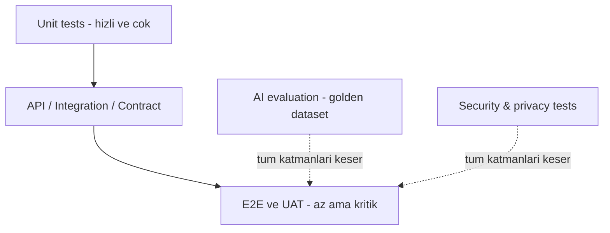

# CILT 12 - Test ve Quality Assurance Documentation: NeuroDesk AI

Surum: 1.0  
Tarih: 09 Temmuz 2026  
Dil: Turkce  
Dokuman turu: Test, Kalite Guvencesi ve Dogrulama Dokumani, Cilt 12  
Kapsam: QA stratejisi, test seviyeleri, unit/integration/API/E2E/mobile testleri, AI evaluation, prompt testleri, security testleri, performance/load testleri, regression, UAT, test data, test otomasyonu, quality gates ve Codex icin test uretim talimatlari

> Onemli: Bu asamada kesinlikle test kodu, uygulama kodu veya CI/CD dosyasi yazma. Sadece Cilt 12 Test ve Quality Assurance dokumani olustur.

> Sureklilik notu: Bu dokuman Cilt 11'de tanimlanan sprint planina test ve kalite kapilari ekler. Kod ve test implementasyonu ileride sprint bazli yapilacaktir; bu cilt yalnizca QA mimarisini, kabul kriterlerini ve dogrulama cercevesini tanimlar.

## Icindekiler

1. [Yonetici Ozeti](#1-yonetici-ozeti)
2. [QA Vizyonu](#2-qa-vizyonu)
3. [Test Stratejisi](#3-test-stratejisi)
4. [Test Ilkeleri](#4-test-ilkeleri)
5. [Quality Gates](#5-quality-gates)
6. [Test Pyramid Yaklasimi](#6-test-pyramid-yaklasimi)
7. [Risk Bazli Test Yaklasimi](#7-risk-bazli-test-yaklasimi)
8. [Shift-Left Testing](#8-shift-left-testing)
9. [Continuous Testing](#9-continuous-testing)
10. [Test Ortamlari](#10-test-ortamlari)
11. [Test Verisi Stratejisi](#11-test-verisi-stratejisi)
12. [Test Kullanicilari ve Roller](#12-test-kullanicilari-ve-roller)
13. [Unit Test Stratejisi](#13-unit-test-stratejisi)
14. [Backend Unit Testleri](#14-backend-unit-testleri)
15. [Frontend Unit Testleri](#15-frontend-unit-testleri)
16. [Mobil Unit Testleri](#16-mobil-unit-testleri)
17. [AI Unit Testleri](#17-ai-unit-testleri)
18. [Integration Test Stratejisi](#18-integration-test-stratejisi)
19. [API Test Stratejisi](#19-api-test-stratejisi)
20. [Contract Test Stratejisi](#20-contract-test-stratejisi)
21. [End-to-End Test Stratejisi](#21-end-to-end-test-stratejisi)
22. [Mobile Test Stratejisi](#22-mobile-test-stratejisi)
23. [Web Test Stratejisi](#23-web-test-stratejisi)
24. [Backend Test Stratejisi](#24-backend-test-stratejisi)
25. [Database Test Stratejisi](#25-database-test-stratejisi)
26. [Worker ve Queue Testleri](#26-worker-ve-queue-testleri)
27. [Scheduler Testleri](#27-scheduler-testleri)
28. [Notification Testleri](#28-notification-testleri)
29. [Authentication Testleri](#29-authentication-testleri)
30. [Authorization ve RBAC Testleri](#30-authorization-ve-rbac-testleri)
31. [Multi-Tenant Testleri](#31-multi-tenant-testleri)
32. [Tenant Isolation Testleri](#32-tenant-isolation-testleri)
33. [AI Analysis Testleri](#33-ai-analysis-testleri)
34. [AI Prompt Evaluation](#34-ai-prompt-evaluation)
35. [AI Hallucination Testleri](#35-ai-hallucination-testleri)
36. [AI Confidence Score Testleri](#36-ai-confidence-score-testleri)
37. [AI Action Approval Testleri](#37-ai-action-approval-testleri)
38. [AI Chat Testleri](#38-ai-chat-testleri)
39. [RAG Testleri](#39-rag-testleri)
40. [Semantic Search Testleri](#40-semantic-search-testleri)
41. [Embedding Testleri](#41-embedding-testleri)
42. [Speech-to-Text Testleri](#42-speech-to-text-testleri)
43. [Call Analysis Testleri](#43-call-analysis-testleri)
44. [Email Analysis Testleri](#44-email-analysis-testleri)
45. [Calendar Integration Testleri](#45-calendar-integration-testleri)
46. [Task Testleri](#46-task-testleri)
47. [Appointment Testleri](#47-appointment-testleri)
48. [Contact / CRM Hafizasi Testleri](#48-contact--crm-hafizasi-testleri)
49. [Dashboard Testleri](#49-dashboard-testleri)
50. [File Upload Testleri](#50-file-upload-testleri)
51. [Document Analysis Testleri](#51-document-analysis-testleri)
52. [Billing Testleri](#52-billing-testleri)
53. [Admin Panel Testleri](#53-admin-panel-testleri)
54. [Webhook Testleri](#54-webhook-testleri)
55. [Security Test Stratejisi](#55-security-test-stratejisi)
56. [OWASP Web Testleri](#56-owasp-web-testleri)
57. [OWASP API Testleri](#57-owasp-api-testleri)
58. [OWASP LLM Testleri](#58-owasp-llm-testleri)
59. [Privacy ve KVKK/GDPR Testleri](#59-privacy-ve-kvkkgdpr-testleri)
60. [Consent Testleri](#60-consent-testleri)
61. [Data Export Testleri](#61-data-export-testleri)
62. [Data Deletion Testleri](#62-data-deletion-testleri)
63. [Performance Test Stratejisi](#63-performance-test-stratejisi)
64. [Load Test Stratejisi](#64-load-test-stratejisi)
65. [Stress Test Stratejisi](#65-stress-test-stratejisi)
66. [Soak Test Stratejisi](#66-soak-test-stratejisi)
67. [Scalability Testleri](#67-scalability-testleri)
68. [Reliability Testleri](#68-reliability-testleri)
69. [Backup ve Restore Testleri](#69-backup-ve-restore-testleri)
70. [Disaster Recovery Testleri](#70-disaster-recovery-testleri)
71. [Accessibility Testleri](#71-accessibility-testleri)
72. [Localization Testleri](#72-localization-testleri)
73. [Cross-Browser Testleri](#73-cross-browser-testleri)
74. [Cross-Device Testleri](#74-cross-device-testleri)
75. [Regression Test Stratejisi](#75-regression-test-stratejisi)
76. [Smoke Test Stratejisi](#76-smoke-test-stratejisi)
77. [Sanity Test Stratejisi](#77-sanity-test-stratejisi)
78. [UAT Stratejisi](#78-uat-stratejisi)
79. [Beta Test Stratejisi](#79-beta-test-stratejisi)
80. [Bug Triage Sureci](#80-bug-triage-sureci)
81. [Defect Lifecycle](#81-defect-lifecycle)
82. [Test Case Standardi](#82-test-case-standardi)
83. [Test Suite Organizasyonu](#83-test-suite-organizasyonu)
84. [Test Automation Mimarisi](#84-test-automation-mimarisi)
85. [CI/CD Test Entegrasyonu](#85-cicd-test-entegrasyonu)
86. [Test Coverage Hedefleri](#86-test-coverage-hedefleri)
87. [Test Raporlama](#87-test-raporlama)
88. [QA Metrikleri](#88-qa-metrikleri)
89. [Release Quality Gates](#89-release-quality-gates)
90. [Sprint Bazli Test Plani](#90-sprint-bazli-test-plani)
91. [MVP Test Plani](#91-mvp-test-plani)
92. [Beta Test Plani](#92-beta-test-plani)
93. [Public Launch Test Plani](#93-public-launch-test-plani)
94. [Enterprise Test Plani](#94-enterprise-test-plani)
95. [Test Risk Matrisi](#95-test-risk-matrisi)
96. [QA Kabul Kriterleri](#96-qa-kabul-kriterleri)
97. [Codex Icin Test Uretim Talimatlari](#97-codex-icin-test-uretim-talimatlari)
98. [Codex Icin Sonraki Ciltlere Hazirlik Notlari](#98-codex-icin-sonraki-ciltlere-hazirlik-notlari)

# 1. Yonetici Ozeti

NeuroDesk AI icin kalite yalnizca "bug yok" anlamina gelmez. Urun; telefon gorusmesi, e-posta, takvim, kisi hafizasi, AI Chat, semantic search, belge analizi, tenant isolation ve kullanici onayi gibi hassas akislara sahip oldugu icin kalite; guvenlik, gizlilik, AI dogrulugu, veri butunlugu, performans, yasal teknik uyum ve kullanici guveni demektir.

Bu cilt, QA ekibinin ve gelistirme ekiplerinin hangi test seviyelerini, hangi ortamlarda, hangi kalite kapilariyla yurutmesi gerektigini tanimlar. MVP'de auth, tenant isolation, AI action approval, conversation -> AI analysis -> approval -> task/appointment akisi, notification, dashboard ve temel privacy akislari testin merkezindedir. Beta'da AI Chat, semantic search, Gmail/Outlook/Calendar, mobile ve UAT kapsami genisler. Public Launch'ta performance, security hardening, data export/delete, backup/restore ve production smoke kalite kapilari zorunludur. Enterprise'da SSO, SCIM, audit export, dedicated tenant ve SIEM testleri eklenir.

# 2. QA Vizyonu

QA vizyonu, kaliteyi sprint sonuna bir kontrol faaliyeti olarak degil, urun gelistirmenin icine gomulu bir ortak sorumluluk olarak konumlandirir. QA; Product Owner ile kabul kriterlerini netlestirir, Tech Lead ile test edilebilir mimariyi denetler, Security ile risk bazli testleri planlar, AI ekibiyle evaluation datasetlerini yonetir, DevOps ile release quality gates'i uygular.

NeuroDesk AI'da QA'nin ana misyonlari:

- Kullanici onayi olmadan AI aksiyonu yapilmadigini kanitlamak.
- Bir tenant verisinin baska tenant'a sizmadigini surekli dogrulamak.
- AI cikarimlarinin kabul edilebilir kalite ve guven araliginda oldugunu olcmek.
- Hassas verinin log, Sentry, prompt, trace veya export icine kontrolsuz girmedigini test etmek.
- Release oncesi riskleri sayisal ve karar verilebilir hale getirmek.

# 3. Test Stratejisi

Test stratejisi risk bazli, otomasyon agirlikli ve sprint icine gomulu olmalidir. Her sprintte unit/integration/API testleri yazilir; kritik akislarda E2E ve security regression eklenir. AI davranislari deterministic unit testlerle degil, mock provider, golden dataset, prompt regression ve insan degerlendirmesi karmasi ile dogrulanir.

Test katmanlari:

- Unit: hizli, izole, cok sayida.
- Integration: API + DB + Redis + worker + provider mock.
- API/contract: frontend/backend ve provider sozlesmeleri.
- E2E: kullanici akislari.
- AI evaluation: extraction accuracy, hallucination, RAG quality.
- Security/privacy: auth, tenant, consent, data export/delete.
- Performance/reliability: load, queue, backup/restore.

# 4. Test Ilkeleri

| Ilke | NeuroDesk AI yorumu |
|---|---|
| Risk bazli test | Auth, tenant isolation, AI approval, OAuth, data deletion ve calendar/mail write once test edilir. |
| Shift-left | Kabul kriteri ve test notu story hazirlik asamasinda yazilir. |
| Automation first | Smoke, regression, API ve tenant isolation otomatiklesir. |
| Human-in-the-loop validation | AI sonuc kalitesi icin insan review seti tutulur. |
| Security by testing | Guvenlik testleri release sonuna birakilmaz. |
| Privacy validation | Consent, export, deletion test edilebilir kabul kriteridir. |
| Environment parity | Staging production'a yakin davranmalidir. |
| Deterministic AI testing | Mock provider ve fixture ile repeatable testler yazilir. |

# 5. Quality Gates

Quality gate, bir degisikligin sonraki asamaya gecmesini belirleyen kalite esigidir.

| Gate | Asama | Gecis kriteri |
|---|---|---|
| PR Gate | Pull request | Lint, type, unit, critical integration, secret scan |
| Sprint Gate | Sprint kapanisi | Sprint kabul kriterleri, demo, P0/P1 yok |
| Staging Gate | Release candidate | E2E smoke, migration check, security smoke |
| Production Gate | Canli cikis | Manual approval, rollback plan, smoke checklist |
| Enterprise Gate | Kurumsal musteri | SSO, audit export, penetration/security checklist |

# 6. Test Pyramid Yaklasimi

Alt katmanda unit testler, orta katmanda integration/API testleri, ust katmanda E2E testler bulunur. NeuroDesk AI icin bu piramide iki yatay katman eklenir: AI evaluation ve security/privacy testing.

# 7. Risk Bazli Test Yaklasimi

Risk skoru etki x olasilik ile hesaplanir. Critical riskler otomatik test, manuel review ve release gate gerektirir. Ornek critical alanlar: cross-tenant access, AI approval bypass, OAuth token leak, data deletion failure, file upload vulnerability, calendar/mail onaysiz aksiyon.

# 8. Shift-Left Testing

Test tasarimi story refinement sirasinda baslar. QA, kabul kriterlerini "test edilebilir" hale getirir. Ornegin "AI iyi ozet cikarsin" kabul kriteri yetersizdir; bunun yerine "golden dataset uzerinde JSON valid response %99+, task extraction precision hedefi, hallucination red flag yok" gibi olculebilir hedefler yazilir.

# 9. Continuous Testing

Continuous testing PR, merge, staging deploy, release candidate ve production smoke asamalarinda farkli test setlerinin otomatik veya yari otomatik calismasidir. Hedef, hatayi production'da degil, en erken asamada yakalamaktir.

# 10. Test Ortamlari

| Ortam | Amac | Test kapsami | Veri |
|---|---|---|---|
| Local | Gelistirici hizli test | Unit, component, local API | Synthetic/seed |
| CI | PR dogrulama | Lint, unit, integration, migration, security scan | Ephemeral |
| Development | Ekip entegrasyonu | Feature/manual exploratory | Test data |
| Staging | Production benzeri dogrulama | E2E, UAT, security, performance smoke | Anonim/sentetik |
| Production monitoring | Canli saglik | Synthetic smoke, health, alert validation | Gercek ama minimal |

# 11. Test Verisi Stratejisi

Test verisi gercek kullanici verisi olmamalidir. Production verisi test ortaminda ancak anonimlestirilmis ve onayli sekilde kullanilabilir.

| Veri tipi | Kullanim | Ornek |
|---|---|---|
| Synthetic data | Genel testler | Sahte kullanici, gorev, randevu |
| Seed data | Ortam kurulumu | Roller, izinler, test tenant |
| AI evaluation dataset | AI kalite | Gorusme/mail/randevu ornekleri |
| Security test data | Guvenlik | Malicious input, expired token |
| Performance data | Load | 1k user, 10k conversation, 100k task |

AI datasetleri versiyonlanmali; prompt degisikligi sonucu onceki skorlarla karsilastirilmalidir.

# 12. Test Kullanicilari ve Roller

Test kullanicilari tenant ve rol bazli ayrilir: owner, admin, manager, member, viewer, billing admin, support admin, super admin, expired user, revoked user. Cross-tenant test icin en az iki tenant, her tenantta en az iki kullanici bulunmalidir.

# 13. Unit Test Stratejisi

Unit testler hizli, izole ve deterministic olmalidir. Dis provider, DB ve network bagimliligi mock'lanir. Unit testler is kurallarini, validation'i, permission kararlarini, parser'lari ve masking utility'lerini dogrular.

# 14. Backend Unit Testleri

Kapsam: auth service, password hashing, JWT creation/validation, refresh token state, permission checks, tenant context, AI response parser, task/appointment business rules, consent validation, data masking, error formatter, pagination helper. Auth, tenant isolation ve AI approval en yuksek kapsama sahip olmalidir.

# 15. Frontend Unit Testleri

Kapsam: form validation, auth state, protected route, permission-based rendering, API client error handling, AI approval component, task/appointment cards, dashboard widgets, search component, empty/error/loading states. Hassas veri UI'da gereksiz gosterilmemelidir.

# 16. Mobil Unit Testleri

Kapsam: state management, repository methods, secure token handling, form validation, offline cache policy, notification preference, AI approval screen state, API error mapping. Mobile token storage ve logout sonrasi temizleme kritik testtir.

# 17. AI Unit Testleri

Kapsam: prompt template selection, prompt variable injection, JSON response schema validation, entity extraction parser, date normalization, task/appointment extraction normalization, low confidence handling, unsafe action blocking. AI unit testleri gercek model cagrisi yapmaz.

# 18. Integration Test Stratejisi

Integration testler bilesenleri birlikte dogrular: API + DB, API + Redis, worker + queue, worker + mock AI provider, API + OAuth mock, API + notification/calendar/email mock, file upload + object storage mock. Kritik akislarda idempotency ve retry davranisi test edilir.

# 19. API Test Stratejisi

API testleri status code, request validation, response schema, auth, authorization, tenant isolation, pagination, filtering, sorting, error format, rate limiting, idempotency, audit log, security headers, CORS ve webhook signature davranislarini kapsar.

# 20. Contract Test Stratejisi

Contract testleri OpenAPI schema, frontend API client beklentileri, provider adapter sozlesmeleri ve webhook payload formatlari uzerinden calisir. API response alanlari geriye uyumlu degilse frontend ve mobil kirmadan once yakalanmalidir.

# 21. End-to-End Test Stratejisi

MVP E2E akisi: kayit, login, dashboard, conversation ekleme, AI analysis baslatma, summary gorme, task/randevu onerisi, kullanici onayi, task/randevu listesinde gorunme, notification planlama, dashboard guncelleme. E2E testler az sayida ama kritik olmalidir.

# 22. Mobile Test Stratejisi

Mobil testlerde cihaz/OS farklari, token storage, push notification, deep link/OAuth callback, offline/online gecis, performans ve crash reporting dogrulanir. MVP'de mobile smoke yeterli; public launch oncesi cihaz matrisi genisletilir.

# 23. Web Test Stratejisi

Web testleri Playwright veya benzeri araclarla auth, dashboard, conversation, AI approval, task, appointment, search, settings ve consent akislari uzerinden planlanir. Cross-browser hedef: Chrome, Edge, Safari, Firefox; MVP'de Chrome/Edge onceliklidir.

# 24. Backend Test Stratejisi

Backend test stratejisi service unit, repository integration, API tests, worker tests, migration tests ve security tests olarak ayrilir. Repository katmaninda tenant scoped query zorunlu testlenir.

# 25. Database Test Stratejisi

Database testleri migration uygulanabilirligi, rollback/forward compatibility, constraints, indexes, tenant_id varligi, cascade/delete davranisi, data retention joblari ve query performance uzerine kurulur. Production migration staging'de test edilmeden release'e girmez.

# 26. Worker ve Queue Testleri

Worker testleri job enqueue, job success, retry, dead-letter, timeout, progress update, crash recovery, duplicate job idempotency, tenant context, provider error ve rate limit davranisini kapsar. Izlenecek metrikler queue length, job duration, retry count, failure rate, DLQ count ve concurrency'dir.

# 27. Scheduler Testleri

Scheduler testleri reminder, retention, sync ve cleanup job'larinin dogru zamanda, duplicate uretmeden ve tenant context kaybetmeden calistigini dogrular. Distributed lock veya leader election davranisi test edilmelidir.

# 28. Notification Testleri

Notification testleri in-app, email, push/SMS future, retry, provider failure, preference, quiet hours, hassas veri maskesi ve delivery status davranislarini kapsar. Lock screen veya email preview'da hassas icerik gorunmemelidir.

# 29. Authentication Testleri

Testler: register, login, logout, refresh, expired token, revoked token, duplicate email, weak password, rate limit, password reset, email verification, session revoke. Sifre plain text saklanmamalı ve loglanmamalidir.

# 30. Authorization ve RBAC Testleri

RBAC testleri role/permission matrisi uzerinden yapilir. Owner/Admin/Manager/Member/Viewer/Billing/Support/Super Admin rolleri icin allowed/denied endpoint listesi test edilir. Frontend gizleme yeterli degildir; backend deny testleri zorunludur.

# 31. Multi-Tenant Testleri

Multi-tenant testleri en az iki tenant ile yapilir. Her domain modulu icin tenant A kullanicisi tenant B kaydini listeleyemez, okuyamaz, guncelleyemez, silemez, arama sonucunda goremez ve export edemez.

# 32. Tenant Isolation Testleri

Tenant isolation testleri API, DB, cache, vector search, object storage, worker job ve admin panel katmanlarini kapsar. Ozellikle cache key, vector filter, background job payload ve object storage path hatalari icin negatif testler yazilmalidir.

# 33. AI Analysis Testleri

AI analysis testleri summary, task extraction, appointment extraction, entity extraction, date normalization, confidence score, invalid JSON, provider timeout, retry ve low-confidence fallback davranisini kapsar. MVP'de mock provider ile deterministic test zorunludur.

# 34. AI Prompt Evaluation

Prompt evaluation golden dataset uzerinden yapilir. Her dataset item'i expected summary characteristics, expected task/randevu/entities, forbidden claims ve confidence expectation icerir. Skorlar prompt version bazinda saklanir.

Metrikler: JSON validity, extraction precision/recall, hallucination flag rate, unsupported claim count, action safety pass, latency, token cost.

# 35. AI Hallucination Testleri

Hallucination testleri modelin metinde olmayan tarih, kisi, gorev veya karar uydurup uydurmadigini inceler. Kritik kural: AI sonucu aksiyona donusmeden once kullanici onayi ve confidence/uyari mekanizmasi bulunmalidir.

# 36. AI Confidence Score Testleri

Confidence score testleri acik, belirsiz ve celiskili verilerle yapilir. Belirsiz ifadelerde sistem kullanicidan onay/duzeltme istemeli; dusuk confidence sonucu otomatik gorev/randevuya donusmemelidir.

# 37. AI Action Approval Testleri

AI action approval testleri en kritik kalite kapisidir. Onaysiz task creation, appointment creation, calendar write, mail send, file share ve CRM update denemeleri engellenmelidir. Approval audit log uretmeli, reject durumunda aksiyon uretmemelidir.

# 38. AI Chat Testleri

AI Chat testleri yetkili kaynaklardan cevap, kaynak/gerekce gosterimi, bilmiyorum davranisi, dusuk confidence, prompt injection, baska tenant verisi talebi, PII leakage ve hallucination senaryolarini kapsar.

# 39. RAG Testleri

RAG testleri retrieval relevance, tenant scoped retrieval, source attribution, stale index, missing document, conflicting sources ve answer grounding davranislarini dogrular. Retrieval sonucu kullanicinin erisemedigi kaynagi icermemelidir.

# 40. Semantic Search Testleri

Semantic search testleri exact-ish query, paraphrase query, typo/noisy query, Turkish/English query, tenant filter, permission filter, empty result ve ranking kalitesi uzerinden yapilir. Vector search'te tenant_id filtresi release gate olmalidir.

# 41. Embedding Testleri

Embedding testleri job enqueue, duplicate prevention, re-index, delete propagation, tenant filter, vector dimension uyumu ve provider error handling davranislarini kapsar. Kullanici veri silme talebi embedding silmeyi de tetiklemelidir.

# 42. Speech-to-Text Testleri

STT MVP disi veya future olabilir; test plani hazir tutulur. Kapsam: dil algilama, speaker diarization, noisy audio, uzun kayit, timestamp, PII handling, provider failure, consent. STT accuracy persona ve domain bazli olculmelidir.

# 43. Call Analysis Testleri

Call analysis testleri manuel transkript uzerinden summary, task, appointment, participant, follow-up ve contact timeline etkisini dogrular. Gorusme verisi hassas kabul edilir; loglarda raw transcript bulunmamalidir.

# 44. Email Analysis Testleri

Email analysis testleri subject/body parsing, attachment handling, thread context, task/date extraction, scope/consent, Gmail/Outlook provider mock, rate limit ve token revoke davranisini kapsar. Mail body raw loglanmamalidir.

# 45. Calendar Integration Testleri

Calendar testleri read/write scope ayrimi, event list, event create approval, timezone, recurring events, provider conflict, revoke ve rate limit davranisini kapsar. Kullanici onayi olmadan event olusturulamaz.

# 46. Task Testleri

Task testleri CRUD, status transitions, due date, filters, AI-approved creation, manual creation, audit log, tenant isolation ve dashboard yansimasini kapsar.

# 47. Appointment Testleri

Appointment testleri CRUD, timezone, conflict, calendar view, AI-approved creation, external calendar sync ve notification scheduling davranisini kapsar.

# 48. Contact / CRM Hafizasi Testleri

Contact testleri CRUD, timeline, notes, conversation links, search, merge future, PII masking, tenant isolation ve AI memory etkisini kapsar.

# 49. Dashboard Testleri

Dashboard testleri aggregation dogrulugu, permission/tenant scope, empty states, performance, cache invalidation ve mobile responsive davranisini kapsar.

# 50. File Upload Testleri

File upload testleri signed URL, file type allowlist, file size, malware scan hook, object storage private policy, metadata, permission ve delete propagation davranisini kapsar.

# 51. Document Analysis Testleri

Document analysis testleri text extraction, OCR future, document summary, entity extraction, PII redaction, provider failure ve prompt injection iceren belge senaryolarini kapsar.

# 52. Billing Testleri

Billing testleri plan, subscription, usage quota, AI usage tracking, payment webhook signature, idempotency, downgrade/upgrade ve invoice future davranisini kapsar. Billing hatalari financial ve trust riskidir.

# 53. Admin Panel Testleri

Admin panel testleri admin auth guard, role permission, tenant list, user list, audit log, AI cost, system health, masked data ve super admin break-glass davranislarini kapsar.

# 54. Webhook Testleri

Webhook testleri signature validation, timestamp tolerance, replay prevention, idempotency, malformed payload, provider retry ve event ordering davranisini kapsar. Payment, email, calendar webhook'lari ayri test edilir.

# 55. Security Test Stratejisi

Security testleri SAST/DAST/dependency/container/secret scanning, auth, authorization, tenant isolation, input validation, SSRF, file upload, webhook, prompt injection, sensitive logging ve data leakage alanlarini kapsar.

# 56. OWASP Web Testleri

OWASP Web testleri broken access control, cryptographic failures, injection, insecure design, security misconfiguration, vulnerable components, auth failures, integrity failures, logging failures ve SSRF risklerini NeuroDesk akislari uzerinden test eder.

# 57. OWASP API Testleri

OWASP API testleri BOLA, broken auth, property-level authorization, resource consumption, function auth, sensitive business flows, SSRF, misconfiguration, inventory ve unsafe API consumption alanlarini kapsar.

# 58. OWASP LLM Testleri

LLM testleri prompt injection, insecure output handling, sensitive disclosure, excessive agency, overreliance, model DoS, insecure plugin/tool design ve supply chain risklerini kapsar. AI tool/action testlerinde approval gate zorunlu kontrol edilir.

# 59. Privacy ve KVKK/GDPR Testleri

Privacy testleri consent, aydinlatma metni version, data export, data deletion, retention, anonymization, masking, subprocessor visibility ve international transfer transparency gibi teknik gereksinimleri dogrular. Bu testler hukuki danismanlik degil, teknik uyum testidir.

# 60. Consent Testleri

Consent testleri telefon, mail, calendar, contact, document, third-party AI provider, marketing ve analytics riza tiplerini kapsar. Riza yoksa veri isleme baslamamali; riza geri cekilirse ilgili sync/analysis durmalidir.

# 61. Data Export Testleri

Export testleri kullanicinin yalnizca kendi yetkili verisini alabildigini, export dosyasinin signed URL ve kisa TTL ile sunuldugunu, audit log olustugunu ve baska tenant verisinin export'a girmedigini dogrular.

# 62. Data Deletion Testleri

Deletion testleri token revoke, DB kayitlari, object storage dosyalari, embeddings, AI memory, analytics/anonymization ve backup propagation politikasini dogrular. Silme isleminden sonra search/RAG sonucunda veri gorunmemelidir.

# 63. Performance Test Stratejisi

Performance testleri API p95 latency, dashboard load, semantic search, AI job duration, queue backlog, DB slow query, Redis latency ve notification throughput uzerine kurulur. MVP hedefleri production hedeflerinden daha gevsek olabilir ancak trend izlenmelidir.

# 64. Load Test Stratejisi

Load test senaryolari: 10, 100, 1.000 concurrent user; conversation create; AI analysis enqueue; dashboard load; search; notification schedule. Load testler staging'de, synthetic data ile ve provider cost limitleriyle calisir.

# 65. Stress Test Stratejisi

Stress test sistemin kirilma noktasini bulur: Redis memory, DB connection pool, worker backlog, AI provider rate limit, file upload burst. Stress test production'da kontrolsuz calistirilmaz.

# 66. Soak Test Stratejisi

Soak test uzun sureli stabiliteyi olcer: memory leak, queue birikimi, connection leak, log volume, worker retry storm. Beta oncesi 4-8 saatlik, enterprise oncesi daha uzun soak test onerilir.

# 67. Scalability Testleri

Scalability testleri yatay worker artisi, API replica artisi, DB read replica future, queue-based scaling ve AI provider quota davranisini olcer. Queue backlog metrikleri scaling kararinin merkezindedir.

# 68. Reliability Testleri

Reliability testleri provider outage, Redis restart, DB connection loss, worker crash, retry/DLQ, notification failure, partial degradation ve idempotency davranisini dogrular.

# 69. Backup ve Restore Testleri

Backup testleri otomatik backup, encryption, alert ve listelenebilirlik; restore testleri staging restore, data integrity, object file access, embeddings rebuild/restore, RPO/RTO ve deleted data reappearance riskini kapsar.

# 70. Disaster Recovery Testleri

DR testleri region outage, DB corruption, DNS issue, secret leak, AI provider outage, major deploy failure ve ransomware varsayimlariyla runbook dogrulamasidir. Enterprise fazda periyodik DR drill gerekir.

# 71. Accessibility Testleri

WCAG 2.1 AA hedeflenir. Klavye kullanimi, screen reader labels, focus state, contrast, form errors, modal/dropdown, calendar, AI Chat ve mobile accessibility labels test edilir.

# 72. Localization Testleri

MVP Turkce onceliklidir. Testler tarih/saat, timezone, Turkce/English AI response, mail/gorusme dil algilama, multilingual search ve semantic search davranisini kapsar.

# 73. Cross-Browser Testleri

MVP: Chrome ve Edge. Beta/Public Launch: Safari ve Firefox eklenir. Testler auth, dashboard, AI approval, calendar, upload, chat ve responsive layout akislari uzerinden yapilir.

# 74. Cross-Device Testleri

Cross-device testleri desktop, tablet, mobile web, Android ve iOS cihaz davranislarini kapsar. Mobil app icin OS version matrisi release planina gore dar/genis tutulur.

# 75. Regression Test Stratejisi

Regression suite: auth smoke, tenant isolation, AI approval, task creation, appointment creation, notification scheduling, dashboard, contact timeline, AI Chat, semantic search, Gmail sync, calendar write, data export/delete. Her RC'de calisir.

# 76. Smoke Test Stratejisi

Production smoke: health, login, dashboard, task list, appointment list, AI health/mock, worker heartbeat, DB, Redis, object storage, Sentry spike, basic tenant isolation. Smoke kisa ve karar verilebilir olmalidir.

# 77. Sanity Test Stratejisi

Sanity test belirli fix veya kucuk release sonrasi ilgili alanin temel calistigini dogrular. Ornegin calendar fix sonrasi timezone, event create approval ve list view test edilir.

# 78. UAT Stratejisi

UAT persona bazli yapilir: satis temsilcisi, freelancer, KOBI sahibi, danisman, avukat, sigorta danismani, destek uzmani, ekip yoneticisi. Senaryolar gercek is akisini temsil eder: gorusme ekleme, AI ozet, gorev/randevu onay, hatirlatma, contact timeline, AI Chat, search, Gmail, export/delete.

# 79. Beta Test Stratejisi

Beta test sinirli kullanici grubu ile yurutulur. Feedback kanali, known issues listesi, crash/error tracking, product analytics, AI output feedback ve support workflow aktif olmalidir. Beta'da P0/P1 hizli triage edilir.

# 80. Bug Triage Sureci

| Oncelik | Tanim | Ornek |
|---|---|---|
| P0 Critical | Sistem/veri/guvenlik kritik | Cross-tenant leak, onaysiz AI action |
| P1 High | Ana akis bozuk | Login, AI analysis, task creation calismiyor |
| P2 Medium | Alternatif yolu var | Filtre/UI orta hata |
| P3 Low | Kozmetik/iyilestirme | Metin/hizalama |

# 81. Defect Lifecycle

Lifecycle: New -> Triaged -> Assigned -> In Progress -> Fixed -> Ready for QA -> Verified -> Closed veya Reopened. P0/P1 bug'lar root cause ve regression test gerektirir.

# 82. Test Case Standardi

Her test case: ID, baslik, modul, test tipi, oncelik, on kosullar, test verisi, adimlar, beklenen sonuc, negatif senaryolar, guvenlik notlari, otomasyon durumu ve MVP durumu icerir.

# 83. Test Suite Organizasyonu

Suite'ler modul ve risk bazli ayrilir: auth, tenant, RBAC, conversation, AI, approval, task, appointment, notification, dashboard, contact, chat, search, integrations, files, billing, admin, security, performance, UAT.

# 84. Test Automation Mimarisi

Onerilen araclar: backend Pytest/HTTPX/Coverage; frontend Vitest/React Testing Library/Playwright/MSW; mobile Flutter test/widget/integration; security OWASP ZAP/Semgrep/Bandit/Trivy/secret scanning; performance k6/Locust; AI evaluation golden dataset ve human review sheets. Bu cilt araclari tarif eder, kod yazmaz.

# 85. CI/CD Test Entegrasyonu

PR pipeline: lint, type, unit, integration, migration check, security scan. Staging deploy: smoke, E2E regression, API regression, security scan, performance smoke, AI evaluation smoke. Production deploy: manual approval, smoke, monitoring/error rate check, rollback readiness.

# 86. Test Coverage Hedefleri

| Alan | MVP hedef |
|---|---|
| Backend service layer | %80+ |
| Auth | %90+ |
| Tenant isolation | %95+ |
| AI approval | %95+ |
| Critical APIs | %80+ |
| Frontend critical components | %70+ |
| Mobile core logic | %70+ |
| AI JSON validity | %99+ |

Coverage tek basina kalite degildir; kritik risk akislari onceliklidir.

# 87. Test Raporlama

Raporlar: sprint test summary, failed/flaky tests, defect summary, risk coverage, AI evaluation score, security scan summary, performance summary, UAT feedback, release quality gate status.

# 88. QA Metrikleri

Metrikler: coverage, passed/failed/flaky test count, defect density, escaped defects, production incident count, MTTD, MTTR, regression pass rate, automation coverage, AI extraction accuracy, hallucination rate, prompt regression score, E2E pass rate, vulnerability count, p95 latency, UAT satisfaction.

# 89. Release Quality Gates

MVP Alpha: auth, conversation, AI analysis, approval ve dashboard critical tests gecer. Beta: E2E regression, tenant isolation, AI eval, Gmail/Calendar temel testleri gecer. Public Launch: P0/P1 yok, security hardening, performance smoke, export/delete, monitoring ve incident runbook hazir. Enterprise: SSO, audit export, SIEM, dedicated tenant, penetration test.

# 90. Sprint Bazli Test Plani

| Sprint | Test odağı |
|---|---|
| S1 | Auth, token, local smoke |
| S2 | Organization, RBAC, tenant |
| S3 | Conversation/call, consent |
| S4 | AI mock analysis |
| S5 | AI approval bypass |
| S6-S8 | Task, appointment, notification |
| S9-S12 | Dashboard, contact, AI Chat, semantic search |
| S13-S16 | Web regression, mobile, Gmail, Outlook |
| S17-S20 | File, analytics, billing, admin |
| S21-S24 | Security, performance, beta/UAT, launch smoke |

# 91. MVP Test Plani

MVP must tests: register/login, JWT/refresh, tenant isolation, RBAC, conversation create, call text add, AI summary/task/appointment extraction, AI approval, task/appointment creation, notification scheduling, dashboard, contact timeline, AI Chat basic, semantic search basic, Google Calendar basic, consent, audit, data export/delete request, Docker local, CI test pipeline.

# 92. Beta Test Plani

Beta tests: real user UAT, AI output feedback, Gmail/Outlook integration, mobile device smoke, semantic search relevance, AI Chat grounding, feedback workflow, known issues, crash/error tracking, support workflow.

# 93. Public Launch Test Plani

Launch tests: full regression, security smoke, performance/load smoke, billing quota, admin, backup/restore, production deployment smoke, monitoring/alert validation, privacy policy/consent, data export/delete, support/contact flows.

# 94. Enterprise Test Plani

Enterprise tests: SSO/SAML/OIDC, SCIM provisioning/deprovisioning, advanced RBAC, audit export, SIEM export, custom retention, dedicated tenant, IP allowlist, MFA enforcement, SLA reporting, large tenant performance, enterprise restore.

# 95. Test Risk Matrisi

| ID | Risk | Etki | Olasilik | Seviye | Azaltma | Test tipi | MVP |
|---|---|---|---|---|---|---|---|
| T-001 | Tenant isolation eksigi | Critical | Medium | Critical | Cross-tenant suite | Security/API | Evet |
| T-002 | AI approval bypass | Critical | Medium | Critical | Bypass tests | AI/Security | Evet |
| T-003 | AI hallucination | High | High | High | Eval dataset | AI | Evet |
| T-004 | Prompt injection | Critical | Medium | Critical | Injection corpus | LLM Security | Evet |
| T-005 | Vector data leak | Critical | Medium | Critical | Tenant vector tests | Search | Evet |
| T-006 | OAuth token leak | Critical | Medium | Critical | Secret/log tests | Security | Evet |
| T-007 | Refresh token reuse | High | Medium | High | Reuse tests | Auth | Evet |
| T-008 | Onaysiz mail | Critical | Low | High | Approval tests | E2E/API | Evet |
| T-009 | Onaysiz calendar | Critical | Medium | Critical | Approval tests | E2E/API | Evet |
| T-010 | Consent bypass | Critical | Medium | Critical | Consent suite | Privacy | Evet |
| T-011 | Deletion failure | Critical | Medium | Critical | Delete tests | Privacy | Evet |
| T-012 | Export wrong data | Critical | Medium | Critical | Export tenant tests | Privacy | Evet |
| T-013 | File vulnerability | High | Medium | High | Upload tests | Security | Evet |
| T-014 | Public object storage | Critical | Low | High | Bucket checks | Security | Evet |
| T-015 | Notification failure | Medium | Medium | Medium | Worker tests | Integration | Evet |
| T-016 | Queue job loss | High | Medium | High | Crash/retry tests | Worker | Evet |
| T-017 | AI provider outage | High | Medium | High | Failure mock | Reliability | Evet |
| T-018 | STT low accuracy | Medium | Medium | Medium | STT eval | AI | Hayir |
| T-019 | Gmail rate limit | Medium | High | Medium | Backoff tests | Integration | Hayir |
| T-020 | Graph rate limit | Medium | High | Medium | Backoff tests | Integration | Hayir |
| T-021 | Dashboard performance | High | Medium | High | Perf tests | Performance | Evet |
| T-022 | Large transcription perf | High | Medium | High | Load tests | Performance | Evet |
| T-023 | Flaky E2E | Medium | High | Medium | Quarantine/fix | QA | Evet |
| T-024 | Insufficient test data | High | Medium | High | Seed strategy | QA | Evet |
| T-025 | Production-only bug | High | Medium | High | Staging parity | E2E | Evet |
| T-026 | Missing audit log | High | Medium | High | Audit assertions | API | Evet |
| T-027 | Restore failure | Critical | Medium | Critical | Restore drill | DR | Evet |
| T-028 | Billing quota bug | High | Medium | High | Quota tests | Billing | Hayir |
| T-029 | Admin permission bug | Critical | Medium | Critical | Admin RBAC | Security | Hayir |
| T-030 | Mobile token bug | High | Medium | High | Secure storage tests | Mobile | Hayir |
| T-031 | Accessibility gaps | Medium | Medium | Medium | A11y tests | Web/Mobile | Hayir |
| T-032 | Scan false negatives | High | Medium | High | Manual review | Security | Evet |
| T-033 | CI test gaps | High | Medium | High | Pipeline gates | DevOps | Evet |
| T-034 | Codex no tests | High | High | High | DoD enforcement | QA | Evet |
| T-035 | Manual review missing | Critical | Medium | Critical | Review gates | Process | Evet |

# 96. QA Kabul Kriterleri

MVP kabul: Critical/High testler gecer, P0/P1 acik bug yoktur, auth/tenant/AI approval/export/delete/sensitive log/security smoke testleri gecer, AI extraction temel dataset kabul esigini gecer, API regression ve web smoke temizdir. Public Launch icin performance smoke, backup/restore, monitoring ve production smoke checklist de tamamlanir.

# 97. Codex Icin Test Uretim Talimatlari

Codex ileride test kodu uretirken su kurallara uymalidir:

1. Her modul icin test dosyalari da uretmelidir.
2. Once backend unit testleri hazirlanmalidir.
3. Auth testleri en yuksek onceliktedir.
4. Tenant isolation testleri her domain modulu icin yazilmalidir.
5. AI action approval testleri bypass edilemeyecek sekilde tasarlanmalidir.
6. AI provider icin once mock adapter testleri yazilmalidir.
7. Gercek AI provider testleri ayri evaluation suite icinde tutulmalidir.
8. Testlerde gercek kullanici verisi kullanilmamalidir.
9. Fixture'lar synthetic data ile olusturulmalidir.
10. OAuth/Gmail/Outlook/Calendar testlerinde provider mock kullanilmalidir.
11. File upload testlerinde object storage mock veya local MinIO kullanilmalidir.
12. Worker testlerinde queue mock veya test Redis kullanilmalidir.
13. CI icinde hizli testler calismalidir.
14. Uzun load/E2E testleri ayri pipeline'da calismalidir.
15. Flaky testler isaretlenmeli ve duzeltilmelidir.
16. Prompt injection testleri AI modulu icin zorunludur.
17. Vector search testlerinde tenant_id filtresi zorunlu kontrol edilmelidir.
18. Sensitive data loglanmadigi test edilmelidir.
19. Data export ve deletion testleri KVKK/GDPR teknik uyumlulugu icin yazilmalidir.
20. Test basarisizsa production deploy engellenmelidir.
21. Codex test uretirken uygulama kodunu gereksiz degistirmemelidir.

# 98. Codex Icin Sonraki Ciltlere Hazirlik Notlari

Bir sonraki dokumanda Cilt 13 - Deployment ve Production Release Documentation hazirlanacaktir. Cilt 13; local, development, staging ve production deployment adimlari, release checklist, production readiness, rollback plani, environment variable listesi, migration plani, monitoring dogrulama, smoke test, incident hazirligi ve ilk canliya alma surecini detaylandirmalidir.

# 99. Sprint 14 Mobile QA Guncellemesi

Mobil MVP icin ek QA kapisi asagidaki sekilde uygulanir. Bu bolum Cilt 11 Sprint 14 guncel mobil kapsamiyla birlikte okunmalidir.

Zorunlu otomatik kontroller:

- `flutter analyze` temiz olmalidir.
- `flutter test` gecmelidir; model parsing testleri backend response alanlariyla uyumlu kalmalidir.
- Auth widget testi unauthenticated kullaniciyi login ekranina yonlendirmelidir.
- AI approval action type testleri backend degerleri olan `task`, `appointment`, `deal` icin label ve materialization uyumunu kapsamalidir.
- API health status testleri `ok`, `degraded`, `maintenance` ve bilinmeyen durumlar icin mobil etiketlerin okunur kaldigini dogrulamalidir.
- Debug ve release APK build kapilari calismalidir; release APK manifest'inde `INTERNET` ve biyometrik izinler bulunmalidir.
- Files ekraninda 25 MB ustu dosya secimi upload baslatmadan kullaniciya okunur hata mesaji gostermelidir.

Zorunlu local smoke kontrolleri:

1. Backend `/health` 200 doner.
2. Android emulator icin backend `0.0.0.0:8000` uzerinden aciktir; mobil `10.0.2.2:8000` ile erisir.
3. Mobil debug APK build edilir ve Pixel 8 emulator'e kurulur.
4. Register akisi mobil veya API smoke ile dogrulanir.
5. Login sonrasi Dashboard, Tasks, Appointments, Conversations, Notifications, AI Approvals, AI Chat, Contacts/CRM, Search, Files, Email, Deals, Priority ve Analytics yuzeyleri acilir.
6. Manuel gorusme transkripti kaydedilir ve AI analiz baslatma istegi gonderilir.
7. AI approval approve akisi yalnizca approval status degistirmekle kalmaz; `task`, `appointment` veya `deal` icin ilgili `from-approval` endpoint'ini cagirarak gercek kayit olusturur.
8. Access token 401 oldugunda mobil refresh token ile yeni token alip istegi bir kez tekrarlar; refresh basarisizsa secure storage temizlenir ve kullanici tekrar auth akisini gorur.
9. Beni hatirla acikken kayitli oturum secure storage'da saklanir; desteklenen cihazda biometric unlock akisi local_auth ile tetiklenir.
10. Android release APK `aapt dump permissions` ile kontrol edilir; API erisimi icin `android.permission.INTERNET` paket icinde olmalidir.

Bilinen MVP test disi veya dis sistem dogrulamasi gerektiren alanlar: offline outbox/cache ve sync engine, push notification/FCM, production domain uzerinde App/Universal Link association dosyalarinin yayinlanmasi ve provider dogrulamasi, crash reporting, product analytics eventleri, tablet/foldable polish, production release otomasyonu ve buyuk dosyalar icin offline upload kuyrugu. Android release signing proje tarafinda `key.properties` veya ortam degiskenleri ile hazirdir; gercek store imzasi release keystore saglandiginda dogrulanmalidir.
